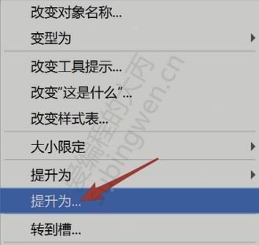
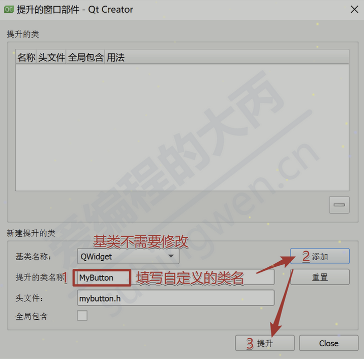
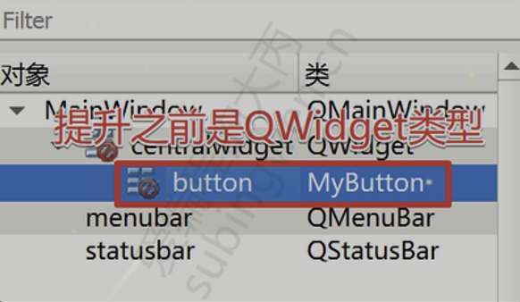

# 事件处理器
## 1. 事件
众所周知Qt是一个基于C++的框架，主要用来开发带窗口的应用程序（不带窗口的也行，但不是主流）。我们使用的基于窗口的应用程序都是基于事件，其目的主要是用来实现回调（因为只有这样程序的效率才是最高的）。所以在Qt框架内部为我们提供了一些列的事件处理机制，当窗口事件产生之后，事件会经过: `事件派发 -> 事件过滤 -> 事件分发 -> 事件处理`几个阶段。Qt窗口中对于产生的一系列事件都有默认的处理动作，如果我们有特殊需求就需要在合适的阶段重写事件的处理动作。

`事件(event)`是由系统或者 Qt 本身在不同的场景下发出的。当用户按下/移动鼠标、敲下键盘，或者是窗口关闭/大小发生变化/隐藏或显示都会发出一个相应的事件。一些事件在对用户操作做出响应时发出，如鼠标/键盘事件等；另一些事件则是由系统自动发出，如计时器事件。

每一个Qt应用程序都对应一个唯一的`QApplication`应用程序对象，然后调用这个对象的`exec()`函数，这样Qt框架内部的事件检测就开始了（`程序将进入事件循环来监听应用程序的事件`）。

```C++
int main(int argc, char *argv[]) {
    QApplication a(argc, argv);
    MainWindow* w = new MainWindow;
    w.show();
    return a.exec();
}
```

事件在Qt中产生之后，的分发过程是这样的:

1. 当事件产生之后，Qt使用用应用程序对象调用`notify()`函数将事件发送到指定的窗口:

```C++
[override virtual] bool QApplication::notify(QObject *receiver, QEvent *e);
```

2. 事件在发送过程中可以通过事件过滤器进行过滤，默认不对任何产生的事件进行过滤。

```C++
// 需要先给窗口安装过滤器, 该事件才会触发
[virtual] bool QObject::eventFilter(QObject *watched, QEvent *event)
```

3. 当事件发送到指定窗口之后，窗口的事件分发器会对收到的事件进行分类:

```C++
[override virtual protected] bool QWidget::event(QEvent *event);
```

4. 事件分发器会将分类之后的事件（鼠标事件、键盘事件、绘图事件...）分发给对应的事件处理器函数进行处理，每个事件处理器函数都有默认的处理动作（我们也可以重写这些事件处理器函数），比如: 鼠标事件:

```C++
// 鼠标按下
[virtual protected] void QWidget::mousePressEvent(QMouseEvent *event);
// 鼠标释放
[virtual protected] void QWidget::mouseReleaseEvent(QMouseEvent *event);
// 鼠标移动
[virtual protected] void QWidget::mouseMoveEvent(QMouseEvent *event);
```

## 2. 事件处理器函数
通过上面的描述可以得知: Qt的事件处理器函数处于食物链的最末端，每个事件处理器函数都对应一个唯一的事件，这为我们重新定义事件的处理动作提供了便利。另外，<span style="color:red">Qt提供的这些事件处理器函数都是回调函数，也就是说作为使用者我们只需要指定函数的处理动作，关于函数的调用是不需要操心的，当某个事件被触发，Qt框架会调用对应的事件处理器函数。</span>

`QWidget`类是Qt中所有窗口类的基类，在这个类里边定义了很多事件处理器函数，它们都是受保护的虚函数。我们可以在Qt的任意一个窗口类中重写这些虚函数来重定义它们的行为。下面介绍一些常用的事件处理器函数：

### 2.1 鼠标事件
- 鼠标按下事件

    当鼠标左键、鼠标右键、鼠标中键被按下，该函数被自动调用，通过参数可以得到当前按下的是哪个鼠标键

```C++
[virtual protected] void QWidget::mousePressEvent(QMouseEvent *event);
```

- 鼠标释放事件

    当鼠标左键、鼠标右键、鼠标中键被释放，该函数被自动调用，通过参数可以得到当前释放的是哪个鼠标键

```C++
[virtual protected] void QWidget::mouseReleaseEvent(QMouseEvent *event);
```

- 鼠标移动事件

    当鼠标移动（也可以按住一个或多个鼠标键移动），该函数被自动调用，通过参数可以得到在移动过程中哪些鼠标键被按下了。

```C++
[virtual protected] void QWidget::mouseMoveEvent(QMouseEvent *event);
```

- 鼠标双击事件

    当鼠标双击该函数被调用，通过参数可以得到是通过哪个鼠标键进行了双击操作。

```C++
[virtual protected] void QWidget::mouseDoubleClickEvent(QMouseEvent *event);
```

- 鼠标进入事件

    当鼠标进入窗口的一瞬间，触发该事件，注意: <span style="color:red">只在进入的瞬间触发一次该事件</span>
    
```C++
[virtual protected] void QWidget::enterEvent(QEvent *event);
```

- 鼠标离开事件

    当鼠标离开窗口的一瞬间，触发该事件，注意: <span style="color:red">只在离开的瞬间触发一次该事件</span>

```C++
[virtual protected] void QWidget::leaveEvent(QEvent *event);
```

### 2.2 键盘事件
- 键盘按下事件

    当键盘上的按键被按下了，该函数被自动调用，通过参数可以得知按下的是哪个键。

```C++
[virtual protected] void QWidget::keyPressEvent(QKeyEvent *event);
```

- 键盘释放事件

    当键盘上的按键被释放了，该函数被自动调用，通过参数可以得知释放的是哪个键。

```C++
[virtual protected] void QWidget::keyReleaseEvent(QKeyEvent *event);
```

### 2.3 窗口重绘事件
当窗口需要刷新的时候，该函数就会自动被调用。窗口需要刷新的情景很多，比如: 窗口大小发生变化，窗口显示等，另外我们还可以通过该函数给窗口绘制背景图，总之这是一个需要经常被重写的一个事件处理器函数。

```C++
[virtual protected] void QWidget::paintEvent(QPaintEvent *event);
```

### 2.4 窗口关闭事件
当窗口标题栏的关闭按钮被按下并且在窗口关闭之前该函数被调用，可以通过该函数控制窗口是否被关闭。

```C++
[virtual protected] void QWidget::closeEvent(QCloseEvent *event);
```

### 2.5 重置窗口大小事件
当窗口的大小发生变化，该函数被调用。

```C++
[virtual protected] void QWidget::resizeEvent(QResizeEvent *event);
```

除此之外，关于Qt窗口提供的其他事件处理器函数还有很多，感兴趣的话可以仔细阅读Qt的帮助文档，窗口的事件处理器函数非常好找，规律是这样的:

1. 受保护的虚函数
2. 函数名分为两部分: 事件描述 + Event
3. 函数带一个事件类型的参数

## 3. 重写事件处理器函数
由于事件处理器函数都是虚函数，因此我们就可以添加一个标准窗口类的派生类，这样不仅使子类继承了父类的属性，还可以在这个子类中重写父类的虚函数，总起来说整个操作过程还是 so easy 的。

下面, 
- 创建一个Qt项目，添加一个窗口类（让其从某个标准窗口类派生）

- 在子类中重写从父类继承的虚函数（也就是事件处理器函数）

### 3.1 头文件

```C++
#include <QMainWindow>

QT_BEGIN_NAMESPACE
namespace Ui { class MainWindow; }
QT_END_NAMESPACE

class MainWindow : public QMainWindow {
    Q_OBJECT

public:
    MainWindow(QWidget *parent = nullptr);
    ~MainWindow();

protected:
    // 重写事件处理器函数
    void closeEvent(QCloseEvent* ev);
    void resizeEvent(QResizeEvent* ev);

private:
    Ui::MainWindow *ui;
};
```

### 3.2 源代码

```C++
#include "mainwindow.h"
#include "ui_mainwindow.h"
#include <QCloseEvent>
#include <QMessageBox>
#include <QResizeEvent>
#include <QDebug>

MainWindow::MainWindow(QWidget *parent)
    : QMainWindow(parent)
    , ui(new Ui::MainWindow)
{
    ui->setupUi(this);
}

MainWindow::~MainWindow() {
    delete ui;
}

void MainWindow::closeEvent(QCloseEvent *ev) {
    QMessageBox::Button btn = QMessageBox::question(this, "关闭窗口", "您确定要关闭窗口吗?");
    if(btn == QMessageBox::Yes) {
        // 接收并处理这个事件
        ev->accept();
    }
    else {
        // 忽略这个事件
        ev->ignore();
    }
}

void MainWindow::resizeEvent(QResizeEvent *ev) {
    qDebug() << "oldSize: " << ev->oldSize()
             << "currentSize: " << ev->size();
}
```

`QCloseEvent`类是`QEvent`类的子类，程序中使用的`accept()`或者`ignore()`的作用请参考`QEvent`类.

### 3.3 效果
在上面重写的`closeEvent`事件中添加了关闭窗口的判断，这样就可以避免误操作导致窗口被关闭了，效果如下：

> 略

如果想要时时检测窗口大小，就可以重写窗口的`resizeEvent`事件，这样就可以得到窗口的最新尺寸信息了：

> 略

## 4. 自定义按钮
基于Qt提供的事件处理器函数，我们可以非常轻松地按照自己的想法制作出一个按钮，按钮的要求如下：

1. 从视觉上看是一个不规则按钮（按钮实际上都是矩形的）
2. 按钮上需要显示指定的背景图片
3. 按钮在鼠标的不同操作阶段（无操作、鼠标悬停、鼠标按下）能够显示不同的背景图

按钮效果如下：

> 略

### 4.1 添加子类
<span style="color:red">新添加的按钮类可以让它继承`QPushButton`，也可以让它继承其他的窗口类（代价是当鼠标点击事件触发之后需要自己发射自定义信号）</span>，这里让添加的子类从QWidget类派生。

自定义类头文件

```C++
#ifndef MYBUTTON_H
#define MYBUTTON_H

#include <QWidget>

class MyButton : public QWidget {
    Q_OBJECT
public:
    explicit MyButton(QWidget *parent = nullptr);

    void setImage(QString normal, QString hover, QString pressed);

protected:
    void mousePressEvent(QMouseEvent* ev);
    void mouseReleaseEvent(QMouseEvent* ev);
    void enterEvent(QEvent* ev);
    void leaveEvent(QEvent* ev);
    void paintEvent(QPaintEvent* ev);

signals:
    void clicked();

private:
    QPixmap m_normal;
    QPixmap m_press;
    QPixmap m_hover;
    QPixmap m_current;
};

#endif // MYBUTTON_H
```

自定义类源文件

```C++
#include "mybutton.h"

#include <QPainter>

MyButton::MyButton(QWidget *parent) 
    : QWidget(parent)
{}

void MyButton::setImage(QString normal, QString hover, QString pressed) {
    // 加载图片
    m_normal.load(normal);
    m_hover.load(hover);
    m_press.load(pressed);
    m_current = m_normal;
    // 设置按钮和图片大小一致
    setFixedSize(m_normal.size());
}

void MyButton::mousePressEvent(QMouseEvent *ev) {
    // 鼠标被按下, 发射这个自定义信号
    emit clicked();
    m_current = m_press;
    update();
}

void MyButton::mouseReleaseEvent(QMouseEvent *ev) {
    m_current = m_normal;
    update();
}

void MyButton::enterEvent(QEvent *ev) {
    m_current = m_hover;
    update();
}

void MyButton::leaveEvent(QEvent *ev) {
    m_current = m_normal;
    update();
}

void MyButton::paintEvent(QPaintEvent *ev) {
    QPainter p(this);
    p.drawPixmap(rect(), m_current);
}
```

### 4.2 使用自定控件
由于Qt的UI工具箱中提供的都是标准控件，自定义的控件是不能直接拖拽到UI窗口中的，这时我们需要先看一下自定义控件的基类类型: <span style="color:red">上面自定义的 MyButton 的基类是 QWidget 类型</span>，因此需要往窗口中拖拽一个QWidget类型的标准控件，然后在这个标准控件上鼠标右键:

| ##container## |
|:--:|
||
||

这样添加的控件类型就变成了自定义的子类类型:

| ##container## |
|:--:|
||

### 4.3 设置图片
在主窗口中通过添加的按钮的对象，调用子类的成员函数给其添加图片:

```C++
MainWindow::MainWindow(QWidget *parent)
    : QMainWindow(parent)
    , ui(new Ui::MainWindow)
{
    ui->setupUi(this);

    // 给自定义按钮设置图片
    ui->button->setImage(":/ghost-1.png", ":/ghost-2.png", ":/ghost-3.png");
    // 处理自定义按钮的鼠标点击事件
    connect(ui->button, &MyButton::clicked, this, [=]() {
        QMessageBox::information(this, "按钮", "莫要调戏我...");
    });
}

MainWindow::~MainWindow() {
    delete ui;
}
```
