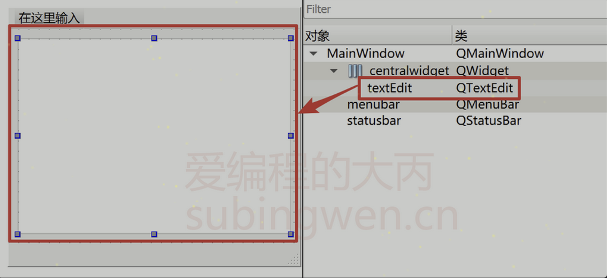
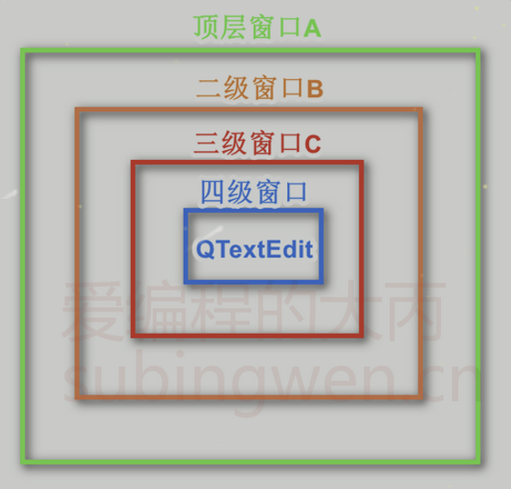

# 事件过滤器
## 1. 事件过滤器
除了使用事件分发器来过滤Qt窗口中产生的事件, 还可以通过事件过滤器过滤相关的事件。当Qt的事件通过应用程序对象发送给相关窗口之后, 窗口接收到数据之前这个期间可对事件进行过滤, 过滤掉的事件就不能被继续处理了。`QObject`有一个`eventFilter()`函数, 用于建立事件过滤器。函数原型如下:

```C++
[virtual] bool QObject::eventFilter(QObject *watched, QEvent *event);
```

- 参数:
    - `watched`: 要过滤的事件的所有者对象
    - `event`: 要过滤的具体的事件
- 返回值: 如果想过滤掉这个事件, 停止它被进一步处理, 返回`true`, 否则返回`false`.

既然要过滤传递中的事件, 首当其冲还是要搞明白如何通过事件过滤器进行事件的过滤, 主要分为两步:

1. 给要被过滤事件的类对象安装事件过滤器

```C++
void QObject::installEventFilter(QObject *filterObj);
```

假设调用`installEventFilter()`函数的对象为当前对象, 那么就可以基于参数指定的`filterObj`对象来过滤当前对象中的指定的事件了。

2. 在要进行事件过滤的类中（`filterObj`参数对应的类）重写从`QObject`类继承的虚函数`eventFilter()`。

[](file:///C:/Users/Heng_Xin/Desktop/wdf.html)

## 2. 事件过滤器的使用

根据上面的使用步骤, 举一个例子:

在一个窗口中有一个多行文本输入框`QTextEdit`, 需要让我们屏蔽掉键盘上的回车键, 也就是按回车键之后在这个文本编辑框中再也不能换行了。

其实上面的需求有三种解决方案：

1. 自定义一个新的类让其继承`QTextEdit`, 在这个子类中重写键盘事件`keyPressEvent`, 在这个函数里边屏蔽掉回车键
2. 自定义一个新的类让其继承`QTextEdit`, 在这个子类中重写事件分发器`event`, 在这个函数里边屏蔽掉回车键
3. 给`QTextEdit`安装事件过滤器, 基于`QTextEdit`的父窗口对这个控件的事件进行过滤

最简单的方式还是第三种, 因为我们不需要再定义出一个子类就可以轻松的完成控件事件的过滤了。

准备工作: 在主窗口中添加一个`QTextEdit`类型的控件, 如下图

| ##container## |
|:--:|
||

主窗口头文件: `mainwindow.h`

```C++
QT_BEGIN_NAMESPACE
namespace Ui { class MainWindow; }
QT_END_NAMESPACE

class MainWindow : public QMainWindow
{
    Q_OBJECT

public:
    MainWindow(QWidget *parent = nullptr);
    ~MainWindow();

    bool eventFilter(QObject *watched, QEvent *event);


private:
    Ui::MainWindow *ui;
};
```

主窗口源文件: mainwindow.cpp

```C++
MainWindow::MainWindow(QWidget *parent)
    : QMainWindow(parent)
    , ui(new Ui::MainWindow)
{
    ui->setupUi(this);

    ui->textEdit->installEventFilter(this);
}

MainWindow::~MainWindow() {
    delete ui;
}

bool MainWindow::eventFilter(QObject *watched, QEvent *event) {
    // 判断对象和事件
    if(watched == ui->textEdit && event->type() == QEvent::KeyPress) {
        QKeyEvent* keyEv = (QKeyEvent*)event;
        if(keyEv->key() == Qt::Key_Enter ||  // 小键盘确认
           keyEv->key() == Qt::Key_Return) { // 大键盘回车
            qDebug() << "我是回车, 被按下了...";
            return true;
        }
    }
    return false;
}
```

在示例代码的第7行: 给多行编辑框控件安装了事件过滤器, 由this对应的主窗口进行事件的过滤

在示例代码的第15行: 主窗口通过重新事件过滤器函数, 对多行编辑框控件进行事件的过滤, 在函数体内部关于键盘事件的过滤需要判断按键是否是回车键, 此处需要注意:

- `Qt::Key_Enter`是小键盘上的回车（确认）键, 有些键盘没有小键盘, 因此也就没有该按键。
- `Qt::Key_Return`是大键盘上的回车键

通过这样的处理, 事件在被应用程序对象发送出去之后, 进入到对应的窗口之前就被其父窗口过滤掉了。

如果在Qt的窗口中有多层嵌套的窗口, 如下图:

| ##container## |
|:--:|
||

[](file:///C:/Users/Heng_Xin/Desktop/wdf.html)

先来描述一下这四层窗口的关系：

- 顶层窗口A的直接子窗口是 B, 间接子窗口是 C, QTextEdit
- 二级窗口B的直接子窗口是 C, 间接子窗口是 QTextEdit
- 三级窗口C的直接子窗口是 QTextEdit

在这种多层嵌套窗口中如果想要过滤掉`QTextEdit`的某些事件, 可以交给A或者B或者C去处理, 当然也可以给`QTextEdit`同时安装多个过滤器：

```C++
ui->textEdit->installEventFilter(窗口A对象);  
ui->textEdit->installEventFilter(窗口B对象);  
ui->textEdit->installEventFilter(窗口C对象);  
```

`如果一个对象存在多个事件过滤器, 那么, 最后一个安装的会第一个执行, 也就是说窗口C先进行事件过滤, 然后窗口B, 最后窗口A。`

注意事项:

<span style="color:red">事件过滤器和被安装过滤器的组件必须在同一线程, 否则, 过滤器将不起作用。另外, 如果在安装过滤器之后, 这两个组件到了不同的线程, 那么, 只有等到二者重新回到同一线程的时候过滤器才会有效。</span>