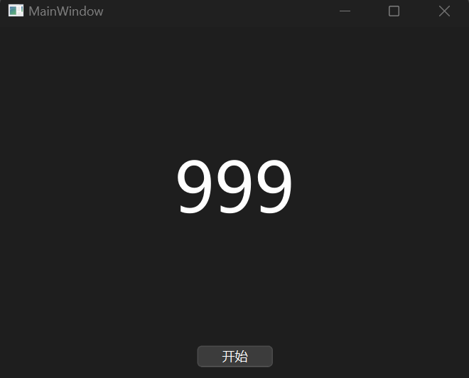

# Qt中多线程的使用
在进行桌面应用程序开发的时候，假设应用程序在某些情况下需要处理比较复杂的逻辑， 如果只有一个线程去处理，就会导致窗口卡顿，无法处理用户的相关操作。这种情况下就需要使用多线程，其中一个线程处理窗口事件，其他线程进行逻辑运算，多个线程各司其职，不仅可以提高用户体验还可以提升程序的执行效率。

在qt中使用了多线程，有些事项是需要额外注意的:

- 默认的线程在Qt中称之为窗口线程，也叫主线程，负责窗口事件处理或者窗口控件数据的更新

- 子线程负责后台的业务逻辑处理，子线程中不能对窗口对象做任何操作，这些事情需要交给窗口线程处理

- 主线程和子线程之间如果要进行数据的传递，需要使用Qt中的信号槽机制

## 1. 线程类 QThread

Qt中提供了一个线程类，通过这个类就可以创建子线程了，Qt中一共提供了两种创建子线程的方式，后边会依次介绍其使用方式。先来看一下这个类中提供的一些常用API函数:

### 1.1 常用共用成员函数

```C++
// QThread 类常用 API
// 构造函数
QThread::QThread(QObject *parent = Q_NULLPTR);
// 判断线程中的任务是不是处理完毕了
bool QThread::isFinished() const;
// 判断子线程是不是在执行任务
bool QThread::isRunning() const;

// Qt中的线程可以设置优先级
// 得到当前线程的优先级
Priority QThread::priority() const;
void QThread::setPriority(Priority priority);
优先级:
    QThread::IdlePriority         --> 最低的优先级
    QThread::LowestPriority
    QThread::LowPriority
    QThread::NormalPriority
    QThread::HighPriority
    QThread::HighestPriority
    QThread::TimeCriticalPriority --> 最高的优先级
    QThread::InheritPriority      --> 子线程和其父线程的优先级相同, 默认是这个
// 退出线程, 停止底层的事件循环
// 退出线程的工作函数
void QThread::exit(int returnCode = 0);
// 调用线程退出函数之后, 线程不会马上退出因为当前任务有可能还没有完成, 调回用这个函数是
// 等待任务完成, 然后退出线程, 一般情况下会在 exit() 后边调用这个函数
bool QThread::wait(unsigned long time = ULONG_MAX);
```

### 1.2 信号槽

```C++
// 和调用 exit() 效果是一样的
// 代用这个函数之后, 再调用 wait() 函数
[slot] void QThread::quit();
// 启动子线程
[slot] void QThread::start(Priority priority = InheritPriority);
// 线程退出, 可能是会马上终止线程, 一般情况下不使用这个函数
[slot] void QThread::terminate();

// 线程中执行的任务完成了, 发出该信号
// 任务函数中的处理逻辑执行完毕了
[signal] void QThread::finished();
// 开始工作之前发出这个信号, 一般不使用
[signal] void QThread::started();
```

### 1.3 静态函数

```C++
// 返回一个指向管理当前执行线程的QThread的指针
[static] QThread *QThread::currentThread();
// 返回可以在系统上运行的理想线程数 == 和当前电脑的 CPU 核心数相同
[static] int QThread::idealThreadCount();
// 线程休眠函数
[static] void QThread::msleep(unsigned long msecs);    // 单位: 毫秒
[static] void QThread::sleep(unsigned long secs);    // 单位: 秒
[static] void QThread::usleep(unsigned long usecs);    // 单位: 微秒
```

### 1.4 任务处理函数

```C++
// 子线程要处理什么任务, 需要写到 run() 中
[virtual protected] void QThread::run();
```

这个`run()`是一个虚函数，如果想让创建的子线程执行某个任务，需要写一个子类让其继承`QThread`，并且在子类中重写父类的`run()`方法，函数体就是对应的任务处理流程。另外，这个函数是一个受保护的成员函数，不能够在类的外部调用，如果想要让线程执行这个函数中的业务流程，需要通过当前线程对象调用槽函数`start()`启动子线程，当子线程被启动，这个`run()`函数也就在线程内部被调用了。

## 2. 使用方式1
### 2.1 操作步骤
Qt中提供的多线程的第一种使用方式的特点是: 简单。操作步骤如下:

1. 需要创建一个线程类的子类，让其继承QT中的线程类 QThread，比如:

```C++
class MyThread : public QThread {
    // ......
}
```

2. 重写父类的`run()`方法，在该函数内部编写子线程要处理的具体的业务流程

```C++
class MyThread : public QThread {
    // ......
protected:
    void run() {
        // ........
    }
}
```

3. 在主线程中创建子线程对象，new 一个就可以了

```C++
MyThread* subThread = new MyThread;
```

4. 启动子线程, 调用`start()`方法

```C++
subThread->start();
```

不能在类的外部调用`run()`方法启动子线程，在外部调用`start()`相当于让`run()`开始运行

当子线程别创建出来之后，父子线程之间的通信可以通过信号槽的方式，注意事项:

- 在Qt中在子线程中不要操作程序中的窗口类型对象, 不允许, 如果操作了程序就挂了

- 只有主线程才能操作程序中的窗口对象, 默认的线程就是主线程, 自己创建的就是子线程

### 2.2 示例代码

| ##container## |
|:--:|
||

- mythread.h
```C++
#ifndef MYTHREAD_H
#define MYTHREAD_H

#include <QThread>

class MyThread : public QThread {
    Q_OBJECT
public:
    explicit MyThread(QObject *parent = nullptr);

protected:
    void run();

signals:
    // 自定义信号, 传递数据
    void curNumber(int num);

public slots:
};

#endif // MYTHREAD_H
```

- mythread.cpp
```C++
#include "mythread.h"
#include <QDebug>

MyThread::MyThread(QObject *parent)
    : QThread(parent)
{}

void MyThread::run() {
    qDebug() << "当前线程对象的地址: " << QThread::currentThread();

    int num = 0;
    while(1) {
        emit curNumber(num++);
        if(num == 1000) {
            break;
        }
        QThread::usleep(1);
    }
    qDebug() << "run() 执行完毕, 子线程退出...";
}
```

- mainwindow.cpp
```C++
#include "mainwindow.h"
#include "ui_mainwindow.h"
#include "mythread.h"
#include <QDebug>

MainWindow::MainWindow(QWidget *parent) :
    QMainWindow(parent),
    ui(new Ui::MainWindow)
{
    ui->setupUi(this);

    qDebug() << "主线程对象地址:  " << QThread::currentThread();
    // 创建子线程
    MyThread* subThread = new MyThread;

    connect(subThread, &MyThread::curNumber, this, [=](int num) {
        ui->label->setNum(num);
    });

    connect(ui->startBtn, &QPushButton::clicked, this, [=]() {
        // 启动子线程
        subThread->start();
    });
}

MainWindow::~MainWindow() {
    delete ui;
}
```

这种在程序中添加子线程的方式是非常简单的，但是也有弊端，假设要在一个子线程中处理多个任务，所有的处理逻辑都需要写到`run()`函数中，这样该函数中的处理逻辑就会变得非常混乱，不太容易维护。

## 3. 使用方式2
### 3.1 操作步骤
Qt提供的第二种线程的创建方式弥补了第一种方式的缺点，用起来更加灵活，但是这种方式写起来会相对复杂一些，其具体操作步骤如下:

1. 创建一个新的类，让这个类从`QObject`派生

```C++
class MyWork : public QObject {
    // .......
}
```

2. 在这个类中添加一个公共的成员函数，函数体就是我们要子线程中执行的业务逻辑

```C++
class MyWork : public QObject {
public:
    // .......
    // 函数名自己指定, 叫什么都可以, 参数可以根据实际需求添加
    void working();
}
```

3. 在主线程中创建一个`QThread`对象, 这就是子线程的对象

```C++
QThread* sub = new QThread;
```

4. 在主线程中创建工作的类对象`（千万不要指定给创建的对象指定父对象）`

```C++
MyWork* work = new MyWork(this);    // error
MyWork* work = new MyWork;          // ok
```

5. 将`MyWork`对象移动到创建的子线程对象中, 需要调用`QObject`类提供的`moveToThread()`方法

```C++
// void QObject::moveToThread(QThread *targetThread);
// 如果给work指定了父对象, 这个函数调用就失败了
// 提示： QObject::moveToThread: Cannot move objects with a parent
work->moveToThread(sub);    // 移动到子线程中工作
```

6. 启动子线程，调用`start()`, 这时候线程启动了, 但是移动到线程中的对象并没有工作

7. 调用`MyWork`类对象的工作函数，让这个函数开始执行，这时候是在移动到的那个子线程中运行的

### 3.2 示例代码
假设函数处理上面在程序中数数的这个需求，具体的处理代码如下:

- mywork.h
```C++
#ifndef MYWORK_H
#define MYWORK_H

#include <QObject>

class MyWork : public QObject {
    Q_OBJECT
public:
    explicit MyWork(QObject *parent = nullptr);
    
    // 工作函数
    void working();
    
signals:
    void curNumber(int num);
    
public slots:
};

#endif // MYWORK_H
```

- mywork.cpp
```C++
#include "mywork.h"
#include <QDebug>
#include <QThread>

MyWork::MyWork(QObject *parent)
    : QObject(parent)
{}

void MyWork::working() {
    qDebug() << "当前线程对象的地址: " << QThread::currentThread();

    int num = 0;
    while(1) {
        emit curNumber(num++);
        if(num == 1000) {
            break;
        }
        QThread::usleep(1);
    }
    qDebug() << "run() 执行完毕, 子线程退出...";
}
```

- mainwindow.cpp
```C++
#include "mainwindow.h"
#include "ui_mainwindow.h"
#include <QThread>
#include "mywork.h"
#include <QDebug>

MainWindow::MainWindow(QWidget *parent) :
    QMainWindow(parent),
    ui(new Ui::MainWindow)
{
    ui->setupUi(this);

    qDebug() << "主线程对象的地址: " << QThread::currentThread();

    // 创建线程对象
    QThread* sub = new QThread;
    // 创建工作的类对象
    // 千万不要指定给创建的对象指定父对象
    // 如果指定了: QObject::moveToThread: Cannot move objects with a parent
    MyWork* work = new MyWork;
    // 将工作的类对象移动到创建的子线程对象中
    work->moveToThread(sub);
    // 启动线程
    sub->start();
    // 让工作的对象开始工作, 点击开始按钮, 开始工作
    connect(ui->startBtn, &QPushButton::clicked, work, &MyWork::working);
    // 显示数据
    connect(work, &MyWork::curNumber, this, [=] (int num) {
        ui->label->setNum(num);
    });
}

MainWindow::~MainWindow() {
    delete ui;
}
```
