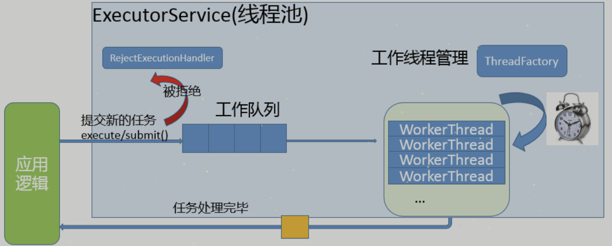

# Qt中线程池的使用
## 1. 线程池的原理
我们使用线程的时候就去创建一个线程，这样实现起来非常简便，但是就会有一个问题：如果并发的线程数量很多，并且每个线程都是执行一个时间很短的任务就结束了，这样频繁创建线程就会大大降低系统的效率，因为频繁创建线程和销毁线程需要时间。

那么有没有一种办法使得线程可以复用，就是执行完一个任务，并不被销毁，而是可以继续执行其他的任务呢？

线程池是一种多线程处理形式，处理过程中将任务添加到队列，然后在创建线程后自动启动这些任务。线程池线程都是后台线程。每个线程都使用默认的堆栈大小，以默认的优先级运行，并处于多线程单元中。如果某个线程在托管代码中空闲（如正在等待某个事件）,则线程池将插入另一个辅助线程来使所有处理器保持繁忙。如果所有线程池线程都始终保持繁忙，但队列中包含挂起的工作，则线程池将在一段时间后创建另一个辅助线程但线程的数目永远不会超过最大值。超过最大值的线程可以排队，但他们要等到其他线程完成后才启动。

在各个编程语言的语种中都有线程池的概念，并且很多语言中直接提供了线程池，作为程序猿直接使用就可以了，下面给大家介绍一下线程池的实现原理：

线程池的组成主要分为3个部分，这三部分配合工作就可以得到一个完整的线程池：

1. 任务队列，存储需要处理的任务，由工作的线程来处理这些任务
    - 通过线程池提供的API函数，将一个待处理的任务添加到任务队列，或者从任务队列中删除
    - 已处理的任务会被从任务队列中删除

2. 线程池的使用者，也就是调用线程池函数往任务队列中添加任务的线程就是生产者线程
    - 工作的线程（任务队列任务的消费者） ，N个
    - 线程池中维护了一定数量的工作线程, 他们的作用是是不停的读任务队列, 从里边取出任务并处理
    - 工作的线程相当于是任务队列的消费者角色，
    - 如果任务队列为空, 工作的线程将会被阻塞 (使用条件变量/信号量阻塞)
    - 如果阻塞之后有了新的任务, 由生产者将阻塞解除, 工作线程开始工作

3. 管理者线程（不处理任务队列中的任务），1个
    - 它的任务是周期性的对任务队列中的任务数量以及处于忙状态的工作线程个数进行检测
    - 当任务过多的时候, 可以适当的创建一些新的工作线程
    - 当任务过少的时候, 可以适当的销毁一些工作的线程

| ##container## |
|:--:|
||

## 2. QRunnable
在Qt中使用线程池需要先创建任务，添加到线程池中的每一个任务都需要是一个`QRunnable`类型，因此在程序中需要创建子类继承`QRunnable`这个类，然后重写`run()`方法，在这个函数中编写要在线程池中执行的任务，并将这个子类对象传递给线程池，这样任务就可以被线程池中的某个工作的线程处理掉了。

`QRunnable`类 常用函数不多，主要是设置任务对象传给线程池后，是否需要自动析构。

```C++
// 在子类中必须要重写的函数, 里边是任务的处理流程
[pure virtual] void QRunnable::run();

// 参数设置为 true: 这个任务对象在线程池中的线程中处理完毕, 这个任务对象就会自动销毁
// 参数设置为 false: 这个任务对象在线程池中的线程中处理完毕, 对象需要程序猿手动销毁
void QRunnable::setAutoDelete(bool autoDelete);
// 获取当前任务对象的析构方式,返回true->自动析构, 返回false->手动析构
bool QRunnable::autoDelete() const;
```

创建一个要添加到线程池中的任务类，处理方式如下:

```C++
class MyWork : public QObject, public QRunnable {
    Q_OBJECT
public:
    explicit MyWork(QObject *parent = nullptr) {
        // 任务执行完毕,该对象自动销毁
        setAutoDelete(true);
    }
    ~MyWork();

    void run() override {}
}
```

在上面的示例中MyWork类是一个多重继承，如果需要在这个任务中使用Qt的信号槽机制进行数据的传递就必须继承QObject这个类，如果不使用信号槽传递数据就可以不继承了，只继承QRunnable即可。

```C++
class MyWork : public QRunnable {
    Q_OBJECT
public:
    explicit MyWork() {
        // 任务执行完毕,该对象自动销毁
        setAutoDelete(true);
    }
    ~MyWork();

    void run() override {}
}
```

## 3. QThreadPool
Qt中的`QThreadPool`类管理了一组`QThreads`, 里边还维护了一个任务队列。`QThreadPool`管理和回收各个`QThread`对象，以帮助减少使用线程的程序中的线程创建成本。每个Qt应用程序都有一个全局`QThreadPool`对象，可以通过调用`globalInstance()`来访问它。也可以单独创建一个`QThreadPool`对象使用。

线程池常用的API函数如下:

```C++
// 获取和设置线程中的最大线程个数
int maxThreadCount() const;
void setMaxThreadCount(int maxThreadCount);

// 给线程池添加任务, 任务是一个 QRunnable 类型的对象
// 如果线程池中没有空闲的线程了, 任务会放到任务队列中, 等待线程处理
void QThreadPool::start(QRunnable * runnable, int priority = 0);
// 如果线程池中没有空闲的线程了, 直接返回值, 任务添加失败, 任务不会添加到任务队列中
bool QThreadPool::tryStart(QRunnable * runnable);

// 线程池中被激活的线程的个数(正在工作的线程个数)
int QThreadPool::activeThreadCount() const;

// 尝试性的将某一个任务从线程池的任务队列中删除, 如果任务已经开始执行就无法删除了
bool QThreadPool::tryTake(QRunnable *runnable);
// 将线程池中的任务队列里边没有开始处理的所有任务删除, 如果已经开始处理了就无法通过该函数删除了
void QThreadPool::clear();

// 在每个Qt应用程序中都有一个全局的线程池对象, 通过这个函数直接访问这个对象
static QThreadPool* QThreadPool::globalInstance();
```

一般情况下，我们不需要在Qt程序中创建线程池对象，直接使用Qt为每个应用程序提供的线程池全局对象即可。得到线程池对象之后，调用start()方法就可以将一个任务添加到线程池中，这个任务就可以被线程池内部的线程池处理掉了，使用线程池比自己创建线程的这种多种多线程方式更加简单和易于维护。

具体的使用方式如下:

- mywork.h
```C++
class MyWork : public QRunnable {
    Q_OBJECT
public:
    explicit MyWork();
    ~MyWork();

    void run() override;
}
```

- mywork.cpp
```C++
MyWork::MyWork() : QRunnable() {
    // 任务执行完毕,该对象自动销毁
    setAutoDelete(true);
}

void MyWork::run() {
    // 业务处理代码
    // ......
}
```

- mainwindow.cpp
```C++
MainWindow::MainWindow(QWidget *parent) :
    QMainWindow(parent),
    ui(new Ui::MainWindow)
{
    ui->setupUi(this);

    // 线程池初始化，设置最大线程池数
    QThreadPool::globalInstance()->setMaxThreadCount(4);
    // 添加任务
    MyWork* task = new MyWork;
    QThreadPool::globalInstance()->start(task);    
}
```
