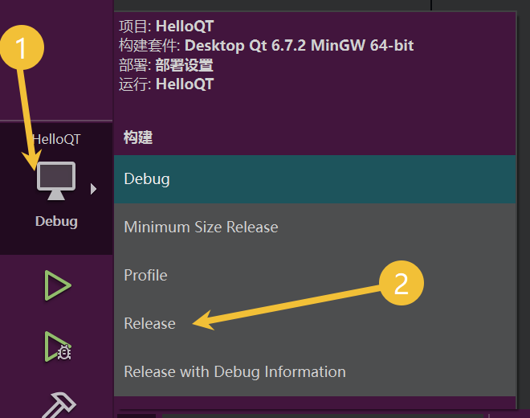
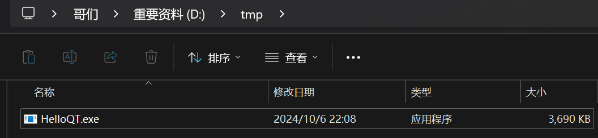
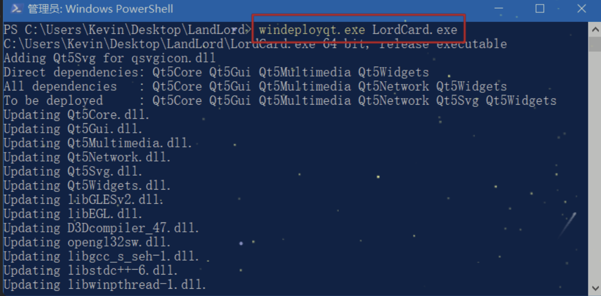
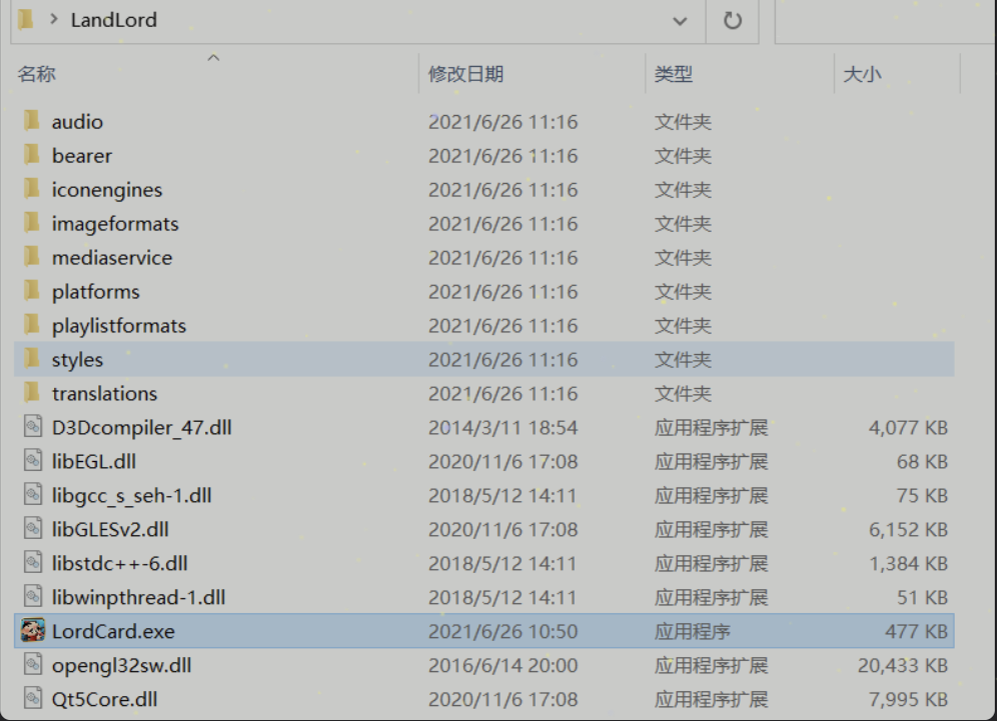

# Qt程序的发布和打包
## 1. Qt程序的发布

当Qt程序编写完成通过IDE编译就可以得到对应的可执行程序，这个可执行程序在本地运行是完全没有问题的（因为在本地有Qt环境，程序运行过程中可以加载到相关的动态库），但是如果我们想把这个Qt程序给到其他小伙伴使用可能就会出问题了，原因如下:

- 这个小伙伴本地根本没有Qt开发环境
- 这个小伙伴本地有Qt开发环境，但是和我们使用的版本不一致
- 这个小伙伴本地有Qt开发环境并且使用的版本与我们一致，但是没有配置环境变量

以上几种情况都会导致我们的小伙伴拿到可执行程序之后无法运行，下面来给大家讲一下解决方案。

### 1.1 生成Release版程序
在编写Qt程序的时候，不管我们使用的什么样的IDE都可以进行编译版本的切换，如果要发布程序需要切换为Release版本（Debug为调试版本），编译器会对生成的Release版可执行程序进行优化，生成的可执行程序会更小。这里以`QtCreator`为例，截图如下:

| ##container## |
|:--:|
||

模式选择完毕之后开始构建当前项目，最后找到生成的带Release后缀的构建目录，进入到release目录中，在里面就能找到我们要的可执行程序了

### 1.2 发布
生成的可执行程序在运行的时候需要加载相关的Qt库文件，因此需要将这些动态库一并发布给使用者，Qt官方给我们提供了相关的发布工具，通过这个工具就可以非常轻松的找出这些动态库文件了，这个工具叫做`windeployqt.exe`，该文件位于Qt安装目录的编译套件目录的bin目录中，以我本地为例: `D:\MyApp\QT\6.7.2\mingw_64\bin`。

- `D:\MyApp\QT`是Qt的安装目录
- `6.7.2`是Qt的版本
- `mingw_64`是编译套件目录
- `bin`存储`windeployqt.exe`文件的目录

如果已经将这个路径设置到环境变量中了，那么在当前操作系统的任意目录下都可以访问`windeployqt.exe`

知道Qt提供的这个工具之后就可以继续向下进行了，首先将生成的Release版本的可执行程序放到一个新建的空目录中:

| ##container## |
|:--:|
||

进入到这个目录，按住键盘shift键然后鼠标右键就可以弹出一个右键菜单, 打开Powershell窗口执行命令:

```sh
# LordCard.exe 是可执行程序的名字
# windeployqt.exe 的后缀 .exe 可以省略不写
windeployqt.exe HelloQT.exe
```

这样LordCard.exe需要的动态库会被全部拷贝到当前的目录中，如下图

| ##container## |
|:--:|
||

| ##container## |
|:--:|
||

使用这种方式Qt会将一些用不到的动态库也拷贝到当前的目录中，如果确定用不到可以手动将其删除，如果不在意这些，完全可以不用理会，我选择后者。

现在一个绿色免安装版的程序就得到了，可以将这个目录打个压缩包发送给自己的小伙伴，但是这种方式终究比较low，我们可以将这个目录中的文件制作成一个安装包，这样档次一下就上去了。

## 2. Qt程序打包
将应用程序和相关的动态库打包成安装包的工具有很多，我自己用过两个一个是NIS Edit，一个是Inno Setup这是一个免费的 Windows 安装程序制作软件，小巧、简便、精美。

官方下载地址: http://www.jrsoftware.org/isdl.php#stable

剩下的百度吧, 用到再说...