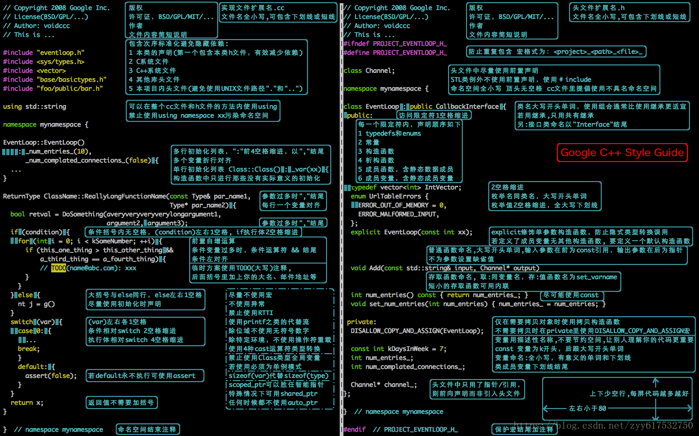

<h1 style="text-align:center">Google 代码规范 C++总结</h1>

> [!TIP]
> 然而这个也就那样, 根本就不是现代... 学学代码缩进什么的就好了, 一些C++98的东西, 为什么要学? 真以为C++98就是985啊.. (2025-4-3更)

| ##container## |
|:--:|
||
|一图总结|

> 应该使用空格而不是制表符: [Visual Studio 2019 制表符TAB键转空格的设置](https://blog.csdn.net/tcjy1000/article/details/112307101) (通用设置)

## 注解
### [1] 参考链接
1. [Google 代码规范 C++总结](https://zhuanlan.zhihu.com/p/400788298)
2. [Google 开源项目风格指南](https://zh-google-styleguide.readthedocs.io/en/latest/google-cpp-styleguide/contents.html)
