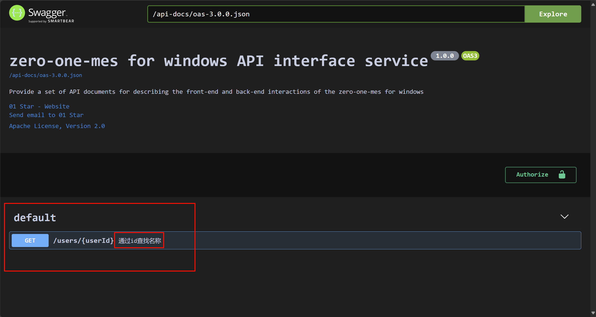
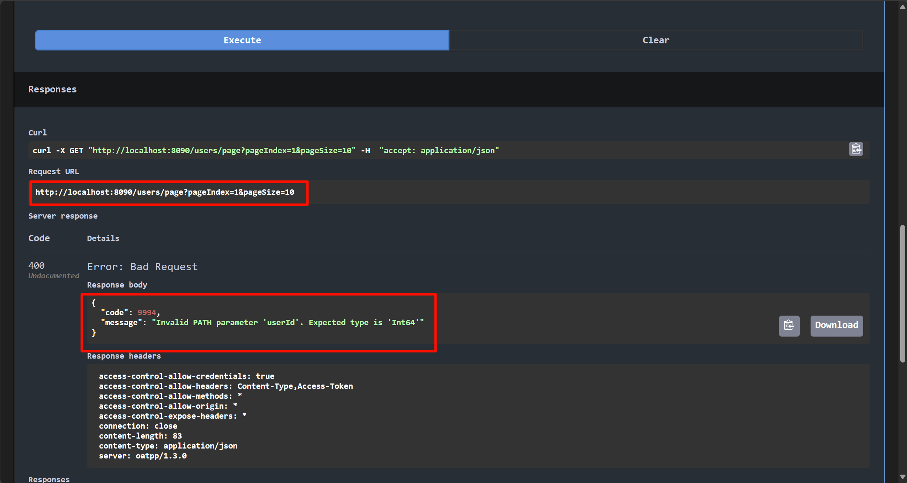

# 一个示例

```C++
#pragma once
#ifndef _TESTCONTROLLER_H_
#define _TESTCONTROLLER_H_

#include "ApiHelper.h"
#include "ServerInfo.h"
#include "domain/vo/BaseJsonVO.h"
#include "domain/query/PageQuery.h"

#include OATPP_CODEGEN_BEGIN(ApiController)

class TestContrller : public oatpp::web::server::api::ApiController
{
    // 定义控制器访问入口
    API_ACCESS_DECLARE(TestContrller);
public: // 定义接口
    // path请求
    ENDPOINT_INFO(getUserById) {
        API_DEF_ADD_TITLE(ZH_WORDS_GETTER("sample.get.summary"));
        API_DEF_ADD_PATH_PARAMS(Int64, "userId",
            ZH_WORDS_GETTER("sample.get.fields.uid.desc"),
            1,
            true);
    }
    ENDPOINT(API_M_GET, "/users/{userId}", getUserById, PATH(Int64, userId))
    {
        OATPP_LOGD("Test", "userId=%d", userId.getValue(0));
        return createResponse(Status::CODE_200, "OK");
    }
    
    // 查询请求
    ENDPOINT_INFO(getUsers) {
        API_DEF_ADD_TITLE(ZH_WORDS_GETTER("sample.get1.summary"));
        API_DEF_ADD_QUERY_PARAMS(Int32, "age",
            ZH_WORDS_GETTER("sample.get1.fields.age.desc"),
            100,
            true);
    }
    ENDPOINT(API_M_GET, "/users", getUsers, QUERY(Int32, age))
    {
        OATPP_LOGD("Test", "age=%d", age.getValue(0));
        return createResponse(Status::CODE_200, "OK");
    }

    // 响应对象
    ENDPOINT_INFO(getPage) {
        API_DEF_ADD_TITLE(ZH_WORDS_GETTER("sample.get2.summary"));
        // 定义分页描述
        API_DEF_ADD_PAGE_PARAMS();
        // 定义响应描述
        API_DEF_ADD_RSP_JSON_WRAPPER(StringJsonVO);
        //API_DEF_ADD_RSP_JSON(StringJsonVO::Wrapper);
    }
    ENDPOINT(API_M_GET, "/users1/page", getPage, QUERIES(QueryParams, params)) {
        // 解析查询参数
        API_HANDLER_QUERY_PARAM(query, PageQuery, params);
        // 响应结果
        API_HANDLER_RESP_VO(executeGetPage(query));
    }
private: // 定义接口执行函数
    StringJsonVO::Wrapper executeGetPage(const PageQuery::Wrapper& query);
};

#include OATPP_CODEGEN_END(ApiController)

#endif // !_TESTCONTROLLER_H_
```

# 报错: 双引号标量内流的意外结束
原因是`.yaml`文件编码为非`UTF-8`, 调整即可

# 学习: 构建一个请求处理层(`Controller`)
## 1. 在`Router::initRouter`中添加绑定控制器

位于`controller/Router.cpp`
```C++
void Router::initRouter()
{
#ifdef HTTP_SERVER_DEMO
    createSampleRouter();
#endif

    //#TIP :系统扩展路由定义，写在这个后面
    // 绑定xx控制器
    ROUTER_SIMPLE_BIND(XxxContrller);
}
```

## 2. 编写一个控制器类

注: 应该按照一定命名规则, 放在`controller`文件夹下 (一般会再新建一个文件夹), 然后新建一个`你的控制器类名称.h`的文件, 写入:

```C++
#pragma once
#ifndef _HX_TEST_CONTROLLER_
#define _HX_TEST_CONTROLLER_

#include "ApiHelper.h"              // 二次封装的API
#include "ServerInfo.h"             // 服务器实体, 包括数据库等信息
#include "domain/vo/BaseJsonVO.h"   // 定义基础数据类型对应的响应JsonVO
#include "domain/query/PageQuery.h" // 定义分页查询对象父类，后续分页查询对象可以继承它

// 定义API控制器使用宏
#include OATPP_CODEGEN_BEGIN(ApiController)

class HXTestController : public oatpp::web::server::api::ApiController
{
    // 定义控制器访问入口
    API_ACCESS_DECLARE(HXTestController);
public: // 定义接口
    // path请求
    ENDPOINT_INFO(getUserById) {
        API_DEF_ADD_TITLE(ZH_WORDS_GETTER("hx.get.by.id"));
        API_DEF_ADD_PATH_PARAMS(Int64, "userId",
            ZH_WORDS_GETTER("hx.get.fields.uid.desc"),
            1,
            true);
    }
    ENDPOINT(API_M_GET, "/users/{userId}", getUserById, PATH(Int64, userId))
    {
        OATPP_LOGD("test_tab", "userId=%d", userId.getValue(0)); // 输出日志
        return createResponse(Status::CODE_200, "OK"); // 给客户端返回结果
    }
};

#include OATPP_CODEGEN_END(ApiController)
#endif // !_HX_TEST_CONTROLLER_
```

宏展开就是:

```C++
public: // 定义接口
    // path请求
    std::shared_ptr<oatpp::web::server::api::Endpoint::Info> Z__ENDPOINT_CREATE_ADDITIONAL_INFO_getUserById() {
        auto info = Z__EDNPOINT_INFO_GET_INSTANCE_getUserById(); Z__ENDPOINT_ADD_INFO_getUserById(info); 
        return info;
    } 
    
    const std::shared_ptr<oatpp::web::server::api::Endpoint::Info> Z__ENDPOINT_ADDITIONAL_INFO_getUserById = Z__ENDPOINT_CREATE_ADDITIONAL_INFO_getUserById(); 
    
    void Z__ENDPOINT_ADD_INFO_getUserById(const std::shared_ptr<oatpp::web::server::api::Endpoint::Info>& info) {
        info->summary = YamlHelper().getString(&(ServerInfo::getInstance().getZhDictNode()), "hx.get.by.id");
        info->pathParams.add<Int64>("userId").description = YamlHelper().getString(&(ServerInfo::getInstance().getZhDictNode()), "hx.get.fields.uid.desc"); 
        info->pathParams["userId"].addExample("default", Int64(1)); 
        info->pathParams["userId"].required = true;
    }

    template<class T> 
    static typename std::shared_ptr<Handler<T>> Z__ENDPOINT_HANDLER_GET_INSTANCE_getUserById(T* controller) {
        auto handler = std::static_pointer_cast<Handler<T>>(controller->getEndpointHandler("getUserById"));
        if (!handler) {
            handler = Handler<T>::createShared(controller, &T::Z__PROXY_METHOD_getUserById, nullptr); 
            controller->setEndpointHandler("getUserById", handler);
        } 
        return handler;
    }

    std::shared_ptr<oatpp::web::server::api::Endpoint::Info> Z__EDNPOINT_INFO_GET_INSTANCE_getUserById() {
        std::shared_ptr<oatpp::web::server::api::Endpoint::Info> info = getEndpointInfo("getUserById"); 
        if (!info) {
            info = oatpp::web::server::api::Endpoint::Info::createShared(); 
            setEndpointInfo("getUserById", info);
        } 
        return info;
    }

    EndpointInfoBuilder Z__CREATE_ENDPOINT_INFO_getUserById = [this]() { 
        auto info = Z__EDNPOINT_INFO_GET_INSTANCE_getUserById(); 
        info->name = "getUserById"; 
        info->path = ((m_routerPrefix != nullptr) ? m_routerPrefix + "/users/{userId}" : "/users/{userId}"); 
        info->method = "GET"; info->pathParams.add("userId", Int64::Class::getType()); 
        return info; 
    }; 

    const std::shared_ptr<oatpp::web::server::api::Endpoint> Z__ENDPOINT_getUserById = createEndpoint(m_endpoints, Z__ENDPOINT_HANDLER_GET_INSTANCE_getUserById(this), Z__CREATE_ENDPOINT_INFO_getUserById); 
    
    std::shared_ptr<oatpp::web::protocol::http::outgoing::Response> Z__PROXY_METHOD_getUserById(const std::shared_ptr<oatpp::web::protocol::http::incoming::Request>& __request) {
        const auto& __param_str_val_userId = __request->getPathVariable("userId"); 
        if (!__param_str_val_userId) {
            return ApiController::handleError(Status::CODE_400, "Missing PATH parameter '" "userId" "'");
        } 
        bool __param_validation_check_userId; 
        const auto& userId = ApiController::TypeInterpretation<Int64>::fromString("Int64", __param_str_val_userId, __param_validation_check_userId); 
        if (!__param_validation_check_userId) {
            return ApiController::handleError(Status::CODE_400, "Invalid PATH parameter '" "userId" "'. Expected type is '" "Int64" "'");
        } 
        return getUserById(userId);
    }

    std::shared_ptr<oatpp::web::protocol::http::outgoing::Response> getUserById(const Int64& userId)
    {
        oatpp::base::Environment::logFormatted(oatpp::base::Logger::PRIORITY_D, "test_tab", "userId=%d", userId.getValue(0));; // 日志
        return createResponse(Status::CODE_200, "OK");
    }
```

~~(看样子, 不需要理解宏原来的东西了)~~

## 2.1 ENDPOINT_INFO 宏 (用于在swagger上的显示描述)

可以不写

```C++
#define ENDPOINT_INFO(NAME) // 省略...
```
- `NAME`: 端点名称(和下面的要相同)

## 2.2 ENDPOINT 宏 (定义URL)
不可或缺!(不能只写上面`2.1`的宏, 但可只写`2.2`的)
```C++
/**
 * 用于在oatpp::web::server::api::ApiController中生成端点的代码生成宏
 * @param METHOD - HTTP方法（"GET"，"POST"，"PUT"等）
 * @param PATH - 端点的URL路径（不包括主机）
 * @param NAME - (端点名称)生成的方法的名称
 * @return - 指向&id:oatpp::web::protocol::http::outgoing::Response的std::shared_ptr;
 */
#define ENDPOINT(METHOD, PATH, ...) \
OATPP_MACRO_EXPAND(OATPP_MACRO_MACRO_BINARY_SELECTOR(OATPP_MACRO_API_CONTROLLER_ENDPOINT_MACRO_, (__VA_ARGS__)) (METHOD, PATH, __VA_ARGS__))
```

## 2.3 ZH_WORDS_GETTER 宏 (获取.yaml文件内容)

返回`std::string`

```C++
ZH_WORDS_GETTER("hx.get.fields.uid.desc"); // 按照以下路径获取(注意需要UTF-8编码的.yaml文件!)
```

```yaml
hx:
 get:
  by:
   id: 通过id查找名称
```

## 2.4 API_DEF_ADD_TITLE 宏 (添加标题)

```C++
API_DEF_ADD_TITLE(std::string); // 需要一个 std::string 类型的字符串
```

| ##container## |
|:--:|
||
|(结果示例)|

## 2.5 API_DEF_ADD_PATH_PARAMS 宏
位于: `lib-oatpp\include\ApiHelper.h`
```C++
/**
 * API描述添加路径参数说明
 * @param _TYPE_: 字段数据类型。如：String、UInt32等
 * @param _FIELD_NAME_: 字段名称。如："age"、"sex"
 * @param _DESCRIPTION_: 字段描述。
 * @param _EXAMPLE_VAL_: 示例值。如："li si"、123
 * @param _REQUIRE_: 是否必传参数，bool值。如：true、false
 */
#define API_DEF_ADD_PATH_PARAMS(_TYPE_, _FIELD_NAME_, _DESCRIPTION_, _EXAMPLE_VAL_, _REQUIRE_) \
info->pathParams.add<_TYPE_>(_FIELD_NAME_).description = _DESCRIPTION_; \
info->pathParams[_FIELD_NAME_].addExample("default", _TYPE_(_EXAMPLE_VAL_)); \
info->pathParams[_FIELD_NAME_].required = _REQUIRE_
```

## 2.6 URL 类型
### 2.6.1 PATH

```C++
ENDPOINT(API_M_GET, "/users/{userId}", getUserById, PATH(Int64, userId))
{
    OATPP_LOGD("test_tab", "userId=%d", userId.getValue(0)); // 日志
    return createResponse(Status::CODE_200, "OK");
}
```

注意: `"/users/{userId}"` 和 `PATH(Int64, userId)`, 像这样的请求叫做`path请求`(即请求一个path如`/users/114514`)

### 2.6.2 查询请求

```C++
ENDPOINT(API_M_GET, "/users", getUsers, QUERY(Int32, age))
{
    OATPP_LOGD("test_tab", "age=%d", age.getValue(0));
    return createResponse(Status::CODE_200, "OK");
}
```
注意: `"/users"`, `QUERY(Int32, age)`, 访问的时候是`/users?age=666`这种(叫做`查询请求`)

### 2.6.3 分页查询 + 响应对象(json字符串)

```C++
// 响应对象
ENDPOINT_INFO(getPage) {
    API_DEF_ADD_TITLE(ZH_WORDS_GETTER("hx.get3.getPage"));
    // 定义分页描述
    API_DEF_ADD_PAGE_PARAMS();
    // 定义响应描述
    API_DEF_ADD_RSP_JSON_WRAPPER(StringJsonVO);
    // 上面等价于 API_DEF_ADD_RSP_JSON(StringJsonVO::Wrapper);
}
ENDPOINT(API_M_GET, "/users1/page", getPage, QUERIES(QueryParams, params)) {
    // 解析查询参数
    API_HANDLER_QUERY_PARAM(query, PageQuery, params);
    // 响应结果
    API_HANDLER_RESP_VO(executeGetPage(query));
    // 宏展开就是 return createDtoResponse(Status::CODE_200, executeGetPage(query));
private: // 定义接口执行函数
    StringJsonVO::Wrapper executeGetPage(const PageQuery::Wrapper& query);
}

// cpp
StringJsonVO::Wrapper HXTestController::executeGetPage(const PageQuery::Wrapper& query) {
    auto vo = StringJsonVO::createShared();
    vo->success(String("test query"));
    return vo;
}
```

注意: 此处定义了URL是`"/users1/page"`, 而不是`"/users/page"`(也不能是), 不然: (和之前的`/users/{userId}`冲突了, 即便它不是数字, 也会被识别到!)

| ##container## |
|:--:|
||

#### 2.6.3.1 自定义分页查询

注: 此处的分页查询还可以自定义! 只需要继承`PageQuery`即可: (`arch-demo\domain\query\sample\SampleQuery.h`)

```C++
#ifndef _SAMPLE_QUERY_
#define _SAMPLE_QUERY_

#include "../../GlobalInclude.h"
#include "domain/query/PageQuery.h"

#include OATPP_CODEGEN_BEGIN(DTO)

/**
 * 示例分页查询对象
 */
class SampleQuery : public PageQuery
{
    DTO_INIT(SampleQuery, PageQuery);
    // 姓名
    DTO_FIELD(String, name);
    DTO_FIELD_INFO(name) {
        info->description = ZH_WORDS_GETTER("sample.field.name");
    }
    // 性别
    DTO_FIELD(String, sex);
    DTO_FIELD_INFO(sex) {
        info->description = ZH_WORDS_GETTER("sample.field.sex");
    }
    // 年龄
    DTO_FIELD(UInt32, age);
    DTO_FIELD_INFO(age) {
        info->description = ZH_WORDS_GETTER("sample.field.age");
    }
};

#include OATPP_CODEGEN_END(DTO)
#endif // !_SAMPLE_QUERY_
```

自定义了这些字段, 就可以通过`查询请求`被`?xxx=abc&yyy=efg`这样获取了: (这里就使用了自定义的name, sex, age字段) (**同时也告诉我们如何使用这个`query`**)

```C++
// 定义条件解析宏，减少重复代码
#define SAMPLE_TERAM_PARSE(query, sql) \
SqlParams params; \
sql<<" WHERE 1=1"; \
if (query->name) { \
    sql << " AND `name`=?"; \
    SQLPARAMS_PUSH(params, "s", std::string, query->name.getValue("")); \
} \
if (query->sex) { \
    sql << " AND sex=?"; \
    SQLPARAMS_PUSH(params, "s", std::string, query->sex.getValue("")); \
} \
if (query->age) { \
    sql << " AND age=?"; \
    SQLPARAMS_PUSH(params, "i", int, query->age.getValue(0)); \
}
```

# DO/DTO/BO/VO/Queryでなに?


概括
- DTO: 前端给后端传递的数据

- VO: 后端给前端传递的数据

- DO: 数据库表结构

- PO: 数据库表结构到JAVA的映射类

一般我们使用Mybatis建的类为 PO, 控制器接受到前端发来的参数为 DTO, 给前端发送的安全的数据为VO。如果数据类不做映射处理关系时 PO = DO ([三分钟掌握POJO及其转换——PO、DO、DTO、VO](https://zhuanlan.zhihu.com/p/94931336))

## `Controller`から見ると
考虑以下`Controller`的代码:
```C++
SamplePageJsonVO::Wrapper SampleController::execQuerySample(const SampleQuery::Wrapper& query, const PayloadDTO& payload) {
    // 定义一个Service
    SampleService service;
    // 查询数据
    SamplePageDTO::Wrapper result = service.listAll(query);
    // 响应结果
    SamplePageJsonVO::Wrapper jvo = SamplePageJsonVO::createShared();
    jvo->success(result);
    return jvo;
}

Uint64JsonVO::Wrapper SampleController::execAddSample(const SampleDTO::Wrapper& dto) {
    // 定义返回数据对象
    auto jvo = Uint64JsonVO::createShared();
    // 参数校验
    // 非空校验
    if (!dto->age || !dto->name || !dto->sex) {
        jvo->init(UInt64(-1), RS_PARAMS_INVALID);
        return jvo;
    }
    // 有效值校验
    if (dto->age < 0 || dto->name->empty() || dto->sex->empty()) {
        jvo->init(UInt64(-1), RS_PARAMS_INVALID);
        return jvo;
    }

    // 定义一个Service
    SampleService service;
    // 执行数据新增
    uint64_t id = service.saveData(dto);
    if (id > 0) {
        jvo->success(UInt64(id));
    } else {
        jvo->fail(UInt64(id));
    }
    //响应结果
    return jvo;
}
```

我们可以发现:

1. 前端传入`query`(可能包含`payload`凭证)(`GET`请求), 然后`Controller`层调用`Service`层(传入`query`), 得到`Service`返回的`DTO`, 再把`DTO`的数据写入`VO`, 最终返回.

2. 前端传入`DTO`(通过`POST`请求(存放在`BODY_DTO`)(下面有端点接口原型)), 然后 **校验数据**, 然后`Controller`层调用`Service`层(传入`DTO`)(返回应该是mysql变更的行数), 最后封装成(Json)`VO`返回.
 
```C++
// 3.1 定义新增接口描述
ENDPOINT_INFO(addSample) {
    // 定义接口标题
    API_DEF_ADD_TITLE(ZH_WORDS_GETTER("sample.post.summary"));
    // 定义默认授权参数（可选定义，如果定义了，下面ENDPOINT里面需要加入API_HANDLER_AUTH_PARAME）
    API_DEF_ADD_AUTH();
    // 定义响应参数格式
    API_DEF_ADD_RSP_JSON_WRAPPER(Uint64JsonVO);
}
// 3.2 定义新增接口处理
ENDPOINT(API_M_POST, "/sample", addSample, BODY_DTO(SampleDTO::Wrapper, dto), API_HANDLER_AUTH_PARAME) {
    // 呼叫执行函数响应结果
    API_HANDLER_RESP_VO(execAddSample(dto));
}
```

## `Service`に見れば

```C++
SamplePageDTO::Wrapper SampleService::listAll(const SampleQuery::Wrapper& query) {
    // 构建返回对象
    auto pages = SamplePageDTO::createShared();
    pages->pageIndex = query->pageIndex;
    pages->pageSize = query->pageSize;

    // 查询数据总条数
    SampleDAO dao;
    uint64_t count = dao.count(query);
    if (count <= 0) {
        return pages;
    }

    // 分页查询数据
    pages->total = count;
    pages->calcPages();
    list<SampleDO> result = dao.selectWithPage(query);
    // 将DO转换成DTO
    for (SampleDO sub : result) {
        auto dto = SampleDTO::createShared();
        ZO_STAR_DOMAIN_DO_TO_DTO(dto, sub, id, Id, name, Name, sex, Sex, age, Age)
        pages->addData(dto);
    }
    return pages;
}

uint64_t SampleService::saveData(const SampleDTO::Wrapper& dto) {
    // 组装DO数据
    SampleDO data;
    // data.setName(dto->name.getValue(""));
    // data.setSex(dto->sex.getValue(""));
    // data.setAge(dto->age.getValue(1));
    ZO_STAR_DOMAIN_DTO_TO_DO(data, dto, Name, name, Sex, sex, Age, age)
    // 执行数据添加
    SampleDAO dao;
    return dao.insert(data);
}
```
1. `Service`会调用`DAO`层(会将`Controller`传入的`query`直接转发给`DAO`层(可以直接发是因为`DAO`有相关解析), `DAO`层返回`DO`, `Service`层再把`DO`转化成`DTO`再返回给`Controller`)

2. `Service`会调用`DAO`层(会将`Controller`传入`DTO`的再传递给`DAO`, 然后`DAO`层查询返回结果(基本数据类型直接返回))

## `DAO`え?見ないのか

```C++
uint64_t SampleDAO::insert(const SampleDO& iObj) {
    string sql = "INSERT INTO `sample` (`name`, `sex`, `age`) VALUES (?, ?, ?)";
    return sqlSession->executeInsert(sql, "%s%s%i", iObj.getName(), iObj.getSex(), iObj.getAge());
}
```

- 这个就没什么好看的了.. 但是我发现了: `mes-cpp\lib-mysql\include\BaseDAO.h`

```C++
/**
 * 定义一个基础的DAO类，方便管理，后续定义DAO都需要继承它
 */
class BaseDAO {
private:
    // 是否自动释放SQLSession
    bool isAutoRelease;
protected:
    // 定义一个SqlSession
    SqlSession* sqlSession;
public:
    BaseDAO();
    virtual ~BaseDAO();
    // 获取SqlSession
    SqlSession* getSqlSession();
    // 设置SqlSession
    void setSqlSession(SqlSession* session);
    // 设置是否自动释放SqlSession
    void setAutoRelease(bool release);
};
```

而:

```C++
class SqlSession final { /*省略n行*/ };
```

就是我们的`mysql操作`工具类!

## 总结
> [!TIP]
>
> $$ \color{Yellow} \text{前端} \xrightleftharpoons[\text{封装成(Json)VO}]{\text{DTO/query}} \text{Controller} \xrightleftharpoons[\text{返回DO转化为DTO}]{\text{数据校验}} \text{Service} \xrightleftharpoons[\text{返回DO}]{\text{将DTO转为DO/传Key: 查询、删除}} \text{DAO} \xrightleftharpoons[\text{返回}]{\text{请求}} \text{MySql} $$
