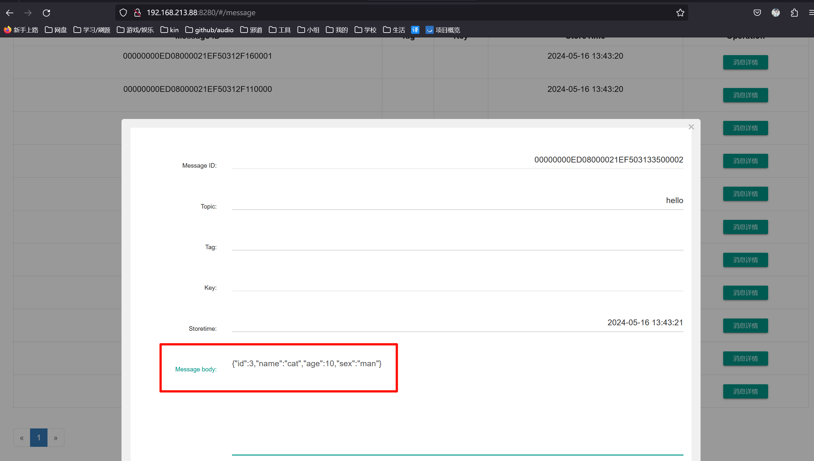
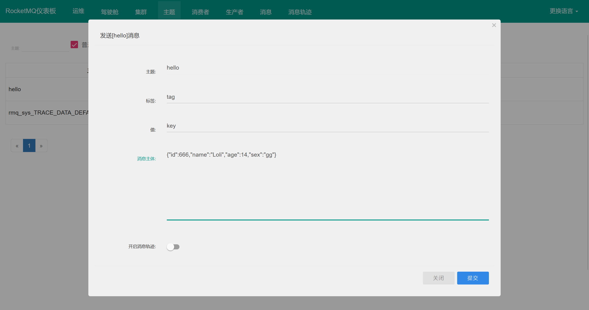
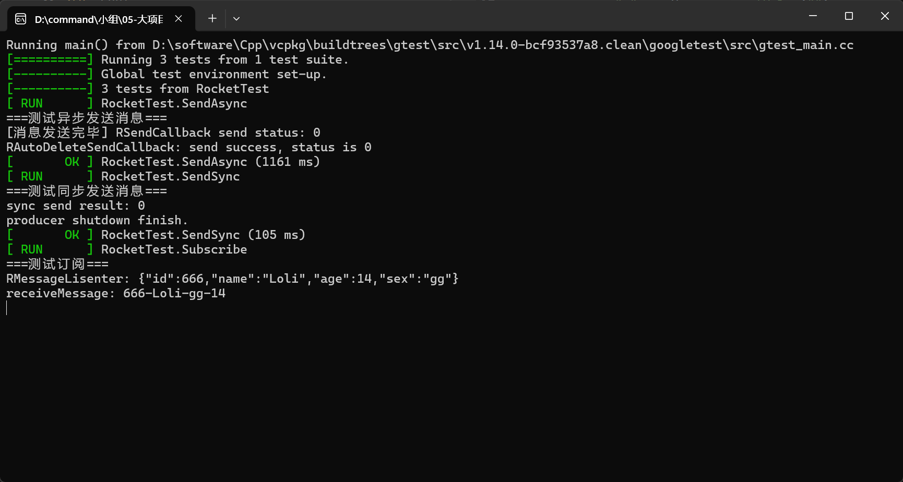

# 一、Websocket
## 1.1 WebSocketでなに?
> WebSocket 是 HTML5 开始提供的一种在单个 TCP 连接上进行全双工通讯的协议。
>
> WebSocket 使得客户端和服务器之间的数据交换变得更加简单，允许服务端主动向客户端推送数据。在 WebSocket API 中，浏览器和服务器只需要完成一次握手，两者之间就直接可以创建持久性的连接，并进行双向数据传输。
>
> 在 WebSocket API 中，浏览器和服务器只需要做一个握手的动作，然后，浏览器和服务器之间就形成了一条快速通道。两者之间就直接可以数据互相传送。
>
> 现在，很多网站为了实现推送技术，所用的技术都是 Ajax 轮询。轮询是在特定的的时间间隔（如每1秒），由浏览器对服务器发出HTTP请求，然后由服务器返回最新的数据给客户端的浏览器。这种传统的模式带来很明显的缺点，即浏览器需要不断的向服务器发出请求，然而HTTP请求可能包含较长的头部，其中真正有效的数据可能只是很小的一部分，显然这样会浪费很多的带宽等资源。
>
> HTML5 定义的 WebSocket 协议，能更好的节省服务器资源和带宽，并且能够更实时地进行通讯。
>
> 
>
> 浏览器通过 JavaScript 向服务器发出建立 WebSocket 连接的请求，连接建立以后，客户端和服务器端就可以通过 TCP 连接直接交换数据。
>
> (copy By: [菜鸟教程 HTML5 WebSocket](https://www.runoob.com/html/html5-websocket.html))

## 1.2 示例
- 实时聊天室
- 消息(邮件) 在不刷新网页的情况下更新
- ...

### 1.2.1 文件位置
- 客户端: `zero-one-08mes\mes-cpp\arch-demo\public\chat.html`

- 控制层: `zero-one-08mes\mes-cpp\arch-demo\controller\ws\WSController.h`

- 实例监听器: `zero-one-08mes\mes-cpp\arch-demo\controller\ws\WSInstanceListener.h`

- 监听器事件处理: `zero-one-08mes\mes-cpp\arch-demo\controller\ws\WSListener.h`

### 1.2.2 控制层

```C++
/**
 * 测试WebSocket访问端点创建
 */
class WSContorller : public oatpp::web::server::api::ApiController
{
    API_ACCESS_DECLARE(WSContorller);
private:
    OATPP_COMPONENT(std::shared_ptr<oatpp::network::ConnectionHandler>, websocketConnectionHandler, "websocket");
public:
    ENDPOINT(API_M_GET, "chat", chat, REQUEST(std::shared_ptr<IncomingRequest>, request)) {
        auto response = oatpp::websocket::Handshaker::serversideHandshake(request->getHeaders(), websocketConnectionHandler);
        auto parameters = std::make_shared<oatpp::network::ConnectionHandler::ParameterMap>();
        (*parameters)["id"] = request->getQueryParameter("id");
        response->setConnectionUpgradeParameters(parameters);
        return response;
    };
};
```

### 1.2.3 监听器

```C++
/**
 * 定义示例WS实例监听器
 */
class WSInstanceListener : public oatpp::websocket::ConnectionHandler::SocketInstanceListener
{
private:
    static constexpr const char* TAG = "Server_WSInstanceListener";
public:
    /**
     * Counter for connected clients.
     */
    static std::atomic<v_int32> SOCKETS;
    // 定义一个连接对象池
    std::map<std::string, const WebSocket*> conn_pool;
    // 定义一个锁对象
    std::mutex instance_mutex;
public:
    // 当socket实例创建时调用
    void onAfterCreate(const WebSocket& socket, const std::shared_ptr<const ParameterMap>& params) override;
    // 当socket实例销毁前调用
    void onBeforeDestroy(const WebSocket& socket) override;
};
```

```C++
// .cpp
std::atomic<v_int32> WSInstanceListener::SOCKETS(0);

void WSInstanceListener::onAfterCreate(const WebSocket& socket, const std::shared_ptr<const ParameterMap>& params)
{
    // 获取客户端ID
    std::string id = params->at("id")->c_str();
    // 判断客户端对象是否存在
    std::lock_guard<std::mutex> guard(instance_mutex);
    if (conn_pool.find(id) != conn_pool.end()) {
        // 关闭拒绝连接
        socket.sendClose(9999, u8"reason id has been used");
        OATPP_LOGD(TAG, "New Incoming Connection. Connection has been refuse.");
        return;
    }

    // 添加到连接池中
    conn_pool.insert(std::make_pair(id, &socket));
    OATPP_LOGD(TAG, "client(%s): open connection", id.c_str());

    // 连接数量计数
    SOCKETS++;
    OATPP_LOGD(TAG, "New Incoming Connection. Connection count=%d", SOCKETS.load());

    // 添加消息处理监听器
    socket.setListener(std::make_shared<WSListener>(id, &conn_pool));
}

void WSInstanceListener::onBeforeDestroy(const WebSocket& socket)
{
    auto peer = std::static_pointer_cast<WSListener>(socket.getListener());
    if (peer)
    {
        // 获取客户端ID
        std::string id = peer->getId();

        // 处理客户端移除
        OATPP_LOGD(TAG, "client(%s): close connection", id.c_str());

        // 将连接对象从map中移除
        std::lock_guard<std::mutex> guard(instance_mutex);
        conn_pool.erase(id);
        socket.setListener(nullptr);

        // 连接数量计数
        SOCKETS--;
        OATPP_LOGD(TAG, "Connection closed. Connection count=%d", SOCKETS.load());
    }
}
```

就问你像不像: [epoll模式](../../../../002-tmp丶C++丶memo/004-C++网络编程/001-实践版本/009-epoll模式/index.md) 实现的聊天室?

### 1.2.4 事件处理

```C++
/**
 * WebSocket侦听器,侦听传入的WebSocket事件
 */
class WSListener : public oatpp::websocket::WebSocket::Listener
{
private:
    static constexpr const char* TAG = "Server_WSListener";
    // 消息缓冲区
    oatpp::data::stream::BufferOutputStream m_messageBuffer;
    // 用户ID
    std::string id;
    // 加入聊天室用户列表
    std::map<std::string, const WebSocket*>* conn_pool;
public:
    // 获取ID
    const std::string& getId();
    // 构造初始化
    WSListener(std::string id, std::map<std::string, const WebSocket*>* conn_pool);
    // 在ping帧上调用
    void onPing(const WebSocket& socket, const oatpp::String& message) override;
    // 在pong帧上调用
    void onPong(const WebSocket& socket, const oatpp::String& message) override;
    // 在close帧上调用
    void onClose(const WebSocket& socket, v_uint16 code, const oatpp::String& message) override;
    // 在每个消息帧上调用。最后一条消息将再次调用，size等于0以指定消息结束
    void readMessage(const WebSocket& socket, v_uint8 opcode, p_char8 data, oatpp::v_io_size size) override;
};
```

```C++
// .cpp
// 定义一个锁对象
std::mutex listener_mutex;

const std::string& WSListener::getId()
{
    return this->id;
}

WSListener::WSListener(std::string id, std::map<std::string, const WebSocket*>* conn_pool)
{
    this->id = id;
    this->conn_pool = conn_pool;
}

void WSListener::onPing(const WebSocket& socket, const oatpp::String& message)
{
    OATPP_LOGD(TAG, "onPing");
    socket.sendPong(message);
}

void WSListener::onPong(const WebSocket& socket, const oatpp::String& message)
{
    OATPP_LOGD(TAG, "onPong");
}

void WSListener::onClose(const WebSocket& socket, v_uint16 code, const oatpp::String& message)
{
    OATPP_LOGD(TAG, "onClose code=%d", code);
}

void WSListener::readMessage(const WebSocket& socket, v_uint8 opcode, p_char8 data, oatpp::v_io_size size)
{
    // message transfer finished
    if (size == 0)
    {
        // 获取消息数据
        auto wholeMessage = m_messageBuffer.toString().getValue("");
        m_messageBuffer.setCurrentPosition(0);
        OATPP_LOGD(TAG, "onMessage message='%s'", wholeMessage.c_str());
        // 解析消息 => ID::消息内容
        std::vector<string> msgs = StringUtil::split(wholeMessage.c_str(), "::");
        // 群发消息ID=all表示群发
        if ("all" == msgs[0])
        {
            std::lock_guard<std::mutex> guard(listener_mutex);
            for (auto one : *conn_pool)
            {
                // 排除自己
                if (one.second == &socket)
                {
                    continue;
                }
                // 发送消息
                one.second->sendOneFrameText(msgs[1]);
            }
        }
        // 指定发送
        else
        {
            std::lock_guard<std::mutex> guard(listener_mutex);
            auto iter = conn_pool->find(msgs[0]);
            if (iter != conn_pool->end())
            {
                iter->second->sendOneFrameText(msgs[1]);
            }
        }
        socket.sendOneFrameText("message send success");
    }
    // message frame received
    else if (size > v_int64(0))
    {
        m_messageBuffer.writeSimple(data, v_buff_size(size));
    }
}
```

注: `ping-pong`就是心跳包

### 1.2.5 前端

```html
<!DOCTYPE html>
<html lang="zh-cn">
<head>
    <meta charset="UTF-8">
    <title>零壹聊天室</title>
</head>
<body>
<h1>Chat Client</h1>
<div>
    <input id="clientId" placeholder="输入ID" value="1">
    <input onclick="init()" value="连接服务器" type="button"><br><br>
    <input id="receiverId" placeholder="输入接收人ID" value="all"><br><br>
    <textarea id="message" style="margin: 0; height: 197px; width: 362px;"
              placeholder="发送消息内容"></textarea><br>
    <input onclick="send()" value="发送消息" type="button">
    <input onclick="closeConnect()" value="关闭连接" type="button">
</div>
<div id="output"></div>
<script type="text/javascript" language="JavaScript">
    // 屏幕回显输出方法
    function writeToScreen(message) {
        let pre = document.createElement("p");
        pre.style.wordWrap = "break-word";
        pre.innerHTML = message;
        document.getElementById("output").appendChild(pre);
    }

    // 初始化websocket
    let echo_websocket = null;
    function init() {
        if (echo_websocket) return;
        let clientId = document.getElementById("clientId").value;
        let wsUri = "ws://localhost:8090/chat?id=" + clientId;
        writeToScreen("连接到" + wsUri);
        // 1.创建WebSocket客户端对象
        echo_websocket = new WebSocket(wsUri);
        // 2.开门握手完成回调
        echo_websocket.onopen = function (evt) {
            console.log(evt);
            writeToScreen("连接打开成功 !");
        };
        // 3.监听服务端的消息
        echo_websocket.onmessage = function (evt) {
            writeToScreen("接收服务端消息:<br> " + evt.data);
        };
        // 4.如果连接中断
        echo_websocket.onerror = function (evt) {
            writeToScreen('<span style="color: red;">ERROR:'+evt.data+'</span>');
            // 关闭连接
            closeConnect();
        };
        // 5.注册close事件
        echo_websocket.onclose = function(evt){
            writeToScreen('<span style="color: green;">INFO：关闭连接</span> ');
            if(evt.reason){
                writeToScreen
                (`<span style="color: red;">错误信息：${evt.reason}</span> `);
            }
            echo_websocket = null;
        }
    }

    // 6.向服务发送消息
    function send() {
        let message = document.getElementById("message").value;
        let receiver = document.getElementById("receiverId").value;
        echo_websocket.send(receiver + "::" + message);
        writeToScreen("发送消息: " + message);
    }

    // 7.如果不需要通讯，那么关闭连接
    function closeConnect() {
        echo_websocket.close();
        echo_websocket = null;
    }
</script>
</body>
</html>
```

## 1.3 编写
~~类似epoll的代码就OK了吧~~ <-- 这个家伙太懒了, 给我熬!

# 二、消息中间件

不要忘记去`.\conf\third-services.yaml`修改为你的服务器ip

## 2.1 大自然的馈赠: RocketClient.h
- `zero-one-08mes\mes-cpp\lib-common\include\RocketClient.h`

使用已经封装过的API:
```C++
/**
 * 定义一个Rocketmq客户端，来封装常用操作。
 * 参考连接：https://github.com/apache/rocketmq-client-cpp/tree/release-2.1.0/example
 */
class RocketClient
{
private:
    /**
     * MQ消息监听器
     */
    class RMessageLisenter : public MessageListenerConcurrently {
    private:
        RocketClient* client;
    public:
        explicit RMessageLisenter(RocketClient* client);
        ConsumeStatus consumeMessage(const std::vector<MQMessageExt>& msgs) override;
    };
    /**
     * MQ自动删除回调
     */
    class RAutoDeleteSendCallback : public AutoDeleteSendCallBack {
    public:
        void onSuccess(SendResult& sendResult) override;
        void onException(MQException& e) override;
    };
public:
    /**
     * 消息交付回调
     */
    class RSendCallback : public SendCallback {
    private:
        std::function<void(SendStatus)> cf;
    public:
        explicit RSendCallback(std::function<void(SendStatus)> cf);
        void onSuccess(SendResult& sendResult) override;
        void onException(MQException& e) override;
    };
    /**
     * 消费消息监听器
     */
    class RConsumerListener {
    public:
        // 接收消息
        virtual void receiveMessage(std::string payload) = 0;
    };
private:
    // nameserver地址
    std::string namesrv;
    // 分组名称
    std::string groupname;
    // 当前主题
    std::string m_topic;
    // 接收消息事件通知集合
    std::vector<RConsumerListener*> m_listeners;
    // 生产者
    DefaultMQProducer* m_producer;
    // 消费者
    DefaultMQPushConsumer* m_consumer;
    // MQ消息监听器
    RMessageLisenter* m_msgListener;
    // 释放生产者
    void releaseProducer();
    // 释放消费者
    void releaseConsumer();
public:
    //************************************
    // Method:    RocketClient
    // FullName:  RocketClient::RocketClient
    // Access:    public 
    // Returns:   
    // Description: 构造初始化
    // Parameter: const std::string & namesrv nameserver地址，如：ip1:port1;ip2:port2
    // Parameter: const std::string & groupName 分组名称，默认值为cpp-rocketmq
    //************************************
    explicit RocketClient(const std::string& namesrv, const std::string& groupName = "cpp-rocketmq");
    // 析构释放资源
    ~RocketClient();
    //************************************
    // Method:    productMsg
    // FullName:  RocketClient::productMsg
    // Access:    public 
    // Returns:   void
    // Description: 生产消息
    // Parameter: const std::string & topic 主题
    // Parameter: const std::string & body 消息主题
    // Parameter: SendCallback * cb 发送结果回调对象，默认值nullptr
    //************************************
    void productMsgAsync(const std::string& topic, const std::string& body, SendCallback* cb = nullptr);
    //************************************
    // Method:    productMsgSync
    // FullName:  RocketClient::productMsgSync
    // Access:    public 
    // Returns:   rocketmq::SendStatus 消息发送结果状态
    // Description: 同步生产消息
    // Parameter: const std::string & topic 主题
    // Parameter: const std::string & body 消息主体
    //************************************
    rocketmq::SendStatus productMsgSync(const std::string& topic, const std::string& body);
    //************************************
    // Method:    subscribe
    // FullName:  RocketClient::subscribe
    // Access:    public 
    // Returns:   bool 订阅成功返回true
    // Description: 订阅主题
    // 注意：同一个RocketClient对象只能订阅一次，当然你可以取消订阅，然后重新订阅
    // Parameter: const std::string & topic 主题
    //************************************
    bool subscribe(const std::string& topic);
    //************************************
    // Method:    unsubscribe
    // FullName:  RocketClient::unsubscribe
    // Access:    public 
    // Returns:   void
    // Description: 取消订阅
    //************************************
    void unsubscribe();
    //************************************
    // Method:    addListener
    // FullName:  RocketClient::addListener
    // Access:    public 
    // Returns:   void
    // Description: 添加订阅消息处理监听者
    // Parameter: RConsumerListener * listener 监听者对象
    //************************************
    void addListener(RConsumerListener* listener);
    //************************************
    // Method:    removeListener
    // FullName:  RocketClient::removeListener
    // Access:    public 
    // Returns:   void
    // Description: 移除订阅消息处理监听者
    // Parameter: RConsumerListener * listener 监听者对象
    //************************************
    void removeListener(RConsumerListener* listener);
    //************************************
    // Method:    removeAllListener
    // FullName:  RocketClient::removeAllListener
    // Access:    public 
    // Returns:   void
    // Description: 移除所有订阅消息处理监听者
    //************************************
    void removeAllListener();
};
```

## 2.2 一个示例
### 2.2.1 include

```C++
#include "RocketClient.h"
```

### 2.2.2 通过配置创建客户端

```C++
/**
 * 定义一个测试夹具，用于处理MQ测试通用逻辑
 */
class RocketTest : public testing::Test {
protected:
    void SetUp() override
    {
        //获取配置
        NacosClient nacosClient(TEST_NS_ADDR, TEST_NS_NAMESPACE);
#ifdef LINUX
        YAML::Node node = nacosClient.getConfig("third-services.yaml");
#else
        YAML::Node node = nacosClient.getConfig("./conf/third-services.yaml");
#endif
        string namesrv = YamlHelper().getString(&node, "rocket-mq.name-server");

        // 创建客户端
        this->client = new RocketClient(namesrv);
    }
    void TearDown() override
    {
        if (client)
        {
            client->unsubscribe();
            delete client;
            client = nullptr;
        }
    }
    // MQ客户端对象
    RocketClient* client = nullptr;
};
```

### 2.2.3 发送同步消息

注: 此处的`TEST_F`可以类比成java的`@Test`注解

```C++
// 测试同步发送消息
TEST_F(RocketTest, SendSync) {
    std::cout << "===测试同步发送消息===" << '\n';

    // 定义消息对象
    auto dto = SampleDTO::createShared();
    dto->name = "cat";
    dto->sex = "man";
    dto->age = 10;
    dto->id = 3;
    // 发送消息
    RC_PUBLISH_OBJ_MSG_SYNC(res, client, "hello", dto);
    std::cout << "sync send result: " << res << endl;
}
```



可以看到消息

### 2.2.4 发送异步消息

```C++
// 测试异步发送消息
TEST_F(RocketTest, SendAsync) {
    std::cout << "===测试异步发送消息===" << '\n';
    // 创建发送消息回调()
    auto cb = make_shared<RocketClient::RSendCallback>([](SendStatus staus)
        {
            std::cout << "[消息发送完毕] RSendCallback send status: " << staus << endl;
        });

    // 定义消息对象
    auto dto = SampleDTO::createShared();
    dto->name = "cat";
    dto->sex = "man";
    dto->age = 10;
    
    // 发送消息
    dto->id = 1;
    RC_PUBLISH_OBJ_MSG_ASYNC(client, "hello", dto, cb.get()); // 使用回调函数
    dto->id = 2;
    RC_PUBLISH_OBJ_MSG_ASYNC(client, "hello", dto, nullptr); // 不使用回调函数

    // 休眠1s等待消息发送完成
    std::this_thread::sleep_for(1s);
}
```

### 2.2.5 订阅
#### 2.2.5.1 编写订阅类

```C++
/**
 * 定义一个MQ订阅测试类，用于演示订阅效果
 */
class RocketSubscribe : public RocketClient::RConsumerListener {
public:
    // 接收到消息个数
    int number = 0;
    // 收到消息处理逻辑
    void receiveMessage(std::string payload) override
    {
        // 接收消息数+1
        number++;
        // 解析JSON消息到DTO中
        RC_RECEIVER_MSG_CONVERT(dto, SampleDTO, payload);
        // 打印消息数据
        std::cout << "receiveMessage: " << dto->id.getValue(-1)
            << "-" << dto->name.getValue("")
            << "-" << dto->sex.getValue("")
            << "-" << dto->age.getValue(0)
            << std::endl;
    }
};
```

#### 2.2.5.2 进行订阅

```C++
// 测试订阅
TEST_F(RocketTest, Subscribe) {
    std::cout << "===测试订阅===" << '\n';

    // 创建订阅消息观察者
    RocketSubscribe tl;

    // 开启订阅
    client->subscribe("hello");
    // 添加消息订阅观察者
    client->addListener(&tl);

    // 接收完2个消息就停止测试逻辑
    while (tl.number < 2)
    {
        // 短暂休眠
        std::this_thread::sleep_for(10ms);
    }
}
```

示例: (通过前端控制台, 找到对应`主题`发送消息即可)





# 三、分布式事务管理
> 没有看到C++的