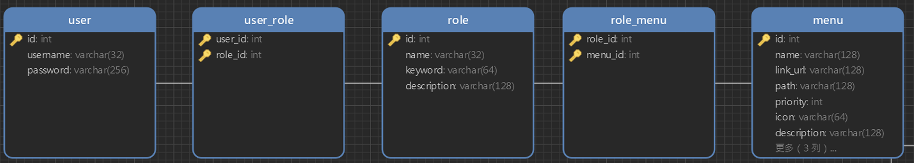

# 一、认证授权
## 1.1 RBAC模型核心数据表

| ##container## |
|:--:|
||

> RBAC全称为 **基于角色的访问控制模型(Role-based access control)**，在该模型中，通过让权限与角色关联来实现授权，给用户分配一系列的角色来让注册用户得到这些角色对应的权限，使系统权限分配更加方便。

- 相关链接: [RBAC模型的分析与实现](https://blog.csdn.net/cx776474961/article/details/106537758)

## 1.2 C++ 使用权限验证
> [!TIP]
> 学习C++的有福了, 你只需要: C++服务器只需要判断是否登录即可，然后可以通过负载信息获取到它用户ID和权限列表。

### 1.2.1 开启凭证检查
- `zero-one-08mes\mes-cpp\arch-demo\controller\SystemInterceptor.cpp`
```C++
#ifndef CHECK_TOKEN
// 开启凭证检查，解开下一行注释即可
//#define CHECK_TOKEN
#endif
```

### 1.2.2 生成凭证

- `zero-one-08mes\mes-cpp\arch-tests\tests\jwt\test-jwt.cpp`

```C++
#define TEST_CREATE_PAYLOAD() \
PayloadDTO p; \
p.getAuthorities().push_back("SUPER_ADMIN"); \
p.setUsername(u8"roumiou"); \
p.setId("1"); \
p.setExp(3600 * 30)

TEST(JwtTest, TestRsa) {
    TEST_CREATE_PAYLOAD();
    std::string token = JWTUtil::generateTokenByRsa(p, RSA_PRI_KEY->c_str());
    ASSERT_NE(token, "");
    std::cout << "RSA-TOKEN:\n\n" << token << std::endl;
    auto pv = JWTUtil::verifyTokenByRsa(token, RSA_PUB_KEY->c_str());
    ASSERT_EQ(pv.getCode(), PayloadCode::SUCCESS);
    std::cout << "\nusername:" << pv.getUsername() << std::endl;
}
```

### 1.2.3 Swagger 传递凭证

在定义端点的时候, 
- 接口描述加上`API_DEF_ADD_AUTH();`, 这样在`Swagger UI`界面才可以看到那把`锁`.

- 定义处理接口的时候, 就要加上`API_HANDLER_AUTH_PARAME`, 这个宏会声明`authObject`, 最终返回`API_HANDLER_RESP_VO(execQuerySample(userQuery, authObject->getPayload()));`给前端

```C++
/**
 * 示例控制器，演示基础接口的使用
 */
class SampleController : public oatpp::web::server::api::ApiController // 1 继承控制器
{
    // 2 定义控制器访问入口
    API_ACCESS_DECLARE(SampleController);
    // 3 定义接口
public:
    // 3.1 定义查询接口描述
    ENDPOINT_INFO(querySample) {
        // 定义接口标题
        API_DEF_ADD_TITLE(ZH_WORDS_GETTER("sample.get.summary"));
        // 定义默认授权参数（可选定义，如果定义了，下面ENDPOINT里面需要加入API_HANDLER_AUTH_PARAME）
        API_DEF_ADD_AUTH();
        // 定义响应参数格式
        API_DEF_ADD_RSP_JSON_WRAPPER(SamplePageJsonVO);
        // 定义分页查询参数描述
        API_DEF_ADD_PAGE_PARAMS();
        // 定义其他查询参数描述
        API_DEF_ADD_QUERY_PARAMS(String, "name", ZH_WORDS_GETTER("sample.field.name"), "li ming", false);
        API_DEF_ADD_QUERY_PARAMS(String, "sex", ZH_WORDS_GETTER("sample.field.sex"), "N", false);
    }
    // 3.2 定义查询接口处理
    ENDPOINT(API_M_GET, "/sample", querySample, QUERIES(QueryParams, queryParams), API_HANDLER_AUTH_PARAME) {
        // 解析查询参数为Query领域模型
        API_HANDLER_QUERY_PARAM(userQuery, SampleQuery, queryParams);
        // 呼叫执行函数响应结果
        API_HANDLER_RESP_VO(execQuerySample(userQuery, authObject->getPayload()));
    }
    // ...
private:
    SamplePageJsonVO::Wrapper SampleController::execQuerySample(const SampleQuery::Wrapper& query, const PayloadDTO& payload);
};
```

其中`PayloadDTO`类就是`凭证信息实体类`

```C++
/**
 * 负载信息获取状态编码
 */
enum class PayloadCode
{
    // 信息验证处理成功
    SUCCESS,
    // Token已过期
    TOKEN_EXPIRED_ERROR,
    // 签名格式错误
    SIGNATUREFORMAT_ERROR,
    // 解密错误
    DECODE_ERROR,
    // 验证错误
    VERIFICATION_ERROR,
    // 其他错误
    OTHER_ERROR
};

/**
 * 负载信息实体类
 */
class PayloadDTO
{
public:
    // 获取状态码对应的枚举值名称
    static std::string getCodeName(PayloadCode code) 
    {
        switch (code)
        {
        case PayloadCode::SUCCESS:
            return "SUCCESS";
        case PayloadCode::TOKEN_EXPIRED_ERROR:
            return "TOKEN_EXPIRED_ERROR";
        case PayloadCode::SIGNATUREFORMAT_ERROR:
            return "SIGNATUREFORMAT_ERROR";
        case PayloadCode::DECODE_ERROR:
            return "DECODE_ERROR";
        case PayloadCode::VERIFICATION_ERROR:
            return "VERIFICATION_ERROR";
        case PayloadCode::OTHER_ERROR:
            return "OTHER_ERROR";
        default:
            return "NONE";
        }
    }
    // 获取凭证前缀
    static std::string getTokenPrefix() {
        return "Bearer ";
    }
private:
    // Token字符串对应的值
    std::string token;
    // 主体数据
    std::string sub;
    // 凭证有效时长（秒）
    int64_t exp;
    // 用户编号
    std::string id;
    // 用户名
    std::string username;
    // 用户拥有的权限
    std::list<std::string> authorities;
    // 数据状态系信息
    PayloadCode code;
public:
    PayloadDTO()
    {
        this->username = "";
        this->exp = 0;
        this->sub = "";
        this->setCode(PayloadCode::SUCCESS);
    }
    PayloadDTO(std::string _sub, int64_t _exp, std::string _username, std::list<std::string> _authorities) :
        sub(_sub), exp(_exp), username(_username), authorities(_authorities)
    {
        this->setCode(PayloadCode::SUCCESS);
    }
    
    // getter/setter
    std::string getSub() const { return sub; }
    void setSub(std::string val) { sub = val; }
    int64_t getExp() const { return exp; }
    void setExp(int64_t val) { exp = val; }
    std::string getUsername() const { return username; }
    void setUsername(std::string val) { username = val; }
    std::list<std::string>& getAuthorities() { return authorities; }
    void setAuthorities(std::list<std::string> val) { authorities = val; }
    PayloadCode getCode() const { return code; }
    void setCode(PayloadCode val) { code = val; }
    std::string getId() const { return id; }
    void setId(std::string val) { id = val; }
    std::string getToken() const { return token; }
    void setToken(std::string val) { token = val; }

    // 添加权限
    void putAuthority(std::string authstr) { authorities.push_back(authstr); }
    
    // 将Payload的属性转换到jwt_object中
    // 注意：新增属性字段后需要维护此方法
    template<class T>
    void propToJwt(T* obj) const
    {
        // 转换权限列表
        obj->add_claim("authorities", authorities);
        // 转换用户名
        obj->add_claim("user_name", username);
        // 转换id
        obj->add_claim("id", id);
        // TIP：新增字段在后面补充即可
    }

    // 将jwt_object的属性转换到Payload中
    // 注意：新增属性字段后需要维护此方法
    void propToPayload(jwt::jwt_object* obj) 
    {
        // 获取负载信息
        auto payload = obj->payload();
        auto _payload = payload.create_json_obj();

        // 转换权限列表
        if (_payload.contains("authorities"))
            setAuthorities(payload.get_claim_value<std::list<std::string>>("authorities"));
        // 转换用户名
        setUsername(payload.get_claim_value<std::string>("user_name"));
        // 转换数字类型id
        if (_payload["id"].is_number()) 
            setId(std::to_string(_payload["id"].get<int64_t>()));
        // 转换字符串类型id
        else
            setId(_payload["id"].get<std::string>());
        // TIP：新增字段在后面补充即可
    }
};
```

### 1.2.4 授权数据实体 & 授权处理器

- `zero-one-08mes\mes-cpp\lib-oatpp\include\CustomerAuthorizeHandler.h`

再者`authObject`变量是`CustomerAuthorizeObject`类型(的智能指针)

```C++
/**
 * 自定义授权实体数据实体
 */
class CustomerAuthorizeObject : public oatpp::web::server::handler::AuthorizationObject
{
private:
    // 负载数据记录实体
    PayloadDTO payload;
public:
    // 构造初初始化
    CustomerAuthorizeObject(PayloadDTO payload);
    // 获取负载数据对象
    const PayloadDTO& getPayload();
};

/**
 * 自定义授权处理器
 */
class CustomerAuthorizeHandler : public oatpp::web::server::handler::BearerAuthorizationHandler
{
public:
    // 构造初始化公钥读取
    CustomerAuthorizeHandler();
    // 授权逻辑
    std::shared_ptr<AuthorizationObject> authorize(const oatpp::String& token) override;
};
```

读取公钥`public.pem`文件, 而不是写死在代码里面.

```C++
// .cpp
CustomerAuthorizeHandler::CustomerAuthorizeHandler()
{
    //读取公钥
    if (!RSA_PUB_KEY)
    {
        std::string pubKey = "";
        std::ifstream ifs("public.pem");
        if (ifs.is_open())
        {
            std::string tmp;
            while (std::getline(ifs, tmp))
            {
                pubKey += tmp + "\n";
            }
            ifs.close();
        }
        RSA_PUB_KEY = std::make_unique<std::string>(pubKey);
    }
}

std::shared_ptr<oatpp::web::server::handler::AuthorizationHandler::AuthorizationObject> CustomerAuthorizeHandler::authorize(const oatpp::String& token)
{
    // 解析凭证
    PayloadDTO payload = JWTUtil::verifyTokenByRsa(token, RSA_PUB_KEY->c_str());
    if (payload.getCode() != PayloadCode::SUCCESS) {
        std::stringstream ss;
        ss << "Token: check fail code <" << PayloadDTO::getCodeName(payload.getCode()) << ">.";
        throw std::logic_error(ss.str());
    }
    // 将数据存放到授权对象中
    payload.setToken(token);
    return std::make_shared<CustomerAuthorizeObject>(payload);
}
```

# 二、ELK
> 学java的有福了

# 三、EE
> 学java的有福了