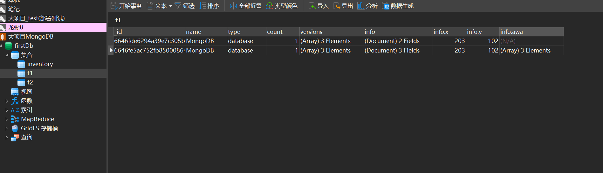
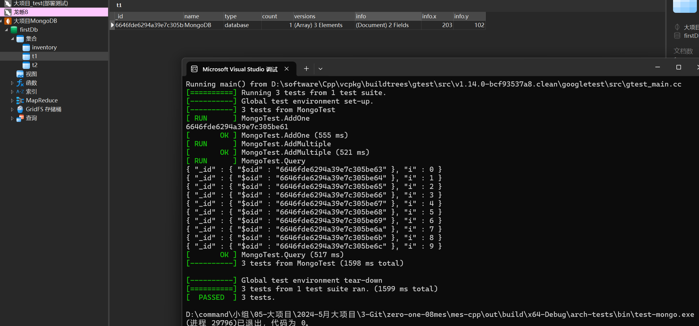
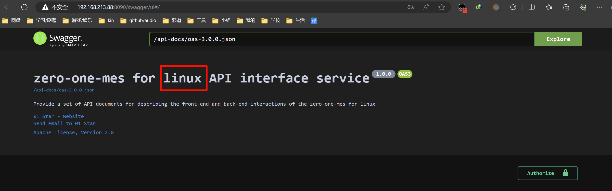

# 一、MongoDB
## 1.1 モンゴディービーでどういうこと

- MongoDB是一个流行的开源文档型数据库，它使用类似 JSON 的文档模型存储数据，这使得数据存储变得非常灵活。

- MongoDB 是一个介于关系数据库和非关系数据库之间的产品，是非关系数据库当中功能最丰富，最像关系数据库的。

- MongoDB是一个基于分布式文件存储的数据库

- 由C++语言编写，旨在为WEB应用提供可扩展的高性能数据存储解决方案。

## 1.2 大自然的馈赠: MongoClient.h
- `zero-one-08mes\mes-cpp\lib-common\include\MongoClient.h`

有两个构造函数, 传入`链接地址`的构造函数是为了适应到时候直接从配置文件服务器中获取到的配置信息.

提供了两个封装好的方法: 插入一或多条数据

以及一个通过回调使用的方法, 你可以在回调函数中写入你的自定义操作(更多操作请见官方文档)

```C++
/**
 * MongoDB客户端
 */
class MongoClient
{
private:
    // 用户名
    string m_username;
    // 密码
    string m_password;
    // MongoDB服务器地址
    string m_host;
    // 数据库
    string m_db;
    // MongoDB服务器端口
    string m_port;
    // 最大连接数
    int m_max = 25;
    // 最小连接数据
    int m_min = 25;
    // 标记是否已经初始化
    bool isInit;
    // 负责构造和析构连接驱动的实例对象
    static mongocxx::instance m_inst;
    // 连接池对象
    shared_ptr<mongocxx::pool> m_pool;
    // 初始化连接池
    bool initPool();
public:
    //************************************
    // Method:    MongoClient
    // FullName:  MongoClient::MongoClient
    // Access:    public 
    // Returns:   
    // Description: 构造初始化
    // Parameter: const string & username 用户名
    // Parameter: const string & password 密码
    // Parameter: const string & host 服务器地址
    // Parameter: const string & db 数据库
    // Parameter: const string & port 服务器端口，默认值27017
    //************************************
    MongoClient(const string& username, const string& password, const string& host, const string& db, const string& port = "27017");
    //************************************
    // Method:    MongoClient
    // FullName:  MongoClient::MongoClient
    // Access:    public 
    // Returns:   
    // Description: 构造初始化
    // Parameter: const string & uri 连接地址，格式为：mongodb://账号:密码@主机地址:端口/数据库名称
    //************************************
    explicit MongoClient(const string& uri);
    // 设置最大连接数
    void setMax(int max);
    // 设置最小连接数
    void setMin(int min);
    //************************************
    // Method:    execute
    // FullName:  MongoClient::execute
    // Access:    public 
    // Returns:   bool
    // Description: 定义一个执行方法，用于支持操作扩展
    // Parameter: const string & collectionName 集合名称
    // Parameter: std::function<void mongocxx::collection*> callfun 扩展执行回调函数
    //************************************
    bool execute(const string& collectionName, std::function<void(mongocxx::collection*)> callfun);
    //************************************
    // Method:    addOne
    // FullName:  MongoClient::addOne
    // Access:    public 
    // Returns:   bsoncxx::types::bson_value::view
    // Description: 添加一条数据
    // Parameter: const string & collectionName 集合名称
    // Parameter: const bsoncxx::document::view & document 文档对象
    //************************************
    bsoncxx::types::bson_value::view addOne(const string& collectionName, const bsoncxx::document::view& document);
    //************************************
    // Method:    addMultiple
    // FullName:  MongoClient::addMultiple
    // Access:    public 
    // Returns:   int32_t 插入数据条数
    // Description: 添加多条数据
    // Parameter: const string & collectionName 集合名称
    // Parameter: const std::vector<bsoncxx::document::value> & documents 文档对象列表
    //************************************
    int32_t addMultiple(const string& collectionName, const std::vector<bsoncxx::document::value>& documents);
};
```

## 1.3 使用示例
### 1.3.1 include

```C++
// MongoDB使用需要的相关头文件
#include "Macros.h"
#include "NacosClient.h"
#include "MongoClient.h"
#include <bsoncxx/json.hpp>
```

### 1.3.2 创建客户端对象

```C++
/**
 *  定义一个测试夹具类，用于管理数据库连接
 */
class MongoTest : public testing::Test {
protected:
    void SetUp() override
    {
        // 获取配置
        NacosClient nacosClient(TEST_NS_ADDR, TEST_NS_NAMESPACE);
#ifdef LINUX
        YAML::Node node = nacosClient.getConfig("data-source.yaml");
#else
        YAML::Node node = nacosClient.getConfig("./conf/data-source.yaml");
#endif
        // 获取mongodb相关配置
        YamlHelper yaml;
        string uri = yaml.getString(&node, "spring.data.mongodb.uri");

        // 创建连接对象
        this->mc = new MongoClient(uri);
    }
    void TearDown() override
    {
        if (mc)
        {
            delete mc;
            mc = nullptr;
        }
    }
    // MongoDB客户端连接对象
    MongoClient* mc = nullptr;
};
```

### 1.3.3 添加单条数据

```C++
// 测试添加单条数据
TEST_F(MongoTest, AddOne) {
    // 使用文档构建器构建文档数据
    auto docBuilder = bsoncxx::builder::stream::document{};
    bsoncxx::document::value doc = docBuilder
        << "name" << "MongoDB"
        << "type" << "database"
        << "count" << 1
        << "versions" << open_array << "v3.2" << "v3.0" << "v2.6" << close_array
        << "info"
        << open_document
        << "x" << 203
        << "y" << 102
        << close_document
        << finalize;
    // 执行数据添加
    auto res = mc->addOne("t1", doc.view());
    ASSERT_NE(res.type(), bsoncxx::type::k_null);
    std::cout << res.get_oid().value.to_string() << std::endl;
}
```

如果我们修改这个数据, 也是依旧可以添加到同一个表, 即便键的数目不统一 (这里就体现了类似json的数据存储)



### 1.3.4 添加多条数据

```C++
// 测试添加多条数据
TEST_F(MongoTest, AddMultiple) {
    // 创建多个文档对象
    std::vector<bsoncxx::document::value> documents;
    for (int i = 0; i < 10; i++) {
        documents.push_back(bsoncxx::builder::stream::document{} << "i" << i << finalize);
    }
    int32_t addNum = mc->addMultiple("t2", documents);
    ASSERT_GT(addNum, 0);
}
```

注: mongoDB 添加数据的时候, 如果表不存在会自动创建表.(又注: 此处的表, 称为`集合`更好)




### 1.3.5 [自定义] 查询调用

```C++
// 测试查询调用
TEST_F(MongoTest, Query) {
    bool res = mc->execute("t2",
        [](mongocxx::collection* collection) {
            auto cursor = collection->find({});
            for (auto doc : cursor) {
                cout << bsoncxx::to_json(doc) << endl;
            }
        });
    ASSERT_EQ(res, true);
}
```

### 1.3.6 更多API

基础学习: [MongoDB官方中文文档: 基本增删改查](https://www.mongodb.com/zh-cn/docs/languages/cpp/cpp-driver/current/tutorial/#create-a-document)

更多命令请见: [MongoDB官方中文文档: 使用 BSON](https://www.mongodb.com/zh-cn/docs/languages/cpp/cpp-driver/current/working-with-bson/)

# 二、Redis
## 2.1 What is Redis?
- [[Redis]目录](../../../../../../005-中间件/001-Redis/001-【Redis】目录/index.md)

## 2.2 大自然的馈赠: RedisClient
- `zero-one-08mes\mes-cpp\lib-common\include\RedisClient.h`

只是封装了一些连接操作, 具体的操作需要我们通过回调函数调用.

```C++
/**
 * Redis客户端
 */
class RedisClient
{
private:
    // Redis连接对象
    shared_ptr<Redis> m_redis;
public:
    //************************************
    // Method:    RedisClient
    // FullName:  RedisClient::RedisClient
    // Access:    public 
    // Returns:   
    // Description: 构造初始化
    // Parameter: const string & host Redis主机地址
    // Parameter: int port Redis服务器端口
    // Parameter: const string & password Redis服务器密码,默认没有密码
    // Parameter: int db 选择的数据库，默认值0
    // Parameter: int max 数据库最大连接数，默认为10
    //************************************
    RedisClient(const string& host, int port, const string& password = "", int db = 0, int max = 10);
    //************************************
    // Method:    execute
    // FullName:  RedisClient::execute
    // Access:    public 
    // Returns:   T 返回值类型
    // Description: 执行Redis操作
    // Parameter: std::function<T<Redis*>> callfun 操作逻辑函数，所有操作逻辑函数在这里写
    //************************************
    template<class T>
    T execute(std::function<T(Redis*)> callfun) {
        try {
            return callfun(m_redis.get());
        } catch (const std::exception& e) {
            cerr << e.what() << endl;
        }
        return {};
    }
};
```

## 2.3 使用示例
### 2.3.1 include

```C++
// 使用Redis需要的相关头文件
#include "Macros.h"
#include "NacosClient.h"
#include "RedisClient.h"
```

### 2.3.2 创建客户端对象

```C++
/**
 *  定义一个测试夹具类，用于管理数据库连接
 */
class RedisTest : public testing::Test {

protected:
    void SetUp() override
    {
        // 获取配置
        NacosClient nacosClient(TEST_NS_ADDR, TEST_NS_NAMESPACE);
#ifdef LINUX
        YAML::Node node = nacosClient.getConfig("data-source.yaml");
#else
        YAML::Node node = nacosClient.getConfig("./conf/data-source.yaml");
#endif
        // 获取redis相关配置
        YamlHelper yaml;
        string host = yaml.getString(&node, "spring.redis.host");
        string port = yaml.getString(&node, "spring.redis.port");
        string password = yaml.getString(&node, "spring.redis.password");

        // 创建RedisClient对象
        this->rc = new RedisClient(host, atoi(port.c_str()), password);
    }
    void TearDown() override
    {
        if (rc)
        {
            delete rc;
            rc = nullptr;
        }
    }
    // Redis客户端连接对象
    RedisClient* rc = nullptr;
};
```

### 2.3.3 set指令

```C++
// 测试set指令
TEST_F(RedisTest, Set) {
    bool res = rc->execute<bool>(
        [](Redis* r) {
            return r->set("foo", "bar");
        });
    ASSERT_EQ(res, true);
}
```

### 2.3.4 get指令

```C++
// 测试get指令
TEST_F(RedisTest, Get) {
    string val = rc->execute<string>(
        [](Redis* r) {
            return r->get("foo").value();
        });
    ASSERT_NE(val, "");
    std::cout << val << std::endl;
}
```

### 2.3.5 更多API
不用担心! 基本上其方法名称都是和`redis`在命令行上的命令名称一模一样的! (我随机尝试了好几个的是这样的) (消息队列什么的就不要理了, 交给MQ! 专业的人做专业的事)

# 三、C++跨平台编译
## 3.1 先决条件
VS2022安装了对应的内容, 以及:

```bash
yum -y install openssh-server gcc-c++ gdb cmake make ninja-build rsync zip unzip
yum -y install openssl-devel libcurl-devel libuuid-devel
```

配置好`NACOS`的配置文件, 然后使用启动参数启动(重点修改ip, na, dh参数)

更多启动/后台启动/关闭 请去 [工程介绍](../001-工程介绍/index.md) 查看

### 3.2 启动成功


