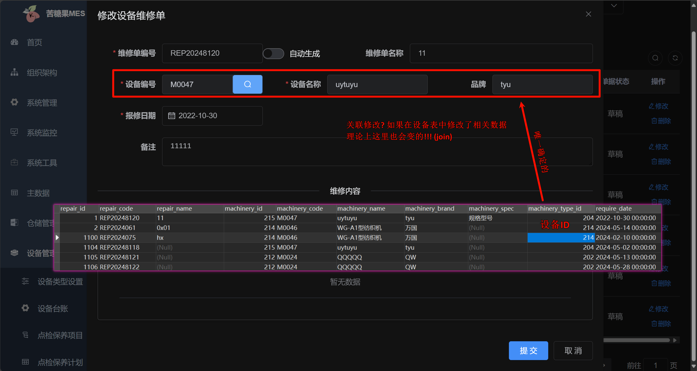
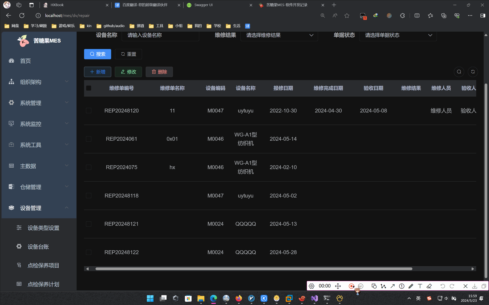
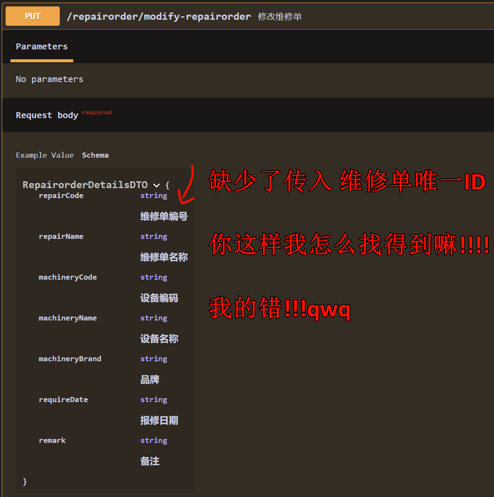
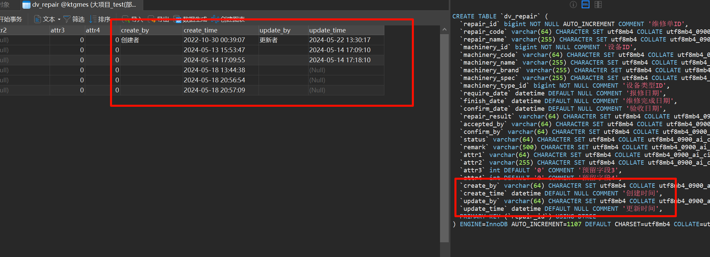

# 大项目Heng_Xin负责内容存在问题
## 一、接口与领域模型定义
### 1.1 添加维修单 接口

我只设计传出了以下字段:
```json
维修单编号
维修单名称
设备编码
设备名称
品牌
报修日期
备注
```

但是组长说还应该差`设备ID(唯一)`字段:



我想也是!

可惜业务参考系统没有关联更新: orz..



### 1.2 修改维修单 接口



## 二、实现控制层/服务层/DAO层
突然发现`创建维修单`还需要`设备的唯一id`

报错: 这个是必填的qwq..
```C++
ExecuteUpdate Exception. Field 'machinery_id' doesn't have a default value
```

## 三、缺少字段

看似业务参考系统没有传参这个, 但是已经隐式传递了!



此时需要一个工具类: 大自然的馈赠: `SimpleDateTimeFormat.h`

```C++
/**
 * 定义一个简单的时间格式工具类
 * 参考：https://zh.cppreference.com/w/cpp/io/manip/put_time
 */
class SimpleDateTimeFormat final
{
public:
    //************************************
    // Method:    format
    // FullName:  SimpleDateTimeFormat::format
    // Access:    public static 
    // Returns:   std::string 返回格式化后的字符串
    // Description: 获取当前时间格式字符串
    // Parameter: const std::string & fmt 格式字符串，默认值%Y-%m-%d %H:%M:%S（对应格式如：2023-01-01 01:01:01）
    //************************************
    static std::string format(const std::string& fmt = "%Y-%m-%d %H:%M:%S");

    //************************************
    // Method:    formatWithMilli
    // FullName:  SimpleDateTimeFormat::formatWithMilli
    // Access:    public static 
    // Returns:   std::string 返回格式化后的字符串
    // Description: 获取当前时间格式字符串，带毫秒时间获取
    // Parameter: const std::string & fmt 格式字符串，默认值%Y-%m-%d %H:%M:%S（对应格式如：2023-01-01 01:01:01）
    // Parameter: const std::string msDelim 毫秒与前部分的分割符，默认是空格
    //************************************
    static std::string formatWithMilli(const std::string& fmt = "%Y-%m-%d %H:%M:%S", const std::string msDelim = " ");
};
```

## 四、文档描述应该使用原本示例的
rt

## 五、对于返回的是`ClassJsonVO`, 应该初始化为空

例如以下代码, 应该如下所示, 返回无效且为空的值, 否则会返回`RepairorderDetailsDTO`中的默认值.

```C++
// 维修单详情查询
RepairorderDetailsJsonVO::Wrapper RepairorderController::execQueryDetailsRepairorder(const RepairorderDetailsQuery::Wrapper& id) {
    // 定义返回数据对象
    auto jvo = RepairorderDetailsJsonVO::createShared();
    // 参数校验
    if (id->repairId <= 0) {
        auto tmp = RepairorderDetailsDTO::createShared();
        tmp->repairId = -1;
        tmp->repairCode = "";
        tmp->repairName = "";
        tmp->machineryCode = "";
        tmp->machineryName = "";
        tmp->machineryBrand = "";
        tmp->requireDate = "";
        tmp->remark = "";
        jvo->init(tmp, RS_PARAMS_INVALID); // 上传参数异常
        return jvo;
    }
    // 定义一个Service
    RepairorderService service;
    // 执行数据查询
    auto dto = service.getData(id);
    if (dto->repairId == -1)
        jvo->fail(dto); // 构建失败消息 RS_FAIL
    else
        jvo->success(dto);
    // 响应结果
    return jvo;
}

// Service层 同理
RepairorderDetailsDTO::Wrapper RepairorderService::getData(const RepairorderDetailsQuery::Wrapper& id) {
    // 构建返回对象
    auto pages = RepairorderDetailsDTO::createShared();

    // 查询数据总条数
    RepairorderDAO dao;
    uint64_t count = dao.count(id);
    if (count <= 0) {
        pages->repairId = -1;
        pages->repairCode = "";
        pages->repairName = "";
        pages->machineryCode = "";
        pages->machineryName = "";
        pages->machineryBrand = "";
        pages->requireDate = "";
        pages->remark = "";
        return pages;
    }

    list<DvRepairDO> result = dao.selectById(id->repairId);

    for (const DvRepairDO& sub : result) {
        ZO_STAR_DOMAIN_DO_TO_DTO(pages, sub,
            repairId, Repair_id,
            repairCode, Repair_code,
            repairName, Repair_name,
            machineryCode, Machinery_code,
            machineryName, Machinery_name,
            machineryBrand, Machinery_brand,
            requireDate, Require_date,
            remark, Remark)
    }

    return pages;
}
```
