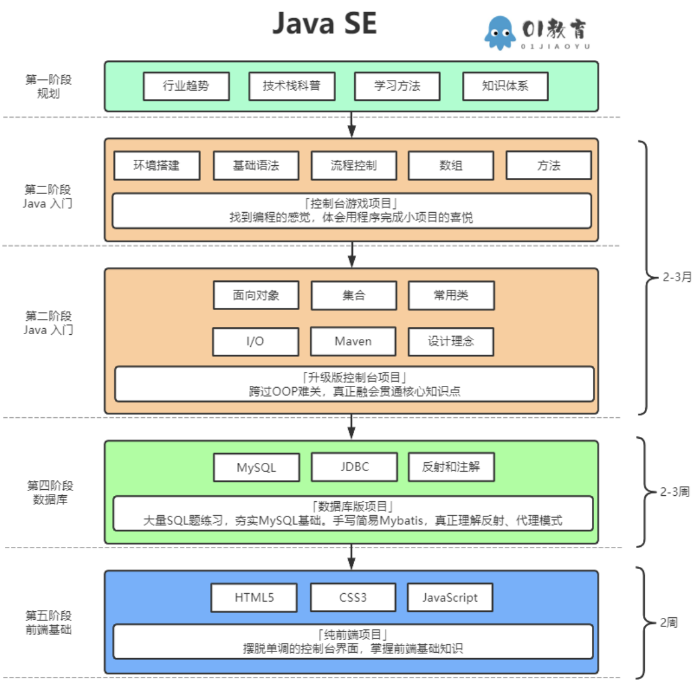
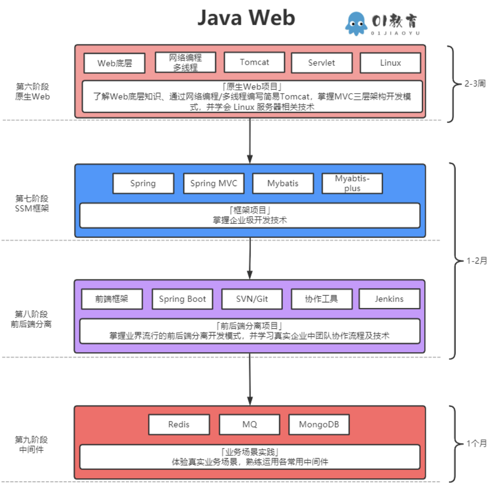
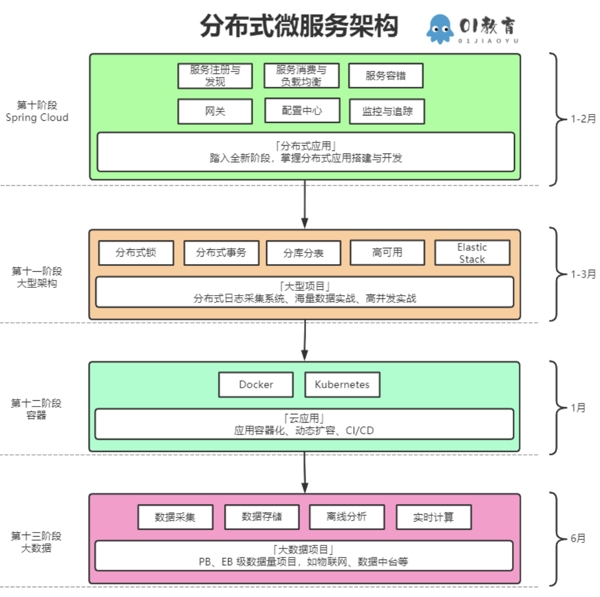

# 🐒Jvav从入门到吗喽🐒
## 🙉咖啡的前(⑨ -=- 1)个阶段🙊
### JavaSE
| ##container## |
|:--:|
||

#### 第一阶段 [???]
> 已完成(?)

#### 第二阶段 [Java入门]
##### 环境搭建
- [安装jdk8+IDE](../002-Java基础/001-基本环境搭建/001-安装jdk+IDE/index.md)

- [配置环境变量](../002-Java基础/001-基本环境搭建/002-配置环境变量/index.md)

##### 初识Java
- [第一个java程序和三种注释](../002-Java基础/002-初识java/001-第一个java程序和三种注释/index.md)
- [Java 跨平台原理](../002-Java基础/002-初识java/002-Java跨平台原理/index.md)
- [Java类型与类型转换与运算符](../002-Java基础/002-初识java/003-Java类型与类型转换与运算符/index.md)
- [输入(Scanner的基本使用)](../002-Java基础/002-初识java/004-输入【Scanner的基本使用】/index.md)

##### 流程控制
- [if_swicth_for_(do)_while等](../002-Java基础/003-流程控制语句/001-if丶swicth丶for丶【do】丶while等/index.md)
- [java的标号](../002-Java基础/003-流程控制语句/002-java的标号/index.md)

##### 数组
- [数组使用](../002-Java基础/004-数组/001-数组使用/index.md)
- [二维数组](../002-Java基础/004-数组/002-二维数组/index.md)

#### 第三阶段 [Java入窗]
##### 面向对象
###### 类和对象
- [类与对象基本使用](../002-Java基础/005-面向对象丶/001-类与对象基本使用/index.md)
- [不同类型的传参](../002-Java基础/005-面向对象丶/002-不同类型的传参/index.md)

###### 封装
- [封装 & 包](../002-Java基础/005-面向对象丶/003-封装/index.md)
- [修饰符](../002-Java基础/005-面向对象丶/004-修饰符/index.md)

###### 继承
- [继承](../002-Java基础/005-面向对象丶/005-继承/index.md)
- [方法重写](../002-Java基础/005-面向对象丶/006-方法重写/index.md)
- [super关键字](../002-Java基础/005-面向对象丶/007-super关键字/index.md)

###### 抽象类与接口
- [抽象类](../002-Java基础/005-面向对象丶/008-抽象类/index.md)
- [接口](../002-Java基础/005-面向对象丶/009-接口/index.md)

###### 多态
- [多态](../002-Java基础/005-面向对象丶/010-多态/index.md)
- [Object类常用方法](../002-Java基础/005-面向对象丶/011-Object类常用方法/index.md)

##### 异常处理
- [什么是异常](../002-Java基础/006-异常处理/001-什么是异常/index.md)
- [异常处理](../002-Java基础/006-异常处理/002-异常处理丶/index.md)

##### 字符串
- [String](../002-Java基础/007-字符串丶/001-String/index.md)

- [StringBuilder和StringBuffer](../002-Java基础/007-字符串丶/002-StringBuilder和StringBuffer/index.md)

##### 流
- [File类](../002-Java基础/008-IO流/001-File类/index.md)
- [IO流](../002-Java基础/008-IO流/002-IO流丶/index.md)

##### 嵌套类以及Lambda表达式
- [嵌套类](../002-Java基础/009-嵌套类及Lambda表达式/001-嵌套类/index.md)
- [Lambda表达式](../002-Java基础/009-嵌套类及Lambda表达式/002-JavaLambda表达式/index.md)

##### 集合与泛型
- [集合框架体系](../002-Java基础/010-集合与泛型/001-集合框架体系/index.md)
- [Collection接口](../002-Java基础/010-集合与泛型/002-Collection接口/index.md)
- [Iterator迭代器](../002-Java基础/010-集合与泛型/003-Iterator迭代器/index.md)
- [泛型](../002-Java基础/010-集合与泛型/004-泛型/index.md)
- [List接口](../002-Java基础/010-集合与泛型/005-List接口/index.md)
- [Java 栈](../002-Java基础/010-集合与泛型/006-Java栈/index.md)
- [Queue接口](../002-Java基础/010-集合与泛型/007-Queue接口/index.md)
- [比较器接口](../002-Java基础/010-集合与泛型/008-比较器接口/index.md)
- [Map接口](../002-Java基础/010-集合与泛型/009-Map接口/index.md)
- [Set接口](../002-Java基础/010-集合与泛型/010-Set接口/index.md)

##### 函数式接口与方法引用
- [方法引用](../002-Java基础/011-函数式接口和方法引用/001-方法引用/index.md)
- [函数式接口](../002-Java基础/011-函数式接口和方法引用/002-函数式接口/index.md)

##### Stream流 与 日历时间
- [Stream流](../002-Java基础/012-Stream流及常用API/001-Stream流/index.md)
- [包装类](../002-Java基础/012-Stream流及常用API/002-包装类/index.md)
- [日期时间](../002-Java基础/012-Stream流及常用API/003-日期时间/index.md)

##### 多线程
- [并发](../002-Java基础/013-多线程/001-并发丶/index.md)
- [进程和线程](../002-Java基础/013-多线程/002-进程和线程/index.md)
- [线程的创建以及内存模型](../002-Java基础/013-多线程/003-线程的创建以及内存模型/index.md)
- [死锁](../002-Java基础/013-多线程/004-死锁丶/index.md)
- [线程池](../002-Java基础/013-多线程/005-线程池丶/index.md)

##### XML解析
- [什么是XML](../002-Java基础/015-XML解析/001-什么是XML/index.md)
- [DTD约束](../002-Java基础/015-XML解析/002-DTD约束/index.md)
- [XML解析](../002-Java基础/015-XML解析/003-XML解析丶/index.md)

##### 网络编程
- [网络基础](../002-Java基础/014-网络编程/001-网络基础/index.md)
- [套接字Socket](../002-Java基础/014-网络编程/002-套接字Socket/index.md)
- [数据报Datagram](../002-Java基础/014-网络编程/003-数据报Datagram/index.md)
- [练习](../002-Java基础/014-网络编程/004-练习/index.md)

#### 第四阶段 [数据库]
##### MySql
- [とある「MySQL」の禁庫目録](../../../006-数据库/001-MySQL数据库/001-とある「MySQL」の禁庫目録/index.md)
- [JDBC](../003-JavaのMysql数据库/001-JDBC/index.md)
- [反射](../003-JavaのMysql数据库/002-反射/index.md)
- [反射与数据库](../003-JavaのMysql数据库/003-反射与数据库/index.md)
- [分层开发](../003-JavaのMysql数据库/004-分层开发/index.md)

---

#### 第五阶段 [前端基础]
##### HTML
##### CSS
##### JavaScript
##### jQuery
- [Web前端目録](../../004-Web前端/001-Web前端目録/index.md)

### JavaWeb
| ##container## |
|:--:|
||

#### JSP
- [JSP入门](../004-JavaWeb/001-JSP/001-JSP入门/index.md)
- [JSP内置对象](../004-JavaWeb/001-JSP/002-JSP内置对象/index.md)
- [Servlet与MVC](../004-JavaWeb/001-JSP/003-Servlet与MVC/index.md)
- [EL表达式与JSTL标签](../004-JavaWeb/001-JSP/004-EL表达式与JSTL标签/index.md)
- [AJAS和JSON](../004-JavaWeb/001-JSP/005-AJAS和JSON/index.md)
- [文件上传下载、Excel导入导出](../004-JavaWeb/001-JSP/006-文件上传下载、Excel导入导出/index.md)
- [监听器、RBAC权限模型](../004-JavaWeb/001-JSP/007-监听器、RBAC权限模型/index.md)

#### Maven工程
- [初识maven与下载安装](../005-Maven/001-初识maven与下载安装/index.md)
- [目录结构和常用命令](../005-Maven/002-目录结构和常用命令/index.md)
- [手动创建maven工程](../005-Maven/003-手动创建maven工程/index.md)
- [使用idea构建maven工程](../005-Maven/004-使用idea构建maven工程/index.md)
- [依赖管理](../005-Maven/005-依赖管理/index.md)
- [生命周期与插件](../005-Maven/006-生命周期与插件/index.md)

##### Maven高级
###### Maven的聚合与继承
- [maven分模块开发与设计](../005-Maven/007-maven分模块开发与设计/index.md)

###### Maven属性与版本管理与多资源配置
- [使用properties标签进行依赖的版本管理](../005-Maven/008-属性与版本管理与多资源配置/001-使用properties标签进行依赖的版本管理/index.md)
- [依赖版本定义规范](../005-Maven/008-属性与版本管理与多资源配置/002-依赖版本定义规范/index.md)
- [在配置文件引入pom属性](../005-Maven/008-属性与版本管理与多资源配置/003-在配置文件引入pom属性/index.md)
- [maven中多环境的配置与切换](../005-Maven/008-属性与版本管理与多资源配置/004-maven中多环境的配置与切换/index.md)

###### Maven私服
- [搭建maven私服服务器nexus](../005-Maven/009-私服/001-搭建maven私服服务器nexus/index.md)
- [创建私服仓库，并上传资源到私服仓库](../005-Maven/009-私服/002-创建私服仓库，并上传资源到私服仓库/index.md)
- [IDEA环境中资源上传与下载](../005-Maven/009-私服/003-IDEA环境中资源上传与下载/index.md)
- [nexus代理阿里云仓库](../005-Maven/009-私服/004-nexus代理阿里云仓库/index.md)

#### Spring
- [1.1 Spring 的基本概述](https://blog.HXLoLi.com/blog/#/articles?articleId=20810 "##20810##")
- [1.2 程序中的耦合](https://blog.HXLoLi.com/blog/#/articles?articleId=20811 "##20811##")
- [1.3 IOC的概念和作用](https://blog.HXLoLi.com/blog/#/articles?articleId=20841 "##20841##")
- [1.4 Spring对bean的管理方式](https://blog.HXLoLi.com/blog/#/articles?articleId=20842 "##20842##")
- [1.5 Bean的细节](https://blog.HXLoLi.com/blog/#/articles?articleId=20843 "##20843##")
- 未完不待续...

#### Spring Boot
##### 入门
- [springboot第一个入门案例](https://blog.HXLoLi.com/blog/#/articles?articleId=21022 "##21022##")
- [springboot自动配置原理](https://blog.HXLoLi.com/blog/#/articles?articleId=21023 "##21023##")
- [@Configuration注解](https://blog.HXLoLi.com/blog/#/articles?articleId=21024 "##21024##")
- [@Import注解](https://blog.HXLoLi.com/blog/#/articles?articleId=21025 "##21025##")
- [@Conditional注解](https://blog.HXLoLi.com/blog/#/articles?articleId=21026 "##21026##")
- [@ImportResource注解](https://blog.HXLoLi.com/blog/#/articles?articleId=21027 "##21027##")
- [配置信息自动绑定的注解](https://blog.HXLoLi.com/blog/#/articles?articleId=21028 "##21028##")
- [springboot的最佳实践](https://blog.HXLoLi.com/blog/#/articles?articleId=21029 "##21029##")
- [lombok插件的使用](https://blog.HXLoLi.com/blog/#/articles?articleId=21030 "##21030##")
- [dev-tools热部署工具](https://blog.HXLoLi.com/blog/#/articles?articleId=21031 "##21031##")
- [Spring Initailizr](https://blog.HXLoLi.com/blog/#/articles?articleId=21032 "##21032##")
- [springboot配置文件](https://blog.HXLoLi.com/blog/#/articles?articleId=21033 "##21033##")

##### Web开发
- [静态资源映射规则](https://blog.HXLoLi.com/blog/#/articles?articleId=21034 "##21034##")
- [常用参数注解使用](https://blog.HXLoLi.com/blog/#/articles?articleId=21035 "##21035##")

---

### 分布式微服务架构
| ##container## |
|:--:|
||
