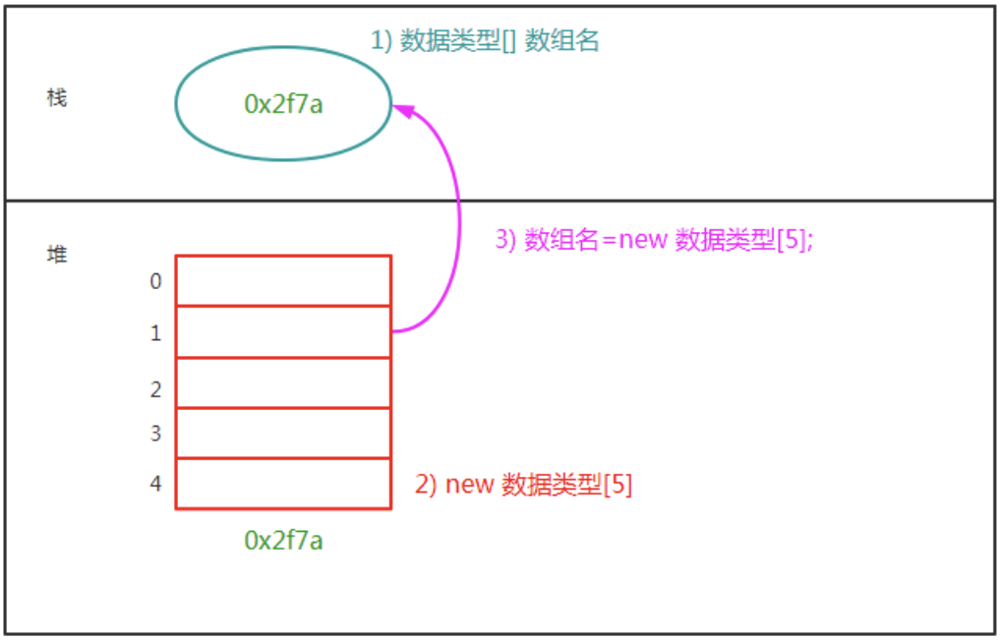

# 数组的使用
## 声明

建议语法: `类型[] 变量名 = new 类型[个数];`

```java
public class Main {
    public static void main(String[] args) {
        int[] arr = {1,1,4,5,1,4};
        int[] arr2 = new int[]{1,1,4,5,1,4};
        int[] arr3 = new int[6];
        arr3 = new int[3];
//        arr3 = {1,2,3}; // 报错
    }
}
```

## 内存模型
不论是 `int[] arr = {1,1,4,5,1,4};` 还是 `int[] arr2 = new int[]{1,1,4,5,1,4};` 都是在栈上使用一个引用, 指向在堆上`new`的内存空间.

| ##container## |
|:--:|
||

## 基本类型的数组的默认值
双精度浮点数数组中的默认值为0.0，<br>
单精度浮点数数组中的默认值为0.0f。<br>
boolean类型数组默认元素为false。<br>
char类型数组中的默认元素为'\u0000'，<br>
整形数组默认元素为0<br>
class类型的数组的默认值是`null`

## 思考 
char[] sexArr = {'M', 'F', 'O'}; 和 char[] sexArr = new char[]{'M', 'F', 'O'};有什么区别？

第一种方式只能在定义数组同时赋值时使用，第二种方式可以在定义数组时直接使用，也可以先定义数组，然后再赋值时使用

## 遍历

和`C++`没什么两样

```java
public class Main {
    public static void main(String[] args) {
        int[] arr = new int[] {1,2,3,4,5,6,8,-1, -2, -100, 100, 0};
        int max = arr[0];
        for (int it : arr) {
            max = (max < it ? it : max);
        }
        System.out.println("数组的最大值为: " + max);

        int min = arr[0];
        for (int i = 0; i < arr.length; ++i) {
            min = (min > arr[i] ? arr[i] : min);
        }
        System.out.println("数组的最小值为: " + min);
    }
}
```

## 长度不变性
数组的长度是不能变的, 除非重新分配 `arr = new int[6];`

### 插入
所以插入, 只能手动扩容, 然后遍历再移动

```java
public class demo_2 {
    public static void main(String[] arg) {
        int[] arr = new int[]{1,2,3,4,5};
        int add = 6; // 插入一个元素 6
        int[] arr_new = new int[arr.length + 1];
        for (int i = 0; i < arr.length; ++i) {
            arr_new[i] = arr[i];
        }
        arr_new[arr.length] = add;

        for (int it : arr_new)
            System.out.println(it + " ");
    }
}
```


### 删除也一样
(会cpp 的 dddd)

## 常用类方法
### 数组拷贝

```java
/**
 * 源数组（source）：要复制元素的源数组。
 * 源数组的起始位置（srcPos）：指定从源数组的哪个索引位置开始复制元素。
 * 目标数组（destination）：要将元素复制到的目标数组。
 * 目标数组的起始位置（destPos）：指定从目标数组的哪个索引位置开始存放复制的元素。
 * 要复制的元素个数（length）：指定要复制的元素个数。
 */
public static void arraycopy(Object source, int srcPos, Object destination, int destPos, int length)

System.arrayCopy(源数组, 拷贝的开始位置, 目标数组, 存放的开始位置, 拷贝的元素个数);
```

示例:
```java
public class demo_2 {
    public static void main(String[] arg) {
        int[] arr_new = new int[]{1,2,3,4,5,6};
        int[] arr = new int[arr_new.length - 1];
        int index = 2; // 删除索引为2的位置
        System.arraycopy(arr_new, 0, arr, 0, index);
        System.arraycopy(arr_new, index + 1, arr, index,arr_new.length - (index + 1));
        for (int it : arr)
            System.out.println(it + " ");
    }
}
```

### 数组扩容

```java
数据类型[] 标识符 = Arrays.copyOf(原数组, 新数组的长度);
```

示例:
```java
import java.util.Arrays;

public class demo_3 {
    public static void main(String[] arg) {
        int[] arr = {1,1,4,5,1,4};
        int[] arr_new = Arrays.copyOf(arr, arr.length + 1);
        for (int it : arr_new)
            System.out.print(it + " ");
    }
}
```

### 数组的排序

```java
Arrays.sort(数组名); //将数组中的元素进行升序排列
```

```java
import java.util.Arrays;

public class demo_3 {
    public static void main(String[] arg) {
        int[] arr = {1,1,4,5,1,4};
        Arrays.sort(arr);
        for (int it : arr)
            System.out.print(it + " ");
    }
}
```

### 组装为字符串

```java
Arrays.toString(数组名);//将数组中的元素组装为一个字符串
```