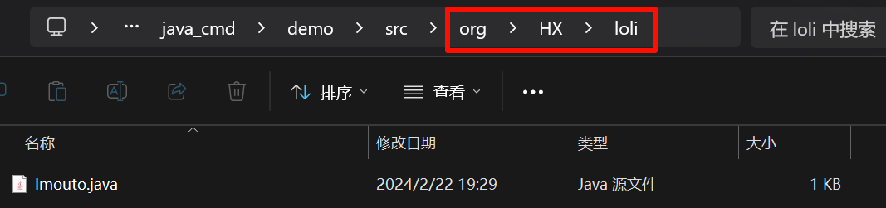

# 封装
## 什么是封装
封装就是将类的部分属性和方法隐藏起来，不允许外部程序直接访问，只能通过该类提供的公开的方法来访问类中定义的属性和方法。封装是面向对象的三大特征之一。

## 如何使用封装

如下是没有进行封装的, 我们可以直接操作成员变量

```java
public class Cat {
    public String catName;

    int catId;
}

// --- 操作成员变量 ---
Cat cat = new Cat();
cat.catId = 114514;
```

这样不好, 因为你不能保证使用者可以完美的按照规则的使用这个类的成员变量

因此, 我们可以封装成`get`/`set`方法, 让类内部实现合理的操作

```java
public class Cat {
    // 创建公开的getter/setter方法：用于读取/修改属性值
    public int getCatId() {
        return catId;
    }

    public void setCatId(int catId) {
        // 在getter/setter方法中加入控制语句：用于对属性值的合法性校验
        if (catId < 0) {
            return; // 错误处理...
        }
        
        this.catId = catId;
    }
  
    public String getCatName() {
        return catName;
    }

    public void setCatName(String catName) {
        this.catName = catName;
    }

    // 修改属性的可见性：将类中定义的所有属性全部修改为private修饰
    private String catName;

    private int catId;
}
```

## 为什么要使用封装

a. 封装提高了代码的重用性。因为封装会提供对外访问的公开的方法，而方法可以重用，因此封装提高了代码的重用性。

b. 封装提高了代码的可维护性。修改代码时，只需要修改部分代码，但不会影响其他代码


# Java的包 (Package)
## 什么是包
包是Java中的一个专业词汇，包的本质就是一个文件夹。

## 为什么要使用包
因此包可以对我们编写的类进行分类、可以防止命名冲突和访问权限控制

## 如何创建包
语法:
```java
package 包名;
```
- 包名的命名规范:
    - 包名一般都是由小写字母和数字组成，每个包之间使用'`.`'隔开，换言之，每出现一个'`.`'，就是一个包
    - 包名一般都含有前缀。比如个人/组织通常都是`org.姓名`, 公司通常都是`com.公司名称简写`或者`cn.公司名称简写`

<span style="color:red">如果一个类中有包的定义，那么这个类的第一行有效代码一定是包的定义</span>

## 如何引入包
为了使用不在同一包中的类，需要在Java程序中使用`import`关键字引入这个类

语法:
```java
import 包名.类名;
```

为什么会引入包？

因为 JVM 只能识别当前包下所有的类，如果要使用当前包之外的其他包中的类，那必须告诉 JVM ，使用的是哪一个包中的哪一个类。

### 示例

| ##container## |
|:--:|
||
|*包的本质就是一个文件夹*|

写一个包
```java
package org.HX.loli;

public class Imouto {
    public static void play() {
        System.out.print("这个是ord.HX.loli 的 imouto 类 的 play静态方法\n");
    }
}
```

使用这个包

```java
import org.HX.loli.Imouto;

public class demo_6 {
    public static void main(String[] arg) {
        Imouto mm = new Imouto();
        mm.play();
        Imouto.play();
    }
}
```

<span style="color:red">一个类同时引用了两个来自不同包的同名类，必须通过完整类名（类的全限定名）来区分。</span>

示例:
```java
package org.wu.lesson;

//类的全限定名： 包名 + "." + 类名
import com.alibaba.dubbo.User;
import java.util.Scanner;//告诉JVM，到java.util包下去找一个名为Scanner的类

public class Test {
    public static void main(String[] args) {
        Scanner sc = new Scanner(System.in);
        Student student = new Student();
        User user = new User();
        //因为该类中引入了com.alibaba.dubbo.User，如果不写包名，那么默认使用的就是
        //com.alibaba.dubbo.User。如果需要使用其他包中的User，则必须使用类的全限定
        //名来进行对象的构建与赋值操作
        com.ly.chapter11.User user1 = new com.ly.chapter11.User();
    }
}
```
