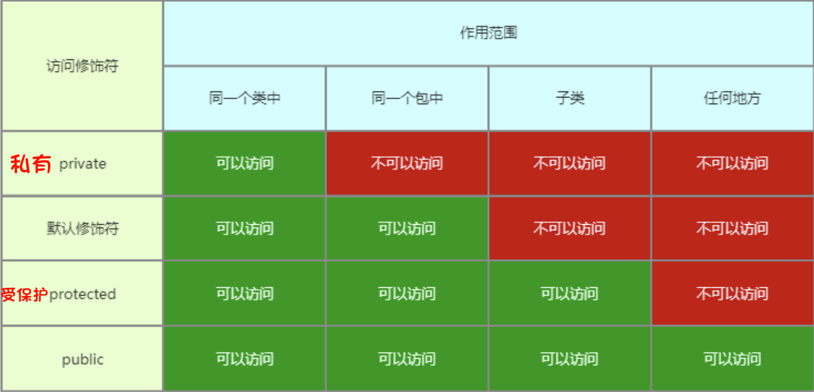

# 访问修饰符
## 概念
访问修饰符就是控制访问权限的修饰符号

## 类的访问修饰符
`类`的访问修饰符只有两种: `public`修饰符和`默认`修饰符（不写修饰符就是默认）

- `public`修饰符修饰类表示类可以公开访问。

- `默认`修饰符修饰类表示该类**只能在同一个包中**可以访问。

```java
package cn.lyxq.chapter11;

//使用默认修饰符修饰类时，该类只能在同一个包的其他类中使用
class Teacher {

}
```

```java
package cn.lyxq.chapter11; // 同一个包

public class School {
    private Teacher[] teachers; // 可以访问Teacher类
}
```

## 类成员访问修饰符
类成员包括了成员属性和成员方法。类成员访问修饰符换言之就是成员属性和成员方法的访问修饰符。

| ##container## |
|:--:|
||

# static 修饰符
## static 修饰符应用范围
`static`修饰符只能用来修饰类中定义的成员变量、成员方法、代码块以及内部类（内部类有专门章节进行讲解）。

## static 修饰成员变量
`static`修饰的成员变量称之为类变量。属于该类所有成员共享。

- 如果类变量是公开的，那么可以使用 类名.变量 名直接访问该类变量。

## static 修饰成员方法
`static`修饰的成员方法称之为类方法。属于该类所有成员共享。

- 如果类方法是公开的，那么可以使用 类名.方法名 名直接访问该类方法。

## static 修饰代码块
`static`修饰的代码块称为静态代码块，在 JVM 第一次记载该类时执行。因此，静态代码块只能够被执行一次，通常用于一些系统设置场景。

示例:

```java
public class Imouto {
    public static void play() {
        System.out.print("这个是ord.HX.loli 的 imouto 类 的 play静态方法\n");
    }

    private static String name;

    // 代码块
    static {
        Imouto.name = "awa!!!";
        System.out.print(name);
    }
}
```

## static 内存
同C++

- 无论是在C++还是在Java中，静态成员变量都只会分配一份内存空间。在C++中，静态成员变量被所有类的实例共享，因此只会有一份内存空间来存储这个静态成员变量的值。在Java中也是同样的原理，静态成员变量被类的所有实例共享，因此只会有一份内存空间来存储这个静态成员变量的值。<sup>*By GPT-3.5*</sup>