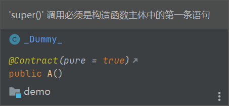
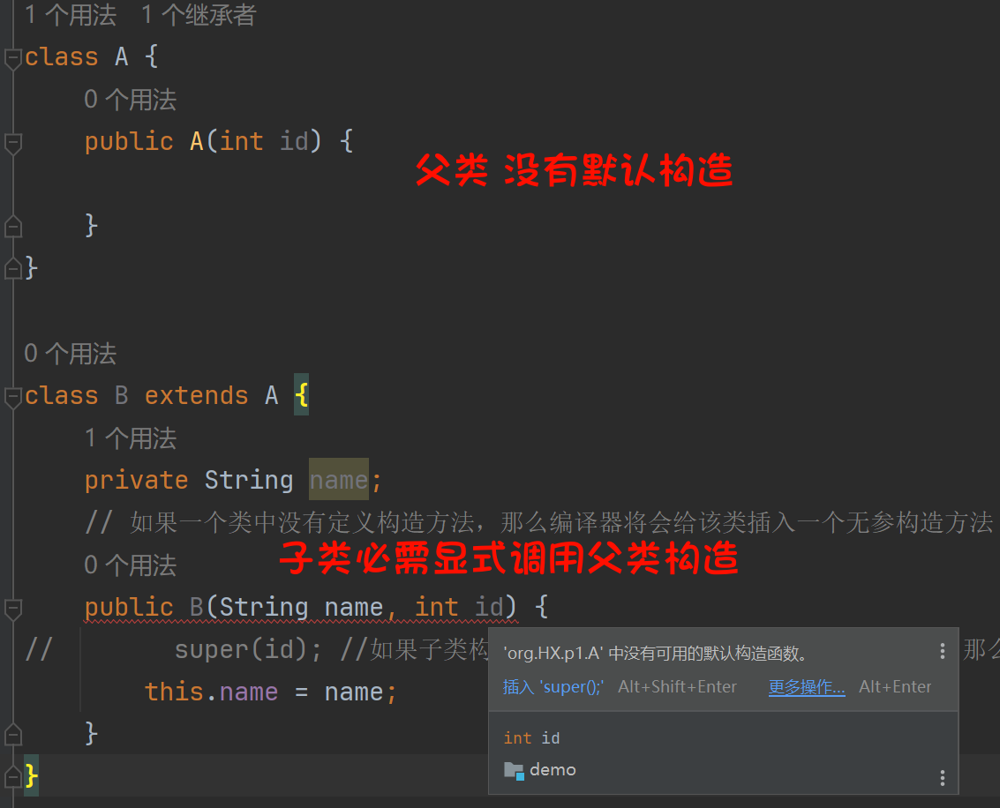

# super关键字
如果子类的构造方法没有明确调用父类的构造方法，Java编译器会自动插入一个父类无参构造的调用。如果父类没有无参构造，你将得到一个编译时错误。Object类有一个无参构造，因此，如果Object类是该类的唯一父类，这就没有问题。

`使用super调用父类的构造方法时，必须为这个构造方法的第一条语句`

示例一：子类和父类中都没有定义构造方法

```java
class A {

}

class B extends A {
    // 如果一个类中没有定义构造方法，那么编译器将会给该类插入一个无参构造方法
    public B() {
        super(); // 如果子类构造方法中没有显示的调用父类的构造方法，那么编译器会自动插入一个父类无参构造的调用
    }
}
```

示例二：子类中有定义构造方法，父类没有定义构造方法

| ##container## |
|:--:|
||

```C++
class A {

}

class B extends A {
    private String name;
    // 如果一个类中没有定义构造方法，那么编译器将会给该类插入一个无参构造方法
    public B(String name) {
        super(); // 如果子类构造方法中没有显示的调用父类的构造方法，那么编译器会自动插入一个父类无参构造的调用
        this.name = name;
        // super(); // 显式调用父类构造函数时: 必需是第一条语句
    }
}
```

示例三：子类和父类中都有定义构造方法
| ##container## |
|:--:|
||

```java
class A {
    public A(int id) {

    }
}

class B extends A {
    private String name;
    // 如果父类中定义了带参构造，并且没有定义无参构造，那么必须在子类的构造方法中显式的调用父类的带参构造
    public B(String name, int id) {
        super(id); // 如果子类构造方法中没有显示的调用父类的构造方法，那么编译器会自动插入一个父类无参构造的调用 (有参不行)
        this.name = name;
    }
}
```

## 使用隐藏字段
如果你的方法重写了父类的方法之一，则可以通过使用关键字`super`来调用父类中被重写的方法。 你也可以使用`super`来引用隐藏字段（尽管不建议使用隐藏字段）。

考虑以下代码:
```java
package org.HX.p1;

class A {
    public String getName() {
        return name;
    }

    public void setName(String name) {
        this.name = name;
    }

    protected String name;
}

class B extends A {
    @Override
    public String getName() {
        return name;
    }

    protected String name;
}

public class text_1 {
    public static void main(String[] args) {
        A b = new B();
        b.setName("张三"); // 设值的是基类的name
        System.out.println(b.getName()); // 获取的是子类的name
    }
}
```


```java
class A {
    public String getName() {
        return name;
    }

    public void setName(String name) {
        this.name = name;
    }

    protected String name;
}

class B extends A {
    @Override
    public String getName() {
        return this.name;
    }

    B(String name) {
        this.name = name;
    }

    public void show() {
        System.out.println(this.name);  // 访问本类的 name
        System.out.println(super.name); // 访问父类的 name
    }

    protected String name;
}

class C extends B {
    protected String name;

    @Override
    public void show() {
        System.out.println(this.name);
        System.out.println(super.name);
        System.out.println(((A)this).name);  // 通过强制类型转换访问类A中的属性
    // 需要注意的是，这种做法需要谨慎，确保对象的实际类型符合预期，避免出现ClassCastException异常。
    }
}

public class text_1 {
    public static void main(String[] args) {
        A b = new B("张三");
        ((B)b).show();
    }
}
```

思考：如果子类中的静态方法与父类中的静态方法具有相同的签名，是否属于方法重写？

不属于方法重写。因为静态方法称之为类方法，跟对象无关，调用时只看对象的数据类型。(通过类名调用)