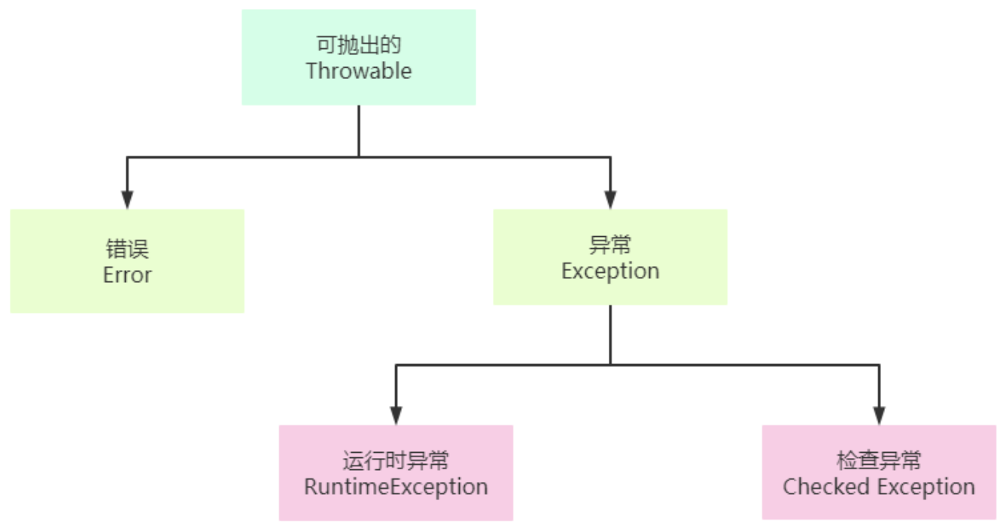

# 什么是异常
## 概念
> 异常是在程序执行期间发生的事件，该事件中断了程序指令的正常流程。

> 当方法内发生错误时，该方法将创建一个对象并将其交给运行时系统。该对象称为异常对象，包含有关错误的信息，包括错误的类型和发生错误时程序的状态。创建异常对象并将其交给运行时系统称为抛出异常。

<span style="color:red">异常是由方法抛出</span>

## Java异常体系
| ##container## |
|:--:|
||

### Throwable
是所有异常的父类。其常用方法如下:
```java
public Throwable();               // 无参构造
public Throwable(String message); // 有参构造
public String getMessage();       // 获取异常发生的原因
public void printStackTrace();    // 打印异常在栈中的轨迹信息
```

### Error
`Error`是一种非常严重的错误，程序员不能通过编写解决。(一般是JVM出现了问题)

### Exception
`Exception`表示异常的意思，主要是程序员在编写代码时考虑不周导致的问题。异常分为运行时异常和检查异常两大类，一旦程序出现这些异常，程序员应该处理这些异常。

### RuntimeException
`RuntimeException`表示运行时异常，所有在程序运行的时候抛出的异常类型都是属于`RuntimeException`的子类。运行时异常一般来说程序可以自动恢复，不必处理(指的是多线程中, 如果出现, 那么不影响其他线程)。

- 在多线程编程中，如果抛出运行时异常，并且该异常没有被捕获和处理，那么程序会将该异常交给默认的异常处理器来处理。默认的异常处理器将会打印异常信息并停止当前线程，但不会影响其他线程的执行。

### 检查异常
`检查异常`是指编译器在编译代码的过程中发现不正确的编码所抛出的异常。