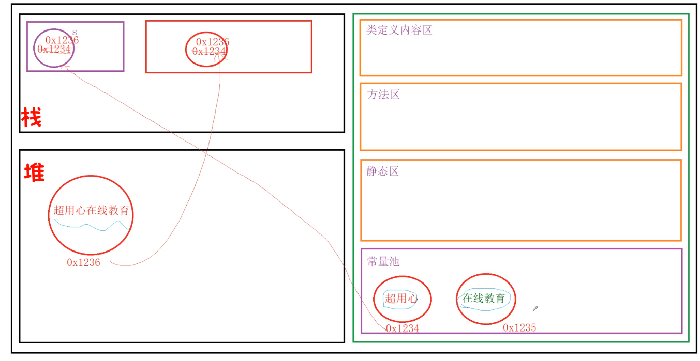

# String
## 特性介绍
- String 类位于 java.lang 包中，无需引入，直接使用即可。
- String 类是由 final 修饰的，表示String 类是一个最终类，不能够被继承。
- String 类构建的对象不可再被更改


```java
public class Example1 {
    public static void main(String[] args) {
        // 当使用一个字面量给字符串赋值时，首先会去字符串常量池中检测是否存在这个字面量。
        // 如果存在，则直接使用这个字面量的地址赋值即可。
        // 如果不存在，则需要在字符串常量池中创建这个字面量，然后再将地址赋值过去即可。
        String s = "超用心";
        s += "在线教育"; // 这里的字符串拼接动作发生在堆内存上
        System.out.println(s);
    }
}
```

| ##container## |
|:--:|
||

> > java常量区的字符串会一直存在还是会被释放的?
>
> 在 Java 中，字符串常量池（String Pool）存储着在编译时期确定的字符串常量。字符串常量池是位于运行时常量池（Runtime Constant Pool）中的一部分，它存储着经过编译器优化的字符串常量。
>
> 对于字符串常量池中的字符串，它们会被 JVM 在初始化阶段加载到内存中，并且一直存在于内存中，直到程序结束或者显式地调用了 String.intern() 方法来将字符串从常量池中移除。
>
> 这意味着，字符串常量池中的字符串不会被自动释放，并且可以在整个程序运行期间被访问和使用。当程序中的其他部分引用了相同的字符串常量时，实际上是指向了字符串常量池中的同一个实例。
>
> 需要注意的是，通过动态创建字符串对象（例如使用 new String("abc")），会在堆内存中创建新的字符串对象，而不是在字符串常量池中。这些动态创建的字符串对象不会被自动加入到字符串常量池中，除非显式地调用 String.intern() 方法。
>
> 总结起来，字符串常量池中的字符串常量在程序运行期间一直存在，直到程序结束或者显式地调用了 String.intern() 方法。动态创建的字符串对象不会被自动加入到字符串常量池中。<sup>By GPT-3.5</sup> 

> > 可是new String("abc") 的 "abc" 会在常量区
>
> 在 Java 中，使用 new String("abc") 创建的字符串对象中的文本内容 "abc" 确实会存在于常量池中，但这并不是因为字符串对象本身是一个字符串常量。实际上，当使用 new String("abc") 创建字符串对象时，会在常量池中存储一个字符串常量 "abc"，同时在堆内存中创建一个新的字符串对象，该对象的值指向常量池中的 "abc"。<sup>By GPT-3.5</sup> 

> > 那 String str = "abc";是不是更好?
> 
> 是的，使用 String str = "abc" 的方式更好。这种方式创建的字符串对象会在编译时期就被确定为常量，并且存储在字符串常量池中。当程序运行时，JVM 会直接从字符串常量池中获取相应的字符串常量，而不需要额外地创建新的对象。因此，这种方式不仅具有更好的性能，而且能够节省内存空间。<sup>By GPT-3.5</sup>

## 常用构造方法

```java
public String(String original);
public String(char value[]);
public String(char value[], int offset, int count); // 从数组的 偏移量为 offset 到之后的 count 个字符进行构造, 需要考虑越界的问题
public String(byte bytes[]);
public String(byte bytes[], int offset, int length);
public String(byte bytes[], Charset charset); // 指定字符集
```

示例:

```java
public class Example2 {
    public static void main(String[] args) {
        String s = "超用心在线教育";
        System.out.println(s);
        
        //这里会创建两个对象：一个是字面量会在常量池中创建一个对象，
        //另一个是new String("")构造方法创建出来的对象
        String s1 = new String("超用心在线教育");
        System.out.println(s1);
        
        char[] values = {'a','d','m','i','n'};
        String s2 = new String(values);
        System.out.println(s2);
        //在使用这个构造方法时必须要考虑到数组下标越界的可能性
        String s3 = new String(values, 1, 3);
        System.out.println(s3);
        //字节可以存储整数，字符也可以使用整数表示，这个整数就是ASCII码对应的整数值
        byte[] bytes = {97, 98, 99, 100, 101, 102};
        String s4 = new String(bytes);
        System.out.println(s4);
        String s5 = new String(bytes, 2, 3);
        System.out.println(s5);
        Charset charset = Charset.forName("UTF-8");// 构建UTF-8字符集
        String s6 = new String(bytes, charset);
        System.out.println(s6);
    }
}
```

## 常用的字符串方法
### 获取长度

```java
public int length(); // 获取字符串的长度
```

### 字符串比较

```java
public boolean equals(Object anObject);               // 比较两个字符串是否相同
public boolean equalsIgnoreCase(String anotherString);// 忽略大小比较两个字符串是否相同
```

### 字符串大小写转换
```java
public String toLowerCase(); // 转换为小写
public String toUpperCase(); // 转换为大写
```

示例:

```java
public class Example3 {
    public static void main(String[] args) {
        String s1 = "超用心在线教育";
        int length = s1.length(); // 获取字符串的长度
        System.out.println(length);
        String s2 = "abc";
        String s3 = "abc";
        String s4 = "AbC";
        System.out.println(s2 == s3);
        // 字符串之间进行比较时，首先会查看两个字符串的长度是否一致，如果一致，再看其中的每一个字符是否相同
        System.out.println(s2.equals(s3));
        System.out.println(s2.equals(s4));
        System.out.println(s2.equalsIgnoreCase(s4));
        String s5 = s2.toUpperCase();
        System.out.println(s5);
        String s6 = s4.toLowerCase();
        System.out.println(s6);
    }
}
```

### 获取字符在字符串中的下标
```java
public int indexOf(int ch);     // 获取指定字符在字符串中第一次出现的下标
public int lastIndexOf(int ch); // 获取指定字符在字符串中最后一次出现的下标
```

### 获取字符串在字符串中的下标
```java
public int indexOf(String str);     // 获取指定字符串在字符串中第一次出现的下标
public int lastIndexOf(String str); // 获取指定字符串在字符串中最后一次出现的下标
```

### 获取字符串中的指定下标的字符
```java
public char charAt(int index);
```

示例:
```java
public class Example4 {
    public static void main(String[] args) {
        String s = "kiley@aliyun.com";
        int number = 'a';
        System.out.println(number);
        // '@' => char => int
        // 求指定字符在字符串中第一次出现的下标位置
        int index1 = s.indexOf('@'); // 相互兼容的数据类型之间可以发生自动类型转换
        System.out.println(index1);
        int index2 = s.lastIndexOf('@');
        System.out.println(index2);
        int index3 = s.indexOf('.'); // 相互兼容的数据类型之间可以发生自动类型转换
        int index4 = s.lastIndexOf('.');
        boolean case1 = (index1 == index2); // 保证只有一个@
        boolean case2 = (index3 == index4); // 保证只有一个.
        boolean case3 = (index3 - index2 > 1);// @必须在.的前面
        boolean case4 = (index1 > 0 && index3 < s.length() - 1);//@不能在最开始.不能在末尾
        if (case1 && case2 && case3 && case4) {
            System.out.println("字符串" + s + "是一个邮箱地址");
        }
        System.out.println(s.charAt(0));
    }
}
```

### 字符串截取
```java
public String substring(int beginIndex);               // 从指定开始位置截取字符串，直到字符串的末尾
public String substring(int beginIndex, int endIndex); // 从指定开始位置到指定结束位置截取字符串
```

示例:

```java
public class Example5 {
    public static void main(String[] args) {
        String s = "Java是一门非常高深的语言";
        //字符串截取，截取是使用的是左闭右开区间[0, 4)
        String sub1 = s.substring(0, 4);
        System.out.println(sub1);
        String sub2 = s.substring(7);
        System.out.println(sub2);
    }
}
```

### 字符串替换
```java
public String replace(char oldChar, char newChar); // 使用新的字符替换字符串中存在的旧的字符
public String replace(CharSequence target, CharSequence replacement); // 使用替换的字符串来替换字符串中的就的字符串
public String replaceAll(String regex, String replacement); // 使用替换的字符串来替换字符串中满足正则表达式的字符串
```

示例:
```java
public class Example6 {
    public static void main(String[] args) {
        String s = "Hello World";
        String s1 = s.replace('o', 'a');
        System.out.println(s);
        System.out.println(s1);
        String s2 = s.replace("o", "a");
        System.out.println(s2);
        String info = "a1b2c3d4e5";
        // regular expression 正则表达式
        // 三至五位整数的正则表达式 099 [123456789][0123456789][0123456789]
        // [1-9][0-9]{2,4}
        // 英文字符串正则表达式
        // [a-zA-Z]+
        String result1 = info.replaceAll("[0-9]","");
        System.out.println(result1);
        String result2 = info.replaceAll("[a-zA-Z]","");
        System.out.println(result2);
    }
}
```

### 获取字符数组

在 Java 中，字符数组（char[]）在定义时可以存放在堆内存或者方法区中。如果字符数组是作为类的静态变量或者常量被初始化的，那么它们会被存放在方法区的运行时常量池中（不同于堆内存中的对象实例）。这意味着这些字符数组会被视为常量，并且不会被垃圾回收器回收。

当程序结束或者对应类被卸载时，方法区中的运行时常量池会被销毁，其中的常量数据也会随之被释放，因此这些字符数组最终会被释放掉。

需要注意的是，如果字符数组是在方法中动态创建的，即在方法的局部变量中定义并初始化的，那么这些字符数组会存放在堆内存中，而不是常量池中。这种情况下，字符数组会受到垃圾回收器的管理，当没有引用指向这些字符数组时，它们会被垃圾回收器回收释放内存。<sup>By GPT-3.5</sup>

```java
public char[] toCharArray();
```

### 获取字节数组
```java
public byte[] getBytes();                // 获取字节数组
public byte[] getBytes(Charset charset); // 获取指定编码下的字节数组
```

示例:
```java
public class Example7 {
    public static void main(String[] args) {
        String s = "My God";
        char[] values = s.toCharArray();
      
        for(int i = 0; i < values.length; i++) {
            System.out.println(values[i]);
        }
      
        byte[] bytes = s.getBytes();
        for(int i = 0; i < bytes.length; i++) {
            System.out.println(bytes[i]);
        }
      
        byte[] bytes1 = s.getBytes(Charset.forName("GB2312"));
        for(int i = 0; i < bytes1.length; i++) {
            System.out.println(bytes1[i]);
        }
    }
}
```

### 字符串拼接
```java
public String concat(String str); // 将字符串追加到末尾
```

### 去除字符串两端的空白字符

空格和制表符都可以('\t', '\n', '\r', ...)
```java
public String trim();
```

示例:
```java
public class Example8 {
    public static void main(String[] args) {
        String s1 = "Hello";
        String s2 = "World";
        String s3 = s1 + s2;
        System.out.println(s3);
        String s4 = s1.concat(s2); // 将s2追加到s1的末尾
        System.out.println(s4);
        String s5 = " ab cde ";
        System.out.println(s5);
        String s6 = s5.trim(); // 将字符串两端的空格修剪掉
        System.out.println(s6);
    }
}
```

### 字符串分割
```java
public String[] split(String regex); // 将字符串按照匹配的正则表达式分割
```

### 字符串匹配正则表达式
```java
public boolean matches(String regex); // 检测字符串是否匹配给定的正则表达式
```

示例:
```java
public class Example9 {
    public static void main(String[] args) {
        String s = "a1b2c3d4e5A";//[a-z0-9]+
        String[] arr = s.split("[0-9]");
        for(int i = 0; i < arr.length; i++){
            System.out.println(arr[i]);
        }
      
        String personInfo = "刘德华,男,53,很帅气";
        String[] arr1 = personInfo.split(",");
        for(int i = 0; i < arr1.length; i++){
            System.out.println(arr1[i]);
        }
      
        String regex = "[a-z0-9]+";
        boolean match = s.matches(regex);
        System.out.println(match);
    }
}
```

### 不得不提的intern()方法

```java
public native String intern();
```

将堆的String 放到 常量池中

```java
public class Example10 {
    public static void main(String[] args) {
        String s1 = "超用心";
        String s2 = "在线教育";
        String s3 = s1 + s2;
        String s4 = "超用心在线教育";
        System.out.println(s3 == s4); // false
        // 将字符串s3放入字符串常量池，放入时会先检测常量池中是否存在s3字符串，如果字符串常量池中存在
        // 字符串s3，那么s5直接使用常量池中的s3字符串地址即可。如果不存在，则在常量池中创建字符串s3
        String s5 = s3.intern();
        System.out.println(s5 == s4); // true
    }
}
```