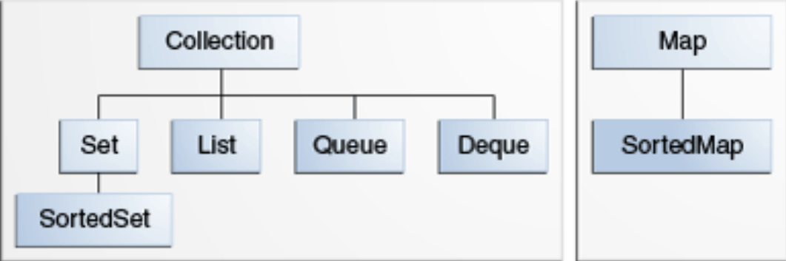

# 集合框架体系
> 类似于 C++ 的 STL --> [STL常用数据结构](../../../../001-C++/002-tmp丶C++丶memo/002-STL库/001-STL常用数据结构/index.md)
## 集合与集合框架

```
集合（有时称为容器）只是一个将多个元素分组为一个单元的对象。集合用于存储，检索，操作和传达聚合数据。

集合框架是用于表示和操作集合的统一体系结构。
```
## 为什么要使用集合框架
回想我们之前所学的数组，数组也能存储元素，也能对元素进行增删改查操作。那么数组与集合之间有什么区别呢？

使用数组实现增删改查:

```java
import java.util.Arrays;

class ArrayUtil {
    //使用数组来存储数据，因为不知道存储什么样的数据，所以使用Object数组
    //支持存储所有类型的数据
    private Object[] elements;
    private int size;//数组中存储的元素个数
    public ArrayUtil() {
        this(16);
    }
    public ArrayUtil(int capacity) {
        elements = new Object[capacity];
    }
    public int size(){
        return size;
    }
    public void add(Object o){
        //数组中存储满了，数组需要扩容才能存储新的元素
        if(size == elements.length){
            //4 >> 1 0100 >> 1 => 010 = 2
            int length = elements.length + elements.length >> 1;
            elements = Arrays.copyOf(elements, length);
        }
        elements[size++] = o;
    }
    public void delete(Object o){
        if(o == null) return;
        int index = -1;//要删除的元素的下标
        for(int i=0; i< size; i++){
            if(o.equals(elements[i])){
                index = i;
                break;
            }
        }
        // 1 2 3 4 5
        // 1 2 4 5
        System.arraycopy(elements, index + 1, elements, index, size-index - 1);
        size--;
    }
    public void update(int index, Object o){
        if(index < 0 || index >= size){
            throw new ArrayIndexOutOfBoundsException("下标越界了");
        }
        elements[index] = o;
    }
    public Object get(int index){
        if(index < 0 || index >= size){
            throw new ArrayIndexOutOfBoundsException("下标越界了");
        }
        return elements[index];
    }
}

class ArrayUtilTest {
    public static void text() {
        ArrayUtil util = new ArrayUtil();
        util.add(1);
        util.add(2);
        util.add(3);
        util.add(4);
        util.add(5);
        for(int i=0; i<util.size(); i++){
            Object o = util.get(i);
            System.out.println(o);
        }
        System.out.println("=================");
        util.update(1, 10);
        for(int i=0; i<util.size(); i++){
            Object o = util.get(i);
            System.out.println(o);
        }
        System.out.println("=================");
        util.delete(4);
        for(int i=0; i<util.size(); i++){
            Object o = util.get(i);
            System.out.println(o);
        }
        System.out.println("=================");
    }
}
```

使用数组对元素进行增删改查时，需要我们自己编码实现。而集合是Java平台提供的，也能进行增删改查，已经有了具体的实现。我们不需要再去实现，直接使用Java平台提供的集合即可，这无疑减少了编程的工作量。同时Java平台提供的集合无论是在数据结构还是算法设计上都具有更优的性能。

## 集合框架接口体系
| ##container## |
|:--:|
||

集合接口体系中有两个顶层接口`Collection`和`Map`， `Collection`接口属于单列集合（可以理解为一次存储一个元素），`Map`接口属于双列集合（可以理解为一次存入两个相关联的元素）。
