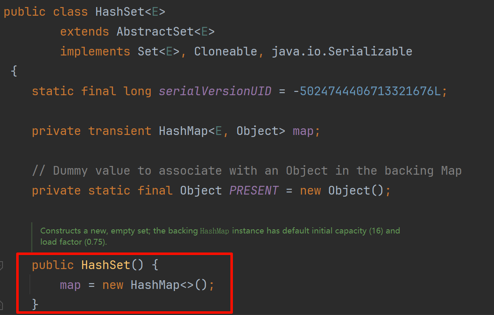

# Set 接口
## 特性描述
> 集合是一个集合，不能包含重复的元素。它为数学集合抽象建模。`Set`接口仅包含从`Collection`继承的方法，并增加了禁止重复元素的限制。`Set`还为`equals`和`hashCode`操作的行为增加了更紧密的约定，即使它们的实现类型不同，也可以有意义地比较Set实例。 如果两个`Set`实例包含相同的元素，则它们相等。
>
> Java平台包含三个通用的Set实现：`HashSet`，`TreeSet`和`LinkedHashSet`。HashSet将其元素存储在哈希表中，是性能最好的实现。但是，它不能保证迭代的顺序。

值得注意的是, Set的实现是基于Map的 =-=

| ##container## |
|:--:|
||

这里使用了[适配器模式](../../../../../001-计佬常識/002-设计模式/008-结构型模式/001-适配器模式/index.md), 提升了代码的复用性.

值得注意的是, `map.entrySet()` 返回的`set` 而 set又是map实现的?!

实际上此set非彼set?
```java
public Set<Map.Entry<K,V>> entrySet() {
        EntrySet es = entrySet;
        return (es != null) ? es : (entrySet = new EntrySet());
}
```

---

在 Java 中，`map.entrySet()` 返回的 `Set` 对象是基于 `Map` 实现的，但是它是一个视图（view），而不是一个新的集合对象。这个视图包含了 `Map` 中的键值对关系。

这个 `Set` 视图的元素是 `Map.Entry` 对象，每个 `Map.Entry` 对象代表了 `Map` 中的一个键值对。因此，通过 `map.entrySet()` 返回的 `Set` 中的元素与原始的 `Map` 是相同的，但是它们的存储方式不同。<sup>By GPT-3.5</sup>

---

## HashSet

> 此类实现Set接口，该接口由哈希表（实际上是HashMap实例）支持。它不保证集合的迭代顺序。特别是，它不能保证顺序会随着时间的推移保持恒定。此类允许使用null元素。

示例:

```java
public class MyHashMapText {
    public static void main(String[] args) {
       HashSet<String> set = new HashSet<>();
       set.add("钻石");
       set.add("红石");
       set.add("铁");
       for (String it : set)
           System.out.println(it);
    }
}
```

## TreeSet
> 基于`TreeMap`的`NavigableSet`实现。元素使用其自然顺序或在集合创建时提供的`Comparator`进行排序，具体取决于所使用的构造方法。

示例: 略 (参考[Map接口](../009-Map接口/index.md)的使用, 和上面的方法名)

## LinkedHashSet
> Set接口的哈希表和链表实现，具有可预测的迭代顺序。此实现与HashSet的不同之处在于，它维护在其所有条目中运行的双向链接列表。此链表定义了迭代顺序，即将元素插入到集合中的顺序（插入顺序）。请注意，如果将元素重新插入到集合中，则插入顺序不会受到影响。

示例: 略