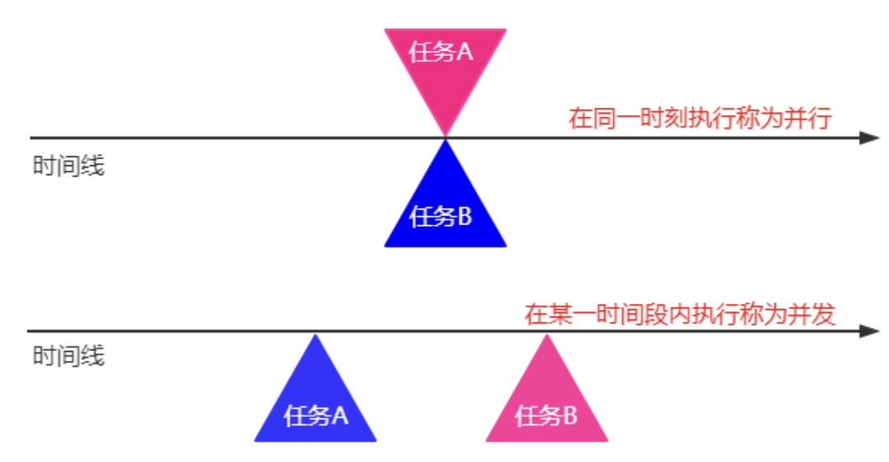

# 并发
> 计算机用户认为他们的系统一次可以执行多项操作是理所当然的。他们假设自己可以继续在文字处理器中工作，而其他应用程序则可以下载文件，管理打印队列和流音频。通常甚至一个应用程序一次都可以完成多项任务
>
> Java平是从一开始就设计为支持并发编程，并在Java编程语言和Java类库中提供基本的并发支持。从5.0版开始，Java平台还包含高级并发API。本课介绍了平台的基本并发支持，并总结了`java.util.concurrent`包中的一些高级API。

在并发的概念中还包含并行在其中。

| ##container## |
|:--:|
||
