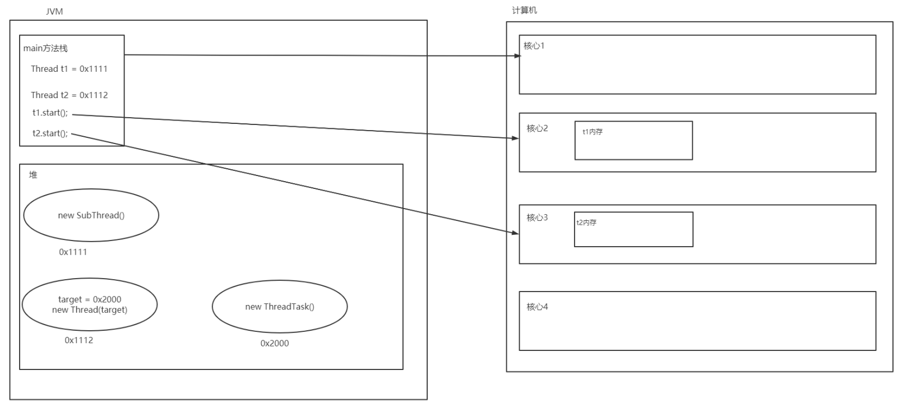
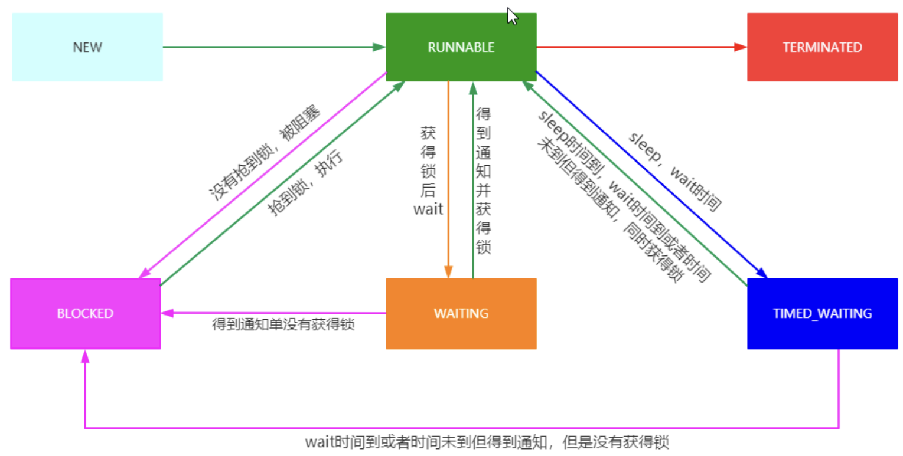

# 线程
## 线程的创建方式
> 创建Thread实例的应用程序必须提供将在该线程中运行的代码。 有两种方法可以做到这一点：
> > - 提供可运行的对象。 Runnable接口定义了一个方法run，旨在包含在线程中执行的代码。
> 
> > - 子类线程。 Thread类本身实现了Runnable，尽管它的run方法不执行任何操作。

### Thread类常用构造方法

```java
public Thread();                             // 创建一个线程
public Thread(String name);                  // 创建一个依据名称的线程
public Thread(Runnable target);              // 根据给定的线程任务创建一个线程
public Thread(Runnable target, String name); // 根据给定的线程任务和名称创建一个线程
```

### Thread类常用成员方法

```java
public synchronized void start();                     // 启动线程但不一定会执行
public final String getName();                        // 获取线程名称
public final synchronized void setName(String name);  // 设置线程的名称
public final void setPriority(int newPriority);       // 设置线程的优先级
public final int getPriority();                       // 获取线程的优先级
public final void join() throws InterruptedException; // 等待线程执行完成
// 等待线程执行给定的时间(单位毫秒)
public final synchronized void join(long millis) throws InterruptedException;
// 等待线程执行给定的时间(单位毫秒、纳秒)
public final synchronized void join(long millis, int nanos) throws InterruptedException;
public long getId();            // 获取线程的ID
public State getState();        // 获取线程的状态
public boolean isInterrupted(); // 检测线程是否被打断
public void interrupt();        // 打断线程
```

### Thread类常用静态方法

```java
public static native Thread currentThread(); // 获取当前运行的线程
public static boolean interrupted();         // 检测当前运行的线程是否被打断
public static native void yield();           // 暂停当前运行的线程，然后再与其他线程争抢资源，称为线程礼让
// 使当前线程睡眠给定的时间（单位毫秒）
public static native void sleep(long millis) throws InterruptedException;
// 使当前线程睡眠给定的时间（单位毫秒、纳秒）
public static void sleep(long millis, int nanos) throws InterruptedException;
```

示例

```java
public class Main {
    public static void main(String[] args) {
        Thread t1 = new MyThread();
        Thread t2 = new Thread(new MyThreadTask(), "任务线程");
        Thread t3 = new Thread(new MyThreadTask(), "任务线程");

        t1.start();
        t2.start();
        t3.start();

        try {
            t1.join(200); // 没有等到结束, 就不等待了
        } catch (InterruptedException e) {
            throw new RuntimeException(e);
        }

        System.out.println("任务　リンク　スタート");
    }
}

class MyThread extends Thread {
    @Override
    public void run() {
        System.out.println(this.getId() + "线程: 执行任务");
        try {
            Thread.sleep(1000);
        } catch (InterruptedException e) {
            throw new RuntimeException(e);
        }
        System.out.println(this.getName() + " 执行完毕");
    }
}

class MyThreadTask implements Runnable {

    @Override
    public void run() {
        System.out.println(Thread.currentThread().getId() + Thread.currentThread().getName() + "线程: 执行任务");
    }
}
```

### 总结
创建线程有两种方式:
- 实现 Runable 接口和继承 Thread。

- 相较于继承 Thread ，实现 Runable 接口更具有优势，在实现接口的同时还可以继承自其他的父类，避免了Java中类单继承的局限性；

- 同时Runable 接口的实现可以被多个线程重用，但继承 Thread 无法做到；后续学到的线程池中支持Runable 接口但不支持 Thread

## 线程内存模型
| ##container## |
|:--:|
||

## 线程安全
为何不问一下隔壁的C/C++? [线程同步序言](../../../../001-C++/002-tmp丶C++丶memo/005-C++多进程与多线程/001-C语言版/003-线程同步序言/index.md)

## 线程同步 synchronized
> Java编程语言提供了两种基本的同步习惯用法：同步方法和同步代码块

### 同步方法语法

```java
访问修饰符 synchronized 返回值类型 方法名(参数列表) {

}
```

示例

```java
public class TongBu {
    public static void main(String[] args) {
        MyTask task = new MyTask(10);
        Thread t1 = new Thread(task, "[售货员1]");
        Thread t2 = new Thread(task, "[售货员2]");
        Thread t3 = new Thread(task, "[售货员3]");

        t1.start();
        t2.start();
        t3.start();
    }
}

class MyTask implements Runnable {

    private int mono_num; // 物品数量

    MyTask(int monoNum) {
        mono_num = monoNum;
    }

    private synchronized void del_mono() {
        if (this.mono_num <= 0)
            return;
        --this.mono_num;
        System.out.println(Thread.currentThread().getName() + ": 出售了一个物品, 当前剩余: " + this.mono_num);
    }

    @Override
    public void run() {
        while (true) {
            this.del_mono();
            try {
                Thread.sleep(100L);
            } catch (InterruptedException e) {
                throw new RuntimeException(e);
            }
            if (this.mono_num <= 0)
                break;
        }
        System.out.println(Thread.currentThread().getName() + ": 已经卖完了, 当前剩余: " + this.mono_num);
    }
}
```

### 同步代码块语法

```java
synchronized(对象) {

}
```

示例

```java
public class TongBu {
    public static void main(String[] args) {
        MyTask task = new MyTask(10);
        Thread t1 = new Thread(task, "[售货员1]");
        Thread t2 = new Thread(task, "[售货员2]");
        Thread t3 = new Thread(task, "[售货员3]");

        t1.start();
        t2.start();
        t3.start();
    }
}

class MyTask implements Runnable {
    private int mono_num; // 物品数量
    private byte[] lock = new byte[0]; // 特殊的instance变量(占用空间更少)
  
    MyTask(int monoNum) {
        mono_num = monoNum;
    }

    @Override
    public void run() {
        while (true) {

            synchronized (this) { // 这个也可以使用this.lock
                if (this.mono_num <= 0)
                    break;
                --this.mono_num;
                System.out.println(Thread.currentThread().getName() + ": 出售了一个物品, 当前剩余: " + this.mono_num);
            }

            try {
                Thread.sleep(100L);
            } catch (InterruptedException e) {
                throw new RuntimeException(e);
            }
            if (this.mono_num <= 0)
                break;
        }
        System.out.println(Thread.currentThread().getName() + ": 已经卖完了, 当前剩余: " + this.mono_num);
    }
}

class _MyTask implements Runnable {

    private int mono_num; // 物品数量

    _MyTask(int monoNum) {
        mono_num = monoNum;
    }

    private synchronized void del_mono() {
        if (this.mono_num <= 0)
            return;
        --this.mono_num;
        System.out.println(Thread.currentThread().getName() + ": 出售了一个物品, 当前剩余: " + this.mono_num);
    }

    @Override
    public void run() {
        while (true) {
            this.del_mono();
            try {
                Thread.sleep(100L);
            } catch (InterruptedException e) {
                throw new RuntimeException(e);
            }
            if (this.mono_num <= 0)
                break;
        }
        System.out.println(Thread.currentThread().getName() + ": 已经卖完了, 当前剩余: " + this.mono_num);
    }
}
```

### 值得注意的是
---

`synchronized`保证的是同一个对象只能在同一时刻访问`synchronized`内的代码块, 如果不是同一个对象, 则不行.

对于`synchronized(对象) {代码块}`中, `()`内的对象也应该是一个和该对象共用的, 而不能`synchronized(new Obj()) {代码块}`这样!

更多学习: [Java多线程——synchronized使用详解](https://blog.csdn.net/zhangqiluGrubby/article/details/80500505)

---

### synchronized 锁实现原理
> 同步是围绕称为内部锁或监视器锁的内部实体构建的。 （API规范通常将此实体简称为“监视器”。）内在锁在同步的两个方面都起作用：强制对对象状态的独占访问并建立对可见性至关重要的事前关联。
>
> 每个对象都有一个与之关联的固有锁。按照约定，需要对对象的字段进行独占且一致的访问的线程必须在访问对象之前先获取对象的内在锁，然后在完成对它们的使用后释放该内在锁。据说线程在获取锁和释放锁之间拥有内部锁。只要一个线程拥有一个内在锁，其他任何线程都无法获得相同的锁。另一个线程在尝试获取锁时将阻塞。
>
> 当线程释放内在锁时，该动作与任何随后的相同锁获取之间将建立事前发生的关系。
>
> 当线程调用同步方法时，它会自动获取该方法对象的内在锁，并在方法返回时释放该内在锁。 即使返回是由未捕获的异常引起的，也会发生锁定释放。

## 线程同步 Lock
> 同步代码依赖于一种简单的可重入锁。这种锁易于使用，但有很多限制。
>
> 锁对象的工作方式非常类似于同步代码所使用的隐式锁。与隐式锁一样，一次只能有一个线程拥有一个Lock对象。
>
> 与隐式锁相比，Lock对象的最大优点是它们能够回避获取锁的企图。如果该锁不能立即或在超时到期之前不可用，则`tryLock`方法将撤消（如果指定）。如果另一个线程在获取锁之前发送了中断，则`lockInterruptibly`方法将退出。

示例
```java
import java.util.concurrent.locks.Lock;
import java.util.concurrent.locks.ReentrantLock;

public class TongBu {
    public static void main(String[] args) {
        MyTask task = new MyTask(10);
        Thread t1 = new Thread(task, "[售货员1]");
        Thread t2 = new Thread(task, "[售货员2]");
        Thread t3 = new Thread(task, "[售货员3]");

        t1.start();
        t2.start();
        t3.start();
    }
}

class MyTask implements Runnable {
    private int mono_num; // 物品数量
    private Lock lock = new ReentrantLock();//创建一个可重入锁

    MyTask(int monoNum) {
        mono_num = monoNum;
    }

    @Override
    public void run() {
        while (true) {

            lock.lock(); // 锁不上就阻塞
                if (this.mono_num <= 0)
                    break;
                --this.mono_num;
                System.out.println(Thread.currentThread().getName() + ": 出售了一个物品, 当前剩余: " + this.mono_num);
            lock.unlock();

            try {
                Thread.sleep(100L);
            } catch (InterruptedException e) {
                throw new RuntimeException(e);
            }
            if (this.mono_num <= 0)
                break;
        }
        System.out.println(Thread.currentThread().getName() + ": 已经卖完了, 当前剩余: " + this.mono_num);
    }
}
```

另外这样可能更好！！！

```java
@Override
public void run() {
    while (true) {

        if (lock.tryLock()) { // 尝试上锁
            try {
                if (this.mono_num <= 0)
                    break;
                --this.mono_num;
                System.out.println(Thread.currentThread().getName() + ": 出售了一个物品, 当前剩余: " + this.mono_num);
            }
            finally {
                lock.unlock(); // 解锁(防止因为异常等 产生死锁)
            }
        }
        else
            System.out.println("锁不了!"); // 可做别的, 等等

        try {
            Thread.sleep(100L);
        } catch (InterruptedException e) {
            throw new RuntimeException(e);
        }
        if (this.mono_num <= 0)
            break;
    }
    System.out.println(Thread.currentThread().getName() + ": 已经卖完了, 当前剩余: " + this.mono_num);
}
```

## 线程通信
### Object类中的通信方法

```java
public final native void notify();                    // 唤醒一个在监视器上等待的线程
public final native void notifyAll();                 // 唤醒所有在监视器上等待的线程
public final void wait() throws InterruptedException; // 等待
public final native void wait(long timeout) throws InterruptedException;     // 计时等待
public final void wait(long timeout, int nanos) throws InterruptedException; // 计时等待
```

应用: 生产者-消费者模型: [条件变量](../../../../001-C++/002-tmp丶C++丶memo/005-C++多进程与多线程/001-C语言版/007-条件变量/index.md)

示例

```java
public class BoundedBufferProblem {
    public static void main(String[] args) {
        BBP_Task_P bbpTaskP = new BBP_Task_P(5);
        BBP_Task_BB bbpTaskBb = new BBP_Task_BB(bbpTaskP);
        Thread tBb = new Thread(bbpTaskBb, "[生产者]");
        Thread tP = new Thread(bbpTaskP, "[消费者]");
        tP.start();
        tBb.start();
    }
}

class BBP_Task_BB implements Runnable {
    private BBP_Task_P p;

    BBP_Task_BB(BBP_Task_P p) {
        this.p = p;
    }

    @Override
    public void run() {
        while (true) {
            p.Add();

            try {
                Thread.sleep(100L);
            } catch (InterruptedException e) {
                throw new RuntimeException(e);
            }
        }
    }
}

class BBP_Task_P implements Runnable {
    private int mono; // 当前数量
    private int tsuKuRu; // 一次生产的数量

    BBP_Task_P(int tsuKuRu) {
        this.tsuKuRu = tsuKuRu;
    }

    private synchronized void Eat() {
        if (this.mono <= 0) {
            try {
                notify(); // 通知存钱
                wait();   // 等待生产
            } catch (InterruptedException e) {
                throw new RuntimeException(e);
            }
        }
        --this.mono;
        System.out.println(Thread.currentThread().getName() + "吃一个后, 还剩下: " + this.mono + "个");
    }

    public synchronized void Add() {
        if (this.mono > 0) {
            try {
                wait(); // 等待消耗
            } catch (InterruptedException e) {
                throw new RuntimeException(e);
            }
        }

        this.mono += this.tsuKuRu;
        notify();
        System.out.println(Thread.currentThread().getName() + "给你生产了!!!");
    }

    @Override
    public void run() {
        while (true) {
            Eat();
            try {
                Thread.sleep(100L);
            } catch (InterruptedException e) {
                throw new RuntimeException(e);
            }
        }
    }
}
```

## 线程状态

```java
public enum State {
    /**
     * Thread state for a thread which has not yet started.
     */
    NEW, // 刚刚被 new 还没有 start 的时候

    /**
     * Thread state for a runnable thread.  A thread in the runnable
     * state is executing in the Java virtual machine but it may
     * be waiting for other resources from the operating system
     * such as processor.
     */
    RUNNABLE, // 告诉JVM准备好了, 不一定正在运行

    /**
     * Thread state for a thread blocked waiting for a monitor lock.
     * A thread in the blocked state is waiting for a monitor lock
     * to enter a synchronized block/method or
     * reenter a synchronized block/method after calling
     * {@link Object#wait() Object.wait}.
     */
    BLOCKED,

    /**
     * Thread state for a waiting thread.
     * A thread is in the waiting state due to calling one of the
     * following methods:
     * <ul>
     *   <li>{@link Object#wait() Object.wait} with no timeout</li>
     *   <li>{@link #join() Thread.join} with no timeout</li>
     *   <li>{@link LockSupport#park() LockSupport.park}</li>
     * </ul>
     *
     * <p>A thread in the waiting state is waiting for another thread to
     * perform a particular action.
     *
     * For example, a thread that has called <tt>Object.wait()</tt>
     * on an object is waiting for another thread to call
     * <tt>Object.notify()</tt> or <tt>Object.notifyAll()</tt> on
     * that object. A thread that has called <tt>Thread.join()</tt>
     * is waiting for a specified thread to terminate.
     */
    WAITING,

    /**
     * Thread state for a waiting thread with a specified waiting time.
     * A thread is in the timed waiting state due to calling one of
     * the following methods with a specified positive waiting time:
     * <ul>
     *   <li>{@link #sleep Thread.sleep}</li>
     *   <li>{@link Object#wait(long) Object.wait} with timeout</li>
     *   <li>{@link #join(long) Thread.join} with timeout</li>
     *   <li>{@link LockSupport#parkNanos LockSupport.parkNanos}</li>
     *   <li>{@link LockSupport#parkUntil LockSupport.parkUntil}</li>
     * </ul>
     */
    TIMED_WAITING,

    /**
     * Thread state for a terminated thread.
     * The thread has completed execution.
     */
    TERMINATED;
}
```
### 线程状态转换图

| ##container## |
|:--:|
||
