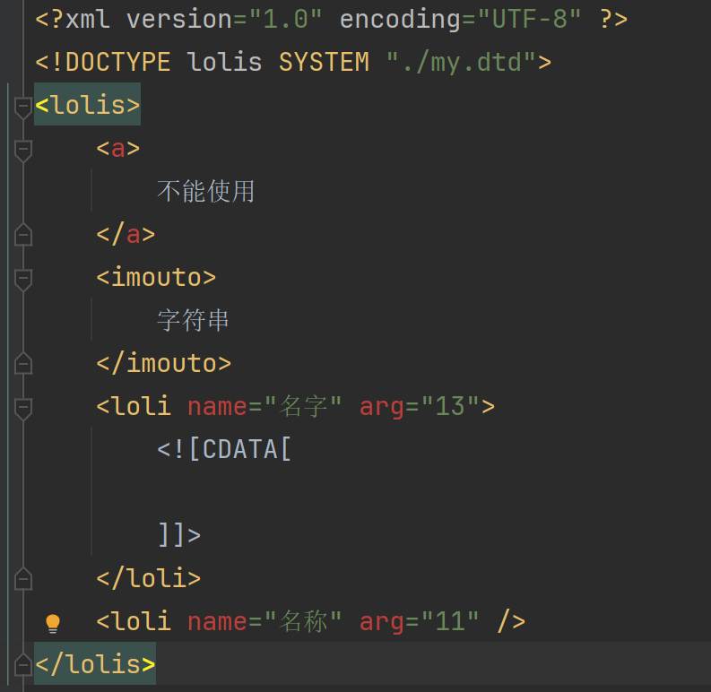

# DTD约束
## DTD约束元素
### EMPTY(空元素)
元素不包含任何数据，但是可以有属性，如:

```xml
<loli name="名称" arg="11" />
```

### #PCDATA(字符串)
PCDATA是指被解析器解析的文本也就是字符串内容，不能包含其他类型的元素，如:

```xml
<imouto>字符串</imouto>
```

### ANY(任何内容都可以)
字面意思

<div style="margin-top: 80px;">

---
</div>

## DTD约束元素出现顺序及次数
|情景|语法|描述|
|-|-|-|
|顺序出现|\<!ELEMENT name (a, b)>|子元素a、b必须同时出现，且a必须在b之前出现|
|选择出现|\<!ELEMENT name (a\|b)>|子元素a、b只能有一个出现，要么是a，要么是b|
|只出现一次|\<!ELEMENT name (a)>|子元素a只能且必须出现一次|
|一次或多次|\<!ELEMENT name (a+)>|子元素a要么出现一次，要么出现多次|
|零次或多次|\<!ELEMENT name (a*)>|子元素a可以出现任意次（包括不出现，即出现零次）|
|零次或一次|\<!ELEMENT name (a?)>|子元素a可以出现一次或不出现|

### 元素格式

```dtd
<!ELEMENT 元素名称 元素类型>
```

示例
```dtd
<!ELEMENT lolis (loli*)(imouto*)>
<!ELEMENT loli ANY>
<!ELEMENT imouto EMPTY>
```

<div style="margin-top: 80px;">

---
</div>

## DTD约束元素属性
### 属性值类型
- `CDATA`，属性值为普通文本字符串。
- `Enumerated`，属性值的类型是一组取值的列表，XML文件中设置的属性值只能是这个列表中的某一个值。
- `ID`，表示属性值必须唯一，且不能以数字开头

### 属性值设置
- `#REQUIRED`，必须设置该属性。
- `#IMPLIED`，该属性可以设置也可以不设置。
- `#FIXED`，该属性的值为固定的。
- 使用默认值。

### 属性格式

```dtd
<!ATTLIST 元素名 属性名 属性值类型 设置说明>
```

示例:

```dtd
<!ELEMENT lolis (loli*)(imouto*)>
<!ELEMENT loli (name, sex)>
<!ELEMENT imouto EMPTY>
<!ELEMENT name (#PCDATA)>
<!ELEMENT sex (#PCDATA)>
<!ATTLIST loli id ID #REQUIRED>
<!ATTLIST loli name CDATA>
<!ATTLIST loli sex(男|女|其他) #IMPLIED>
```

没有报错的`.xml`:

```xml
<?xml version="1.0" encoding="UTF-8" ?>
<!DOCTYPE lolis SYSTEM "./my.dtd">
<lolis>
    <imouto>
        字符串
    </imouto>
    <loli id="1" name="名字" sex="男">
        <![CDATA[

        ]]>
    </loli>
    <loli id="2" name="名称" sex="女" />
</lolis>
```

<div style="margin-top: 80px;">

---
</div>

## 引入DTD约束
语法
```xml
<!DOCTYPE 根标签名 SYSTEM "(路径)约束文档名.dtd">
```

| ##container## |
|:--:|
|导入后, 就会有限制<sup>(*导入的是第一个示例*)</sup>|
||
