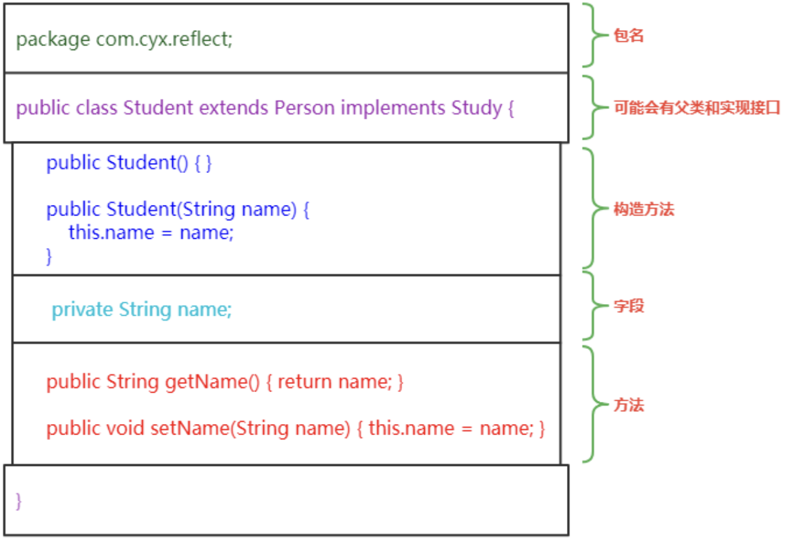

# 反射
## Class类
我们编写的 Java 程序先经过编译器编译，生成`class`文件，而`class`文件的执行场所是在 JVM 中，那么 JVM 如何存储我们编写的类的信息？

首先我们回想一下，一个类有哪些组成部分？

| ##container## |
|:--:|
||

如果要定义一个类来描述所有类的共有特征，应该如何来设计?

```java
public class Class {
    private String name;                // 类名
    private Package pk;                 // 包名
    private Constructor[] constructors; // 构造方法，因为可能存在多个，所以使用数组
    private Field[] fields;             // 字段，因为可能存在多个，所以使用数组
    private Method[] methods;           // 方法，因为可能存在多个，所以使用数组
    private Class<?> interfaces;        // 实现的接口，因为可能存在多个，所以使用数组
    private Class<?> superClass;        // 继承的父类
    
    // 省略getter/setter
}
```

为什么要设计这样的类？因为我们编写的程序从本质上来说也是文件， JVM 加载类的过程相当于对文件内容进行解析，解析内容就需要找到共有特征（`Class`类定义），然后再将这特征（使用`Class`对象）存储起来，在使用的时候再取出来。通过 Class 对象反向推到我们编写的类的内容，然后再进行操作，这个过程就称为反射。

在 JDK 中已经提供了这样的类: `java.lang.Class`， 因此，我们不需要再来设计，只需要学习它即可。

### 获取一个类对应的 Class 对象

如何获取一个类对应的 Class 对象呢？

```java
Class<类名> clazz = 类名.class;
Class<类名> clazz = 对象名.getClass();
Class<类名> clazz = clazz.getSuperClass();
Class clazz = Class.forName("类的全限定名"); // 类的全限定名=包名 + "." + 类名
Class<类名> clazz = 包装类.TYPE; // 包装类比如 Double, Long
```

### Class 类常用方法

```java
// --- 获取类的字段(成员变量) ---
// 获取类中使用public修饰的字段
public Field[] getFields() throws SecurityException;

// 获取类中定义的所有字段
public Field[] getDeclaredFields() throws SecurityException;

// 通过给定的字段名获取类中定义的字段
public Field getField(String name) throws NoSuchFieldException,
SecurityException;

// --- 获取类的方法 ---
// 获取类中使用public修饰的方法, 注: 此方法会把其父类的public方法也获取
public Method[] getMethods() throws SecurityException;

// 获取类中定义的所有方法
public Method[] getDeclaredMethods() throws SecurityException;

// --- 获取构造方法 ---
// 通过给定的方法名和参数列表类型获取类中定义的方法
public Method getDeclaredMethod(String name, Class<?>... parameterTypes) throws NoSuchMethodException, SecurityException;

// 获取类中使用public修饰的构造方法
public Constructor<?>[] getConstructors() throws SecurityException;

// 通过给定的参数列表类型获取类中定义的构造方法
public Constructor<T> getConstructor(Class<?>... parameterTypes) throws NoSuchMethodException, SecurityException;

// --- 获取类的信息 ---
// 获取类的全限定名
public String getName();

// 获取类所在的包
public Package getPackage();

// 判断该类是否是基本数据类型
public native boolean isPrimitive();

// 判断该类是否是接口
public native boolean isInterface();

// 判断该类是否是数组
public native boolean isArray();

// --- 绕过? ---
// 通过类的无参构造创建一个实例, 注: 前提是必须存在无参构造(无论是什么访问级别(如果是私有, 需要先修改其访问级别))
public T newInstance() throws InstantiationException, IllegalAccessException;
```

`java.lang.reflect.AccessibleObject`

```java
// 修改访问权限
public void setAccessible(boolean flag) throws SecurityException;
```

示例

```java
package com.HX.text;

import java.lang.reflect.Constructor;
import java.lang.reflect.Field;
import java.lang.reflect.InvocationTargetException;
import java.lang.reflect.Method;

class Stu {
    private String name;
    protected int age;

    protected static double fenSu;

    private Stu() {}

    public Stu(String name, int age) {
        this.name = name;
        this.age = age;
    }

    public int getAge() {
        return age;
    }

    public void setAge(int age) {
        this.age = age;
    }

    public String getName() {
        return name;
    }

    public void setName(String name) {
        this.name = name;
    }
}

public class ReflectionTest {
    public static void main(String[] args) {
        Class<Stu> clazz = Stu.class;
        System.out.println("全限定名: " + clazz.getName() + " | 所在包: " + clazz.getPackage() + " | 父类名: " + clazz.getSuperclass().getName());

        // --- 测试获取类的字段 ---
        ReflectionTest.getFieldText(clazz);

        // --- 测试获取类的构造方法 ---
        ReflectionTest.getConstructorText(clazz);

        // --- 测试获取类的方法 ---
        ReflectionTest.getMethodText(clazz);

        // --- 用反射做坏事(访问不能访问的东西) ---
        ReflectionTest.doBadText(clazz);
    }

    private static void doBadText(Class<Stu> clazz) {
        // 使用无参构造, 构造出一个对象的实例, 注: 前提是必须存在无参构造(无论是什么访问级别)
        try {
            System.out.println("\n干坏事:");
            // 私有的, 需要先修改访问权限
            Constructor<Stu> c = clazz.getDeclaredConstructor();
            c.setAccessible(true);
            Stu stu = c.newInstance();

            Field nameFun = clazz.getDeclaredField("name");
            nameFun.setAccessible(true);
            nameFun.set(stu, "张三"); // 给指定字段赋值

            Field ageFun = clazz.getDeclaredField("age");
            ageFun.setAccessible(true);
            ageFun.set(stu, 28);

            // --- 使用反射来使用方法 ---
            // getName -> get + N + ame
            String nameFunName = nameFun.getName();
            String methodName = "get" + nameFunName.substring(0, 1).toUpperCase() + nameFunName.substring(1);
            Method nameMethod = clazz.getDeclaredMethod(methodName);
            nameMethod.setAccessible(true);
            System.out.println(nameMethod.invoke(stu));

            // getAge -> get + A + ge
            String ageFunName = ageFun.getName();
            String methodName2 = "get" + ageFunName.substring(0, 1).toUpperCase() + ageFunName.substring(1);
            Method ageMethod = clazz.getDeclaredMethod(methodName2);
            ageMethod.setAccessible(true);
            System.out.println(ageMethod.invoke(stu));

        } catch (Exception e) { // 异常也太多了吧qwq...
            throw new RuntimeException(e);
        }
    }

    private static void getMethodText(Class<Stu> clazz) {
        {   // 获取所有方法
            Method[] methods = clazz.getDeclaredMethods();
            System.out.println("\n获取所有方法:");
            for (Method method : methods) {
                System.out.println("方法: " + method);
            }
        }

        {   // 获取所有public方法 [注: 此方法会把其父类的public方法也获取]
            Method[] methods = clazz.getMethods();
            System.out.println("\n获取所有public方法:");
            for (Method method : methods) {
                System.out.println("方法: " + method);
            }
        }

        {   // 获取指定方法 (需要指定参数列表(除非是无参))
            try {
                Method method = clazz.getDeclaredMethod("setName", String.class);
                System.out.println("\n获取指定方法:");
                System.out.println("方法: " + method);
            } catch (NoSuchMethodException e) {
                throw new RuntimeException(e);
            }
        }
    }

    private static void getConstructorText(Class<Stu> clazz) {
        {   // 获取所有构造方法
            Constructor<?>[] constructors = clazz.getDeclaredConstructors();
            System.out.println("\n获取所有构造方法:");
            for (Constructor<?> constructor : constructors) {
                System.out.println("方法: " + constructor.toString());
            }
        }

        {   // 获取所有public构造方法
            Constructor<?>[] constructors = clazz.getConstructors();
            System.out.println("\n获取所有public构造方法:");
            for (Constructor<?> constructor : constructors) {
                System.out.println("方法: " + constructor.toString());
            }
        }

        {   // 获取指定参数列表的构造方法
            Constructor<Stu> constructors;
            try {
                constructors = clazz.getDeclaredConstructor(String.class, int.class);
            } catch (NoSuchMethodException e) {
                throw new RuntimeException(e);
            }
            System.out.println("\n获取指定参数列表的构造方法:");

            System.out.println("方法: " + constructors.toString());
        }
    }

    private static void getFieldText(Class<Stu> clazz) {
        {   // 获取所有字段
            Field[] fields = clazz.getDeclaredFields();
            System.out.println("\n获取所有字段:");
            for (Field field : fields) {
                System.out.println(field.getType().getName() + " : " + field.getName());
            }
        }

        {   // 获取所有public字段
            Field[] fields = clazz.getFields();
            System.out.println("\n获取所有public字段:");
            for (Field field : fields) {
                System.out.println(field.getType().getName() + " : " + field.getName());
            }
        }

        {   // 获取指定名称的字段
            try {
                Field name = clazz.getDeclaredField("name");
                System.out.println("\n获取指定名称的字段:");
                System.out.println(name.getType().getName() + " : " + name.getName());
            } catch (NoSuchFieldException e) {
                throw new RuntimeException(e);
            }
        }
    }
}
```
