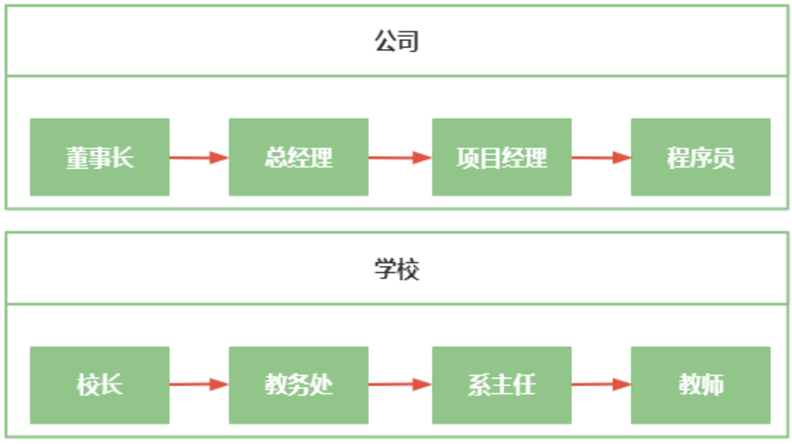

# 分层开发
## 第一节 生活中的分层
| ##container## |
|:--:|
||

由上图可以看出，公司和学校对职工都进行了分层，为什么要进行这样的分层呢?
- 分层后每一层只专注于自己所做的事情，能够提高作业质量
- 便于分工协作，提高作业效率
- 便于业务拓展
- 方便问题排查

这样的分层有什么特点呢？
- 上层制定任务，下层接受任务，上层安排下层做事，但下层不能安排上层做事
- 下层只需要汇报做事的结果，不需要汇报做事的过程

## 第二节 分层开发
### 三层结构
生活中的分层也可以应用于软件开发中，软件开发分层主要分为三层:
- 界面层，又称控制层（controller）
    - 与用户进行交互，主要负责数据采集和展示

- 业务逻辑层（service）
    - 负责处理功能模块的业务逻辑，以及界面层和数据访问层的数据流转

- 数据访问层（data access object =>`dao`）
    - 只负责与数据库进行交互

### 分层原则
软件分层开发也具有生活中分层的特点，这些特点被称之为分层原则:
- 封装性原则
    - 每层只向外公开接口，但隐藏了内部实现细节

- 顺序访问原则
    - 下层为上层服务，但下层不能使用上层服务

- 开闭原则
    - 对扩展开放，对修改关闭

### 分层的优点
软件分层开发的好处:
- 各层专注于自己所做的事情，便于提高开发质量
- 便于分工协作，提高开发效率
- 便于程序扩展
- 便于代码复用
- 易于维护

### 分层开发案例
使用分层开发完成用户注册与登录功能:

#### 目录结构
```dos
UserLoginSystem
│  UserLoginSystem.iml
│
└─src
    └─org
        └─hengxin
            └─UserLoginSystem
                ├─control
                │      UserControl.java
                │
                ├─dao
                │  │  UserDao.java
                │  │
                │  └─impl
                │          UserDaoImpl.java
                │
                ├─model
                │      User.java
                │
                ├─Service
                │  │  Service.java
                │  │
                │  └─impl
                │          ServiceImpl.java
                │
                ├─start
                │      startUp.java
                │
                └─Util
                        JdbcUtil.java
                        MD5.java
```

#### 启动类

```java
package org.hengxin.UserLoginSystem.start;

import org.hengxin.UserLoginSystem.control.UserControl;

import java.util.Scanner;

public class startUp {
    static final Scanner sc = new Scanner(System.in);

    public static void main(String[] args) {
        UserControl userControl = new UserControl();
        System.out.println("请选择功能 [1]注册, [2]登录 :");
        int xz = sc.nextInt();
        if (xz == 1) {
            System.out.println("请输入注册的账号:");
            String username = sc.next();
            System.out.println("请输入注册账号的密码:");
            String password = sc.next();
            System.out.println(userControl.register(username, password));
        } else {
            System.out.println("请输入登录的账号:");
            String username2 = sc.next();
            System.out.println("请输入登录账号的密码:");
            String password2 = sc.next();
            System.out.println(userControl.login(username2, password2));
        }
    }
}
```

#### 界面层

```java
package org.hengxin.UserLoginSystem.control;

import org.hengxin.UserLoginSystem.Service.Service;
import org.hengxin.UserLoginSystem.Service.impl.ServiceImpl;

/**
 * 控制层, 界面层
 */
public class UserControl {
    Service service = new ServiceImpl();

    public String register(String username, String password) {
        return service.register(username, password);
    }

    public String login(String username, String password) {
        return service.login(username, password);
    }
}
```

#### 业务逻辑层
##### 接口
```java
package org.hengxin.UserLoginSystem.Service;

/**
 * 业务逻辑层接口
 */
public interface Service {
    String register(String username, String password);
    String login(String username, String password);
}
```

##### 接口的实现

```java
package org.hengxin.UserLoginSystem.Service.impl;

import org.hengxin.UserLoginSystem.Service.Service;
import org.hengxin.UserLoginSystem.Util.MD5;
import org.hengxin.UserLoginSystem.dao.UserDao;
import org.hengxin.UserLoginSystem.dao.impl.UserDaoImpl;
import org.hengxin.UserLoginSystem.model.User;

/**
 * 具体业务层类 Impl表示对接口的实现
 */
public class ServiceImpl implements Service {
    UserDao userDao = new UserDaoImpl();
    @Override
    public String register(String username, String password) {
        String encryptionKey = MD5.randomStr(18);
        password = MD5.encrypt(password, encryptionKey);
        // 对密码进行加密
        return userDao.register(username, password, encryptionKey) > 0 ? "注册成功" : "注册失败";
    }

    @Override
    public String login(String username, String password) {
        User user = userDao.login(username);
        if (user == null)
            return "用户名不存在";

        return user.getPassword().equals(MD5.encrypt(password, user.getEncryptionKey())) ? "登录成功" : "账号或密码错误, 登录失败";
    }
}
```

#### 数据层
##### 接口
```java
package org.hengxin.UserLoginSystem.dao;

import org.hengxin.UserLoginSystem.model.User;

public interface UserDao {
    int register(String username, String password, String encryptionKey);

    User login(String username);
}
```

##### 接口实现

```java
package org.hengxin.UserLoginSystem.dao.impl;

import org.hengxin.UserLoginSystem.Util.JdbcUtil;
import org.hengxin.UserLoginSystem.dao.UserDao;
import org.hengxin.UserLoginSystem.model.User;

import java.util.List;

/**
 * 数据访问层
 */
public class UserDaoImpl implements UserDao {
    @Override
    public int register(String username, String password, String encryptionKey) {
        String sql = "INSERT INTO user (`username`, `password`, `encryptionKey`) VALUES (?, ?, ?)";
        return JdbcUtil.update(sql, username, password, encryptionKey);
    }

    @Override
    public User login(String username) {
        String sql = "SELECT `username`, `password`, `encryptionKey` FROM user WHERE `username` = ?";
        List<User> user = JdbcUtil.select(sql, User.class, username);
        return user.size() == 0 ? null : user.get(0);
    }
}
```

#### 工具类

数据库访问的(略->([反射与数据库](../003-反射与数据库/index.md)))
##### MD5加密
```java
package org.hengxin.UserLoginSystem.Util;

import java.security.MessageDigest;
import java.security.NoSuchAlgorithmException;
import java.util.Base64;
import java.util.Random;

public class MD5 {
    private static final char[] chars = {
            'a','b','c','d','e','f','g','h','i','j','k','l',
            'm','n','o','p','q','r','s','t','u','v','w','x',
            'y','z','0','1','2','3','4','5','6','7','8','9'
    };

    /**
     * 生成一个长度为 length 的密匙字符串
     * @param length 生成的字符串长度
     * @return 密匙字符串
     */
    public static String randomStr(int length){
        Random r = new Random();
        StringBuilder sb = new StringBuilder();
        for(int i = 0; i < length; ++i){
            int index = r.nextInt(chars.length);
            sb.append(chars[index]);
        }
        return sb.toString();
    }

    /**
     * 对 password 进行 加密, 和 secret 进行组合
     * @param password
     * @param secret
     * @return 加密后的密码
     */
    public static String encrypt(String password, String secret){
        try {
            MessageDigest md5 = MessageDigest.getInstance("MD5");
            int len1 = password.length();
            int len2 = secret.length();
            String str = password.substring(0, len1) + secret.substring(0, len2) + password.substring(len1) + secret.substring(len2);
            byte[] data = str.getBytes();
            byte[] result = md5.digest(data);
            return Base64.getEncoder().encodeToString(result);
        } catch (NoSuchAlgorithmException e) {
            e.printStackTrace();
        }
        return "";
    }
}
```

#### 存储数据的对象
`User`类, 有`username`, `password`, `encryptionKey` 以及提供`get/set`方法罢了, 用于兼容数据库读取时候的代码.