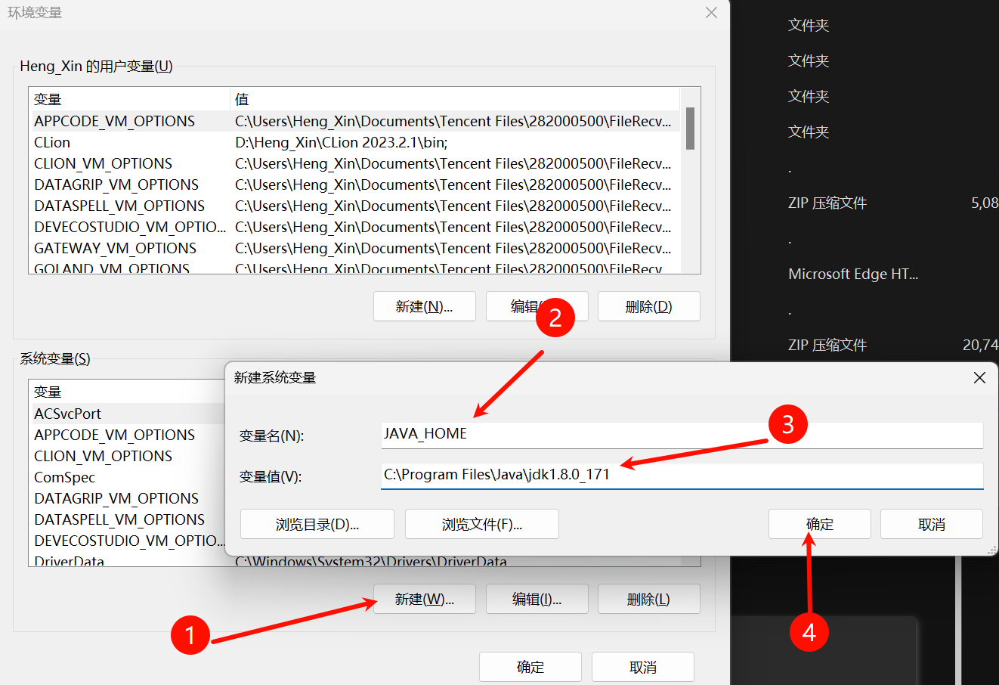
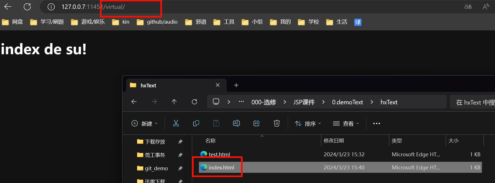
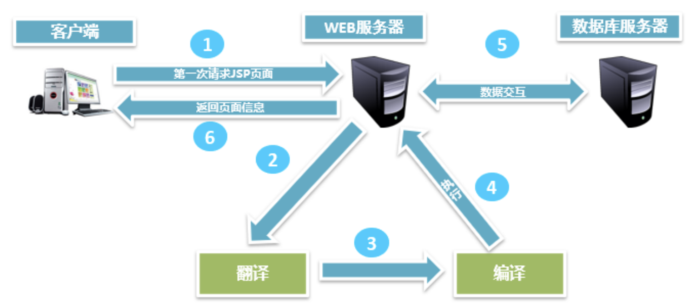

<style>
/* Markdown风格的样式 */

/* h1的样式 */
h1 {
    color: yellow;
    margin-top: 1.5em; /* 顶部间距 */
    margin-bottom: 0.5em; /* 底部间距 */
}

/* h2的样式 */
h2 {
    color: rgb(100,233,233);
    margin-top: 1.25em; /* 顶部间距 */
    margin-bottom: 0.5em; /* 底部间距 */
}

/* h3的样式 */
h3 {
    color: rgb(250, 100, 200);
    margin-top: 1.25em; /* 顶部间距 */
    margin-bottom: 0.5em; /* 底部间距 */
}

/* h4的样式 */
h4 {
    color: rgb(75,250,75);
    margin-top: 1.25em; /* 顶部间距 */
    margin-bottom: 0.5em; /* 底部间距 */
}

/* 段落样式 */
p {
    margin-top: 1em; /* 顶部间距 */
    margin-bottom: 1em; /* 底部间距 */
    text-indent: 1.5em; /* 首行缩进 */
}
</style>

# JSP 入门
## 程序结构
互联网发展到现在出现过两种结构：C/S 结构 和 B/S 结构

### C/S 结构介绍
C/S 是 Client/Server 的简称，C/S 结构在技能上非常成熟，它的重要特征就是交互性强、拥有安全的存取形式、网络通信数量低、响应速度快、利于处置大量数据。

- 优点：
    - 优秀的处理能力，很多工作能够在客户端处理后再提交给服务器，减少了服务器端的开销，因此，C/S 结构的客户端响应速度快
    - 操作界面漂亮、形式多样，能够足够满足客户自己的个性化要求
    - 安全性能能够非常容易确保，能够对权限实行多层次校验，对信息安全的控制能力非常强
- 缺点：
    - 需要安装客户端程序，分布功能弱
    - 兼容性差

### B/S 结构介绍
B/S 是 Browser/Server 的简称，就是只安装维护一个服务器，而客户端选用浏览器运行软件。B/S 结构应用程序相对于传统的 C/S 结构应用程序就是一个特别大的进步。 B/S 结构的重要特征就是分布性强、维护方便、开发简单并且共享性强、总体拥有费用低
- 优点：
    - 分布性强。只需有网络、浏览器，能够随时随地实行查询、浏览等业务处理。
    - 业务扩展简单便利，通过添加网页就可以添加服务器功能。
    - 维护简单便利，只须要更改网页，就可以完成全部用户的同步更新。
    - 开发简单，共享性强。
- 缺点：
    - 个性化特征明显减少，难以完成拥有个性化的功能要求。
    - 在跨浏览器上，B/S 结构不尽如人意。
    - 在速度与安全性上须要花费超大的设计费用。

## Web 服务器
### Web 服务器概念
Web服务器是可以向发出请求的浏览器提供文档的<b style="color:red">程序</b>，主要提供网上的信息浏览服务

### 常见Web服务器
- `IIS` ( Micro Soft )
- `Tomcat` ( Apache )
- `WebLogic` ( Oracle )
- `WebSphere` ( IBM )
- `Nginx`
- ...

## Tomcat 服务器
Tomcat 是 Apache 软件基金会(Apache Software Foundation)的 Jakarta 项目中的一个核心项目，由 Apache、Sun 和其他一些公司及个人共同开发而成。Tomcat 服务器是一个免费的开放源代码的 Web 应用服务器，属于轻量级应用服务器，在中小型系统和并发访问用户不是很多的场合下被普遍使用，是开发和调试 JSP 程序的首选。

### Tomcat 服务器安装
解压: `apache-tomcat-9.0.48.zip` [下载](https://tomcat.apache.org/download-90.cgi)

### Tomcat 目录结构

| 目录    | 说明                                           |
|--------|------------------------------------------------|
| /bin    | 存放各种平台下用于启动和停止Tomcat的脚本文件     |
| /conf   | 存放Tomcat服务器的各种配置文件                   |
| /lib    | 存放Tomcat服务器所需的各种JAR文件                |
| /logs   | 存放Tomcat的日志文件                            |
| /temp   | Tomcat运行时用于存放临时文件                      |
| /webapps| 当发布Web应用时，默认情况下会将Web应用的文件存放于此目录中 |
| /work   | Tomcat把由JsP生成的Servlet放于此目录下            |

### 部署第一个应用
在 webapps 文件夹下创建一个文件夹 hxApp，编写一个 hx.html ，然后放入 hxApp 文件夹

```html
<!DOCTYPE html>
<html lang="en">
<head>
    <meta charset="UTF-8">
    <meta name="viewport" content="width=device-width, initial-scale=1.0">
    <title>HX HTML</title>
</head>
<body>
    <h1>您好, 小东西</h1>
</body>
</html>
```

#### 启动 Tomcat 服务器
进入 bin 目录， 然后 双击 `startup.bat`，启动 Tomcat 服务器

注: 如果报错:
```error
Neither the JAVA_HOME nor the JRE_HOME environment variable is defined
At least one of these environment variable is needed to run this program
```

则新建一个环境变量的系统变量 `JAVA_HOME`



然后再去`path`配置 `%JAVA_HOME%\bin`

然后再次启动即可

#### 访问 Tomcat 服务器
在浏览器地址栏输入网址 http://127.0.0.7:8080/hxApp/hx.html 进行访问

这个网址有一个专业的名称，叫做 <b style="color:red">统一资源定位符</b>

统一资源定位符包含了以下三部分：
- 协议
    - 比如 http
- 主机地址
    - localhost、127.0.0.1 都是表本机，可以用来代替本机的IP地址
    - 主机地址包括了主机 IP 地址和端口号，比如 IP 地址 localhost ，端口号 8080
- 资源地址
    - 比如 hxApp/hx.html

#### 关闭 Tomcat 服务器
进入 bin 目录， 然后 双击 shutdown.bat ，关闭 Tomcat 服务器 (直接关闭启动.bat也可以)

## Tomcat 配置
### 端口号配置
进入`conf`文件夹，找到`server.xml`文件，使用文本编辑器打开，找到如下内容

```xml
<Connector port="8080"
           protocol="HTTP/1.1"
           connectionTimeout="20000"
           redirectPort="8443" />
```

- 解释说明:
    - `port`
        - 端口号，默认配置为8080，可修改
    - `protocol`
        - Tomcat 服务器使用的协议，默认配置为HTTP协议，HTTP协议版本为1.1
    - `connectionTimeout`
        - 访问 Tomcat 时，连接的超时时间，默认配置为20000毫秒
    - `redirectPort`
        - 重定向端口，默认配置为8443，主要是针对于访问 Tomcat 服务器上的资源时，如果该资源需要使用 HTTPS 访问，此时，Tomcat 会将这个请求重定向到8443端口

### 虚拟路径配置
#### 资源准备
在任一磁盘上（比如 D 盘）创建资源文件夹 hxText， 然后编写一个 test.html ，将其放入 hxText 文件夹中。

```html
<!DOCTYPE html>
<html lang="en">
<head>
    <meta charset="UTF-8">
    <meta name="viewport" content="width=device-width, initial-scale=1.0">
    <title>HX 虚拟路径</title>
</head>
<body>
    <h1>虚拟路径</h1>
</body>
</html>
```

#### 虚拟路径配置
进入 conf 文件夹，找到 server.xml 文件，使用文本编辑器打开，找到如下内容

```xml
<Valve className="org.apache.catalina.valves.AccessLogValve" directory="logs"
       prefix="localhost_access_log" suffix=".txt"
       pattern="%h %l %u %t &quot;%r&quot; %s %b" />
```

在 `<host></Host>` 标签对之间添加如下内容

```xml
<Context path="/virtual" docBase="D:/command/小组/04-01大学/000-选修/JSP课件/0.demoText/hxText"/>
```

意思是 使用 `/virtual` 这个虚拟路径 代替 `D:/command/小组/04-01大学/000-选修/JSP课件/0.demoText/hxText` 这个路径

然后启动 Tomcat 服务器

#### 访问测试
在浏览器地址栏输入 http://127.0.0.7:11451/virtual/test.html 进行访问 (此处我把8080端口换成11451了)

### web.xml 配置
#### 会话超时配置
```xml
<session-config>
    <!--这里的单位是分钟-->
    <session-timeout>30</session-timeout>
</session-config>
```

会话指的是用户访问 Tomcat 服务器的有效时间。比如，当用户登录某网站后，30分钟内，没有进行任何操作，此时，用户与该网站的会话已经超时。如果再进行页面操作，那么服务器将提示用户重新登录。

#### 欢迎页配置
```xml
<welcome-file-list>
    <welcome-file>index.html</welcome-file>
    <welcome-file>index.htm</welcome-file>
    <welcome-file>index.jsp</welcome-file>
</welcome-file-list>
```

所谓的欢迎页就是当用户访问 Tomcat 服务器资源时，没有对任何资源进行定位，此时，Tomcat 将使用配置的欢迎页进行展示

例如: (*前提是`index.html`必须存在*)

| ##container## |
|:--:|
||

## IDEA 创建 Web 工程

- 2023部署工程的方法: ~~[2023.3 Idea配置Tomcat环境](https://www.cnblogs.com/bktown/p/17636156.html)~~
- 使用这个(上面那个是lj, 被坑惨啦): [详解Tomcat下载安装以及IDEA配置Tomcat（2023最新）](https://blog.csdn.net/m0_48170265/article/details/129073985) 

## 初识 JSP
### JSP 概念
JSP 是 Java Server Pages 的简称，意为 Java 服务器页面。其支持 Java 代码与 HTML 代码混合使用来完成页面的编写。

### JSP page 指令
语法
```jsp
<%@ page 属性名="属性值" [属性名="属性值" 属性名="属性值"]%>
```

常用属性:

| 属性         | 描述                               | 默认值            |
|--------------|------------------------------------|-------------------|
| language     | 指定JSP页面使用的脚本语言           | java              |
| import       | 通过该属性来引用脚本语言中使用到的类 | 无                |
| contentType  | 用来指定JSP页面所采用的编码方式     | text/html;charset=UTF-8 |

### JSP 小脚本
小脚本代码的定义语法
```jsp
<%
// 小脚本代码
%>
```

小脚本方法的定义语法
```jsp
<% !
//小脚本方法
%>
```

小脚本中的变量引用语法
```jsp
<%= 变量名或者表达式 %>
```

示例
```jsp
<%@ page import="java.text.SimpleDateFormat" %>
<%@ page import="java.util.Date" %><%--
  Created by IntelliJ IDEA.
  User: Heng_Xin
  Date: 2024/3/23
  Time: 16:05
  To change this template use File | Settings | File Templates.
--%>
<%@ page contentType="text/html;charset=UTF-8" language="java" %>
<html>
<head>
    <title>index</title>
</head>
<body>
    您好, 今天是
<%!
    String date2Str(Date date) {
        return (new SimpleDateFormat("yy-MM-dd")).format(new Date());
    }
%>
<%=date2Str(new Date())%><br>

输出1-10
<%
    for (int i = 0; i < 10; ++i) {
%>
<div><%=i%></div>
<%
//        Thread.sleep(100); 画面不是动态的, 是加载一次然后传输静态的
    }
%>

</body>
</html>
```

### JSP 的交互流程
JSP 文件在第一次被访问时会被翻译成 java 文件，然后被编译为 class 文件才能被执行，编译好的class文件可以被重用

| ##container## |
|:--:|
||
