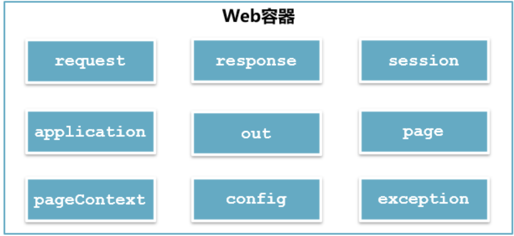

<style>
/* Markdown风格的样式 */

/* h1的样式 */
h1 {
    color: yellow;
    margin-top: 1.5em; /* 顶部间距 */
    margin-bottom: 0.5em; /* 底部间距 */
}

/* h2的样式 */
h2 {
    color: rgb(100,233,233);
    margin-top: 1.25em; /* 顶部间距 */
    margin-bottom: 0.5em; /* 底部间距 */
}

/* h3的样式 */
h3 {
    color: rgb(250, 100, 200);
    margin-top: 1.25em; /* 顶部间距 */
    margin-bottom: 0.5em; /* 底部间距 */
}

/* h4的样式 */
h4 {
    color: rgb(75,250,75);
    margin-top: 1.25em; /* 顶部间距 */
    margin-bottom: 0.5em; /* 底部间距 */
}

/* 段落样式 */
p {
    margin-top: 1em; /* 顶部间距 */
    margin-bottom: 1em; /* 底部间距 */
    text-indent: 1.5em; /* 首行缩进 */
}
</style>

# JSP 内置对象
## JSP 内置对象的概念
JSP 内置对象是 Web 容器创建的一组对象，在页面中可以直接使用。 JSP 常用内置对象入下图所示:

| ##container## |
|:--:|
||

## 内置对象 out
### out 对象的数据类型
`javax.servlet.jsp.JspWriter`

### 作用
向Web浏览器内输出信息，负责管理对客户端的输出

### 用法
```js p
<%
// 在页面上输出Hello JSP (标签也是可以的, 不局限于文本)
out.println("<h1>Hello JSP</h1>");
%>
```

## 内置对象 request
### request 对象的数据类型
`javax.servlet.http.HttpServletRequest`

### 作用
获取**客户端**的参数和数据流

### 常用方法
```js p
// 根据表单组件名称获取提交数据
String getParameter(String name);
// 获取表单组件对应多个值时的请求数据
String[] getParameterValues(String name);
// 指定请求的编码
void setCharacterEncoding(String charset);
// 返回一个RequestDispatcher对象，该对象的forward()方法用于[转发请求]
RequestDispatcher getRequestDispatcher(String path);
// 获取客户端cookie
Cookie[] getCookies();
// 获取请求中所有参数和参数值的映射
Map<String,String[]> getParameterMap();
// 获取当前会话
HttpSession getSession();
```

### 案例
使用内置对象 request 完成注册信息显示

`register.jsp`
```html (jsp)
<form action="info.jsp" method="post">
    <div><span>用户名</span><input type="text" name="username"></div>
    <div><span>密码</span><input type="password" name="password"></div>
    <div>
        <span>信息来源</span>
        <input type="checkbox" name="channel" value="报刊">报刊
        <input type="checkbox" name="channel" value="网络">网络
        <input type="checkbox" name="channel" value="朋友推荐">朋友推荐
        <input type="checkbox" name="channel" value="电视"> 电视
    </div>
    <div>
        <input type="submit" value="注册">
        <input type="reset" value="重置">
    </div>
</form>
```

`info.jsp`
```js p
<%
    request.setCharacterEncoding("UTF-8"); // 防止出现中文乱码
    String name = request.getParameter("username"); // 获取参数username的值
    String password = request.getParameter("password"); // 获取参数password的值
    String[] channels = request.getParameterValues("channel"); // 获取参数channel的值
    String channelInfo = Arrays.toString(channels);
%>

<div><%=name%></div>
<div><%=password%></div>
<div><%=channelInfo%></div>
```

跳转后的页面中显示呈现乱码，如何解决呢？
在小脚本的第一行代码前面添加如下代码:
```js p
// 在从请求中获取参数值之前，先对该请求的字符集编码进行设置
request.setCharacterEncoding("UTF-8");
```

再次测试，显示正常。但如果将 form 表单的提交方式修改为 get ，再测试，又出现了乱码，这如何解释呢？

这是因为`request.setCharacterEncoding("UTF-8");`只能解决 post 请求方式的出现的乱码，而get 请求方式的乱码需要使用字符串转码的方式来解决。

```js p
// 使用字符串的构造方法进行转码
字符串 = new String(字符串.getBytes("ISO-8859-1"), "UTF-8");
```

### GET 和 POST 请求的区别
- GET 请求的参数在URL中，而 POST 请求的参数在请求体（body）中
- GET 请求有数据长度限制，这个长度限制是浏览器或者服务器为了提升处理效率而做出的限制，而 POST 请求没有。
- GET 请求的安全性低，因为参数在URL中，直接暴露了信息，而 POST 请求的安全性高，因为POST 请求的参数在请求体（body）中，隐藏了信息

## 内置对象 response
### response 对象的数据类型
`javax.servlet.http.HttpServletResponse`

### 作用
对客户端请求做出响应

### 常用方法
```js p
// 添加cookie
void addCookie(Cookie c);
// 重新定位新的资源，也叫重定向
void sendRedirect(String url);
// 设置响应状态码
void setStatus(int status);
// 获取打印流，主要用于向页面传输数据
PrintWriter getWriter();
// 获取输出流，主要用于图片传输、下载等功能
ServletOutputStream getOutputStream();
// 设置向页面输出的数据的字符集编码
void setCharacterEncoding(String charset);
```

### 案例
实现登录页面跳转功能，并在跳转的页面中显示登录信息
`login.jsp`
```html (jsp)
<form action="process.jsp" method="post">
    <div>
        <span>账号</span>
        <input type="text" name="username">
    </div>
    <div>
        <span>密码</span>
        <input type="password" name="password">
    </div>
    <input type="submit" value="登录">
</form>
```

`process.jsp`
```js p
<%
    request.setCharacterEncoding("UTF-8"); // 防止出现中文乱码
    String name = request.getParameter("username");//获取参数username的值
    String password = request.getParameter("password");//获取参数password的值

    if ("heng_xin".equals(name) && "123456".equals(password)) {
        // 登录成功
        response.sendRedirect("info.jsp"); // info代码写在上面了
    }
    else {
        out.println("<h1>账号或密码错误</h1>");
    }
%>
```

访问`login.jsp`，然后点击 登录 按钮，查看地址栏信息与页面信息。

地址栏信息发生了变化，说明重定向发生在客户端，相当于客户端再发了一次请求，重新定位了新的资源。由于这次请求是新的请求，与之前的登录请求完全独立，因此页面信息中展示全是`null`

**思考：如何才能将登录信息在跳转的页面中显示呢？**

可以通过请求转发来实现，修改`process.jsp`:
```js p
if ("heng_xin".equals(name) && "123456".equals(password)) {
      // 登录成功 转发
      request.getRequestDispatcher("info.jsp").forward(request, response);
}
```

访问 `login.jsp`，然后点击 登录 按钮，查看地址栏信息与页面信息。地址栏信息未发生变化，而页面进行了跳转，说明转发发生在服务器，由服务器完成。转发后，页面能够展示登录信息，说明转发可以共享请求的参数

即 
- a界面 -> b界面(重定向) -> c界面
- a界面 -> (跳转) -> c界面

## 内置对象 session
### session 的概念
session 就是浏览器与服务器之间的一次通话

### 为什么会有 session
`HTTP`协议是一种无状态协议，用户在访问服务器时，服务器无法感知到用户是哪一个用户，也就无法追踪用户的后续操作。为了解决这一问题，服务器端设计了一个类`HttpSession`来感知用户，这个类产生的对象就是`session`。在用户第一次访问服务器时，服务器就会为该用户生成了一个`session`对象，`session`对象一产生就会生成了一个唯一标识符`JSESSIONID`，并将这个唯一标识符使用Cookie存储在浏览器中，用户后续进行的每一个操作都将携带这个唯一标识符，服务器就根据这个唯一标识符追踪用户。`session`对象产生时就有一个过期时间，主要用于检测用户是否还在进行有效的操作。如果用户具有有效的操作，那么每一次用户的有效操作都将重置该`session`的过期时间。这个过期时间就是检测用户登录超时的依据。除此之外，`session`还可以存储数据。

### session 对象的数据类型
`javax.servlet.http.HttpSession`

### 常用方法
```js p
// 以key/value的形式保存对象值
void setAttribute(String key, Object value);
// 通过key获取对象值
Object getAttribute(String key);
// 设置session对象失效
void invalidate();
// 获取sessionid
String getId();
// 设定session的非活动时间(以秒为单位)
void setMaxInactiveInterval(int interval);
// 获取session的有效非活动时间(以秒为单位)
int getMaxInactiveInterval();
// 从session中删除指定名称(key)所对应的对象
void removeAttribute(String key);
```

### 案例
使用 session 完成登录成功后页面显示登录信息，要求登录处理使用重定向。
```js p
<%
    request.setCharacterEncoding("UTF-8"); // 防止出现中文乱码
    String name = request.getParameter("username");//获取参数username的值
    String password = request.getParameter("password");//获取参数password的值

    if ("heng_xin".equals(name) && "123456".equals(password)) {
        // 登录成功
        session.setAttribute("name", name);
        session.setAttribute("password", password);
        response.sendRedirect("info.jsp"); // 使用重定向
//        request.getRequestDispatcher("info.jsp").forward(request, response);
    }
    else {
        out.println("<h1>账号或密码错误</h1>");
    }
%>
```

`info.jsp`
```js p
<%
    // 记得要转化类型
    request.setCharacterEncoding("UTF-8"); // 防止出现中文乱码
    String name = (String) session.getAttribute("name");//获取参数username的值
    String password = (String) session.getAttribute("password");//获取参数password的值
%>

<div><%=name%></div>
<div><%=password%></div>
```

## include 指令
语法
```jsp
<%@ include file="文件名" %>
```

在开发过程中，开发的页面数量总是很多，如何确保用户的每一次操作都是有效操作呢？所谓的有效操作是指在登录没有超时的情况下进行的操作。

可以编写一个检测登录超时的页面，然后使用`include`指令引入至每一个页面中

`timeout.jsp`

```js p
<%
    if (session.getAttribute("name") == null) {
        response.sendRedirect("login.jsp");
    }
%>
```

`info.jsp`
```jsp
<%@include file="timeout.jsp"%>
```

### session 超时设置
#### 第一种方式: Tomcat 中的 web.xml
```xml
<session-config>
    <!-- 单位：分钟 -->
    <session-timeout>30</session-timeout>
</session-config>
```

#### 第二种方式: 工程中的 web.xml
```xml
<session-config>
    <!-- 单位：分钟 (优先级比Tomcat 中的 web.xml高) -->
    <session-timeout>30</session-timeout>
</session-config>
```

#### 第三种方式: Java 代码实现
```js p
// 设置会话超时时间，单位：秒
session.setMaxInactiveInterval(15 * 60); // 15min
```

## 内置对象 application
### application 对象的数据类型
`javax.servlet.ServletContext`

### 作用
实现用户数据共享，将信息保存在服务器中，直到服务器关闭

### 常用方法
```js p
// 以key/value的形式保存对象值
void setAttribute(String key,Object value);
// 通过key获取对象值
Object getAttribute(String key);
// 返回相对路径的真实路径
String getRealPath(String path);
```

### 案例
统计网站访问次数
`statistics.jsp`
```js p
<%
    Integer conut = (Integer) application.getAttribute("count");
    application.setAttribute("count", conut == null ? 0 : ++conut);
%>
<h1>访问量: <%=conut%></h1>
```

## Cookie
### 什么是 Cookie
Cookie 是 Web 服务器保存在客户端的一系列文本信息。Session 机制采用的是在服务端保持状态的方案，而Cookie 机制则是在客户端保持状态的方案，Cookie 又叫`会话跟踪机制`，用来弥补HTTP无状态协议的不足

### Cookie 的作用
- 弥补HTTP无状态协议的不足
- 简化登录，比如记住密码、自动登录等

### 常用方法
```js p
// 构造方法
Cookie cookie = new Cookie("名称", "值");
// 设置cooki的有效期，以秒为单位
void setMaxAge(int expiry);
// 在cookie创建后，对cookie进行赋值
void setValue(String value);
// 获取cookie的名称
String getName();
// 获取cookie的值
String getValue();
// 获取cookie的有效时间，以秒为单位
String getMaxAge();
```

### 案例
使用 Cookie 完成记住账号和密码功能

`login.jsp`
```jsp
<%
    String name = "";
    String password = "";
    String checked = "";
    Cookie[] cookies = request.getCookies();
    if (cookies != null) {
        for (Cookie it : cookies) {
            if ("name".equals(it.getName())) {
                name = URLDecoder.decode(it.getValue(), "utf-8");
                checked = "checked";
            } else if ("password".equals(it.getName())) {
                password = it.getValue();
            }
        }
    }
%>

<body>
    <form action="process.jsp" method="post">
        <div>
            <span>账号</span>
            <input type="text" name="username" value="<%=name%>">
        </div>
        <div>
            <span>密码</span>
            <input type="password" name="password" value="<%=password%>">
        </div>
        <div>
            <label>
                <input type="checkbox" name="rememberMe" checked="<%=checked%>"/>记住我
            </label>
        </div>
        <input type="submit" value="登录">
    </form>
</body>
```

`process`
```js p
<%
    request.setCharacterEncoding("UTF-8");              // 防止出现中文乱码
    String name = request.getParameter("username");     // 获取参数username的值
    String password = request.getParameter("password"); // 获取参数password的值

    if ("heng_xin".equals(name) && "123456".equals(password)) {
        // 登录成功
        Cookie c_name = new Cookie("name", URLEncoder.encode(name, "utf-8"));
        Cookie c_password = new Cookie("password", URLEncoder.encode(password, "utf-8"));
        String rememberMe = request.getParameter("rememberMe"); // on 或者 null
        if (rememberMe != null) {
            // 记住密码
            c_name.setMaxAge(7 * 24 * 60 * 60);
            c_password.setMaxAge(7 * 24 * 60 * 60);
        } else {
            c_name.setMaxAge(0);
            c_password.setMaxAge(0);
        }

        // 输出到客户端
        response.addCookie(c_name);
        response.addCookie(c_password);
        session.setAttribute("name", name);
        session.setAttribute("password", password);
        session.setMaxInactiveInterval(3);
        response.sendRedirect("info.jsp");
//        request.getRequestDispatcher("info.jsp").forward(request, response);
    }
    else {
        out.println("<h1>账号或密码错误</h1>");
    }
%>
```