<style>
/* Markdown风格的样式 */

/* h1的样式 */
h1 {
    color: yellow;
    margin-top: 1.5em; /* 顶部间距 */
    margin-bottom: 0.5em; /* 底部间距 */
}

/* h2的样式 */
h2 {
    color: rgb(100,233,233);
    margin-top: 1.25em; /* 顶部间距 */
    margin-bottom: 0.5em; /* 底部间距 */
}

/* h3的样式 */
h3 {
    color: rgb(250, 100, 200);
    margin-top: 1.25em; /* 顶部间距 */
    margin-bottom: 0.5em; /* 底部间距 */
}

/* h4的样式 */
h4 {
    color: rgb(75,250,75);
    margin-top: 1.25em; /* 顶部间距 */
    margin-bottom: 0.5em; /* 底部间距 */
}

/* 段落样式 */
p {
    margin-top: 1em; /* 顶部间距 */
    margin-bottom: 1em; /* 底部间距 */
    text-indent: 1.5em; /* 首行缩进 */
}
</style>

# Servlet 与 MVC
<div style="font-size:32px; text-align: center; color: red;">目标</div>

- 掌握 Servlet 的作用
- 掌握 Servlet 的生命周期
- 掌握 JSP 的本质
- 掌握 MVC 的设计思想
- 掌握 Filter 的作用及使用场景

# Servlet
## Servlet 概念
Servlet 是在服务器上运行的能够对客户端请求进行处理，并返回处理结果的程序

## Servlet 体系结构
| ##container## |
|:--:|
|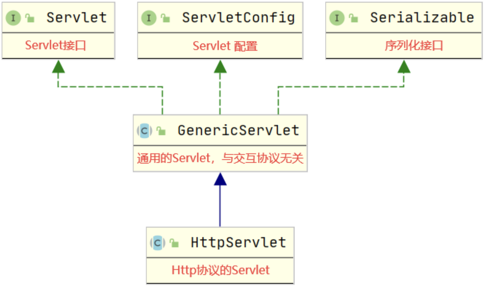|

### Servlet 接口

```java
// Servlet对象的初始化，Servlet 对象初始化后才能处理请求，由 Servlet 容器调用
public void init(ServletConfig config) throws ServletException;
// 获取Servlet配置信息
public ServletConfig getServletConfig();
// 处理客户端的请求，由 Servlet 容器调用
public void service(ServletRequest req, ServletResponse res) throws ServletException, IOException;
// 返回有关 Servlet 的信息，比如作者、版本和版权
public String getServletInfo();
// 销毁Servlet，由 Servlet 容器调用
public void destroy();
```

### ServletConfig 接口
```java
// 获取Servlet的实例名称
public String getServletName();
// 返回正在执行的Servlet所在的上下文对象
public ServletContext getServletContext();
// 获取Servlet中给定名称的初始化参数
public String getInitParameter(String name);
// 获取Servlet中所有的初始化参数
public Enumeration<String> getInitParameterNames();
```

## Servlet 案例
- 编写Servlet, 注意需要添加外部jar包: `Tomcat的lib的编写servlet-api.jar`
  ```java
  package com.HX.jsp.servlet;
  
  import javax.servlet.*;
  import java.io.IOException;
  import java.util.Enumeration;
  
  public class HXServlet implements Servlet {
  
      private ServletConfig servletConfig;

      public HXServlet() {
          System.out.println("构造了 HXServlet 对象");
      }
  
      /**
       * 通过配置文件进行初始化
       * @param config
       * @throws ServletException
       */
      @Override
      public void init(ServletConfig config) throws ServletException {
          System.out.println("HXServlet 进行了初始化");
          this.servletConfig = config;
          String servletName = servletConfig.getServletName();
          System.out.println("servlet 实例名称: " + servletName);
          // 获取 servlet 中所有初始化参数
          Enumeration<String> initParameterNames = config.getInitParameterNames();
          while (initParameterNames.hasMoreElements()) {
              String nextElement = initParameterNames.nextElement();
              // 获取 servlet 中 给定名称的初始化参数
              String initParameterValue = config.getInitParameter(nextElement);
              System.out.println("servlet 初始化参数: " + nextElement + ": " + initParameterValue);
          }
      }
  
      /**
       * 获取配置文件
       * @return
       */
      @Override
      public ServletConfig getServletConfig() {
          return this.servletConfig;
      }
  
      /**
       * 处理客户浏览器的请求
       * @param request
       * @param response
       * @throws ServletException
       * @throws IOException
       */
      @Override
      public void service(ServletRequest request, ServletResponse response) throws ServletException, IOException {
          System.out.println("处理了请求");
      }
  
      /**
       * 获取开发者等信息
       * @return
       */
      @Override
      public String getServletInfo() {
          return "By Heng_Xin";
      }
  
      /**
       * 释放资源
       */
      @Override
      public void destroy() {
          System.out.println("资源被释放啦~");
      }
  }
  ```
- 配置项目的`web.xml`
  ```xml
  <?xml version="1.0" encoding="UTF-8"?>
  <web-app xmlns="http://xmlns.jcp.org/xml/ns/javaee"
           xmlns:xsi="http://www.w3.org/2001/XMLSchema-instance"
           xsi:schemaLocation="http://xmlns.jcp.org/xml/ns/javaee http://xmlns.jcp.org/xml/ns/javaee/web-app_4_0.xsd"
           version="4.0">
  
      <display-name>ServletApp</display-name>
  
      <servlet>
          <!-- Servlet 实例的名称 -->
          <servlet-name>HXServlet</servlet-name>
  
          <!--Servlet 的类型-->
          <servlet-class>com.HX.jsp.servlet.HXServlet</servlet-class>
  
          <!-- 初始化参数1 -->
          <init-param>
              <!-- 初始化参数的名称 -->
              <param-name>characterEncoding</param-name>
              <!-- 初始化参数的值 -->
              <param-value>UTF-8</param-value>
          </init-param>
        <!-- 初始化参数2 -->
        <init-param>
            <!-- 初始化参数的名称 -->
            <param-name>loli</param-name>
            <!-- 初始化参数的值 -->
            <param-value>kawaii</param-value>
        </init-param>
      </servlet>
      <!--Servlet 实例与请求地址的映射配置-->
      <servlet-mapping>
          <!-- Servlet 实例的名称-->
          <servlet-name>HXServlet</servlet-name>
          <!-- Servlet 匹配的请求地址 注意一定要带有'/'-->
          <url-pattern>/gg</url-pattern>
      </servlet-mapping>
      <!-- 超时时间配置 -->
      <session-config>
          <session-timeout>30</session-timeout>
      </session-config>
  </web-app>
  ```

启动服务器, 并且访问 URL: `部署位置/gg` 控制台有如下内容: (如果报错请认真配置环境)
| ##container## |
|:--:|
|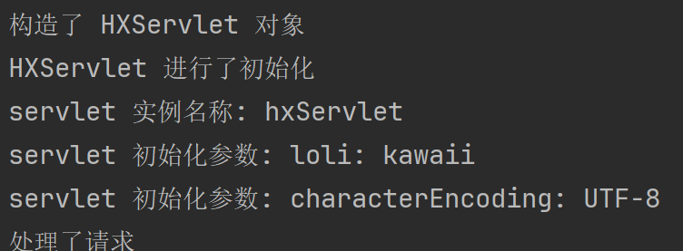|
|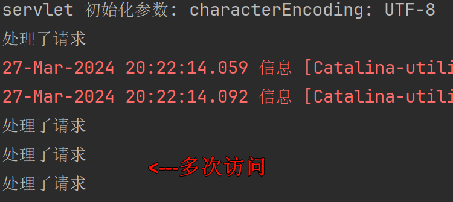|
|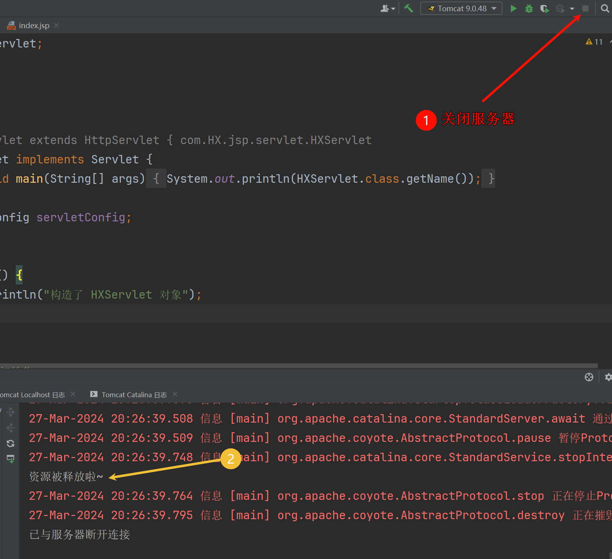|

上面依次是 首次访问该链接、多次访问(非首次)该链接、关闭服务器 时候控制台的输出.

可以知道, `Servlet`类就像是一个`懒汉单例模式`, 首次被使用的时候会被实例化, 然后其生命周期是同程序的生命周期(即服务器(Tomcat)的生命周期一样); 而不是处理一次请求后就会被销毁.

## JSP 的本质
| ##container## |
|:--:|
|启动服务后`.jsp`文件会编译生成`.java/.class`文件(下图就是`index.jsp`对应的java文件)|
|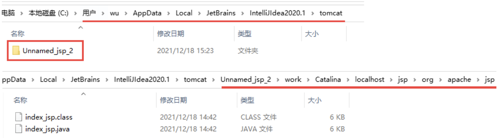|


```java
package org.apache.jsp;

import javax.servlet.*;
import javax.servlet.http.*;
import javax.servlet.jsp.*;

public final class index_jsp
    extends org.apache.jasper.runtime.HttpJspBase
    implements org.apache.jasper.runtime.JspSourceDependent, org.apache.jasper.runtime.JspSourceImports {
  
}
```

| ##container## |
|:--:|
|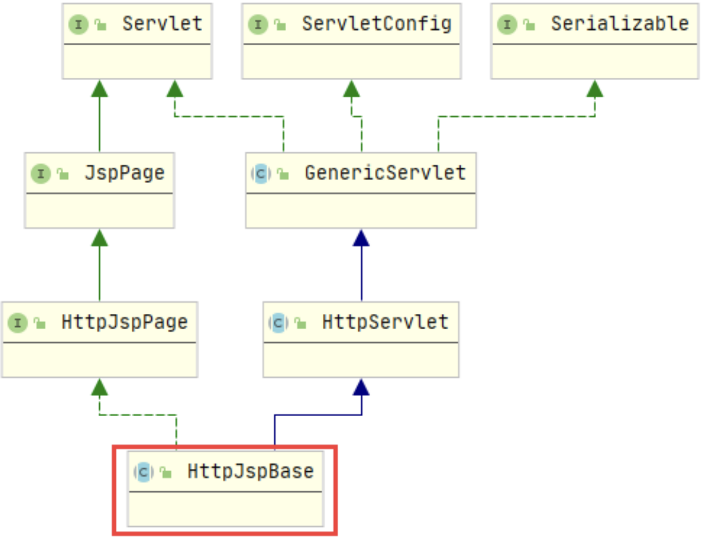|
|可以看到, `Servlet`就是`HttpJspBase`的子类|

由此可以得出: <b style="color:red">JSP 的本质就是 Servlet，只是 JSP 注重的是页面内容的展示，而 Servlet 注重的是业务逻辑的处理。</b>

## 请求处理与响应
### 体系结构
| ##container## |
|:--:|
|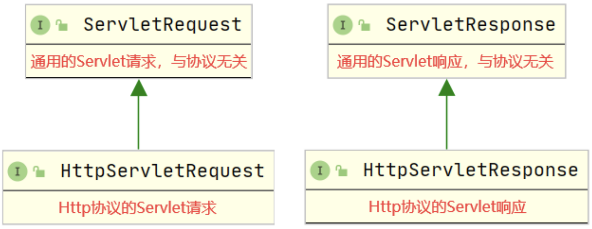|

### 请求接口
#### `ServletRequest` 接口常用方法

```java
// 从请求中获取给定属性名对应的属性值
Object getAttribute(String attributeName);
// 将给定的属性值以给定的属性名存储在请求中
void setAttribute(String attributeName, Object attributeVaue);
// 从请求中将给定的属性名移除
void removeAttribute(String attributeName);
// 获取请求中存储的所有属性名
Enumeration<String> getAttributeNames();
// 从请求中获取给定参数名对应的参数值（参数值是单个数据）
String getParameter(String parameterName);
// 从请求中获取给定参数名对应的参数值（参数值是多个数据）
String[] getParameterValues(String parameterName);
// 从请求中获取所有的参数名
Enumeration<String> getParameterNames();
// 从请求中获取所有的参数名和参数值形成的映射
Map<String, String[]> getParameterMap();
// 从请求中获取字符集编码
String getCharacterEncoding();
// 设置请求的字符集编码
void setCharacterEncoding(String charset) throws UnsupportedEncodingException;
// 从请求中获取字符流，该字符流只能读取请求体中的数据信息，与下面的 getInputStream 方法只能二选一
BufferedReader getReader() throws IOException;
// 从请求中获取字节流，该字节流只能读取请求体中的数据信息
ServletInputStream getInputStream() throws IOException;
// 从请求中获取当前Servlet所在的上下文对象
ServletContext getServletContext();
// 从请求中获取请求转发的对象
RequestDispatcher getRequestDispatcher(String path);
```
- 用法 先编写`index.jsp`

```html (jsp)
<%@ page contentType="text/html;charset=UTF-8" language="java" %>
<!DOCTYPE HTML>
<html>
<head>
    <title>登录页面</title>
</head>
<body>
<form action="gg" method="post">
    <div>
        <input type="text" name="username">
    </div>
    <div>
        <input type="password" name="password">
    </div>
    <div>
        <input type="submit" value="登录">
    </div>
</form>
</body>
</html>
```
- 修改案例的`HXServlet`类

```java
/**
 * 处理客户浏览器的请求
 * @param request
 * @param response
 * @throws ServletException
 * @throws IOException
 */
@Override
public void service(ServletRequest request, ServletResponse response) throws ServletException, IOException {
    System.out.println("请求的字符集编码需要在读取请求信息之前进行设置，否则，设置的字符集编码格式将不生效");
    System.out.println("请求编码: " + request.getCharacterEncoding());
    request.setCharacterEncoding("UTF-8");
    System.out.println("设置请求编码为: " + request.getCharacterEncoding());

    // 如果使用这个那么下面的[那个]就会无效, 因为流已经为空
    // BufferedReader reader = request.getReader(); // 从请求中获取字符流，该字符流只能读取请求体中的数据信息
    System.out.println("开始读取请求参数信息");
    // String line;
    // while ((line = reader.readLine()) != null) {
    //     System.out.println(line);
    // }
    System.out.println("请求参数信息读取完毕");
    System.out.println("================");
    System.out.println("开始获取请求中存储的数据");
    Enumeration<String> attributeNames = request.getAttributeNames();
    while (attributeNames.hasMoreElements()) {
        String name = attributeNames.nextElement();
        System.out.println(name + " => " + request.getAttribute(name));
    }
    System.out.println("请求中存储的数据获取完毕");
    System.out.println("================");
    System.out.println("方式一：开始获取请求参数信息");
    Enumeration<String> parameterNames = request.getParameterNames(); // 使用这个的时候, 请注释上面的代码
    while (parameterNames.hasMoreElements()) {
        String name = parameterNames.nextElement();
        System.out.println(name + " => " + request.getParameter(name));
    }
    System.out.println("方式一：请求参数信息获取完毕");
    System.out.println("================");
    System.out.println("方式二：开始获取请求参数信息");
    Map<String, String[]> parameterMap = request.getParameterMap();
    parameterMap.forEach((k, v)->System.out.println(k + " => " + Arrays.toString(v)));
    System.out.println("方式二：请求参数信息获取完毕");
    System.out.println("请求所使用的上下文路径：" + request.getServletContext().getContextPath());
}
```

- 结果1 (不注释)

```cmd
请求的字符集编码需要在读取请求信息之前进行设置，否则，设置的字符集编码格式将不生效
请求编码: null
设置请求编码为: UTF-8
开始读取请求参数信息
username=asd&password=asda
请求参数信息读取完毕
================
开始获取请求中存储的数据
请求中存储的数据获取完毕
================
方式一：开始获取请求参数信息
方式一：请求参数信息获取完毕
================
方式二：开始获取请求参数信息
方式二：请求参数信息获取完毕
请求所使用的上下文路径：/home
```

- 结果2 (注释了上面的代码(如上一样))

```cmd
请求的字符集编码需要在读取请求信息之前进行设置，否则，设置的字符集编码格式将不生效
请求编码: null
设置请求编码为: UTF-8
开始读取请求参数信息
请求参数信息读取完毕
================
开始获取请求中存储的数据
请求中存储的数据获取完毕
================
方式一：开始获取请求参数信息
username => asd
password => asd
方式一：请求参数信息获取完毕
================
方式二：开始获取请求参数信息
username => [asd]
password => [asd]
方式二：请求参数信息获取完毕
请求所使用的上下文路径：/home
```

注意: 
- 使用`GET`方式发送的请求，只能通过`getParameter`方法获取；
- 使用`POST`方式发送的请求，只能使用`流`来获取。这是因为使用GET方式发送的请求，参数在URL地址中，解析这些参数的时候将其存放在一个Map集合中，因此可以直接获取。而POS方式发送的请求，参数在请求体中，这部分内容只能通过流来读取，然后再进行处理。(~~怎么我测试好像没有感觉?~~)

### 响应接口
#### `ServletResponse` 接口常用方法

```java
// 获取响应的字符集编码
String getCharacterEncoding();
// 设置响应的字符集编码
void setCharacterEncoding(String charset);
// 获取响应的内容类型
String getContentType();
// 设置响应的内容类型
void setContentType(String contentType);
// 获取输出流，主要用于下载文件
ServletOutputStream getOutputStream() throws IOException;
// 获取打印流，主要用于向页面传输信息
PrintWriter getWriter() throws IOException;
```

- 用法（在`service`方法最后追加如下代码）

```java
System.out.println();
System.out.println();
System.out.println("===========================================");
System.out.println("响应的字符集编码：" + response.getCharacterEncoding());
response.setCharacterEncoding("UTF-8");
System.out.println("响应的字符集编码：" + response.getCharacterEncoding());

System.out.println("响应的内容类型：" + response.getContentType());
response.setContentType("text/html;charset=utf-8");
System.out.println("响应的内容类型：" + response.getContentType());

PrintWriter writer = response.getWriter();
writer.print("<h1>登录请求已处理</h1>"); // 是真的有<h1>标签
writer.flush(); // 发送
writer.close();
```

控制台输出

```cmd
响应的字符集编码：ISO-8859-1
响应的字符集编码：UTF-8
响应的内容类型：null
响应的内容类型：text/html;charset=utf-8
```

### HTTP 请求和响应
#### `HttpServletRequest` 接口常用方法

```java
// 从请求中获取Cookie信息
Cookie[] getCookies();
// 从请求中获取给定请求头名称对应的属性值
String getHeader(String headerName);
// 从请求中获取所有的请求头名称
Enumeration<String> getHeaderNames();
// 获取请求的方式：GET、POST、PUT、DELETE等
String getMethod();
// 从请求中获取上下文路径
String getContextPath();
// 从请求中获取session
HttpSession getSession();
// 获取请求地址
String getRequestURI();
```
#### `HttpServletResponse` 接口常用方法

```java
// 添加客户端存储的Cookie信息
void addCookie(Cookie cookie);
// 返回错误状态及错误信息
void sendError(int status, String errorMsg) throws IOException;
// 返回错误状态
void sendError(int status) throws IOException;
// 重定向至新的资源
void sendRedirect(String redirectURL) throws IOException;
// 设置响应头信息
void setHeader(String headerName, String headerValue);
// 添加响应头信息
void addHeader(String headerName, String headerValue);
// 设置响应状态
void setStatus(int status);
```
#### `HttpServlet` 常用方法(支持 HTTP 协议的 Servlet)

```java
// 对父类抽象方法的实现，该方法是对HTTP协议的交互信息的实现，调用的是下面的 service 方法
void service(ServletRequest req,ServletResponse res);

// [请调用我]
// HTTP协议的交互信息的实现，该方法主要针对不同的请求方式进行处理。GET请求会调用 doGet 方法处理，
// POST请求会调用 doPost 处理， PUT请求会调用 doPut 方法处理， DELETE请求会调用doDelete 方法处理

void service(HttpServletRequest req, HttpServletResponseres res);
// GET请求处理
void doGet(HttpServletRequestreq,HttpServletResponse res);
// POST请求处理
void doPost(HttpServletRequestreq,HttpServletResponse res);
// PUT请求处理
void doPut(HttpServletRequestreq,HttpServletResponse res);
// DELETE请求处理
void doDelete(HttpServletRequestreq,HttpServletResponse res);
```

- 用法: 新建一个`RegisterServlet`类, 可以尝试把下面方法名修改为`doPost`、`doGet`, 

```java
package com.HX.jsp.servlet;

import javax.servlet.ServletException;
import javax.servlet.http.HttpServlet;
import javax.servlet.http.HttpServletRequest;
import javax.servlet.http.HttpServletResponse;
import java.io.IOException;
import java.io.PrintWriter;
import java.util.Arrays;
import java.util.Enumeration;
import java.util.Map;

public class RegisterServlet extends HttpServlet {
    @Override
    protected void service(HttpServletRequest req, HttpServletResponse resp) throws ServletException, IOException {
        System.out.println("获取请求头信息");
        Enumeration<String> headerNames = req.getHeaderNames();
        while (headerNames.hasMoreElements()) {
            String name = headerNames.nextElement();
            System.out.println(name + " => " + req.getHeader(name));
        }
        System.out.println("获取请求头完毕");

        System.out.println("请求方式：" + req.getMethod());
        System.out.println("请求地址：" + req.getRequestURI());
        System.out.println("请求的上下文路径：" + req.getContextPath());
        System.out.println("==================");
        System.out.println("开始读取请求参数");

        Map<String, String[]> parameterMap = req.getParameterMap();
        parameterMap.forEach((k, v) -> {System.out.println(k + " => " + Arrays.toString(v));});

        System.out.println("请求参数读取完毕");
        System.out.println();
        System.out.println();
        System.out.println("=========================");
        System.out.println("响应开始");
        resp.setContentType("text/html;charset=utf-8");
        PrintWriter writer = resp.getWriter();
        writer.print("注册请求已经处理");
        writer.flush(); // 刷新
        writer.close();
    }
}
```

对应的`.jsp`添加一个表单, 记得`web.xml`配置也要加上对应的类~

```html (jsp)
<form action="rs" method="post">
    <div>
        <input type="text" name="username">
    </div>
    <div>
        <input type="password" name="password">
    </div>
    <div>
        <input type="submit" value="注册">
    </div>
</form>
```

观察不同的请求类型(`method="post"`)对应的`RegisterServlet`的方法的结果.

控制台:

```cmd
获取请求头信息
host => localhost:11451
connection => keep-alive
content-length => 25
cache-control => max-age=0
sec-ch-ua => "Chromium";v="122", "Not(A:Brand";v="24", "Microsoft Edge";v="122"
sec-ch-ua-mobile => ?0
sec-ch-ua-platform => "Windows"
upgrade-insecure-requests => 1
origin => http://localhost:11451
content-type => application/x-www-form-urlencoded
user-agent => Mozilla/5.0 (Windows NT 10.0; Win64; x64) AppleWebKit/537.36 (KHTML, like Gecko) Chrome/122.0.0.0 Safari/537.36 Edg/122.0.0.0
accept => text/html,application/xhtml+xml,application/xml;q=0.9,image/avif,image/webp,image/apng,*/*;q=0.8,application/signed-exchange;v=b3;q=0.7
sec-fetch-site => same-origin
sec-fetch-mode => navigate
sec-fetch-user => ?1
sec-fetch-dest => document
referer => http://localhost:11451/home/
accept-encoding => gzip, deflate, br
accept-language => zh-CN,zh;q=0.9,en;q=0.8,en-GB;q=0.7,en-US;q=0.6
cookie => JSESSIONID=F5304DD4B862ED37917D0A60252DE952
获取请求头完毕
请求方式：POST
请求地址：/home/rs
请求的上下文路径：/home
==================
开始读取请求参数
username => [asd]
password => [asd]
请求参数读取完毕
```

如果是使用`service`则可以处理所有类型的请求 (因为父类写了判断)

```java
protected void service(HttpServletRequest req, HttpServletResponse resp) throws ServletException, IOException {
    String method = req.getMethod();
    long lastModified;
    if (method.equals("GET")) {
        lastModified = this.getLastModified(req);
        if (lastModified == -1L) {
            this.doGet(req, resp);
        } else {
            long ifModifiedSince;
            try {
                ifModifiedSince = req.getDateHeader("If-Modified-Since");
            } catch (IllegalArgumentException var9) {
                ifModifiedSince = -1L;
            }

            if (ifModifiedSince < lastModified / 1000L * 1000L) {
                this.maybeSetLastModified(resp, lastModified);
                this.doGet(req, resp);
            } else {
                resp.setStatus(304);
            }
        }
    } else if (method.equals("HEAD")) {
        lastModified = this.getLastModified(req);
        this.maybeSetLastModified(resp, lastModified);
        this.doHead(req, resp);
    } else if (method.equals("POST")) {
        this.doPost(req, resp);
    } else if (method.equals("PUT")) {
        this.doPut(req, resp);
    } else if (method.equals("DELETE")) {
        this.doDelete(req, resp);
    } else if (method.equals("OPTIONS")) {
        this.doOptions(req, resp);
    } else if (method.equals("TRACE")) {
        this.doTrace(req, resp);
    } else {
        String errMsg = lStrings.getString("http.method_not_implemented");
        Object[] errArgs = new Object[]{method};
        errMsg = MessageFormat.format(errMsg, errArgs);
        resp.sendError(501, errMsg);
    }
}
```

如果是`doPost`就必需使用`POST`请求, 否则会报错: `405 - 方法不允许`

### Servlet 交互流程
| ##container## |
|:--:|
|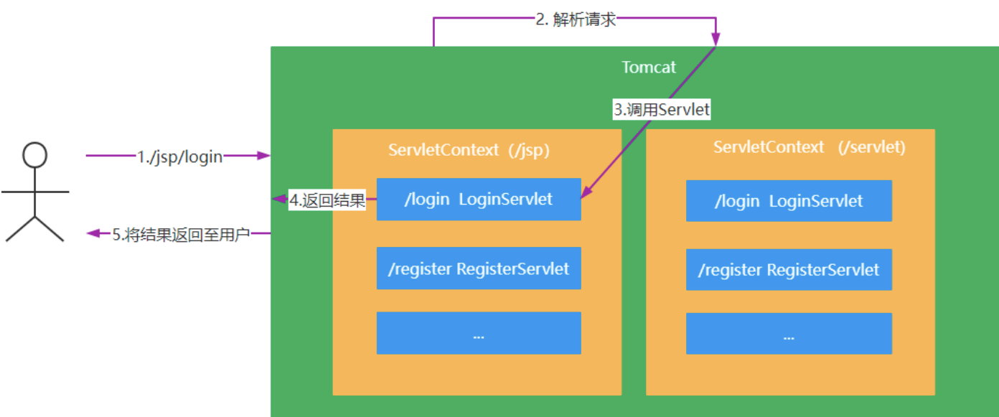|

## ServletContext 上下文
### 常用方法
```java
// 获取上下问参数
String getContextPath();
// 获取给定相对路径对应的绝对路径
String getRealPath(String path);
// 获取上下文初始化参数中给定参数名对应的参数值
String getInitParameter(String parameterName);
// 获取上下文初始化参数中所有的参数名
Enumeration<String> getInitParameterNames();
// 获取上下文存储的数据中给定属性名对应的属性值
Object getAttribute(String attributeName);
// 获取上下文存储的数据中所有的属性名
Enumeration<String> getAttributeNames();
// 将给定的属性值使用给定的属性名存储在上下文中
void setAttribute(String attributeName, Object attributeValue);
// 从上下文存储的数据中将给定的属性名移出
void removeAttribute(String attributeName);
```

### 用法
#### 配置 web.xml

```xml
<context-param>
    <param-name>name</param-name>
    <param-value>ロリ王</param-value>
</context-param>
```

#### 修改 RegisterServlet
重写`init`方法
```java
public class RegisterServlet extends HttpServlet {
    @Override
    public void init(ServletConfig config) throws ServletException {
        System.out.println("开始读取上下文信息");
        ServletContext servletContext = config.getServletContext();
        Enumeration<String> parameterNames = servletContext.getInitParameterNames();
        while (parameterNames.hasMoreElements()) { // 输出上下文初始化参数内容
            String pName = parameterNames.nextElement();
            System.out.println(pName + " => " + servletContext.getInitParameter(pName));
        }
        System.out.println(servletContext.getContextPath()); // 输出上下文路径
    }
    // ...
}
```

控制台输出: (只会输出一次, 因为是`init`嘛~)

```cmd
开始读取上下文信息
name => ロリ王
/home
```

# MVC
## 什么是 MVC
**模型-视图-控制器(MVC模式)** 是一种非常经典的软件架构模式，在UI框架和UI设计思路中扮演着非常重要的角色。从设计模式的角度来看，MVC模式是一种复合模式，它将多个设计模式在一种解决方案中结合起来，用来解决许多设计问题。MVC模式把用户界面交互分拆到不同的三种角色中，使应用程序被分成三个核心部件: Model（模型）、View（视图）、Control（控制器）
| ##container## |
|:--:|
|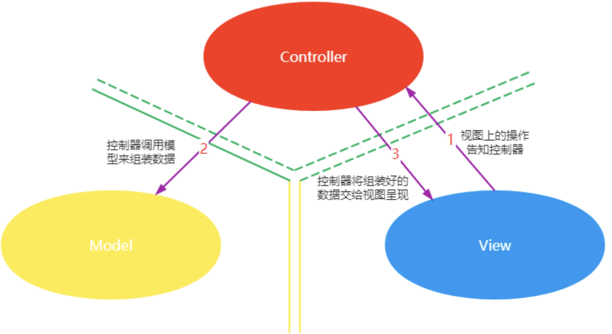|

- 模型: 模型持有所有的数据、状态和程序逻辑。模型独立于视图和控制器。
- 视图: 用来呈现模型。视图通常直接从模型中取得它需要显示的状态与数据。对于相同的信息可以有多个不同的显示形式或视图。
- 控制器: 位于视图和模型中间，负责接受用户的输入，将输入进行解析并反馈给模型

MVC模式将它们分离以提高系统的灵活性和复用性，不使用MVC模式，用户界面设计往往将这些对象混在一起。MVC模式实现了模型和视图的分离，使得其具有以下优点:

- <b style="color:red">一个模型提供不同的多个视图表现形式，也能够为一个模型创建新的视图而无须重写模型。一旦模型的数据发生变化，模型将通知有关的视图，每个视图相应地刷新自己。
- 模型可复用。因为模型是独立于视图的，所以可以把一个模型独立地移植到新的平台工作。
- 提高开发效率。在开发界面显示部分时，仅仅需要考虑的是如何布局一个好的用户界面；开发模型时，仅仅要考虑的是业务逻辑和数据维护，这样能使开发者专注于某一方面的开发，提高开发效率。</b>

## JSP 中的 MVC
在 JSP 中 Servlet 扮演的是控制器，JSP 页面扮演的是视图，Java Bean 扮演的是模型。

**案例**: 将用户信息呈现在页面上

- 编写视图 user.jsp

```html (jsp)
<html>
<head>
    <title>查看用户信息</title>
</head>
<body>
    <a href="showUserData">查询</a>
</body>
</html>
```

- 编写控制器 UserInfoServlet 类

```java
package com.HX.jsp.servlet;

import com.HX.jsp.pojo.User; // 自备一个实现了 构造函数和toString的 存放信息的类

import javax.servlet.ServletException;
import javax.servlet.annotation.WebServlet;
import javax.servlet.http.HttpServlet;
import javax.servlet.http.HttpServletRequest;
import javax.servlet.http.HttpServletResponse;
import java.io.IOException;
import java.io.PrintWriter;

@WebServlet(urlPatterns = "/showUserData") // 可以使用这样的方式, 就不需要再去web.xml里面改配置了, 但是为了统一管理, 最好写web.xml里面
public class UserInfoServlet extends HttpServlet {
    /**
     * 因为 <a>超链接</a> 默认是使用 `get` 请求, 所以针对性的写了这个
     * @param req
     * @param resp
     * @throws ServletException
     * @throws IOException
     */
    @Override
    protected void doGet(HttpServletRequest req, HttpServletResponse resp) throws ServletException, IOException {
        User user = new User("张三", 27, "男"); // 模拟调用了[模型]层获取了数据
        resp.setCharacterEncoding("UTF-8"); // 记得要改编码, 因为传输的是中文
        resp.setContentType("text/html;charset=utf-8");
        PrintWriter writer = resp.getWriter();
        // 告知视图需要展示的模型
        writer.print(user.toString());
        writer.flush();
        writer.close();
    }
}
```

# 过滤器
## 什么是过滤器
过滤器是一个服务器端的组件，可以拦截客户端的请求和响应信息并对这些信息进行过滤。

## 过滤器体系结构
| ##container## |
|:--:|
|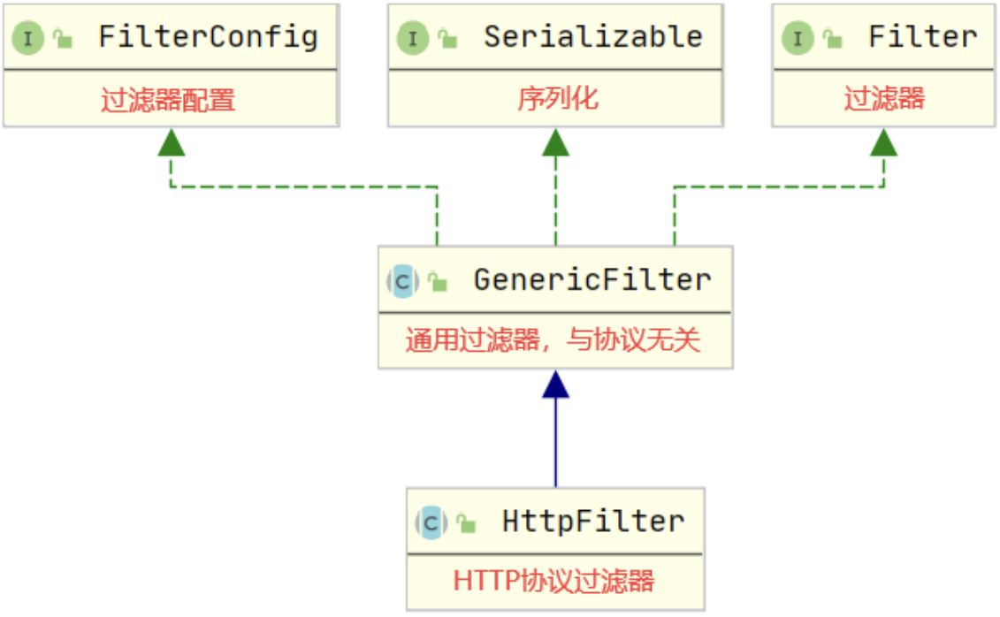|

### Filter 接口

实际上同`Servlet`/`HttpServlet`

```java
// 过滤器初始化
default void init(FilterConfig filterConfig) throws ServletException {}
// 过滤操作，与协议无关
void doFilter(ServletRequest req, ServletResponse resp, FilterChain chain) throws IOException, ServletException;
// 过滤器销毁
default void destroy() {}
```

#### FilterConfig 接口

```java
// 获取过滤器实例的名称
String getFilterName();
// 获取Servlet上下文
ServletContext getServletContext();
// 从过滤器初始化配置中获取给定属性名对应的属性值
String getInitParameter(String parameterName);
// 获取过滤器初始化配置中所有的属性名
Enumeration<String> getInitParameterNames();
```

#### 案例
使用过滤器完成中文乱码处理

- 编写过滤器 CharacterEncodingFilter

```java
package com.HX.jsp.filter;

import javax.servlet.*;
import javax.servlet.annotation.WebFilter;
import javax.servlet.annotation.WebInitParam;
import java.io.IOException;

@WebFilter(urlPatterns = "/*", initParams = { // 快捷配置
        @WebInitParam(name = "characterEncoding", value = "UTF-8")
})
public class CharacterEncodingFilter implements Filter {
    private String characterEncoding;

    public CharacterEncodingFilter() {
        System.out.println("被构造啦");
    }

    @Override
    public void init(FilterConfig config) throws ServletException {
        System.out.println("初始化啦");
        this.characterEncoding = config.getInitParameter("characterEncoding"); // 获取指定配置
    }

    @Override
    public void doFilter(ServletRequest request, ServletResponse response, FilterChain chain) throws IOException, ServletException {
        System.out.println("过滤器操作...");
        request.setCharacterEncoding(characterEncoding);
        response.setCharacterEncoding(characterEncoding);
        chain.doFilter(request, response); // 让过滤器链中的其他过滤器执行，这行代码必不可少，否则，无法进入后面的Servlet执行
    }

    @Override
    public void destroy() {
        System.out.println("被释放啦");
    }
}
```

- 配置文件, 当然也可以使用`@WebFilter`(如上)

```.xml
<filter>
    <filter-name>characterEncodingFilter</filter-name>
    <filter-class>com.HX.jsp.filter.CharacterEncodingFilter</filter-class>
    <init-param>
        <param-name>characterEncoding</param-name>
        <param-value>UTF-8</param-value>
    </init-param>
</filter>

<filter-mapping>
    <filter-name>characterEncodingFilter</filter-name>
    <!-- * 标识通配符，匹配所有-->
    <url-pattern>/*</url-pattern>
</filter-mapping>
```

现在可以把之前代码(Servlet)中的设置编码给去掉了, 一样不会出现乱码

其次, 过滤器的生命周期也同Servlet, 并且比Servlet更早初始化, 因为: 必须先进行过滤嘛.

### HttpFilter 抽象类

```java
// 同样有init等方法!

// 重写无协议过滤器操作，调用下面支持HTTP协议请求过滤操作的方法
public void doFilter(ServletRequest request, ServletResponse response, FilterChain chain) throws IOException, ServletException {}
// HTTP协议请求过滤操作的方法
protected void doFilter(HttpServletRequest request, HttpServletResponse response, FilterChain chain) throws IOException, ServletException {}
```

#### 案例
使用过滤器完成登录超时处理

- 编写过滤器

```java
package com.HX.jsp.filter;

import javax.servlet.FilterChain;
import javax.servlet.ServletException;
import javax.servlet.annotation.WebFilter;
import javax.servlet.http.HttpFilter;
import javax.servlet.http.HttpServletRequest;
import javax.servlet.http.HttpServletResponse;
import javax.servlet.http.HttpSession;
import java.io.IOException;

@WebFilter(urlPatterns = "/*")
public class TimeoutFilter extends HttpFilter {
    @Override
    protected void doFilter(HttpServletRequest request, HttpServletResponse response, FilterChain chain) throws IOException, ServletException {
        System.out.println("查询是否登录超时");
        HttpSession session = request.getSession();
        Object username = session.getAttribute("username");
        System.out.println(request.getRequestURI());
        if (username == null
                && !("/home/".equals(request.getRequestURI())
                || "/home/rs".equals(request.getRequestURI()))) {
            // 首页的地址 就是上下文路径
            String homePageUrl = request.getContextPath();
            if ("".equalsIgnoreCase(homePageUrl)) { // 上下文路径为空字符串时给一条斜杠即可
                homePageUrl = "/";
            }
            response.sendRedirect(homePageUrl);
        } else {
            chain.doFilter(request, response); // 让过滤器链中的其他过滤器执行，这行代码必不可少，否则，无法进入后面的Servlet执行
        }
    }
}
```

- 在之前的`rs`注册类代码，修改为登录, 因为是继承`HttpServlet`的, 所以`HttpServletResponse`是HTTP的, 所以可以保存 session

```java
public class RegisterServlet extends HttpServlet {
@Override
    protected void doPost(HttpServletRequest req, HttpServletResponse resp) throws ServletException, IOException {
        HttpSession session = req.getSession();
        session.setAttribute("username", "ok");

        writer.print("注册请求已经处理, 已经登录");
        writer.flush(); // 刷新
        writer.close();
    }
}
```

## Filter 交互流程
| ##container## |
|:--:|
|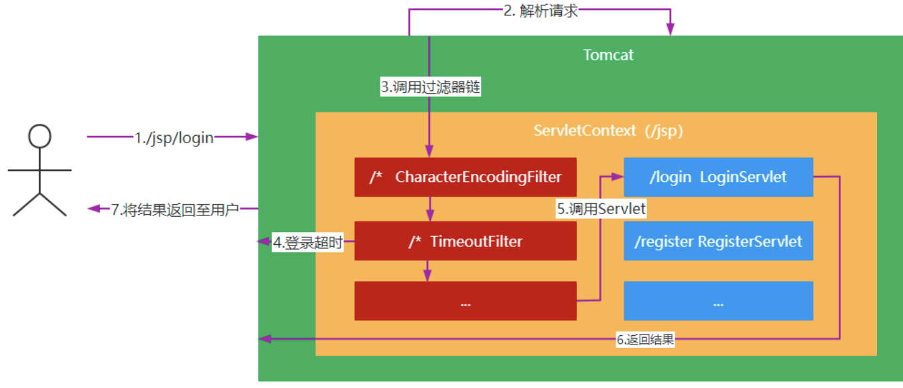|
