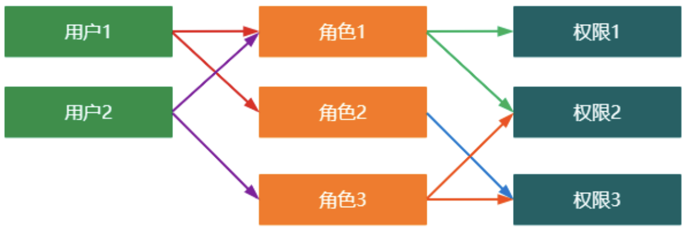

<style>
/* Markdown风格的样式 */

/* h1的样式 */
h1 {
    color: yellow;
    margin-top: 1.5em; /* 顶部间距 */
    margin-bottom: 0.5em; /* 底部间距 */
}

/* h2的样式 */
h2 {
    color: rgb(100,233,233);
    margin-top: 1.25em; /* 顶部间距 */
    margin-bottom: 0.5em; /* 底部间距 */
}

/* h3的样式 */
h3 {
    color: rgb(250, 100, 200);
    margin-top: 1.25em; /* 顶部间距 */
    margin-bottom: 0.5em; /* 底部间距 */
}

/* h4的样式 */
h4 {
    color: rgb(75,250,75);
    margin-top: 1.25em; /* 顶部间距 */
    margin-bottom: 0.5em; /* 底部间距 */
}

/* 段落样式 */
p {
    margin-top: 1em; /* 顶部间距 */
    margin-bottom: 1em; /* 底部间距 */
    text-indent: 1.5em; /* 首行缩进 */
}
</style>

# Servlet上下文监听器
## 什么是监听器
监听器顾名思义就是监听某种事件的发生，一旦监听的事件触发，那么监听器就将开始执行。例如: 在上课的时候，老师会观察每一位学生的听课情况，如果有学生上课打瞌睡，那么老师就会提醒他。这个场景中，老师就是一个监听器，监听的是学生是否打瞌睡，一旦学生出现打瞌睡的情况，监听器就开始执行（老师提醒学生）

## ServletContextListener
`ServletContextListener`是 Servlet上下文的监听器，该监听器主要监听的是Servlet上下文的初始化和销毁。一旦Servlet上下文初始化或者销毁，`ServletContextListener`就执行响应的操作。

```java
public interface ServletContextListener extends EventListener {
    // Servlet上下文初始化
    default void contextInitialized(ServletContextEvent sce) {
      
    }
    // Servlet上下文销毁
    default void contextDestroyed(ServletContextEvent sce) {
      
    }
}
```

### 示例
1. 在`resources`(在项目目录下, 新建目录, 并且设置为 **资源根目录**)目录下创建`jdbc.properties`

```properties
druid.url=jdbc:mysql://localhost:3306/hx_demo?serverTimezone=Asia/Shanghai
druid.driverClassName=com.mysql.cj.jdbc.Driver
druid.username=root
druid.password=root
```

2. 在`web.xml`中配置上下文参数

```xml
<context-param>
    <param-name>jdbcConfig</param-name>
    <param-value>/jdbc.properties</param-value>
</context-param>
```

3. 创建一个上下文监听器

```java
package com.HX.jsp.contextListener;

import javax.servlet.ServletContextEvent;
import javax.servlet.ServletContextListener;
import javax.servlet.annotation.WebListener;

@WebListener
public class ApplicationContextListener implements ServletContextListener {
    @Override
    public void contextInitialized(ServletContextEvent sce) {
        System.out.println("监听器被初始化啦");
        // 读取配置(上下文参数)
        ServletContext context = sce.getServletContext();
        String config = context.getInitParameter("jdbcConfig");
        if (config != null && !"".equals(config)) {
            InputStream is = this.getClass().getResourceAsStream(config);
            Properties properties = new Properties();
            try {
                properties.load(is);
                System.out.println(properties);
            } catch (IOException e) {
                e.printStackTrace();
            }
        }
    }

    @Override
    public void contextDestroyed(ServletContextEvent sce) {
        System.out.println("监听器被释放啦~");
    }
}
```

从输出也可以看出, 监听器的优先级是最高的
```cmd
监听器被初始化啦 (监听器)
{jdbc.url=jdbc:mysql://localhost:3306/hx_demo?serverTimezone=UTF8, jdbc.username=root, jdbc.password=root, jdbc.driverClassName=com.mysql.cj.jdbc.Driver}
被构造啦 (过滤器)
初始化啦

被释放啦 (过滤器)
监听器被释放啦~ (监听器)
```

由此可以看出，Servelt上下文监听器可以读取到上下文参数，这些参数可以用来配置开发中所需要的环境。

## DruidDataSource
[`DruidDataSource`](https://github.com/alibaba/druid)是阿里巴巴开发的一款高性能的数据源。利用 Servlet 上下文监听器建立工程中需要的数据源
- 引入`DruidDataSource`的依赖包
- 创建 JbdcUtil 工具类


```java
package com.HX.jsp.jdbc.handler;

import java.sql.ResultSet;
import java.sql.SQLException;

public interface BeanHandler<T> {
    /**
     * 处理查询结果集
     * @param rs
     * @return
     * @throws SQLException
     */
    T handle(ResultSet rs) throws SQLException;
}
```


```java
package com.HX.jsp.jdbc.handler.impl;

import com.HX.jsp.jdbc.handler.BeanHandler;

import org.apache.commons.beanutils.BeanUtils;
import java.sql.ResultSet;
import java.sql.ResultSetMetaData;
import java.sql.SQLException;
import java.util.HashMap;
import java.util.Map;


/**
 * 单个结果的处理器
 * @param <T>
 */
public class SingleResultHandler<T> implements BeanHandler<T> {
    private Class<T> clazz;
    public SingleResultHandler(Class<T> clazz) {
        this.clazz = clazz;
    }
    @Override
    public T handle(ResultSet rs) throws SQLException {
        int totalCount = 0;
        T t = null;
        while (rs.next()){
            totalCount++;
            if(totalCount > 1){
                throw new RuntimeException("查询存在多条结果: " + totalCount);
            }
            try {
                t = clazz.newInstance();
                Map<String,Object> values = new HashMap<>();
                ResultSetMetaData rsmd = rs.getMetaData();
                int columnCount = rsmd.getColumnCount();
                for(int i = 1; i <= columnCount; i++){
                    String label = rsmd.getColumnLabel(i);
                    Object value = rs.getObject(label);
                    values.put(label, value);
                }
                BeanUtils.populate(t, values);
            } catch (Exception e) {
                e.printStackTrace();
            }
        }
        return t;
    }
}
```

```java
package com.HX.jsp.jdbc.handler.impl;

import com.HX.jsp.jdbc.handler.BeanHandler;
import org.apache.commons.beanutils.BeanUtils;

import java.sql.ResultSet;
import java.sql.ResultSetMetaData;
import java.sql.SQLException;
import java.util.ArrayList;
import java.util.HashMap;
import java.util.List;
import java.util.Map;

/**
 * 多个结果的处理器
 * @param <T>
 */
public class MultiResultHandler<T> implements BeanHandler<List<T>> {
    private Class<T> clazz;
    public MultiResultHandler(Class<T> clazz) {
        this.clazz = clazz;
    }
    @Override
    public List<T> handle(ResultSet rs) throws SQLException {
        List<T> dataList = new ArrayList<>();
        while (rs.next()){
            try {
                T t = clazz.newInstance();
                Map<String,Object> values = new HashMap<>();
                ResultSetMetaData rsmd = rs.getMetaData();
                int columnCount = rsmd.getColumnCount();
                for(int i=1; i<=columnCount; i++){
                    String label = rsmd.getColumnLabel(i);
                    Object value = rs.getObject(label);
                    values.put(label, value);
                }
                BeanUtils.populate(t, values);
                dataList.add(t);
            } catch (Exception e) {
                e.printStackTrace();
            }
        }
        return dataList;
    }
}
```


```java
package com.HX.jsp.jdbc;

import com.HX.jsp.jdbc.handler.BeanHandler;
import com.alibaba.druid.pool.DruidDataSource;
import java.sql.Connection;
import java.sql.PreparedStatement;
import java.sql.ResultSet;
import java.sql.SQLException;
import java.util.Properties;

public class JdbcUtil {
    private static DruidDataSource dataSource = new DruidDataSource();
    /**
     * 初始化数据源
     * @param props
     */
    public static void init(Properties props){
        dataSource.configFromPropety(props);
    }

    /**
     * 查询
     * @param sql
     * @param handler
     * @param params
     * @param <T>
     * @return
     */
    public static <T> T query(String sql, BeanHandler<T> handler, Object...params){
        try {
            Connection conn = dataSource.getConnection();
            PreparedStatement ps = conn.prepareStatement(sql);
            if(params != null && params.length > 0){
                for(int i=0; i<params.length; i++){
                    ps.setObject(i+1, params[i]);
                }
            }
            ResultSet rs = ps.executeQuery();
            T result = handler.handle(rs);
            rs.close();
            ps.close();
            conn.close();
            return result;
        } catch (SQLException e) {
            e.printStackTrace();
        }
        return null;
    }

    /**
     * 更新
     * @param sql
     * @param params
     * @return
     */
    public static int update(String sql, Object...params){
        try {
            Connection conn = dataSource.getConnection();
            PreparedStatement ps = conn.prepareStatement(sql);
            if(params != null && params.length > 0){
                for(int i=0; i<params.length; i++){
                    ps.setObject(i+1, params[i]);
                }
            }
            int result = ps.executeUpdate();
            ps.close();
            conn.close();
            return result;
        } catch (SQLException e) {
            e.printStackTrace();
        }
        return 0;
    }
}
```

使用

```java
@WebListener
public class ApplicationContextListener implements ServletContextListener {
    @Override
    public void contextInitialized(ServletContextEvent sce) {
        System.out.println("监听器被初始化啦");
        ServletContext context = sce.getServletContext();
        String config = context.getInitParameter("jdbcConfig");
        if (config != null && !"".equals(config)) {
            InputStream is = this.getClass().getResourceAsStream(config);
            Properties properties = new Properties();
            try {
                properties.load(is);
                System.out.println(properties);

                JdbcUtil.init(properties); // 初始化
                
                // 模拟有请求来查询 (实际上绝对不可能写在这里
                List<Score> scoreList = JdbcUtil.query("SELECT id, stu_id, course, score FROM score", new MultiResultHandler<>(Score.class));
                if (scoreList != null)
                    for (Score it : scoreList)
                        System.out.println(it.toString());
            } catch (IOException e) {
                e.printStackTrace();
            }
        }
    }

    @Override
    public void contextDestroyed(ServletContextEvent sce) {
        System.out.println("监听器被释放啦~");
    }
}
```

实际上, 这里只是在`init`处使用到`DruidDataSource`, 其他还是使用`jdbc`...

---
**DruidDataSource** 主要用于管理数据库连接池，而不是执行具体的 SQL 查询。它具备以下功能：

1. **连接池管理**：`DruidDataSource` 负责管理连接池，包括获取连接、回收连接、维护连接的状态等。这样，您在应用程序中获取连接时，可以直接从连接池中获取，而不需要手动创建新的连接。
2. **性能优化**：`DruidDataSource` 在市场上表现出更高的性能，相比其他数据库连接池（如 DBCP 和 C3P0）。它通过有效地管理连接，减少了连接创建和销毁的开销。
3. **监控功能**：`DruidDataSource` 支持丰富的监控功能，您可以方便地查看连接池的状态、性能指标等。
4. **动态配置**：您可以根据实际需求动态调整连接池的配置参数，而无需重新启动应用程序。

总之，`DruidDataSource` 是一个强大且高性能的数据库连接池，适用于 Java 应用程序中与数据库的连接管理和资源池化。如果您需要执行具体的 SQL 查询，仍然需要使用 JDBC 来操作数据库。🛠️<sup>[By GPT-4]</sup>

# RBAC 权限模型
## 什么是RBAC
RBAC全称为**Role-Based Access Control**，表示基于角色的访问控制。在RBAC中，有三个最常用的术语
- 用户：系统资源的操作者
- 角色：具有一类相同操作权限的用户的总称
- 权限：能够访问资源的资格

资源：服务器上的一切数据都是资源，比如静态文件，查询的动态数据等。

RBAC的设计主要是控制服务器端的资源访问。

RBAC怎么与用户建立联系？服务器感知用户是通过session来感知的，因此，RBAC的实现需要与session配合。前提是用户需要登录，登录后将用户信息存储在session中，这样才能在session中获取用户的信息

## RBAC简单结构图
| ##container## |
|:--:|
||

## RBAC 案例
> 脑补:
>
> 1. 在数据库确定好 RBAC简单结构图 关系表, 以便查询
> 2. 写一个登录系统, 登录后可以进行 查询 和 修改 操作(当然操作权限等级不一样)
> 3. 通过查询数据库进行登录(通过过滤器来拦截未登录的), 进行操作时候, 通过查询数据库是否有对应的权限, 进行判断