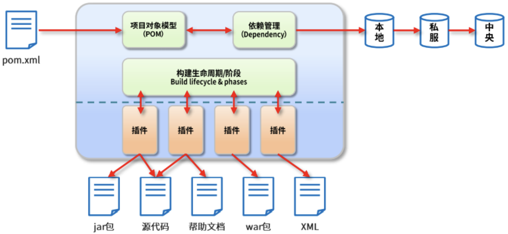
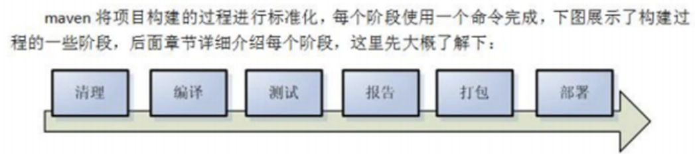
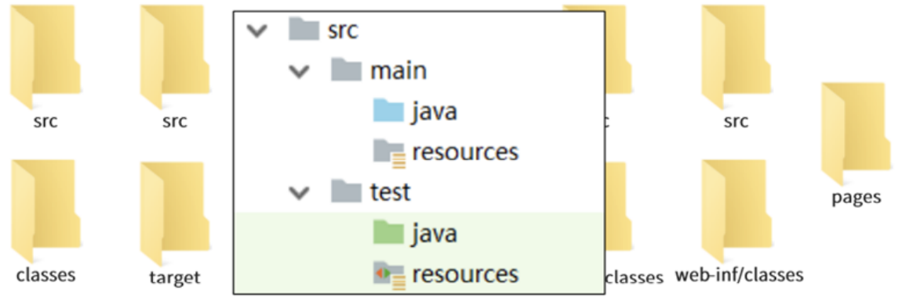
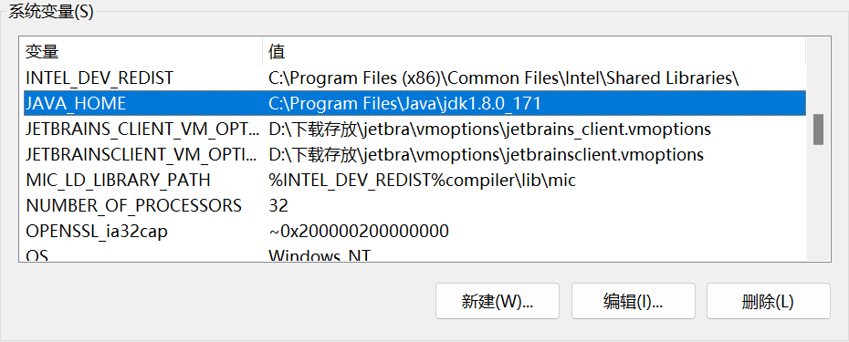
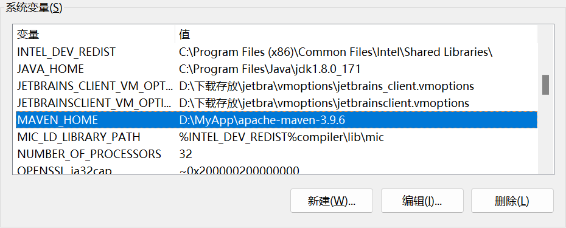
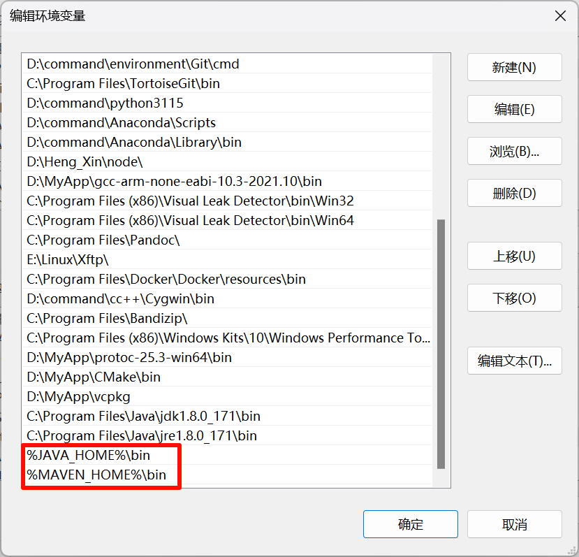
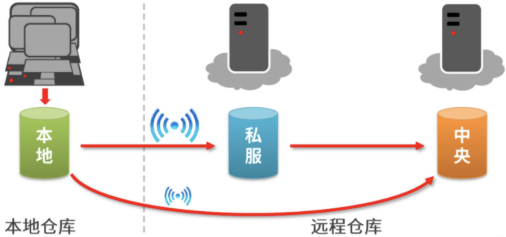
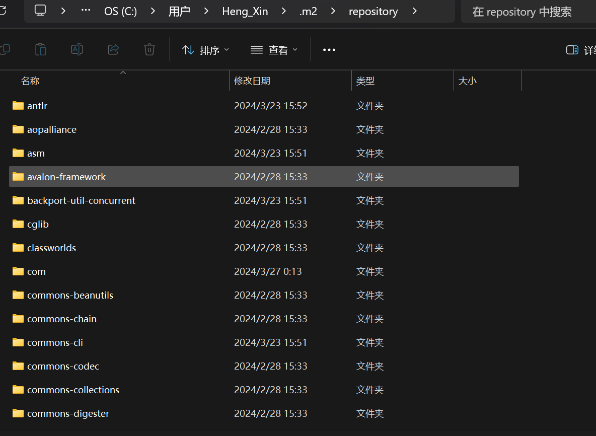
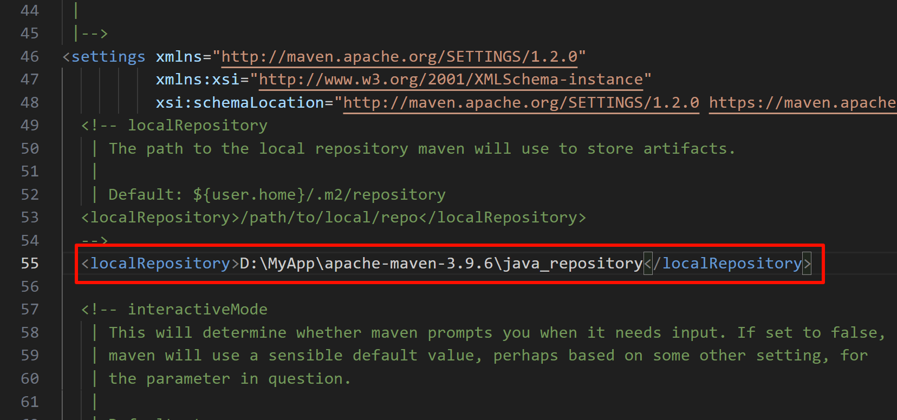

# Maven基础
> 课程目标
> - 了解maven的基本简介
> - 掌握maven的下载、安装流程
> - 理解maven的基本概念(重点)
> - 动手完成第一个maven项目(重点)
> - 理解依赖管理(重点)
> - 理解生命周期与插件

# Maven简介
## 传统构建java项目的弊端
在项目中我们不可避免的要用到一些jar包。这种手动导入jar包的端：
1. 需要提前准备很多jar包，非常的繁琐
2. jar包与jar包之间存在版本冲突的问题，要求我们手动收集的jar包版本之间必须兼容。
3. 导入很多jar包之后的项目变得庞大，不利于后期的部署和维护。

解决方案: 使用 **Maven**

## 什么是maven
Maven 的正确发音是[ˈmevən]。Maven 在美国是一个口语化的词语，代表专家、内行的意思。

一个对 Maven 比较正式的定义是这么说的:
- Maven 是一个项目管理工具，
    - 它包含了一个项目对象模型 (POM: **Project Object Model**)，
    - 一组标准集合，
    - 一个项目生命周期(**Project Lifecycle**)，
    - 一个依赖管理系统(**Dependency Management System**)，
    - 和用来运行定义在生命周期阶段(**phase**)中插件(**plugin**)目标(**goal**)的逻辑。

| ##container## |
|:--:|
||

## Maven的作用
1. 我们需要引用各种 jar 包，尤其是比较大的工程，引用的 jar 包往往有几十个乃至上百个， 每用 到一种 jar 包，都需要手动引入工程目录，而且经常遇到各种让人抓狂的 jar 包冲突，版本冲突。

2. 世界上没有不存在 bug 的代码，计算机喜欢 bug 就和人们总是喜欢美女帅哥一样。为了追求美为了减少 bug，因此写完了代码，我们还要写一些单元测试，然后一个个的运行来检验代码质量。

3. 再优雅的代码也是要出来卖的。我们后面还需要把代码与各种配置文件、资源整合到一起，定型打包，如果是 web 项目，还需要将之发布到服务器，供人蹂躏。

试想，如果现在有一种工具，可以把你从上面的繁琐工作中解放出来，**能帮你构建工程，管理 jar 包，编译代码，还能帮你自动运行单元测试，打包，生成报表，甚至能帮你部署项目，生成 Web 站点，你会心动吗？ Maven 就可以解决上面所提到的这些问题**

| ##container## |
|:--:|
||

4. 统一开发结构，提供标准了、统一的项目结构

| ##container## |
|:--:|
||

# maven的下载安装
## maven的下载
官网: [maven](https://maven.apache.org/)

**注意：不同的MAVEN版本，跟IDEA之间也存在适配问题，所以大家在选择 maven 版本的时候，应该根据自己IDEA的版本选择对应的适配版本,适配版本如下**
> - IDEA 2022 兼容maven 3.8.1及之前的所用版本
> - IDEA 2021 兼容maven 3.8.1及之前的所用版本
> - IDEA 2020 兼容Maven 3.6.3及之前所有版本
> - IDEA 2018 兼容Maven3.6.1及之前所有版本
>
> 在MAVEN官网 http://maven.apache.org/docs/history.html 查找发布时间在IDEA版本之前的
>
> 我使用的是 IDEA 2023 所以直接下载 maven 3.9.6

## Maven的安装
Maven 下载后，将 Maven 解压到一个 **没有中文没有空格** 的路径下, 比如: `D:\MyApp\apache-maven-3.9.6`

其目录结构为

```cmd
apache-maven-3.9.6
├─bin
├─boot
├─conf
│  └─logging
└─lib
    ├─ext
    │  ├─hazelcast
    │  └─redisson
    └─jansi-native
        └─Windows
            ├─x86
            └─x86_64
```

- bin: 存放了 maven 的命令，比如我们前面用到的 mvn tomcat:run
- boot: 存放了一些 maven 本身的引导程序，如类加载器等
- conf: 存放了 maven 的一些配置文件，如 setting.xml 文件
- lib: 存放了 maven 本身运行所需的一些 jar 包 至此我们的 maven 软件就可以使用了，前提是你的电脑上之前已经安装并配置好了 JDK。

## maven及JDK的配置
我们所使用工具软件的统一，JDK 使用 JDK8 版本。

- JDK1.8版本安装之后，JDK配置 **JAVA_HOME**

| ##container## |
|:--:|
||

- 配置 **MAVEN_HOME** ，变量值就是你的 maven 安装 的路径（bin 目录之前一级目录）

| ##container## |
|:--:|
||

- 在环境变量的`path`目录里面还需要配置

| ##container## |
|:--:|
||

通过 `mvn -v` 命令检查 maven 是否安装成功:


```cmd
C:\Users\Heng_Xin>mvn -v
Apache Maven 3.9.6 (bc0240f3c744dd6b6ec2920b3cd08dcc295161ae)
Maven home: D:\MyApp\apache-maven-3.9.6
Java version: 1.8.0_171, vendor: Oracle Corporation, runtime: C:\Program Files\Java\jdk1.8.0_171\jre
Default locale: zh_CN, platform encoding: GBK
OS name: "windows 10", version: "10.0", arch: "amd64", family: "windows"
```

看到 maven 的版本为 3.9.6 及 java版本为 1.8 即为安装成功。 

# maven的基本概念
## 仓库
maven 的工作需要从仓库下载一些 jar 包，如下图所示，本地的项目 A、项目 B 等都会通过 maven 软件从远程仓库（可以理解为互联网上的仓库）下载 jar 包并存在本地仓库，本地仓库就是本地文件夹，当第二次需要此 jar 包时则不再从远程仓库下载，因为本地仓库已经存在了，可以将本地仓库理解为缓存，有了本地仓库就不用每次从远程仓库下载了。

| ##container## |
|:--:|
||
|上图描述了maven仓库的类型|

- **本地仓库**: 用来存储从远程仓库或中央仓库下载的插件和 jar 包，项目使用一些插件或 jar 包，manen项目优先从本地仓库查找 默认本地仓库位置在`${user.dir}/.m2/repository`，`${user.dir}`表示 windows 用户目录。

| ##container## |
|:--:|
||

- **远程仓库(私服)**: 如果本地需要插件或者 jar 包，本地仓库没有，默认去远程仓库下载。远程仓库可以在互联网内也可以在局域网内。

- **中央仓库**: 在 maven 软件中内置一个远程仓库地址 http://repo1.maven.org/maven2 ，它是中央仓库，服务于整个互联网，它是由 Maven 团队自己维护，里面存储了非常全的 jar 包，它包 含了世界上大部分流行的开源项目构件

### 设置本地仓库路径
注意: 默认本地仓库在系统磁盘中，比较浪费系统盘空间，所以我们可以修改本地仓
库的默认存放位置。

我打算放在`D:\MyApp\apache-maven-3.9.6\java_repository`

在`%MAVE_HOME%/conf/settings.xml`文件中配置本地仓库位置（maven 的安装目录下） 打开 settings.xml 文件，配置如下:

| ##container## |
|:--:|
||
|配置本地仓库路径|

### 配置镜像仓库
解决中央仓库资源下载慢的问题(因为是外网嘛~)

- 在settings.xml配置文件中，配置阿里云镜像仓库

注意: 请放在`<mirrors>`块里面
```xml
<mirror>
  <!-- mirror -->
  <id>nexus-aliyun</id>
  <!-- -->
  <mirrorOf>central</mirrorOf>
  <!-- 名称 -->
  <name>Nexus aliyun</name>
  <!-- URL -->
  <url>http://maven.aliyun.com/nexus/content/groups/public</url>
</mirror>
```

## 坐标
### 什么是坐标?
maven中的坐标用于描述仓库中资源的位置。

### Maven坐标的主要构成

```xml
<dependency>
    <groupId></groupId>       <!--描述当前依赖隶属于的组织名称，通常的写法格式是域名的小写。如: org.mybatis-->
    <artifactId></artifactId> <!--描述的是当前依赖的工程名称-->
    <version></version>       <!--描述的依赖的版本号-->
    <packing></packing>       <!--描述当前依赖的打包方式默认不写打jar包 也可以打war包pom包-->
    <scope></scope>           <!--描述当前依赖的作用域-->
</dependency>
```

### Maven坐标的作用
使用唯一标识，用来定位资源。通过该标识可以将资源的识别与下载交给机器完成。
