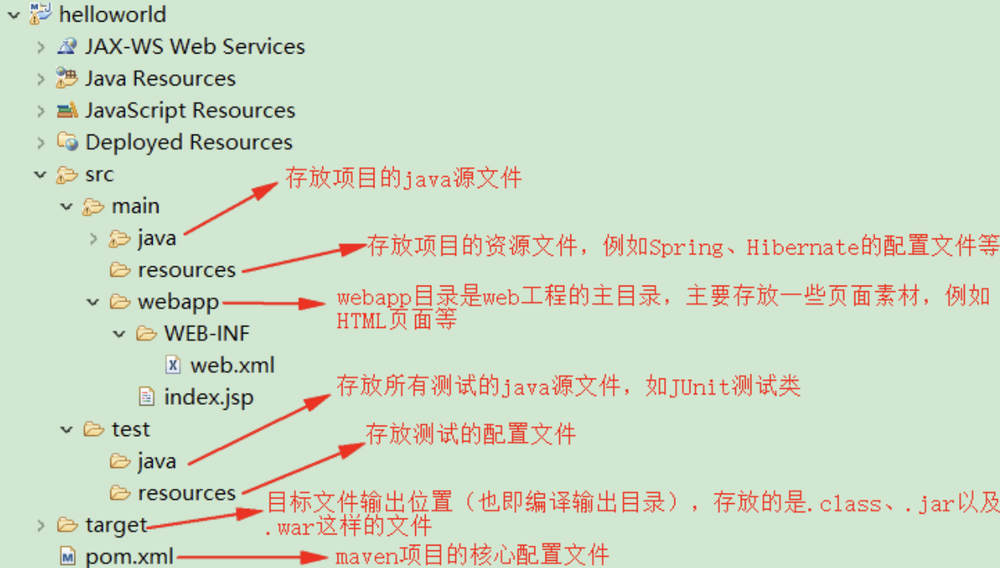

# maven工程的目录结构和常用命令介绍
## 工程的目录结构

| ##container## |
|:--:|
||

- `src/main/java` —— 存放项目的.java 文件
- `src/main/resources` —— 存放项目资源文件，如 spring, hibernate 配置文件
- `src/test/java` —— 存放所有单元测试.java 文件，如 JUnit 测试类
- `src/test/resources` —— 测试资源文件
- `target` —— 项目输出位置，编译后的 class文件会输出到此目录
- `pom.xml` —— maven 项目核心配置文件

注意: *如果是普通的 java 项目，那么就没有 webapp 目录。*

## maven的常用命令
### mvn compile
> compile 是 maven 工程的编译命令，作用是将`src/main/java`下的文件编译为 class 文件输出到 target 目录下。

### mvn clean
> clean 是 maven 工程的清理命令，执行 clean 会删除`target`目录及内容。

### mvn test
> 测试命令将测试代码进行执行，并生成测试结果报告。

### mvn package
> 打包的命令同时编译主程序的代码，并且执行测试代码。编译测试成功之后, 再将对应的工程进行打包。普通工程打jar包，web工程打war包。

### mvn install
> 安装的命令。先执行编译测试打包的命令。这些命令执行成功之后，在将打好的包(jar/war)发布到本地仓库。