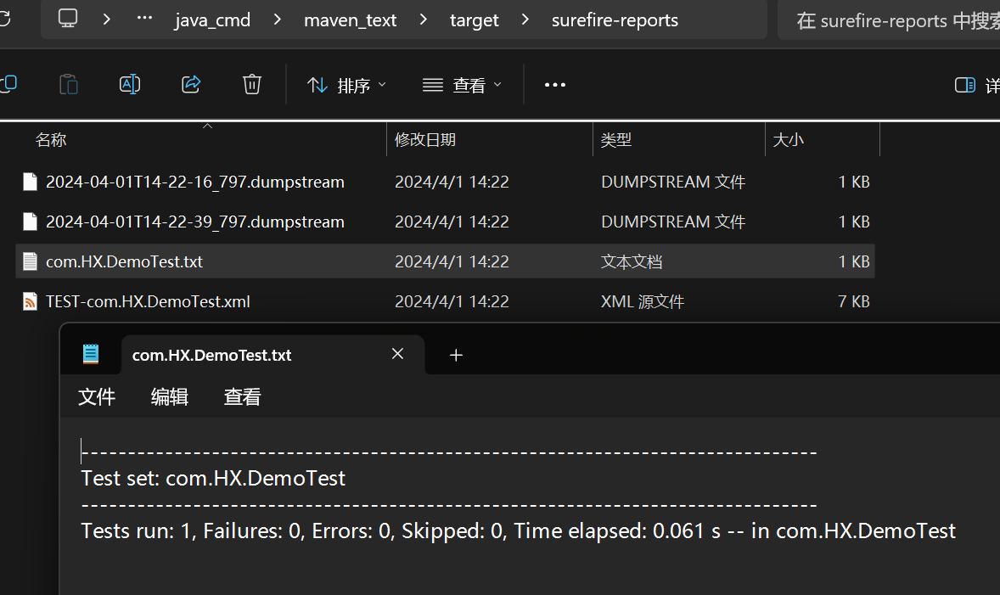
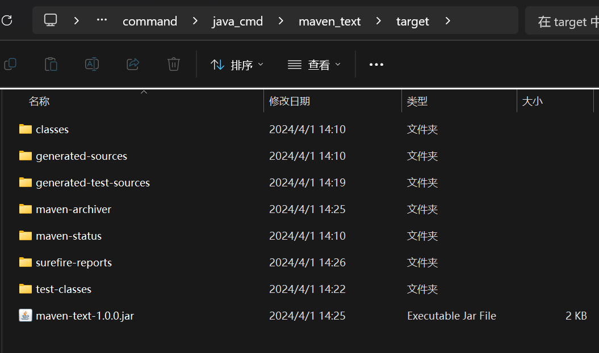
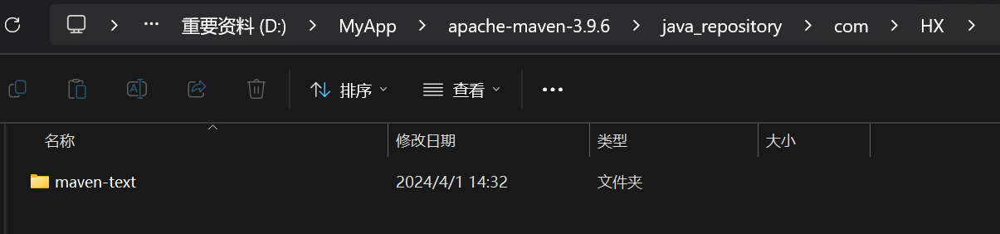

# 手动创建maven工程
## 创建目录结构

```cmd
maven_text
│  pom.xml
│
└─src
    ├─main
    │  ├─java
    │  │  └─com
    │  │      └─HX
    │  │              Demo.java
    │  │
    │  └─resources
    └─test
        ├─java
        │  └─com
        │      └─HX
        │              DemoTest.java
        │
        └─resources
```

`Demo.java`内容为

```java
package com.HX;

public class Demo {
    public void hello() {
        System.out.println("Hello maven");
    }
}
```

`DemoTest.java`内容为

```java
package com.HX;

import org.junit.Test

public class DemoTest {
    @Test
    public void test(String[] args) {
        Demo d = new Demo();
        d.hello();
    }
}
```

`pom.xml`内容为

```xml
<project xmlns="http://maven.apache.org/POM/4.0.0" 
  xmlns:xsi="http://www.w3.org/2001/XMLSchema-instance"
  xsi:schemaLocation="http://maven.apache.org/POM/4.0.0
                      http://maven.apache.org/maven-v4_0_0.xsd">
    <!--声明项目描述符遵循哪一个POM模型版本。模型本身的版本很少改变，虽然如此，但它仍然是必不可少的，这是为了当Maven引入了新的特性或者其他模型变更的时候，确保稳定性。-->
    <modelVersion>4.0.0</modelVersion>

    <groupId>com.HX</groupId> <!--公司或者组织的唯一标志，并且配置时生成的路径也是由此生成，如com.winner.trade，maven会将该项目打成的jar包放本地路径：/com/winner/trade-->
    <artifactId>maven-text</artifactId> <!--本项目的唯一ID，一个groupId下面可能多个项目，就是靠artifactId来区分的-->
    <version>1.0.0</version> <!--本项目目前所处的版本号-->

    <!--坐标表 (也就是依赖关系表)-->
    <dependencies> 
        <!--一个坐标-->
        <dependency>
            <groupId>junit</groupId> <!--依赖项的组织名-->
            <artifactId>junit</artifactId> <!--依赖项的子项目名-->
            <version>4.13</version> <!--依赖项的版本-->
        </dependency>
    </dependencies>
</project>
```

## 使用命令
### mvn compile
```js
D:\command\java_cmd\maven_text>mvn compile
[INFO] Scanning for projects...
[INFO]
[INFO] -------------------------< com.HX:maven-text >--------------------------
[INFO] Building maven-text 1.0.0
[INFO]   from pom.xml
[INFO] --------------------------------[ jar ]---------------------------------
[INFO]
[INFO] --- resources:3.3.1:resources (default-resources) @ maven-text ---
[WARNING] Using platform encoding (GBK actually) to copy filtered resources, i.e. build is platform dependent!
[INFO] Copying 0 resource from src\main\resources to target\classes
[INFO]
[INFO] --- compiler:3.11.0:compile (default-compile) @ maven-text ---
[INFO] Nothing to compile - all classes are up to date
[INFO] ------------------------------------------------------------------------
[INFO] BUILD SUCCESS
[INFO] ------------------------------------------------------------------------
[INFO] Total time:  0.516 s
[INFO] Finished at: 2024-04-01T13:53:23+08:00
[INFO] ------------------------------------------------------------------------
```

发现出现了`target`文件夹

### mvn clean
```js
D:\command\java_cmd\maven_text>mvn clean
[INFO] Scanning for projects...
[INFO]
[INFO] -------------------------< com.HX:maven-text >--------------------------
[INFO] Building maven-text 1.0.0
[INFO]   from pom.xml
[INFO] --------------------------------[ jar ]---------------------------------
[INFO]
[INFO] --- clean:3.2.0:clean (default-clean) @ maven-text ---
[INFO] Deleting D:\command\java_cmd\maven_text\target
[INFO] ------------------------------------------------------------------------
[INFO] BUILD SUCCESS
[INFO] ------------------------------------------------------------------------
[INFO] Total time:  0.241 s
[INFO] Finished at: 2024-04-01T14:09:56+08:00
[INFO] ------------------------------------------------------------------------
```
发现出现的`target`文件夹被删除了

### mvn test
> 1. 检查 test文件夹 命名是否正确
> 2. 类是否是 xxxTest
> 3. 是否`@Test`注解
> 4. 是否导包

```js
D:\command\java_cmd\maven_text>mvn test
[INFO] Scanning for projects...
[INFO]
[INFO] -------------------------< com.HX:maven-text >--------------------------
[INFO] Building maven-text 1.0.0
[INFO]   from pom.xml
[INFO] --------------------------------[ jar ]---------------------------------
[INFO]
[INFO] --- resources:3.3.1:resources (default-resources) @ maven-text ---
[WARNING] Using platform encoding (GBK actually) to copy filtered resources, i.e. build is platform dependent!
[INFO] Copying 0 resource from src\main\resources to target\classes
[INFO]
[INFO] --- compiler:3.11.0:compile (default-compile) @ maven-text ---
[INFO] Nothing to compile - all classes are up to date
[INFO]
[INFO] --- resources:3.3.1:testResources (default-testResources) @ maven-text ---
[WARNING] Using platform encoding (GBK actually) to copy filtered resources, i.e. build is platform dependent!
[INFO] Copying 0 resource from src\test\resources to target\test-classes
[INFO]
[INFO] --- compiler:3.11.0:testCompile (default-testCompile) @ maven-text ---
[INFO] Nothing to compile - all classes are up to date
[INFO]
[INFO] --- surefire:3.2.2:test (default-test) @ maven-text ---
[INFO] Using auto detected provider org.apache.maven.surefire.junit4.JUnit4Provider
[INFO]
[INFO] -------------------------------------------------------
[INFO]  T E S T S
[INFO] -------------------------------------------------------
[INFO] Running com.HX.DemoTest
Hello maven
[INFO] Tests run: 1, Failures: 0, Errors: 0, Skipped: 0, Time elapsed: 0.061 s -- in com.HX.DemoTest
[INFO]
[INFO] Results:
[INFO]
[INFO] Tests run: 1, Failures: 0, Errors: 0, Skipped: 0
[INFO]
[INFO] ------------------------------------------------------------------------
[INFO] BUILD SUCCESS
[INFO] ------------------------------------------------------------------------
[INFO] Total time:  2.004 s
[INFO] Finished at: 2024-04-01T14:22:40+08:00
[INFO] ------------------------------------------------------------------------
```

生成的测试报告如下:
| ##container## |
|:--:|
||

### mvn package

```js
D:\command\java_cmd\maven_text>mvn package
[INFO] Scanning for projects...
[INFO]
[INFO] -------------------------< com.HX:maven-text >--------------------------
[INFO] Building maven-text 1.0.0
[INFO]   from pom.xml
[INFO] --------------------------------[ jar ]---------------------------------
[INFO]
[INFO] --- resources:3.3.1:resources (default-resources) @ maven-text ---
[WARNING] Using platform encoding (GBK actually) to copy filtered resources, i.e. build is platform dependent!
[INFO] Copying 0 resource from src\main\resources to target\classes
[INFO]
[INFO] --- compiler:3.11.0:compile (default-compile) @ maven-text ---
[INFO] Nothing to compile - all classes are up to date
[INFO]
[INFO] --- resources:3.3.1:testResources (default-testResources) @ maven-text ---
[WARNING] Using platform encoding (GBK actually) to copy filtered resources, i.e. build is platform dependent!
[INFO] Copying 0 resource from src\test\resources to target\test-classes
[INFO]
[INFO] --- compiler:3.11.0:testCompile (default-testCompile) @ maven-text ---
[INFO] Nothing to compile - all classes are up to date
[INFO]
[INFO] --- surefire:3.2.2:test (default-test) @ maven-text ---
[INFO] Using auto detected provider org.apache.maven.surefire.junit4.JUnit4Provider
[INFO]
[INFO] -------------------------------------------------------
[INFO]  T E S T S
[INFO] -------------------------------------------------------
[INFO] Running com.HX.DemoTest
Hello maven
[INFO] Tests run: 1, Failures: 0, Errors: 0, Skipped: 0, Time elapsed: 0.064 s -- in com.HX.DemoTest
[INFO]
[INFO] Results:
[INFO]
[INFO] Tests run: 1, Failures: 0, Errors: 0, Skipped: 0
[INFO]
[INFO]
[INFO] --- jar:3.3.0:jar (default-jar) @ maven-text ---
[INFO] ------------------------------------------------------------------------
[INFO] BUILD SUCCESS
[INFO] ------------------------------------------------------------------------
[INFO] Total time:  2.008 s
[INFO] Finished at: 2024-04-01T14:26:13+08:00
[INFO] ------------------------------------------------------------------------
```

| ##container## |
|:--:|
||

### mvn install

```js
D:\command\java_cmd\maven_text>mvn install
[INFO] Scanning for projects...
[INFO]
[INFO] -------------------------< com.HX:maven-text >--------------------------
[INFO] Building maven-text 1.0.0
[INFO]   from pom.xml
[INFO] --------------------------------[ jar ]---------------------------------
[INFO]
[INFO] --- resources:3.3.1:resources (default-resources) @ maven-text ---
[WARNING] Using platform encoding (GBK actually) to copy filtered resources, i.e. build is platform dependent!
[INFO] Copying 0 resource from src\main\resources to target\classes
[INFO]
[INFO] --- compiler:3.11.0:compile (default-compile) @ maven-text ---
[INFO] Nothing to compile - all classes are up to date
[INFO]
[INFO] --- resources:3.3.1:testResources (default-testResources) @ maven-text ---
[WARNING] Using platform encoding (GBK actually) to copy filtered resources, i.e. build is platform dependent!
[INFO] Copying 0 resource from src\test\resources to target\test-classes
[INFO]
[INFO] --- compiler:3.11.0:testCompile (default-testCompile) @ maven-text ---
[INFO] Nothing to compile - all classes are up to date
[INFO]
[INFO] --- surefire:3.2.2:test (default-test) @ maven-text ---
[INFO] Using auto detected provider org.apache.maven.surefire.junit4.JUnit4Provider
[INFO]
[INFO] -------------------------------------------------------
[INFO]  T E S T S
[INFO] -------------------------------------------------------
[INFO] Running com.HX.DemoTest
Hello maven
[INFO] Tests run: 1, Failures: 0, Errors: 0, Skipped: 0, Time elapsed: 0.066 s -- in com.HX.DemoTest
[INFO]
[INFO] Results:
[INFO]
[INFO] Tests run: 1, Failures: 0, Errors: 0, Skipped: 0
[INFO]
[INFO]
[INFO] --- jar:3.3.0:jar (default-jar) @ maven-text ---
[INFO]
[INFO] --- install:3.1.1:install (default-install) @ maven-text ---
[INFO] Installing D:\command\java_cmd\maven_text\pom.xml to D:\MyApp\apache-maven-3.9.6\java_repository\com\HX\maven-text\1.0.0\maven-text-1.0.0.pom
[INFO] Installing D:\command\java_cmd\maven_text\target\maven-text-1.0.0.jar to D:\MyApp\apache-maven-3.9.6\java_repository\com\HX\maven-text\1.0.0\maven-text-1.0.0.jar
[INFO] ------------------------------------------------------------------------
[INFO] BUILD SUCCESS
[INFO] ------------------------------------------------------------------------
[INFO] Total time:  1.983 s
[INFO] Finished at: 2024-04-01T14:32:12+08:00
[INFO] ------------------------------------------------------------------------
```

直接帮你安装到本地仓库了

| ##container## |
|:--:|
||
