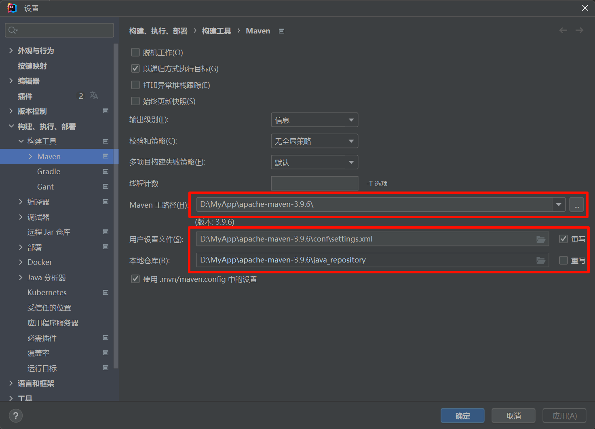
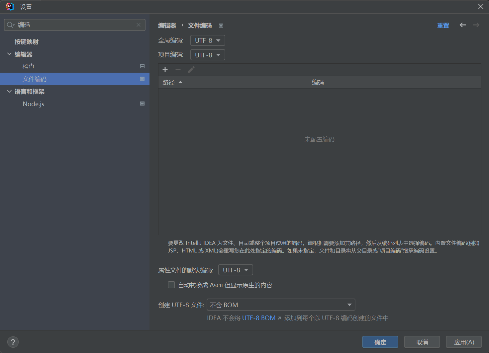
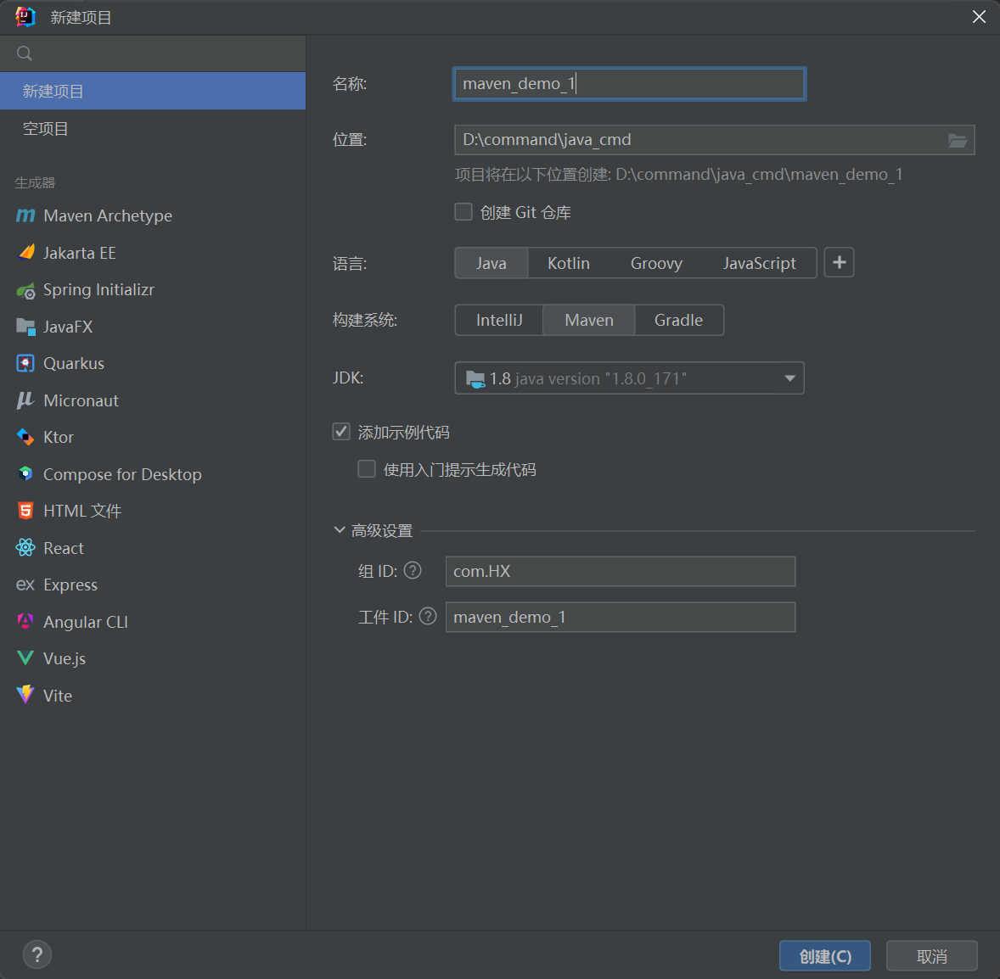
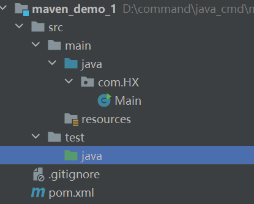
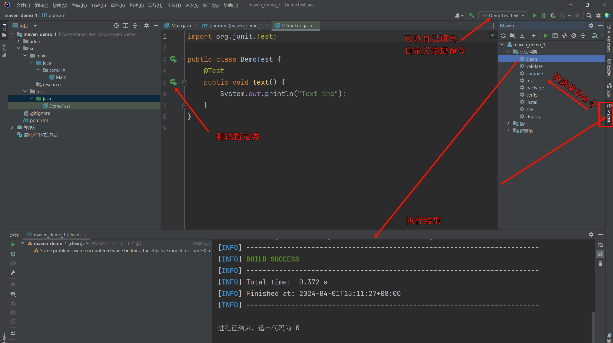
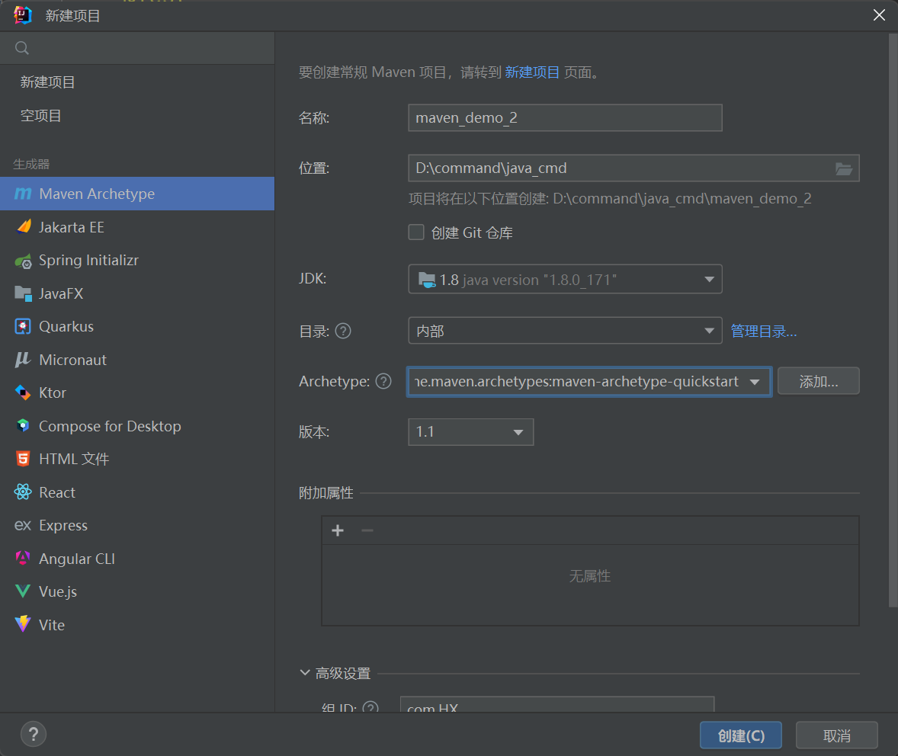
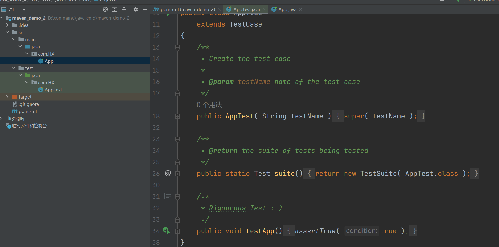
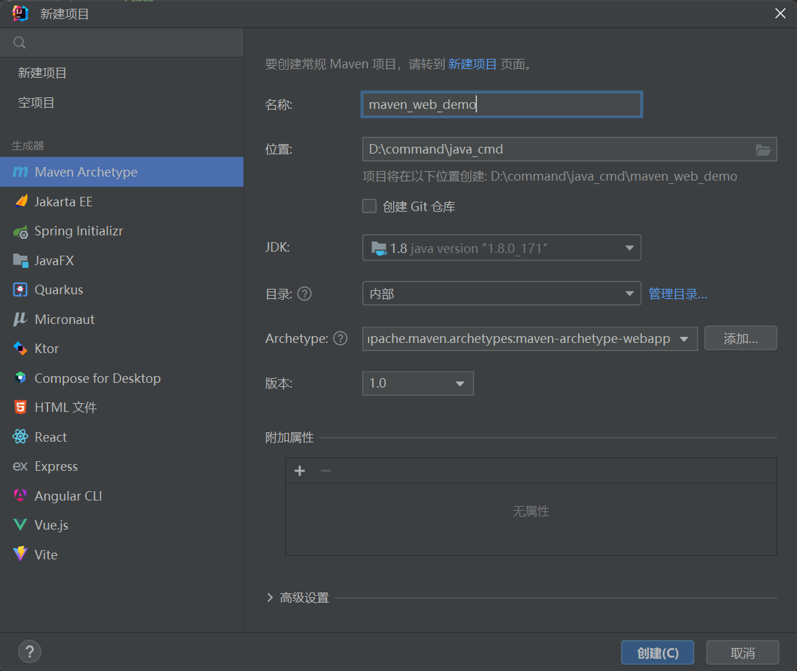
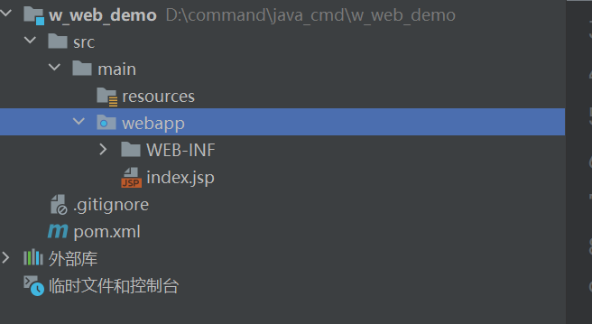
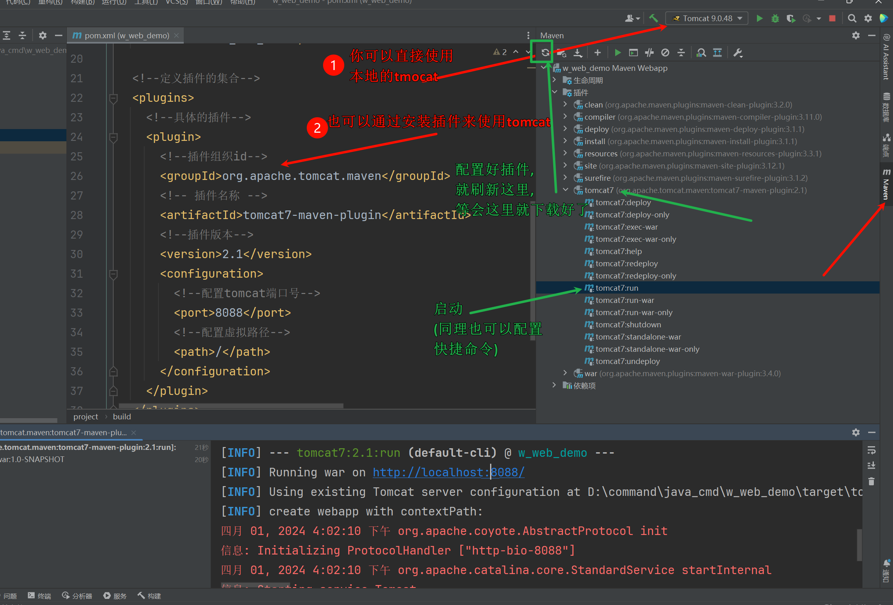

# 使用idea构建maven工程
## 前提
配置好你的maven, 还有编码
| ##container## |
|:--:|
||
||

## 在maven中创建一个工程(不使用骨架)
| ##container## |
|:--:|
||
||
||

## 使用骨架快速构建java项目
1. 空骨架

| ##container## |
|:--:|
||
|选择`...-quickstart`这是一个空的骨架|
||

3. web骨架

| ##container## |
|:--:|
||
|选择`-webapp`这个|
||
|工程目录并不完整，我们需要补齐工程目录|
||