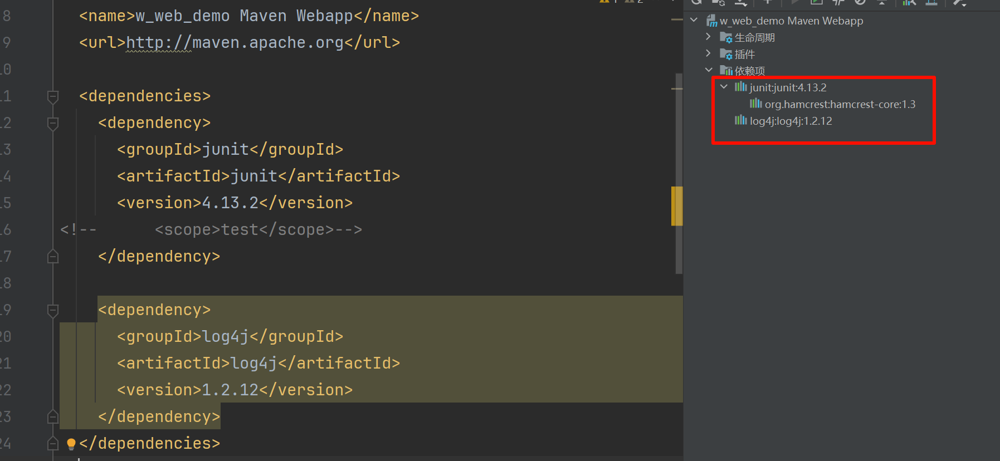
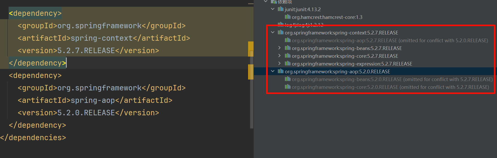
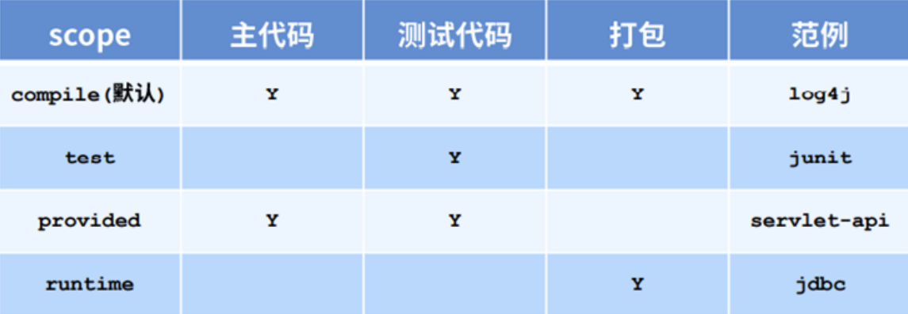

# 依赖管理
## 依赖配置与依赖传递
依赖指的是当前项目运行所需要的jar，一个项目可以有很多个依赖。
例如:

| ##container## |
|:--:|
||

**依赖传递**

依赖具有传递性：
- **直接依赖**：在当前项目中，通过依赖配置建立的依赖关系。
- **间接依赖**：被依赖的资源，如果还依赖其他资源，那么当前项目**间接**依赖其他资源。

## 解决依赖冲突的问题
依赖冲突是指项目依赖的某一个jar包，有多个不同的版本，因而造成类包版本冲突。

如下所示:

| ##container## |
|:--:|
||

通过查看依赖，我们发现`spring-aop`和`spring-context`都依赖了一个叫`spring-core`的依赖。此时`spring-core`的版本有两个。这样就产生了**依赖冲突**。

解决依赖冲突:

### 1. 对于直接依赖, 使用最后声明的

例如以下的, 对于相同的**直接依赖**`org.springframework`我们使用最后声明的`V1.1.4`
```xml
<dependency>
  <groupId>org.springframework</groupId>
  <artifactId>spring-context</artifactId>
  <version>5.2.7.RELEASE</version>
</dependency>

<dependency>
  <groupId>org.springframework</groupId>
  <artifactId>spring-context</artifactId>
  <version>1.1.4.RELEASE</version>
</dependency>
```

### 2. 对于直接依赖和间接依赖, 使用直接依赖

例如以下, 有如下依赖关系`loli -> imouto`(imouto是loli的间接依赖)

那么使用的`HX-loli`是2.2, 其子依赖`HX-imouto`也是2.2, 但是因为下面直接定义了`HX-imouto`为3.3, 所以 **使用直接依赖**: 最终: `HX-loli`是2.2, `HX-imouto`为3.3

```xml
<dependency>
  <groupId>org.HX</groupId>
  <artifactId>HX-loli</artifactId>
  <version>2.2.RELEASE</version>
</dependency>

<dependency>
  <groupId>org.HX</groupId>
  <artifactId>HX-imouto</artifactId>
  <version>3.3.RELEASE</version>
</dependency>
```

### 3. 对于间接依赖, 使用最先声明的

例如以下, 有如下依赖关系`kawaii -> loli -> imouto`(imouto是loli的间接依赖, 而 loli是kawaii的间接依赖)

因为`HX-kawaii`先声明, 而`imouto`都是`kawaii`和`loli`的间接依赖(子依赖), 所以`HX-imouto`使用先声明的`HX-kawaii`作为版本, 即: 最终: `HX-kawaii`是2.2, `HX-loli`是3.3, `HX-imouto`为2.2

```xml
<dependency>
  <groupId>org.HX</groupId>
  <artifactId>HX-kawaii</artifactId>
  <version>2.2.RELEASE</version>
</dependency>

<dependency>
  <groupId>org.HX</groupId>
  <artifactId>HX-loli</artifactId>
  <version>3.3.RELEASE</version>
</dependency>
```

### 4. 排除依赖
在不影响项目运行的情况下，如果依赖冲突，可以把被冲突的依赖排除掉，注意排除的依赖不需要添加依赖的版本号。

```xml
<dependency>
  <groupId>org.springframework</groupId>
  <artifactId>spring-context</artifactId>
  <version>5.2.7.RELEASE</version>
<exclusions>
    <exclusion>
      <artifactId>spring-core</artifactId>
      <groupId>org.springframework</groupId>
    </exclusion>
  </exclusions>
</dependency>
<dependency>
  <groupId>org.springframework</groupId>
  <artifactId>spring-aop</artifactId>
  <version>5.2.0.RELEASE</version>
</dependency>
```

### 5. 版本锁定
使用`dependencyManagement`进行版本锁定，`dependencyManagement`可以统一管理项目的版本号，确保应用的各个项目的依赖和版本一致。

如果我们项目中只想使用`spring core 5.2.0`的包，`pom.xml`可以改为如下

```xml
<dependencyManagement>
  <dependencies>
    <dependency>
      <groupId>org.springframework</groupId>
      <artifactId>spring-core</artifactId>
      <version>5.2.0.RELEASE</version>
    </dependency>
  </dependencies>
</dependencyManagement>

<dependencies>
  <dependency>
    <groupId>org.springframework</groupId>
    <artifactId>spring-context</artifactId>
    <version>5.2.7.RELEASE</version>
  </dependency>
  <dependency>
    <groupId>org.springframework</groupId>
    <artifactId>spring-aop</artifactId>
    <version>5.2.0.RELEASE</version>
  </dependency>
</dependencies>
```

你甚至可以只在`<dependencyManagement>`声明需要的版本号, 这样在`<dependencies>`中就可以不写版本了, 注意`<dependencyManagement>`中声明只是声明, 并不会导入依赖!

## 依赖范围
### 什么是依赖范围
依赖的jar包在默认情况下可以在任何范围内使用，可以通过`scope`标签来控制其作用范围。

作用范围：
- 主程序范围有效(main文件夹)
- 测试程序范围有效(test文件夹)
- 是否参与打包(package指令范围之内)

| ##container## |
|:--:|
||

> 建议学习: [彻底搞懂Maven的依赖范围（scope）](https://blog.csdn.net/hjji12/article/details/131984272)