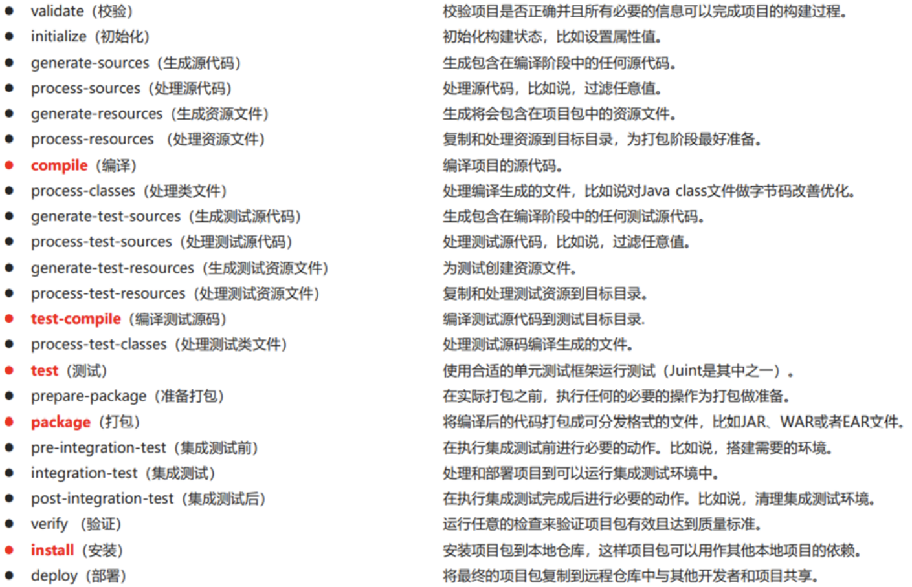
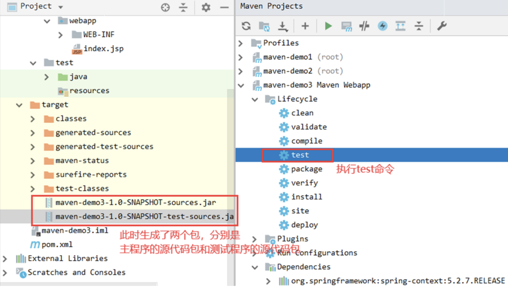

# 生命周期与插件
## 生命周期
Maven对项目周期的构建分为3套
- clean： 清理工作阶段
- default：核心工作阶段。比如编译、测试、打包、部署等
- site： 产生报告，发布站点等

---

- **clean生命周期**
    - `pre-clean`: 执行一些需要在clean之前完成的工作
    - `clean`: 移除所有上一次构建生成的文件
    - `post-clean`: 执行一些需要在clean之后立刻完成的工作

- **default生命周期**

| ##container## |
|:--:|
||

- **site生命周期**
    - pre-site 执行一些需要在生成站点文档之前完成的工作
    - site 生成项目的站点文档
    - post-site 执行一些需要在生成站点文档之后完成的工作，并且为部署做准备
    - site-deploy 将生成的站点文档部署到特定的服务器

## 插件
插件与生命周期内的阶段绑定，在执行到对应生命周期时，执行对应的插件功能

默认maven在各个生命周期阶段上绑定有预设功能

通过插件可以自定义其他功能

- 这个插件就是 在生成测试代码的时候，给主程序源代码打包、同时给测试源代码打
包:

```xml
<build>
  <plugin>
    <groupId>org.apache.maven.plugins</groupId>
    <artifactId>maven-source-plugin</artifactId>
    <version>2.2.1</version>
    <executions>
      <execution>
        <goals>
          <goal>jar</goal>
          <goal>test-jar</goal>
        </goals>
        <phase>generate-test-resources</phase>
      </execution>
    </executions>
  </plugin>
</build>
```

| ##container## |
|:--:|
||
