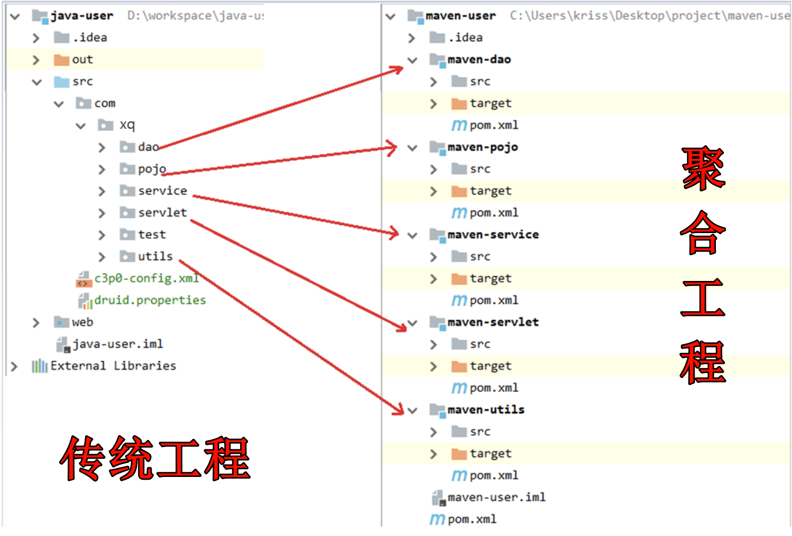
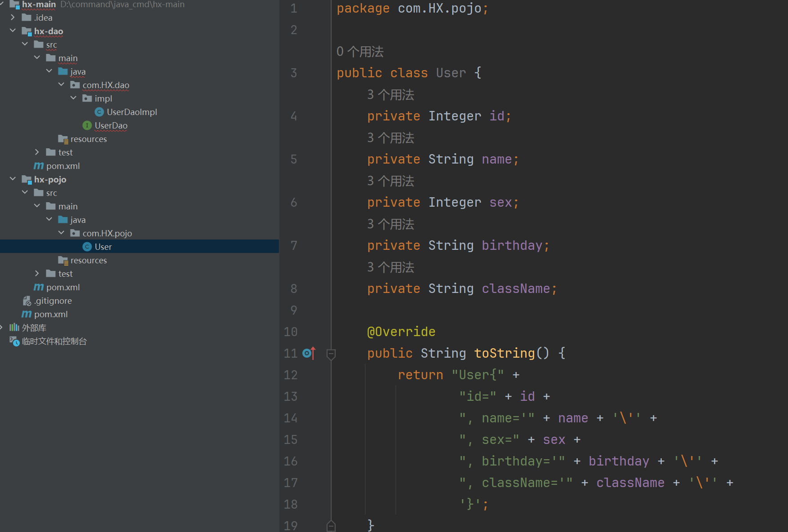
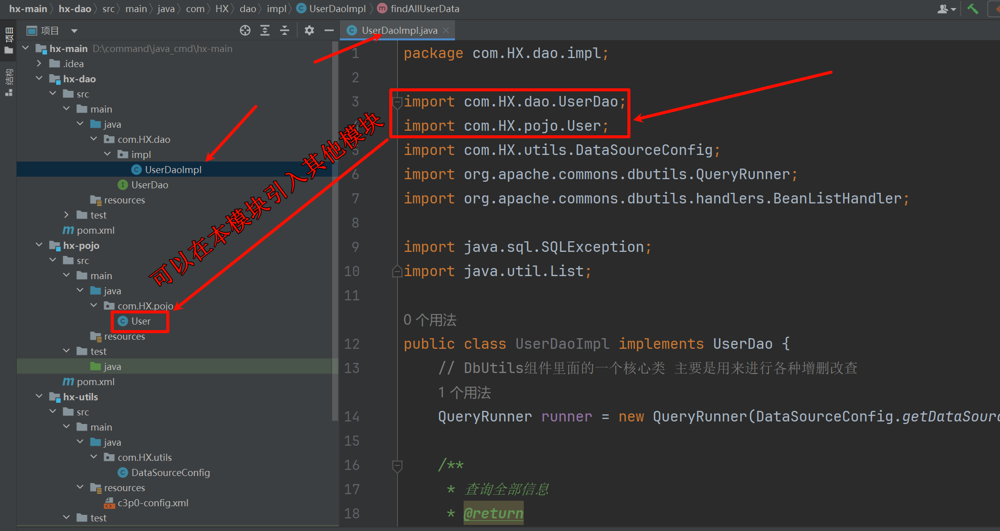
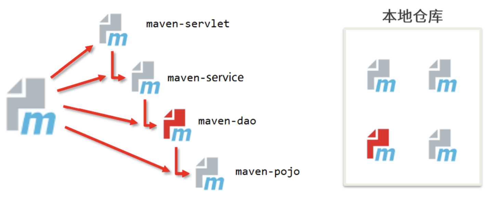
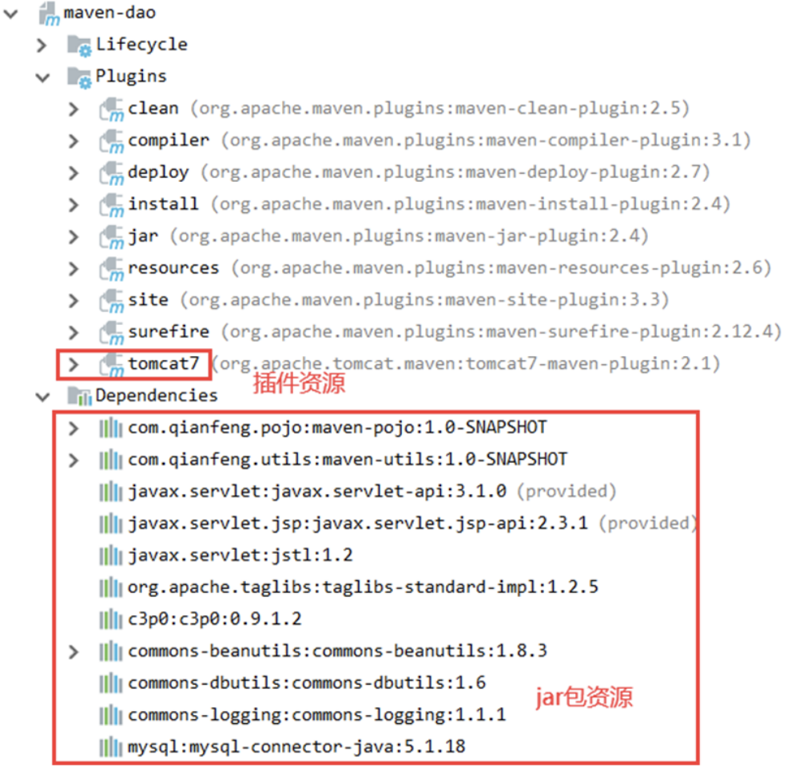
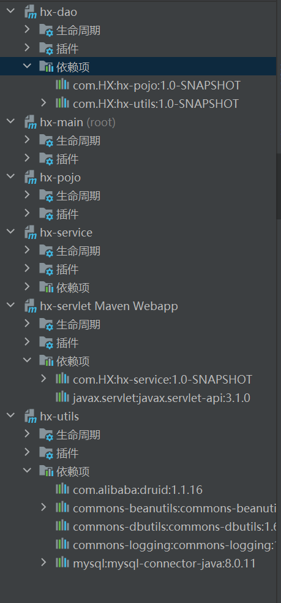

# maven分模块开发与设计
## 聚合工程
| ##container## |
|:--:|
||
|传统工程与聚合工程对比|

实际上, 以后的学习和工作中, 我们都是使用 **聚合工程**.

不要看它结构好像很复杂, 就觉得不好用, 实际上好处大大滴有:

1. **方便管理**：聚合工程的目录清晰，父工程可以集中管理依赖包，对版本进行统一控制。
2. **快速开发**：在父工程中执行构建命令，子工程会自动构建，加快开发流程。
3. **模块化结构(解耦)**：将一个项目的多个功能模块分开，然后再对每个模块进行横向切分，例如三层架构中的web层、service层和dao层，使项目结构更加清晰。
4. **统一依赖版本管理**：通过`dependencyManagement`标签，父工程可以指定jar的版本信息，子工程中引用父工程的依赖信息时，可以省略版本号，具体版本号由父工程指定.

### 实例
#### 创建父工程

使用maven创建一个父工程。在POM里面导入相关依赖:
```xml
<dependencies>
    <!-- servlet依赖的jar包start -->
    <dependency>
        <groupId>javax.servlet</groupId>
        <artifactId>javax.servlet-api</artifactId>
        <version>3.1.0</version>
        <scope>provided</scope>
    </dependency>
    <!-- servlet依赖的jar包start -->
    <!-- jsp依赖jar包start -->
    <dependency>
        <groupId>javax.servlet.jsp</groupId>
        <artifactId>javax.servlet.jsp-api</artifactId>
        <version>2.3.1</version>
        <scope>provided</scope>
    </dependency>
    <!-- jsp依赖jar包end -->
    <!--jstl标签依赖的jar包start -->
    <dependency>
        <groupId>javax.servlet</groupId>
        <artifactId>jstl</artifactId>
        <version>1.2</version>
        <!--<scope>provided</scope>-->
    </dependency>
    <!-- JSTL实现包 -->
    <dependency>
        <groupId>org.apache.taglibs</groupId>
        <artifactId>taglibs-standard-impl</artifactId>
        <version>1.2.5</version>
    </dependency>
    <!--jstl标签依赖的jar包end -->
    <dependency>
        <groupId>c3p0</groupId>
        <artifactId>c3p0</artifactId>
        <version>0.9.1.2</version>
    </dependency>
    <!--beanUtils的依赖-->
    <dependency>
        <groupId>commons-beanutils</groupId>
        <artifactId>commons-beanutils</artifactId>
        <version>1.8.3</version>
    </dependency>
    <!--dbutils组件 封装了原生的jdbc-->
    <dependency>
        <groupId>commons-dbutils</groupId>
        <artifactId>commons-dbutils</artifactId>
        <version>1.6</version>
    </dependency>
    <!--logging-->
    <dependency>
        <groupId>commons-logging</groupId>
        <artifactId>commons-logging</artifactId>
        <version>1.1.1</version>
    </dependency>
    <!--mysql驱动-->
    <dependency>
        <groupId>mysql</groupId>
        <artifactId>mysql-connector-java</artifactId>
        <version>5.1.18</version>
    </dependency>
</dependencies>

<build>
    <plugins>
        <plugin>
            <groupId>org.apache.tomcat.maven</groupId>
            <artifactId>tomcat7-maven-plugin</artifactId>
            <version>2.1</version>
            <configuration>
                <port>8088</port>
                <path>/</path>
            </configuration>
        </plugin>
    </plugins>
</build>
```

#### hx-pojo
在父工程上，右键，新建模块(使用maven构建，不使用骨架创建)。然后创建实体类

| ##container## |
|:--:|
||

#### hx-utils
在父工程上，右键，新建模块(使用maven构建，不使用骨架创建)。然后创建工具类类
```java
package com.HX.utils;

import com.mchange.v2.c3p0.ComboPooledDataSource;

import java.sql.Connection;
import java.sql.SQLException;

/**
 * 创建连接数据库的类
 */
public class DataSourceConfig {
    /**
     * 需要在c3p0-config.xml进行配置
     */
    static ComboPooledDataSource dataSource = new ComboPooledDataSource();

    /**
     * 获取数据源的方法
     * @return
     */
    public static ComboPooledDataSource getDataSource() {
        return dataSource;
    }

    /**
     * 获取连接对象
     * @return
     * @throws SQLException
     */
    public static Connection getConnection() throws SQLException {
        return dataSource.getConnection();
    }
}
```

c3p0-config.xml内容: (请放到资源文件夹)
```xml
<?xml version="1.0" encoding="UTF-8"?>
<c3p0-config>
    <default-config>
        <property name="driverClass">com.mysql.jdbc.Driver</property>
        <property name="jdbcUrl">jdbc:mysql://127.0.0.1:3306/hx_demo</property>
        <property name="user">root</property>
        <property name="password">root</property>
        <!--
            初始化的连接数量 在连接池里面初始化10个连接对象
        -->
        <property name="initialPoolSize">10</property>
        <!--
           最大空闲时间
           某一个连接对象空闲时长最多是30s，超过了30s，该连接对象会被自动回收
        -->
        <property name="maxIdleTime">30</property>
        <!--
            最大连接数量
            在连接池里面存在最多的连接数量
        -->
        <property name="maxPoolSize">100</property>
        <!--
           最小连接数量
        -->
        <property name="minPoolSize">10</property>
    </default-config>
</c3p0-config>
```

#### hx-dao
在父工程上，右键，新建模块(使用maven构建，不使用骨架创建)。然后创建接口以及实现类。

- pom文件
    - 由于这个模块需要用到实体类，操作数据库也需要用到工具类。所以dao模块需要依赖`pojo`和`utils`模块

```xml
<dependencies>
    <dependency>
        <groupId>com.HX</groupId>
        <artifactId>hx-pojo</artifactId>
        <version>1.0-SNAPSHOT</version>
    </dependency>

    <dependency>
        <groupId>com.HX</groupId>
        <artifactId>hx-utils</artifactId>
        <version>1.0-SNAPSHOT</version>
    </dependency>
</dependencies>
```

| ##container## |
|:--:|
||


```java
package com.HX.dao.impl;

import com.HX.dao.UserDao;
import com.HX.pojo.User;
import com.HX.utils.DataSourceConfig;
import org.apache.commons.dbutils.QueryRunner;
import org.apache.commons.dbutils.handlers.BeanListHandler;

import java.sql.SQLException;
import java.util.List;

public class UserDaoImpl implements UserDao {
    // DbUtils组件里面的一个核心类 主要是用来进行各种增删改查 (类似于对jdbc的封装)
    QueryRunner runner = new QueryRunner(DataSourceConfig.getDataSource());

    /**
     * 查询全部信息
     * @return
     */
    @Override
    public List<User> findAllUserData() {
        String sql = "select id, name, sex, birthday, className from stu where id < ?";
        try {
            List<User> query = runner.query(sql, 10, new BeanListHandler<User>(User.class));
            return query;
        } catch (SQLException e) {
            e.printStackTrace();
            throw new RuntimeException(e);
        }
    }
}
```

#### hx-service
在父工程上，右键，新建模块(使用maven构建，不使用骨架创建)。然后创建业务接口以及实现类。

- pom文件
    - 由于service模块需要调用dao模块里面的数据。所以service模块依赖dao模块。
        - 而dao模块已经导入了pojo和工具类的依赖, 那么service模块也会**继承**
  

```xml
<dependencies>
    <dependency>
        <groupId>com.HX</groupId>
        <artifactId>hx-dao</artifactId>
        <version>1.0-SNAPSHOT</version>
    </dependency>
</dependencies>
```

#### hx-servlet
在父工程上，右键，新建模块(使用maven构建，使用骨架创建)。然后创建servlet

servlet依赖service，请自行配置pom, 这里不多赘述

```C++
package com.HX.servlet;

import com.HX.service.UserService;
import com.HX.service.impl.UserServiceImpl;

import javax.servlet.ServletException;
import javax.servlet.annotation.WebServlet;
import javax.servlet.http.HttpServlet;
import javax.servlet.http.HttpServletRequest;
import javax.servlet.http.HttpServletResponse;
import java.io.IOException;
import java.io.PrintWriter;

@WebServlet("/say")
public class UserServlet extends HttpServlet {
    @Override
    protected void doGet(HttpServletRequest req, HttpServletResponse resp) throws ServletException, IOException {
        resp.setCharacterEncoding("UTF-8");
        resp.setContentType("text/html;charset=utf-8");
        PrintWriter writer = resp.getWriter();
        writer.print("<h1>Hello this is say.jsp desu!</h1>");
        UserService userService = new UserServiceImpl();
        writer.print(userService.findAllUserData());
        writer.flush();
        writer.close();
    }
}
```

然后在插件处启动tomcat-run即可, 如果不行, 请在父目录的pom那里启动

## 聚合与继承
### 聚合

> 注: 聚合这个操作, 在上面操作中, 编译器已经帮我们自动导入了!!!!!

我们思考一个问题:

- 上面的各个模块是分开独立开发的，彼此互相独立，互补影响。假设如果现在`hx-dao`模块更新升级了，那么其他模块是如何感知dao模块发生了变化的?

| ##container## |
|:--:|
||

**解决方案**:

会不会有一个工程，专门对这些模块进行管理。对这些模块进行统一的编译，测试，打包等操作。一旦一个模块发生了变化，会同时对其他模块也进行编译、测试、打包。

此时就需要用到聚合的思想。

聚合的作用：用于快速构建maven工程，一次性管理多个模块。

例如:

父模块:

```xml
<packaging>pom</packaging> <!--定义打包方式-->
<modules>
    <module>hx-dao</module>
    <module>hx-pojo</module>
    <module>hx-utils</module>
    <module>hx-service</module>
    <module>hx-servlet</module>
</modules>
```

子模块: 引入父工程

```xml
<parent>
    <groupId>com.HX</groupId>
    <artifactId>hx-main</artifactId>
    <version>1.0-SNAPSHOT</version>
</parent>
```

此时在父模块执行`生命周期`会连带子模块一起编译等

问题：编译的顺序是怎么样的?

- 参与聚合操作的模块最终执行顺序与模块的依赖关系有关系。跟配置顺序没有关系。

- 各个模块的打包方式
    - 父工程打pom
    - Web工程打war包
    - 其他工程 打jar包(如果没有任何打包配置，默认就是打jar包)

### 继承
通过继承可以实现在父工程中的配置，让子模块沿用思考。类似于java中的继承关系。

实现：
- 在子模块中，使用parent标签引入父工程，这样子工程和父工程就有了继承关系了
 
```xml
<parent>
    <groupId>com.HX</groupId>
    <artifactId>hx-main</artifactId>
    <version>1.0-SNAPSHOT</version>
</parent>
```

#### 优化分配
可以看到, dao层只用到了部分模块, 但把其他的jar包, 甚至tomcat都导入了
| ##container## |
|:--:|
||

思考：这样的做法有没有问题？

答案：有，并不是子模块都需要所有父工程的资源。以maven-dao为例，这个子模块并不需要tomcat插件，也不需要servlet jsp相关的依赖。如果全部资源都继承下来会导致子模块特别大，将来打包，部署效率比较低。

解决方案：

- 使用`<dependencyManagement>`标签帮我们管理依赖, 当然插件就使用`<pluginManagement>`来管理

```xml
<dependencyManagement>
    <dependencies>
        <!-- ... -->
        <!--logging-->
        <dependency>
            <groupId>commons-logging</groupId>
            <artifactId>commons-logging</artifactId>
            <version>1.1.1</version>
        </dependency>
        <!--mysql驱动-->
        <dependency>
            <groupId>mysql</groupId>
            <artifactId>mysql-connector-java</artifactId>
            <version>8.0.11</version>
        </dependency>
    </dependencies>
</dependencyManagement>

<build>
    <pluginManagement>
        <plugins>
            <plugin>
                <groupId>org.apache.tomcat.maven</groupId>
                <artifactId>tomcat7-maven-plugin</artifactId>
                <version>2.1</version>
                <configuration>
                    <port>8088</port>
                    <path>/</path>
                </configuration>
            </plugin>
        </plugins>
    </pluginManagement>
</build>
```

`hx-servlet`节选
```xml
<dependencies>
    <dependency>
        <groupId>com.HX</groupId>
        <artifactId>hx-service</artifactId>
        <version>1.0-SNAPSHOT</version>
        <scope>compile</scope>
    </dependency>
    <dependency>
        <groupId>javax.servlet</groupId>
        <artifactId>javax.servlet-api</artifactId>
        <scope>compile</scope>
    </dependency>
</dependencies>

<build>
    <plugins>
        <plugin>
            <!-- 同样不需要填写版本, 也不需要再次配置 -->
            <groupId>org.apache.tomcat.maven</groupId>
            <artifactId>tomcat7-maven-plugin</artifactId>
        </plugin>
    </plugins>
</build>
```


在子模块中按照自己的需求，引入对应的依赖，此时不需要加依赖的版本号了，因为在父工程里面已经给我们定义好了。

| ##container## |
|:--:|
||

清晰, 精简多了!

### 总结
聚合和继承的关系
- 作用:
    - 聚合用于快速构建项目
    - 继承用于快速配置
- 相同点:
    - 聚合与继承的`pom.xml`文件打包方式均为`pom`。可以将两种关系定义在同一个`pom`文件中。
    - 聚合和继承均属于设计系模块，并无实际的模块内容
- 不同点:
    - 聚合是在当前模块中配置关系，聚合可以感知到参与聚合的模块都有哪些
    - 继承是在子模块中配置关系，父模块无法感知哪些子模块继承了自己