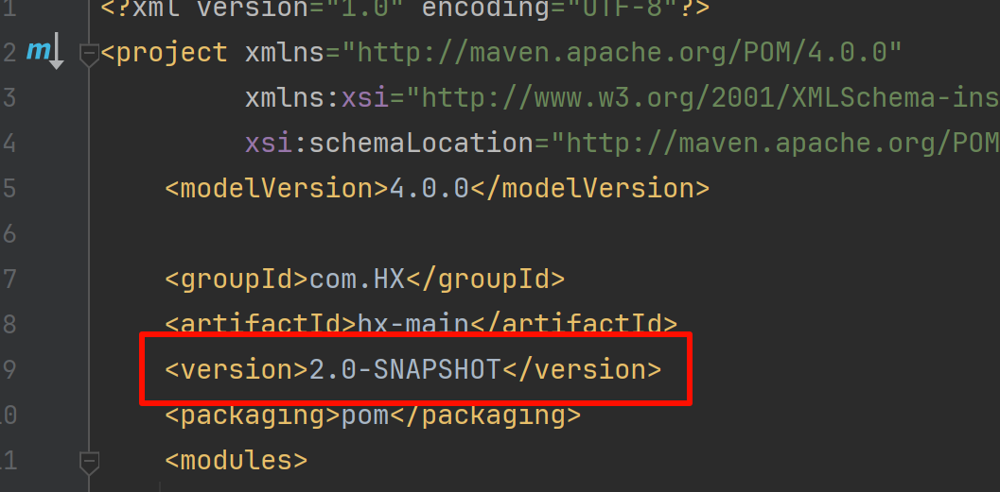
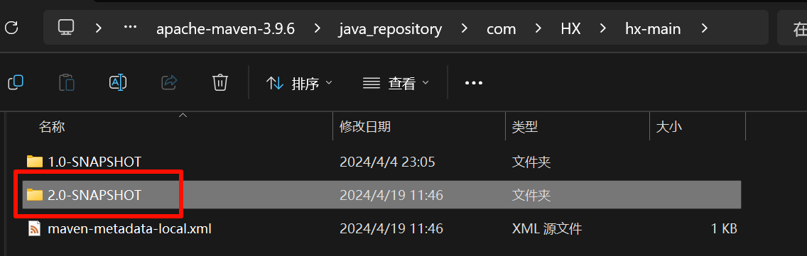

# 版本管理
我们的模块开发完成之后，并不是一成不变的。后续肯定会进行更新升级，那么这样会形成多个版本，那么如何来区分这些版本呢?

## 工程版本
### SNAPSHOT (快照版本)
- 项目开发过程中，为方便团队成员合作，解决模块间相互依赖和时时更新的问题，开发者对每个模块进行构建的时候，输出的临时性版本叫快照版本 (测试阶段版本)

- 快照版本会随着开发的进展不断更新

### RELEASE (发布版本)
- 项目开发到进入阶段里程碑后，向团队外部发布较为稳定的版本，这种版本所对应的构件文件是稳定的，即便进行功能的后续开发，也不会改变当前发布版本内容，这种版本称为发布版本

- 测试:

| ##container## |
|:--:|
|我们在hx-main上面自定义版本|
||
|然后 打包安装(install|
|观察本地仓库|
||

## 工程版本号约定
- 约定规范:
    - <主版本>.<次版本>.<增量版本>.<里程碑版本>
    - 主版本: 表示项目重大架构的变更，如：spring5相较于spring4的迭代
    - 次版本: 表示有较大的功能增加和变化，或者全面系统地修复漏洞
    - 增量版本: 表示有重大漏洞的修复
    - 里程碑版本: 表明一个版本的里程碑（版本内部）。这样的版本同下一个正式版本相比，相对来说不是很稳定，有待更多的测试

- 范例:
    - 5.1.9.RELEASE