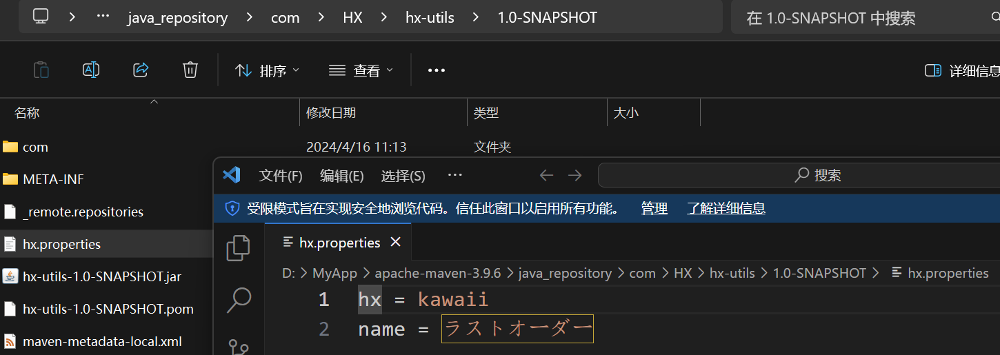

# 在配置文件引入pom属性
我们可以在任意配置文件中加载`POM`属性

格式: `${usr.name}`

示例:

1. 在`hx-utils`的pom中定义属性: (标签名称可以自定义)

```xml
<properties>
    <loli.hx>kawaii</loli.hx>
    <loli.name>ラストオーダー</loli.name>
<properties>
```

2. 在`hx-utils`的`hx.properties`中加载这些属性值:

```properties
hx = ${loli.hx}
name = ${loli.name}
```

3. 在`hx-utils`的pom中定义如下配置:

```xml
<build>
    <resources>
        <resource>
            <!--
                ${project.basedir} 是一个宏, 
                意思是从任意子模块的根目录开始加载
            -->
            <directory>${project.basedir}/src/main/resources</directory>
            <!-- true 表示开始加载, 否则不能读取 -->
            <filtering>true</filtering>
        </resource>
    </resources>
</build>
```

4. 构建`install`后, 解压jar包, 有:

| ##container## |
|:--:|
||
|可以看到, 值已经被替换了|