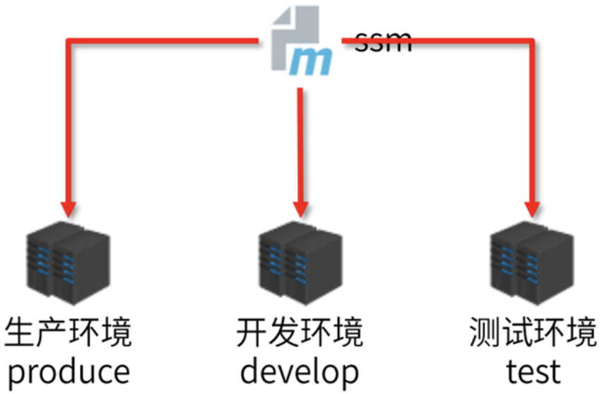
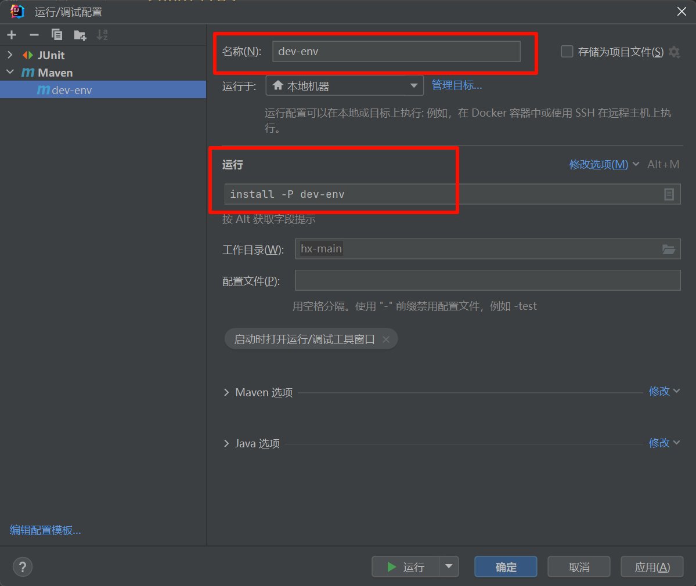
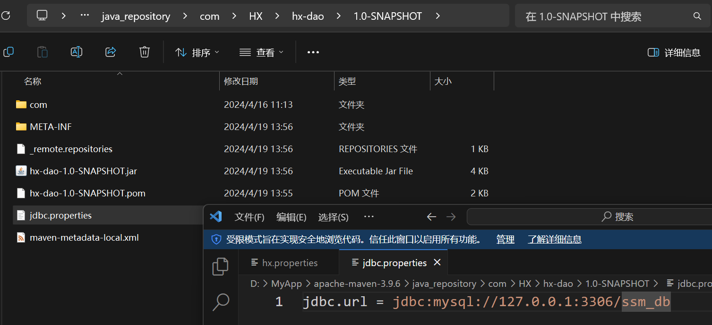

# maven中多环境的配置与切换
在实际开发中，生产环境的配置和开发环境的配置是不一样的。比如生产环境使用的数据库和开发环境的数据库就不一样。那么在项目由开发环境切换到生产环境的时候，配置应该如何更改?

| ##container## |
|:--:|
||

实例:

1. 在`hx-dao/pom.xml`中写入:
```xml
<profiles>
    <!-- 生成环境的数据库信息 -->
    <profile>
        <id>pro-env</id> <!-- 环境名称, 自定义 -->
        <properties>
            <jdbc.url>jdbc:mysql://127.1.1.1:3306/ssm_db</jdbc.url>
        </properties>
    </profile>

    <!-- 开发环境的数据库信息 -->
    <profile>
        <id>dev-env</id>
        <properties>
            <jdbc.url>jdbc:mysql://127.0.0.1:3306/ssm_db</jdbc.url>
        </properties>
    </profile>
</profiles>
```

2. 在`properties`文件中指定

```properties
jdbc.url = ${jdbc.url}
```

3. 那么如何根据指定的开发环境进行运行呢?
    - 格式: `指令 –P 环境名称`

| ##container## |
|:--:|
||
||
|打包后, 可以看到确实是被替换了|
