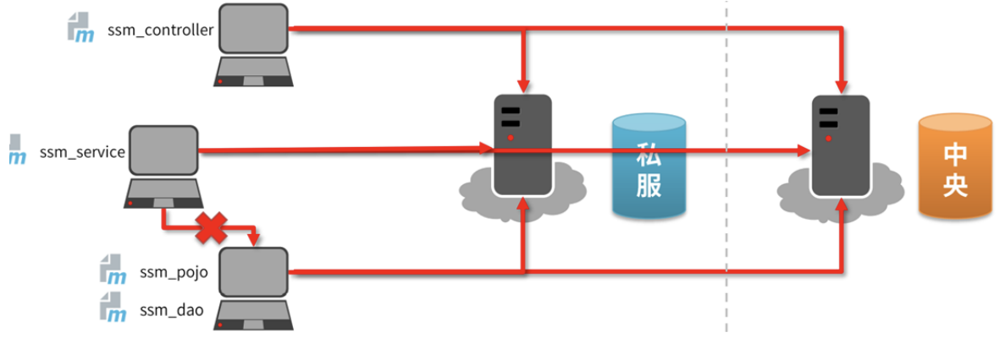
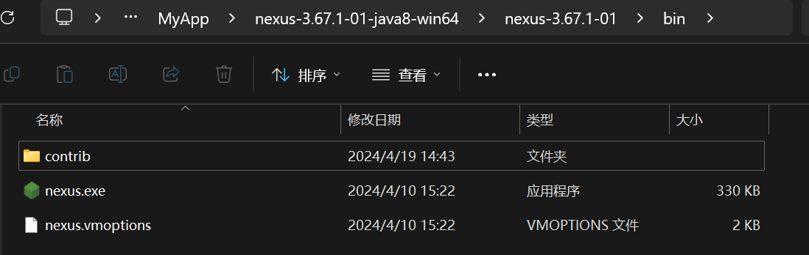
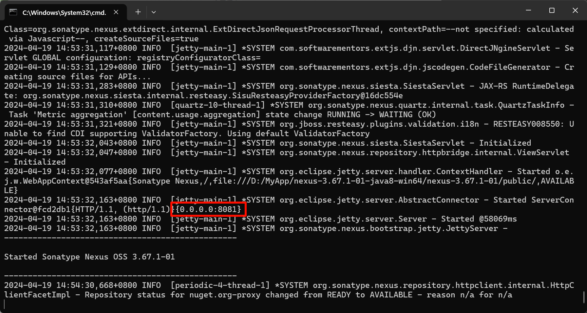
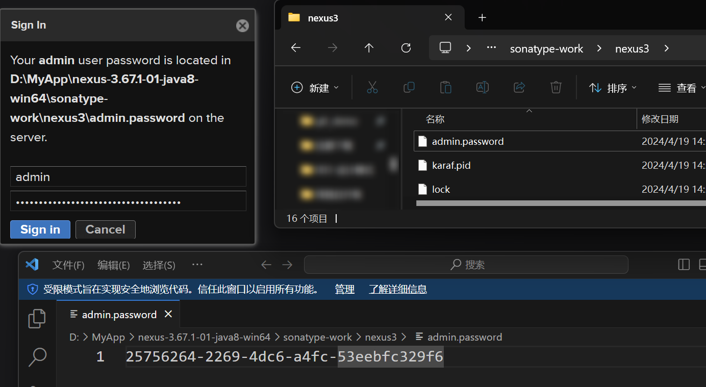

# 搭建maven私服服务器nexus
我们的项目都是协同开发的，并不是一个人开发所有的模块。如果每个人开发不同的模块，当我们需要别人的模块时，怎么获取?用硬盘拷贝吗?很显然不可取。

应该怎么办?

可不可以把大家开发的模块都放在一个公共的服务器上，大家需要别人的模块时，只需要从这个公共的服务器去获取就可以。

| ##container## |
|:--:|
||

## 搭建私服
- Nexus是SonaType公司的一款maven私服产品
- 下载地址: [Nexus下载](https://help.sonatype.com/repomanager3/download)

直接解压即可使用!

去到这个目录:

| ##container## |
|:--:|
||

召唤出cmd, 输入命令运行: `nexus.exe /run nexus`

等待一小会, 出现这个就是部署成功:

| ##container## |
|:--:|
||
|默认的端口号是 8081|

在浏览器使用`127.0.0.1:8081`然后登录:

| ##container## |
|:--:|
||

第一次需要输入密码, 然后设置新密码... (我都设置为`admin`了)

- 修改基础配置信息
    - 在etc目录下面的`nexus-default.properties`文件中保存nexus的基础配置信
息。比如默认访问端口

- 修改服务器运行配置信息
    - 在bin目录中的`nexus.vmoptions`文件保存有nexus服务器运行的配置信息。
比如内存分配的信息等

(我全部默认了awa..)

至此安装完成!