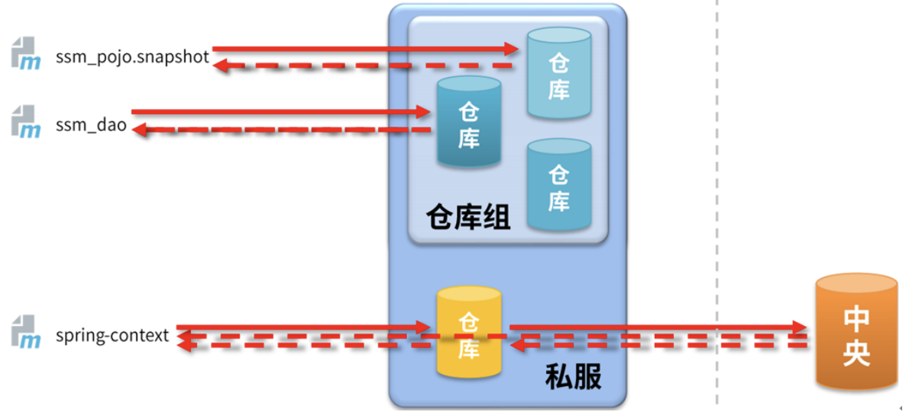
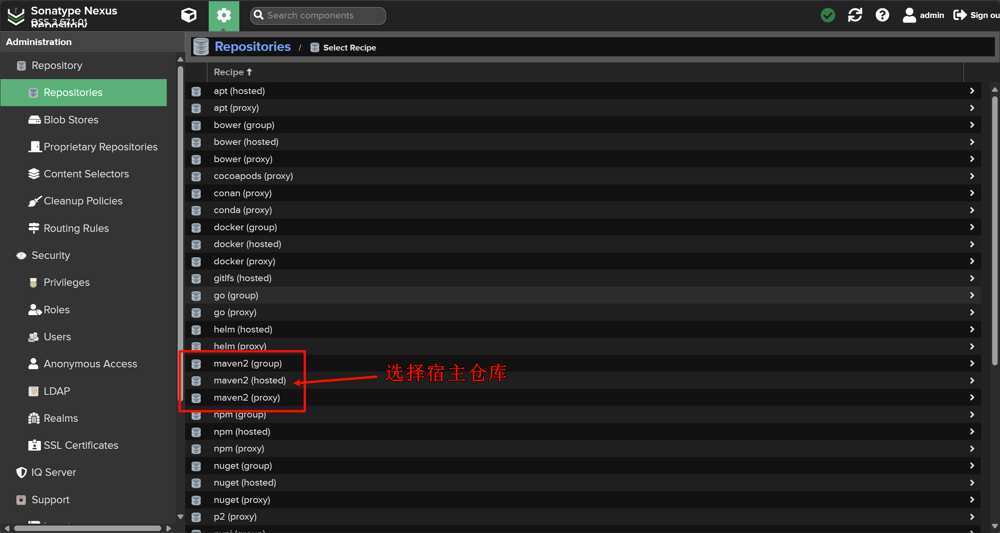
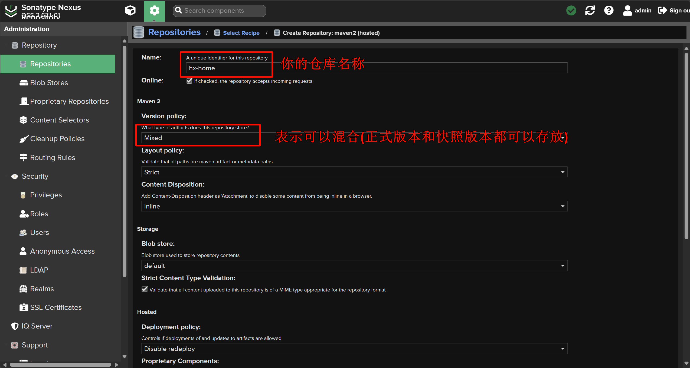
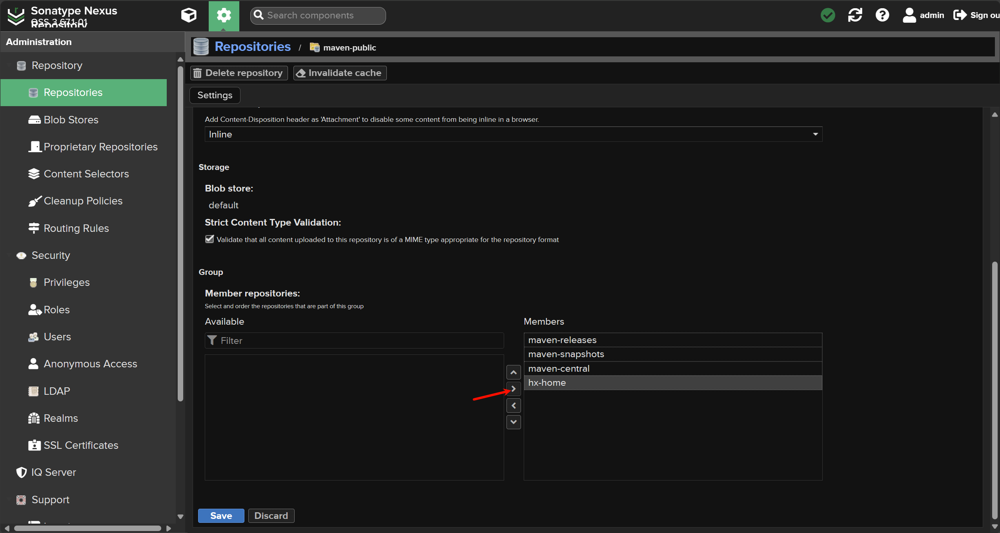
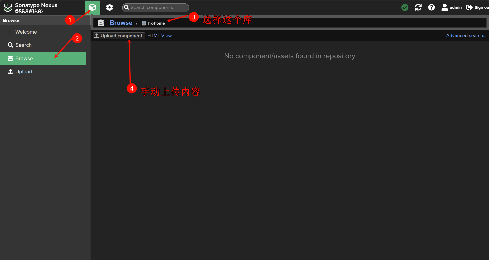
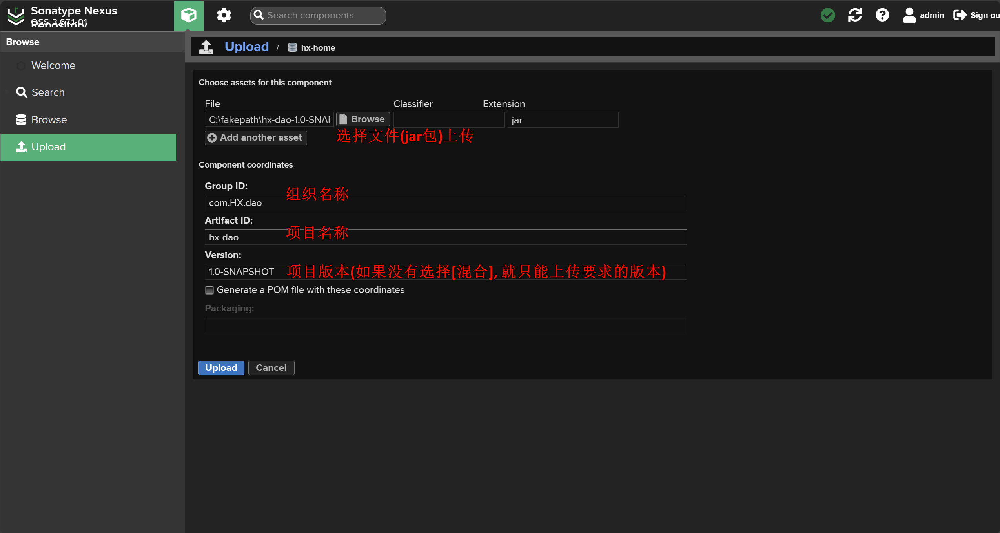

# 创建私服仓库，并上传资源到私服仓库

| ##container## |
|:--:|
||

## 仓库的分类
- 宿主仓库`hosted`
    - 保存无法从中央仓库获取的资源
        - 自主研发
        - 第三方非开源项目
- 代理仓库`proxy`
    - 代理远程仓库，通过nexus访问其他公共仓库，例如中央仓库
- 仓库组`group`
    - 将若干个仓库组成一个群组，简化配置
    - 仓库组不能保存资源，属于设计型仓库

## 登录私服
~~太简单了~~

## 创建仓库

| ##container## |
|:--:|
||
||
||
|将创建的仓库加入到仓库组里面来(添加到`maven-public`这个组), 点击`maven-public`这个组，进入到添加页面|
||
|记得save保存|

## 向仓库上传资源

| ##container## |
|:--:|
||
||
|然后上传即可|