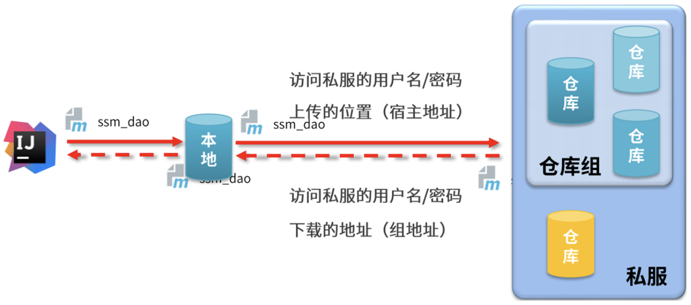
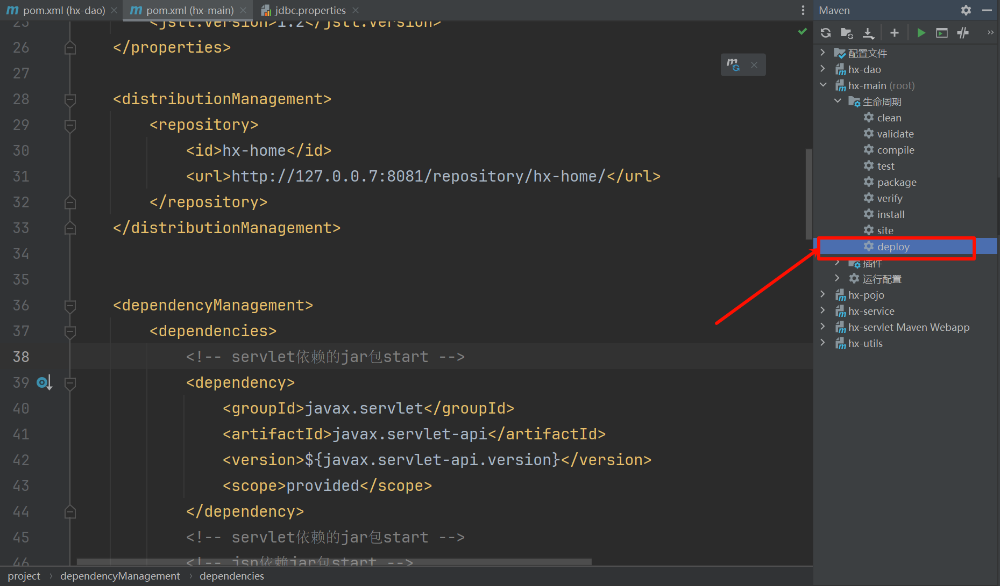
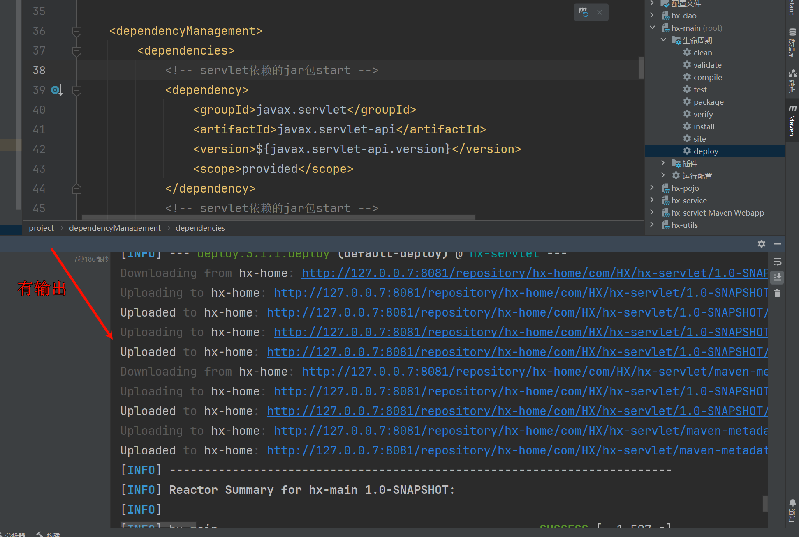
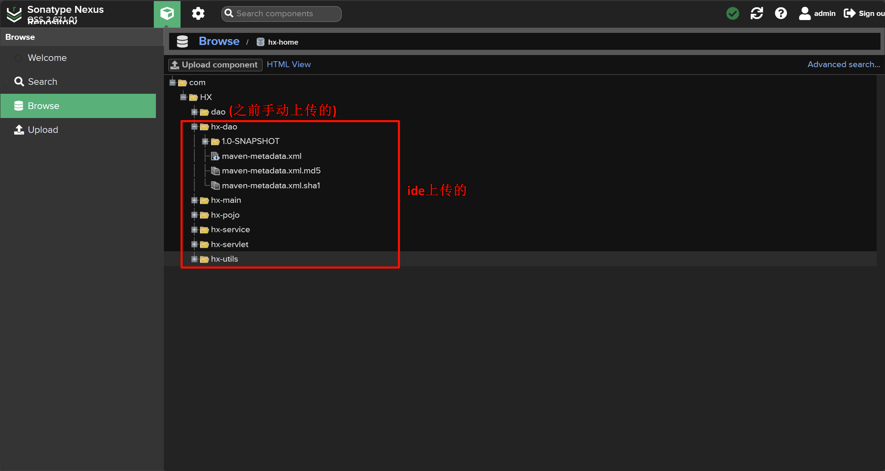

# IDEA环境中资源上传与下载

| ##container## |
|:--:|
||

- 配置maven客户端的`settings`配置文件

```xml
<!--配置访问krisswen-release的仓库名称、用户名、密码-->
<server>
    <id>krisswen-release</id>
    <username>admin</username>
    <password>admin</password>
</server>
```

- 配置私服的地址

```xml
<mirror>
    <id>nexus-hx-home</id>
    <mirrorOf>*</mirrorOf>
    <url>http://localhost:8081/repository/maven-public/</url>
</mirror>
```

- 配置当前项目访问私服上传资源保存的位置

```xml
<distributionManagement>
    <repository>
        <id>hx-home</id>
        <url>http://127.0.0.7:8081/repository/hx-home/</url>
    </repository>
</distributionManagement>
```

- 发布资源到私服的命令: `mvn deploy`

| ##container## |
|:--:|
||
||

- 最后在私服上面查看是否上传成功:

| ##container## |
|:--:|
||
