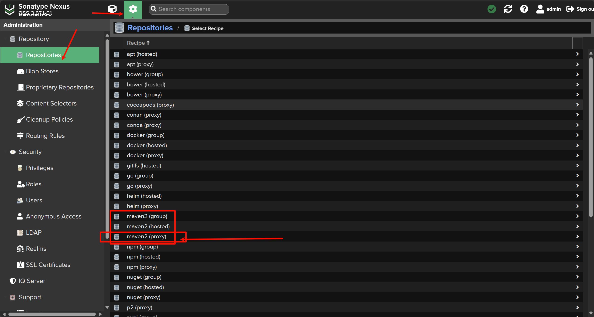
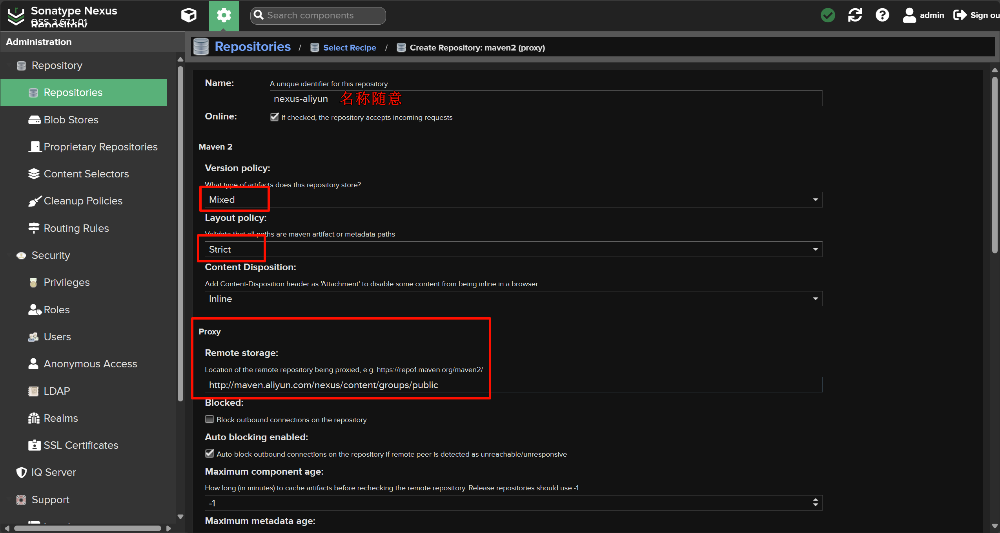
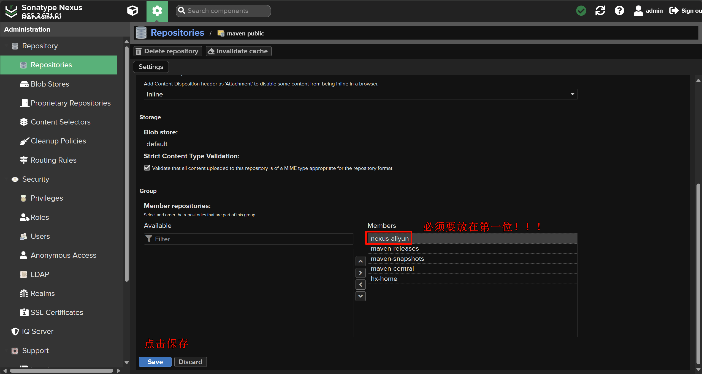

# nexus代理阿里云仓库
为了提高资源的下载速度，我们也可以在nexus官方仓库中添加国内阿里云maven仓
库。具体操作如下:

1. 点击`repositories`, 创建新的仓库:

| ##container## |
|:--:|
||

2. 写上内容:

阿里云仓库url: http://maven.aliyun.com/nexus/content/groups/public




3. 将创建的仓库添加到仓库组`maven-public`, 把阿里云代理仓库设置为第一位(**一定!**)

| ##container## |
|:--:|
||

4. 设置maven的`setting.xml`文件

```xml
<!-- 使用nexus 配置镜像 -->
<mirror>
    <id>nexus-aliyun</id>
    <mirrorOf>*</mirrorOf>
    <name>Nexus aliyun</name>
    <url>http://localhost:8081/nexus/repository/maven-public/</url>
</mirror>
```
或者在项目的`pom.xml`里面指定仓库路径:

```xml
<repositories>
    <repository>
        <id>nexus-central</id>
        <name>nexus-central</name>
        <url>http://localhost:8081/repository/maven-public/</url>
        <releases>
        <enabled>true</enabled>
        </releases>
            <snapshots>
            <enabled>true</enabled>
        </snapshots>
    </repository>
</repositories>
```