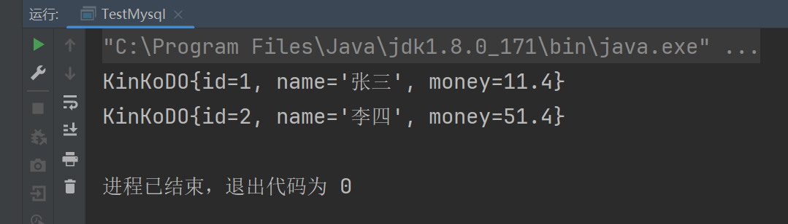
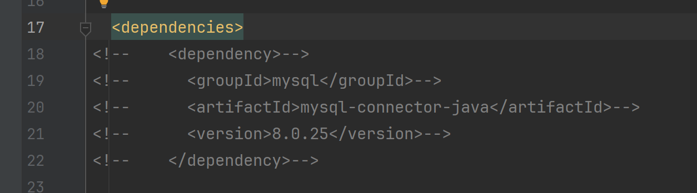
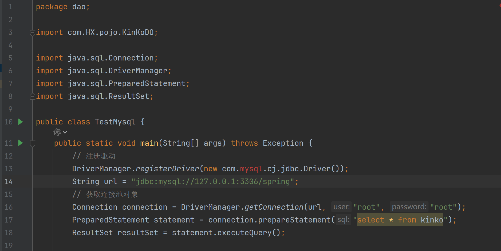
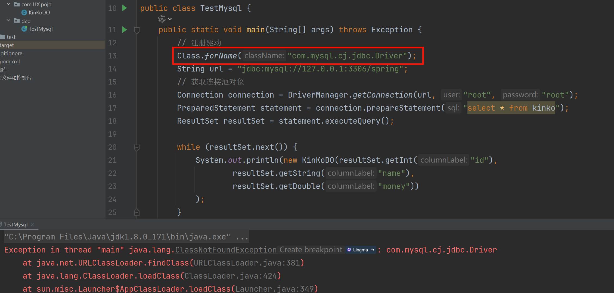
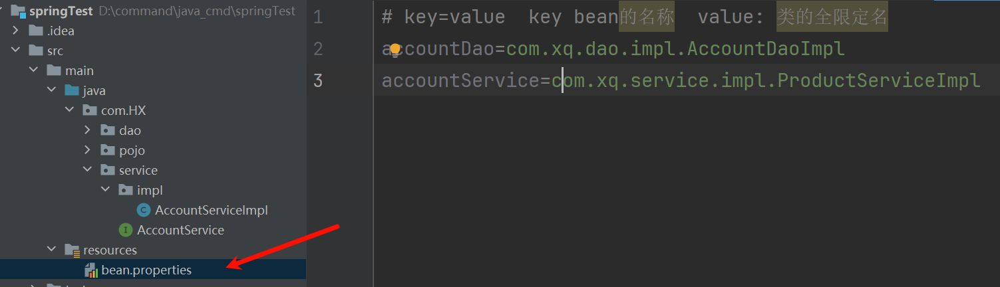
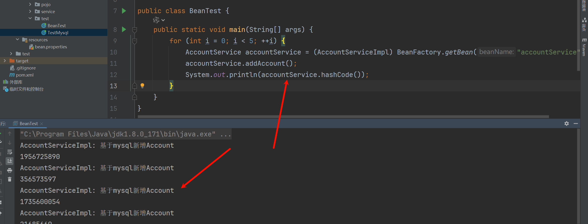
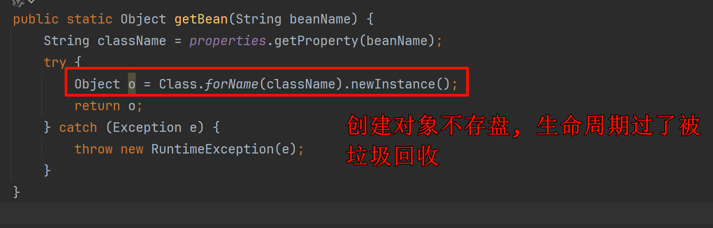

# 1.2 程序中的耦合
## 1.2.1 使用反射解耦
### 1.2.1.1 代码示例

```xml
<dependency>
  <groupId>mysql</groupId>
  <artifactId>mysql-connector-java</artifactId>
  <version>8.0.25</version>
</dependency>
```

```java
package dao;

import com.HX.pojo.KinKoDO;

import java.sql.Connection;
import java.sql.DriverManager;
import java.sql.PreparedStatement;
import java.sql.ResultSet;

public class TestMysql {
    public static void main(String[] args) throws Exception {
        // 注册驱动
        DriverManager.registerDriver(new com.mysql.cj.jdbc.Driver());
        String url = "jdbc:mysql://127.0.0.1:3306/spring";
        // 获取连接池对象
        Connection connection = DriverManager.getConnection(url, "root", "root");
        PreparedStatement statement = connection.prepareStatement("select * from kinko");
        ResultSet resultSet = statement.executeQuery();

        while (resultSet.next()) {
            System.out.println(new KinKoDO(
                    resultSet.getInt("id"),
                    resultSet.getString("name"),
                    resultSet.getDouble("money")
            ));
        }
        resultSet.close();
        statement.close();
        connection.close();
    }
}
```

查看效果:



显然没有问题.

此时代码是没有问题的。但是如果我们把POM文件中的依赖注释掉呢?



我们`Ctrl+F9`编译一下再看,此时程序报错:



### 1.2.1.2 耦合分析以及解决方案 
什么是耦合?
- 耦合指的是程序间的依赖关系
- 类的依赖关系
- 方法的依赖关系

注意: 我们不能消除程序间的依赖关系，只能尽可能的降低程序的依赖关系。

这种降低程序间的依赖关系就叫做解耦。

如何解耦：在实际开发中，我们应该做到在编译期不依赖，在运行期依赖。

所以我们对上面的代码进行改造:



此时重新编译代码，这个时候就不会报错。然后我们运行试试（此时`pom.xml`的坐标被注释了，在运行时会报异常）

但是！！！如果我现在不使用`mysql`驱动，换成`oracle`驱动呢?
- 我们需要在源代码上去将`mysql`驱动改成`oracle`驱动，这样修改源代码，违反了项目开发的原则。

- 怎么解决?
    - 将驱动信息定义在配置文件里面，通过读取配置文件的形式，来获取我们的配置信息。

总结: 降低耦合的思路
1. 使用反射的机制，避免使用`new`关键字。
2. 通过读取配置文件的方式来获取资源的全限定名。

## 1.2.2 使用工厂解耦
### 1.2.2.1 示例代码

DAO层
```java
public interface AccountDao {
    // 模拟新增account方法
    public void addAccount();
}
```
```java
public class AccountDaoImpl implements AccountDao {
    @Override
    public void addAccount() {
        System.out.println("addAccount");
    }
}
```

service层
```java
public interface AccountService {
    // 模拟新增账户接口
    public void addAccount();
}
```
```java
public class AccountDaoImpl implements AccountDao {
    // 新增账户方法
    @Override
    public void addAccount() {
        AccountDao accountDao = new AccountDaoImpl();
        accountDao.addAccount();
    }
}
```

### 1.2.2.2 耦合分析以及解决方案 
此时我们也会发现问题:
- 在业务层里面(service层)会去调用dao层。这就是刚刚提到的耦合性问题。
- 如果此时删除掉接口的实现类，必然编译报错。
---
在解决问题之前，我们先**明确几个概念**:
1. **Bean**: 在计算机英语中，有可重用组件（如持久层和业务层的接口和重用）的含义。
2. **JavaBean**: 其实`JavaBean`并不完全等于实体类，因为实体类只是可重用组件的一部分，也就是`JavaBean`的范围大于实体类的范围。

`JavaBean`的含义: 用Java语言编写的可重用组件。

3. 工厂就是创建我们的`service`和`dao`对象的(`JavaBean`)。
---
**解决步骤**:
1. 需要一个配置文件来配置我们的`service`和`dao`。
    - 配置的内容: `唯一标志 = 全限定类名`(`key=value`)。

2. 通过读取配置文件中配置的内容，反射创建对象。
---
**配置文件的选取**:
1. `xml` (当然后期`spring`框架用的肯定是`xml`)
2. `properties` (读取更简单，我们这个例程先选用这种)
    - 定义配置文件

```properties
# key=value  key bean的名称  value: 类的全限定名
accountDao=com.HX.dao.impl.AccountDaoImpl
accountService=com.HX.service.impl.AccountServiceImpl
```



编写一个工厂类来获取配置:

```java
import java.io.IOException;
import java.io.InputStream;
import java.util.Properties;

public class BeanFactory {
    static Properties properties;

    static {
        InputStream is = BeanFactory.class.getClassLoader().getResourceAsStream("bean.properties");
        properties = new Properties();
        try {
            properties.load(is);
        } catch (IOException e) {
            e.printStackTrace();
        }
    }

    public static Object getBean(String beanName) {
        String className = properties.getProperty(beanName);
        try {
            Object o = Class.forName(className).newInstance();
            return o;
        } catch (Exception e) {
            throw new RuntimeException(e);
        }
    }
}
```

使用:
```java
import com.HX.bean.BeanFactory;
import com.HX.service.AccountService;
import com.HX.service.impl.AccountServiceImpl;

public class BeanTest {
    public static void main(String[] args) {
        AccountService accountService = (AccountServiceImpl) BeanFactory.getBean("accountService");
        accountService.addAccount();
    }
}
```
此时我们再尝试删除掉AccountDaoImpl这个实现类的时候.发现程序在编译的时候不会出错。

### 1.2.2.3 工厂模式出现的问题 
如果我们循环调用5次service会出现什么结果?



- 结论: 该业务实现类的对象是多例的。

我们的”工厂类”之所以是多例模式，是因为下面这句代码:



问题: 每次调用都要重新创建新的对象，比较耗时。

### 1.2.2.4 工程模式升级解耦 
我们可以通过下面的步骤，把它改造成单例模式。
- 首先我们创建一个容器，用来存放对象

```java
import java.io.IOException;
import java.io.InputStream;
import java.util.HashMap;
import java.util.Map;
import java.util.Properties;

public class BeanFactory {
    static Properties properties;
    static Map<String, Object> beans;

    static { // init
        InputStream is = BeanFactory.class.getClassLoader().getResourceAsStream("bean.properties");
        properties = new Properties();
        beans = new HashMap<>();
        try {
            properties.load(is);
        } catch (IOException e) {
            e.printStackTrace();
        }
    }

    private static Object _getBean(String beanName) {
        String className = properties.getProperty(beanName);
        try {
            Object o = Class.forName(className).newInstance();
            beans.put(beanName, o);
            return o;
        } catch (Exception e) {
            throw new RuntimeException(e);
        }
    }

    public static Object getBean(String beanName) {
        Object o = beans.get(beanName);
        if (o == null) {
            o = _getBean(beanName);
        }
        return o;
    }
}
```
