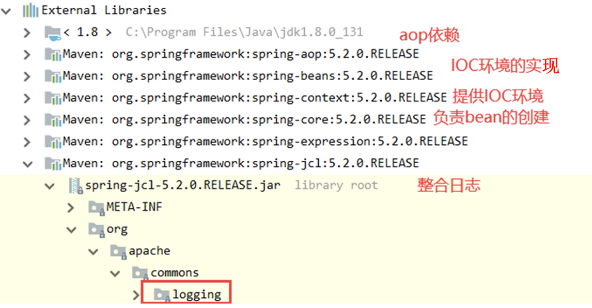
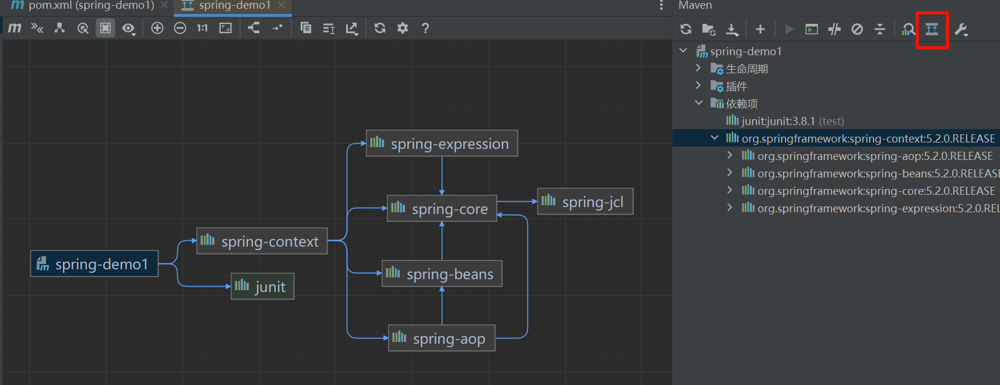
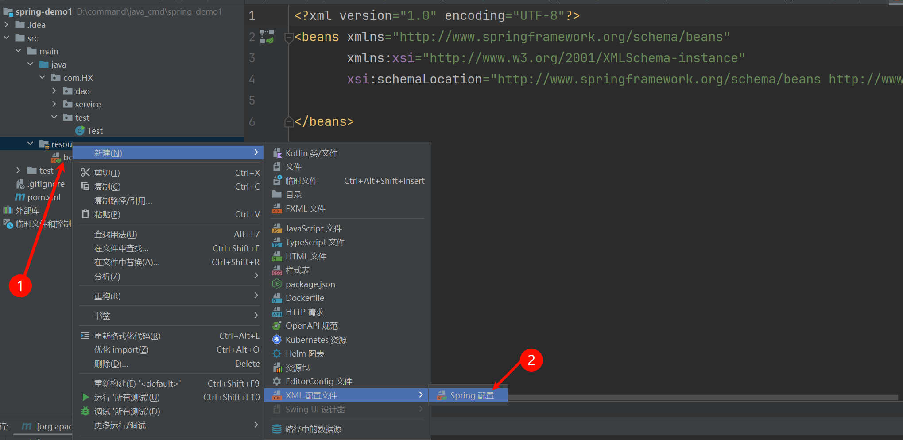
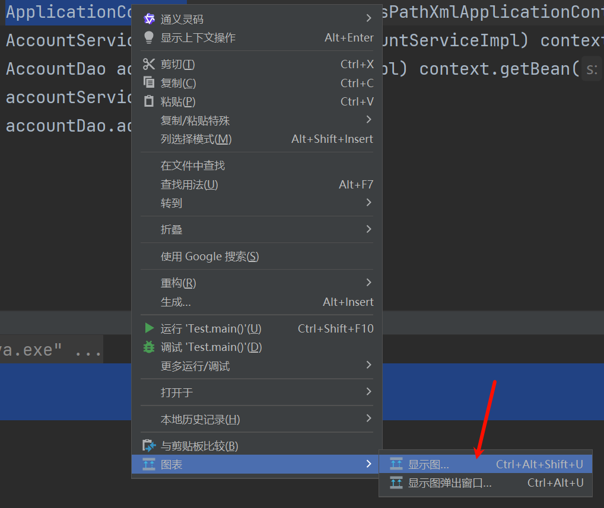
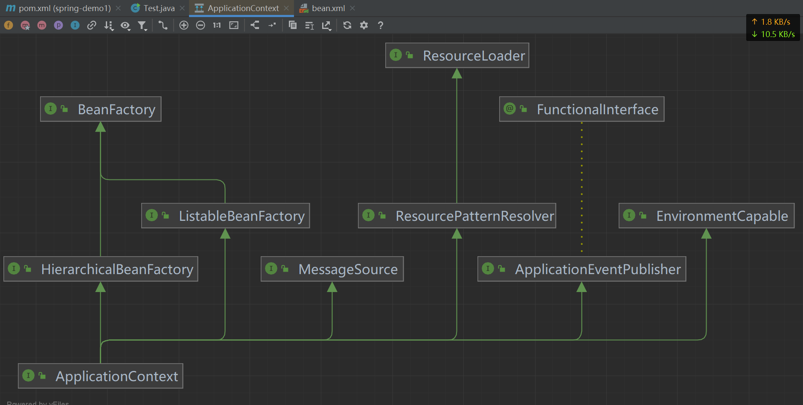
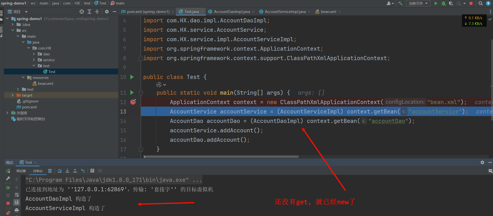
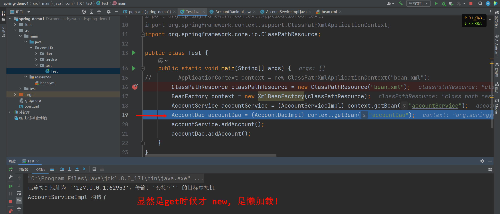
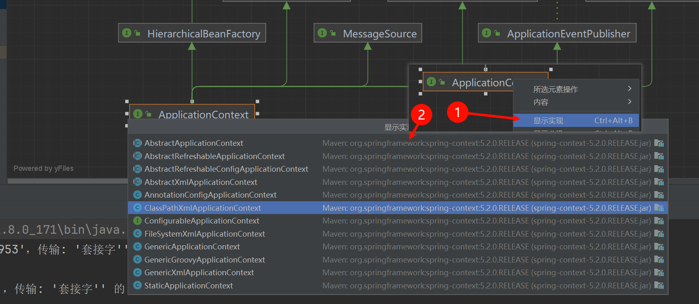

# 1.3 IOC的概念和作用
现在我们是时候揭晓IOC的谜底了。

通过以上分析，我们创建对象的方式有两种:

第一种:
```java
AccountDao dao = new AccountDaoImpl();
```

第二种:
```C++
AccountDao dao = (AccountDao) BeanFactory.getBean("accountDao");
```

这两种有什么不同?

第一种创建对象的方式是我们主动创建的，控制权在我们手里。但是程序的耦合性高

第二种创建对象的方式是交给工厂帮我们创建的，控制权交给工厂了。这样降低了程序的耦合性。

但是我们每次都 *自己* 通过`工厂+配置`的方式创建对象的过程过于繁琐，那我们看看Spring是如何帮我们做的。

## 1.3.1 基于XML的IOC环境搭建和入门
### 1.3.1.1 创建一个maven工程, 导入spring的依赖

```xml
<dependencies>
  <dependency>
    <groupId>org.springframework</groupId>
    <artifactId>spring-context</artifactId>
    <version>5.2.0.RELEASE</version>
  </dependency>
</dependencies>
```

| ##container## |
|:--:|
||

我们也可以查询这些依赖的对应关系:

| ##container## |
|:--:|
||

### 1.3.1.2 创建接口和实现类

```java
public interface AccountDao {
    public void addAccount();
}
```

```java
public class AccountDaoImpl implements AccountDao {
    @Override
    public void addAccount() {
        System.out.println("[Dao]: 新增账户的方法实现了....");
    }
}
```

```java
public interface AccountService {
    public void addAccount();
}
```

```java
public class AccountServiceImpl implements AccountService {
    @Override
    public void addAccount() {
        System.out.println("[Service]: 新增账户的方法实现了....");
    }
}
```

### 1.3.1.3 创建Spring的配置文件

| ##container## |
|:--:|
||

```xml
<?xml version="1.0" encoding="UTF-8"?>
<beans xmlns="http://www.springframework.org/schema/beans"
       xmlns:xsi="http://www.w3.org/2001/XMLSchema-instance"
       xsi:schemaLocation="http://www.springframework.org/schema/beans http://www.springframework.org/schema/beans/spring-beans.xsd">

    <!-- 使用IOC容器管理bean -->
    <bean id="accountDao" class="com.HX.dao.impl.AccountDaoImpl"></bean>
    <bean id="accountService" class="com.HX.service.impl.AccountServiceImpl"></bean>
</beans>
```

- `id` 可以随意, 但必需唯一.
- `class` 是对应类的全限定名.

测试一下:

```java
public class Test {
    public static void main(String[] args) {
        ApplicationContext context = new ClassPathXmlApplicationContext("bean.xml");
        AccountService accountService = (AccountServiceImpl) context.getBean("accountService");
        AccountDao accountDao = (AccountDaoImpl) context.getBean("accountDao");
        accountService.addAccount();
        accountDao.addAccount();
    }
}
```

output:

```print
[Service]: 新增账户的方法实现了....
[Dao]: 新增账户的方法实现了....
```

## 1.3.2 详解ApplicationContext
`ApplicationContext`是Spring给我们提供的核心容器。我们可以去查看它的依赖关系。

| ##container## |
|:--:|
||
||

我们发现`ApplicationContext`继承了`BeanFactory`。`BeanFactory`才是顶级容器。

那么这两个核心的容器有什么区别呢?

1. **ApplicationContext**
- `ApplicationContext`在构建核心容器时，创建对象采取的策略是采用立即加载的方式。也就是说，只要一读取完配置文件马上就创建配置文件中配置的对象。

我们来证明一下:

先添加一下构造函数:

```java
public class AccountDaoImpl implements AccountDao {
    AccountDaoImpl() {
        System.out.println("AccountDaoImpl 构造了");
    }
    @Override
    public void addAccount() {
        System.out.println("[Dao]: 新增账户的方法实现了....");
    }
}
```

| ##container## |
|:--:|
||

可以看到，当配置文件一旦加载完成，对象就已经创建。

2. **BeanFactory**
- `BeanFactory`它在构建核心容器时，创建对象采取的策略是采用延迟加载的方式,也就是说，什么时候根据id获取对象了，什么时候才真正的创建对象。

```java
public class Test {
    public static void main(String[] args) {
//        ApplicationContext context = new ClassPathXmlApplicationContext("bean.xml");
        ClassPathResource classPathResource = new ClassPathResource("bean.xml");
        BeanFactory context = new XmlBeanFactory(classPathResource);
        AccountService accountService = (AccountServiceImpl) context.getBean("accountService");
        AccountDao accountDao = (AccountDaoImpl) context.getBean("accountDao");
        accountService.addAccount();
        accountDao.addAccount();
    }
}
```

| ##container## |
|:--:|
||

可以看到只有根据id创建对象时，才是真正的创建对象。

最后我们再来看一个问题:

- `ApplicationContext`是一个接口，那么它的实现类呢?

| ##container## |
|:--:|
||

- `ClassPathXmlApplicationContext`

    它可以加载类路径下的配置文件，要求配置文件必须在类路径下，否则加载不了(这种比较常用)。之前演示的就是`ClassPathXmlApplicationContext`，这里不再重复演示了。

- `FileSystemXmlApplicationContext`(很少用)

    它可以加载磁盘任意路径下的配置文件(必须有访问权限）。

- `AnnotationConfigApplicationContext`

    它是用于读取注解创建容器的，后面再介绍。