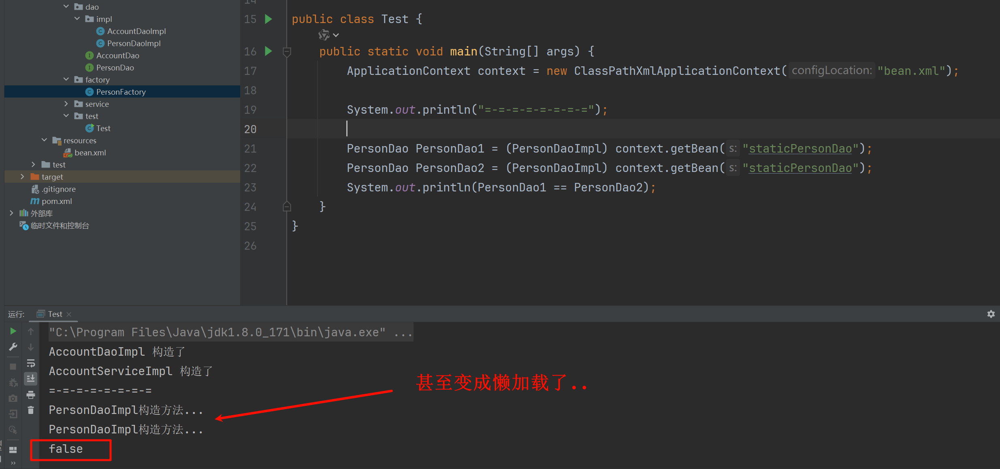

# 1.5 Bean的细节
> [!TIP]
> 听说这里面试常考哦~

## 1.5.1 Bean的作用域
在默认情况下，bean是单例的。我们来测试一下:

| ##container## |
|:--:|
||

那我们要怎么修改bean对象的作用范围呢?

- bean标签的`scope`属性:
    - 作用: 用于指定bean的作用范围
    - 取值: 常用的就是单例的和多例的
        - `singleton`: 单例的(默认值)
        - `prototype`: 多例的
        - `request`: 作用于web应用的请求范围
        - `session`: 作用于web应用的会话范围
        - `global-session`: 作用于集群环境的会话范围(全局会话范围), 当不是集群环境时, 它就是`session`。

此时我们把bean的作用域修改为`prototype`:

```xml
<bean id="staticPersonDao" class="com.HX.factory.PersonFactory"
      scope="prototype"
      factory-method="staticGetPerson"></bean>
```

| ##container## |
|:--:|
||

### 1.5.2 Bean的生命周期
1. 单例对象

单例对象的生命周期和容器的生命周期是一致的。当容器创建时，对象就实例化好了。当容器还在的时候，对象也就一直存在。当容器销毁，对象也就消亡。

下面来实例单例对象的生命周期:

```java
public class AccountDaoImpl implements AccountDao {
    AccountDaoImpl() {
        System.out.println("AccountDaoImpl 构造了");
    }
  
    @Override
    public void addAccount() {
        System.out.println("[Dao]: 新增账户的方法实现了....");
    }

    public void init() {
        System.out.println("初始化init方法...");
    }

    public void destroy() {
        System.out.println("销毁destroy方法...");
    }
}
```

配置文件:

```xml
<bean id="accountDao" class="com.HX.dao.impl.AccountDaoImpl"
      scope="singleton" 
      init-method="init" destroy-method="destroy"></bean>
```

| ##container## |
|:--:|
||

2. 多例对象

- 出生: 当我们使用对象时spring框架为我们创建
- 活着: 对象只要是在使用过程中就一直活着
- 死亡: 当对象长时间不用，且没有别的对象引用时，由Java的垃圾回收器回收

我们**只需要**把配置改成`多例`，其他不变。

```xml
<bean id="accountDao" class="com.HX.dao.impl.AccountDaoImpl"
      scope="prototype"
      init-method="init" destroy-method="destroy"></bean>
```

| ##container## |
|:--:|
||

我们发现销毁方法没有被执行，这是为什么呢？

因为spring交给了Java的垃圾回收器进行回收，回收与否不能干涉

具体参考: [深究Spring中Bean的生命周期](https://www.cnblogs.com/javazhiyin/p/10905294.html)