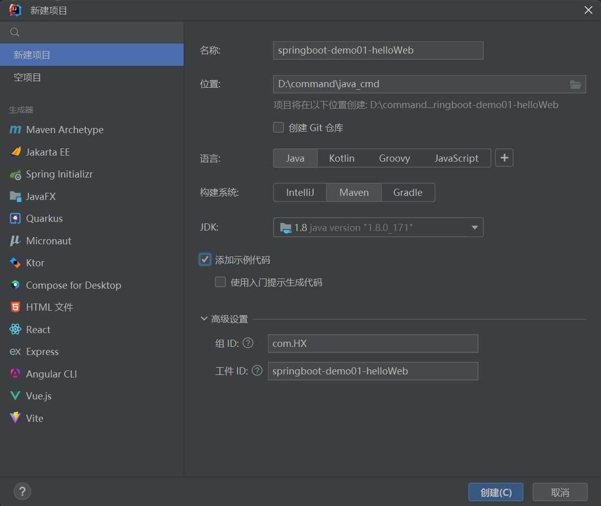
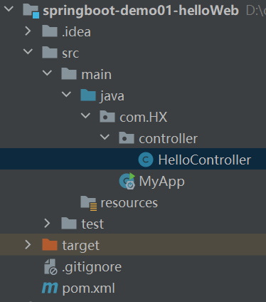
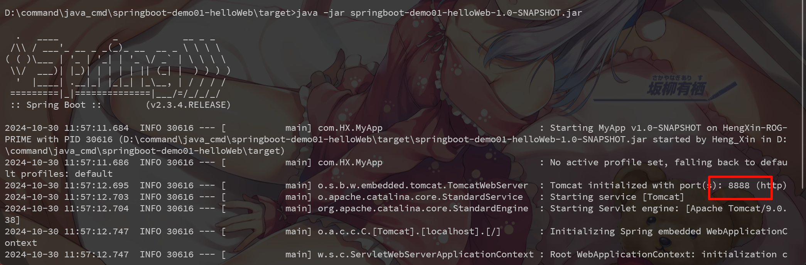

# SpringBoot第一个入门案例
## 1. spring与springboot
### 1.1 spring能为我们做什么？

我们可以查看官网: https://spring.io/

### 1.2 spring的生态
https://spring.io/projects/spring-boot

(涵盖了各个行业的解决方案)

### 1.3 为什么要用springboot
能快速创建出生产级别的Spring应用。

### 1.4 springboot的优点
- 创建独立Spring应用
- 内嵌web服务器
- 自动starter依赖，简化构建配置
- 自动配置Spring以及第三方功能
- 提供生产级别的监控、健康检查及外部化配置
- 无代码生成、无需编写XML

总结:
- SpringBoot是整合Spring技术栈的一站式框架
- SpringBoot是简化Spring技术栈的快速开发脚手架

当然springboot也有一些缺点:
- 版本迭代快，需要时刻关注变化。
- 封装太深，内部原理复杂，不容易精通

## 2. springboot诞生的背景
### 2.1 微服务
https://martinfowler.com/microservices/ 提出微服务的完整概念.

简单的来说:
- 微服务是一种架构风格
- 一个应用拆分为一组小型服务
- 每个服务运行在自己的进程内，也就是可独立部署和升级
- 服务之间使用轻量级HTTP交互
- 服务围绕业务功能拆分
- 可以由全自动部署机制独立部署
- 去中心化，服务自治。服务可以使用不同的语言、不同的存储技术

### 2.2 分布式
一旦我们将大型应用拆分成各个小的微服务之后，必然会产生分布式。

那么分布式也会产生各种问题:
- 远程调用
- 服务发现
- 负载均衡
- 服务容错
- 配置管理
- 服务监控
- 链路追踪
- 日志管理
- 任务调度

分布式问题的解决:
使用`springboot`快速的构建应用，由于微服务模块众多，我们使用`springcloud`来解决微服务模块众多带来的问题。由于微服务架构下会产生大量数据，我们可以使用`springcloud data flow`做成响应式数据流来整合起来。

## 3. 如何学习springboot
### 3.1 官方文档架构
https://spring.io/projects/spring-boot#learn

当然我们也可以去查看版本新特性:
https://github.com/spring-projects/spring-boot/wiki#release-notes

## 4. springboot入门案例
我们搭建这个入门案例会参照官方文档进行搭建。

系统要求: (springboot 2.3.4)
- jdk 1.8
- maven 3.5+

而 springboot 3.3.5
- java 17+
- Maven 3.6.3+

### 4.1 搭建hello案例
需求: 浏览发送/hello请求，响应 HelloWorld, Spring Boot 2。

#### 4.1.1 创建maven工程
使用maven创建java工程，不用使用骨架创建。

| ##container## |
|:--:|
||

#### 4.1.2 引入依赖

```xml
<parent>
    <groupId>org.springframework.boot</groupId>
    <artifactId>spring-boot-starter-parent</artifactId>
    <version>2.3.4.RELEASE</version>
</parent>

<dependencies>
    <dependency>
        <groupId>org.springframework.boot</groupId>
        <artifactId>spring-boot-starter-web</artifactId>
    </dependency>
</dependencies>
```

#### 4.1.3 创建主程序

```Java
package com.HX;

import org.springframework.boot.SpringApplication;
import org.springframework.boot.autoconfigure.SpringBootApplication;

@SpringBootApplication
public class MyApp {
    public static void main(String[] args) {
        SpringApplication.run(MyApp.class,args);
    }
}
```

#### 4.1.4 编写业务

```Java
package com.HX.controller;

import org.springframework.web.bind.annotation.RequestMapping;
import org.springframework.web.bind.annotation.RestController;

@RestController
public class HelloController {
    @RequestMapping("hello")
    public String hello() {
        return "hello 世界";
    }
}
```

最后定义项目目录结构如下:

| ##container## |
|:--:|
||

#### 4.1.5 测试
直接运行main方法

执行: http://localhost:8080/hello

#### 4.1.6 定义配置文件
定义配置文件`application.properties`。

```properties
# 自定义端口
server.port=8888
```

#### 4.1.7 部署项目
导出为jar包, 需要这个定义:

```xml
<build>
    <plugins>
        <plugin>
            <groupId>org.springframework.boot</groupId>
            <artifactId>spring-boot-maven-plugin</artifactId>
        </plugin>
    </plugins>
</build>
```

通过`maven`生命周期命令, 把项目打成jar包, 直接在目标服务器执行即可。

| ##container## |
|:--:|
||

并且也应用了配置文件.

> 注意点:
>
> 如果运行不成功，请取消掉cmd的快速编辑模式。在cmd窗口，右键->属性 即可设置。