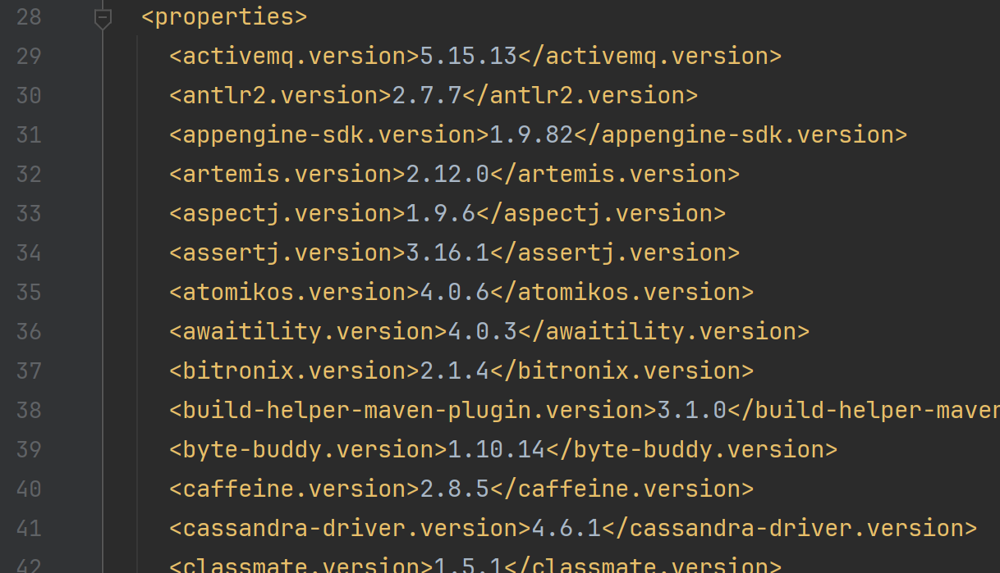
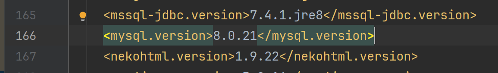
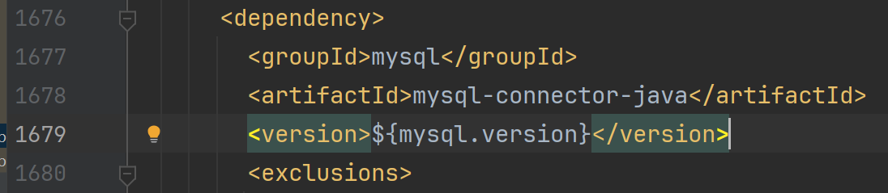
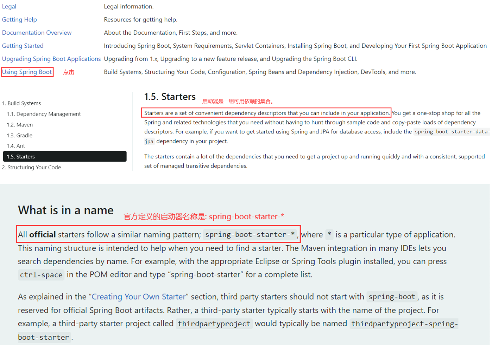
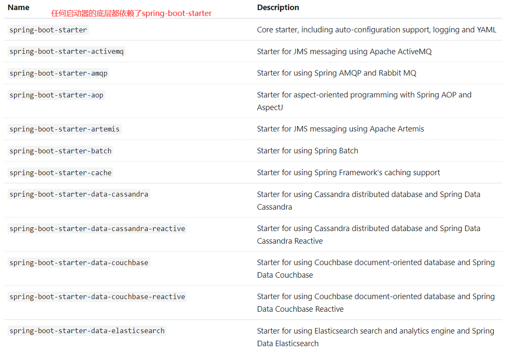
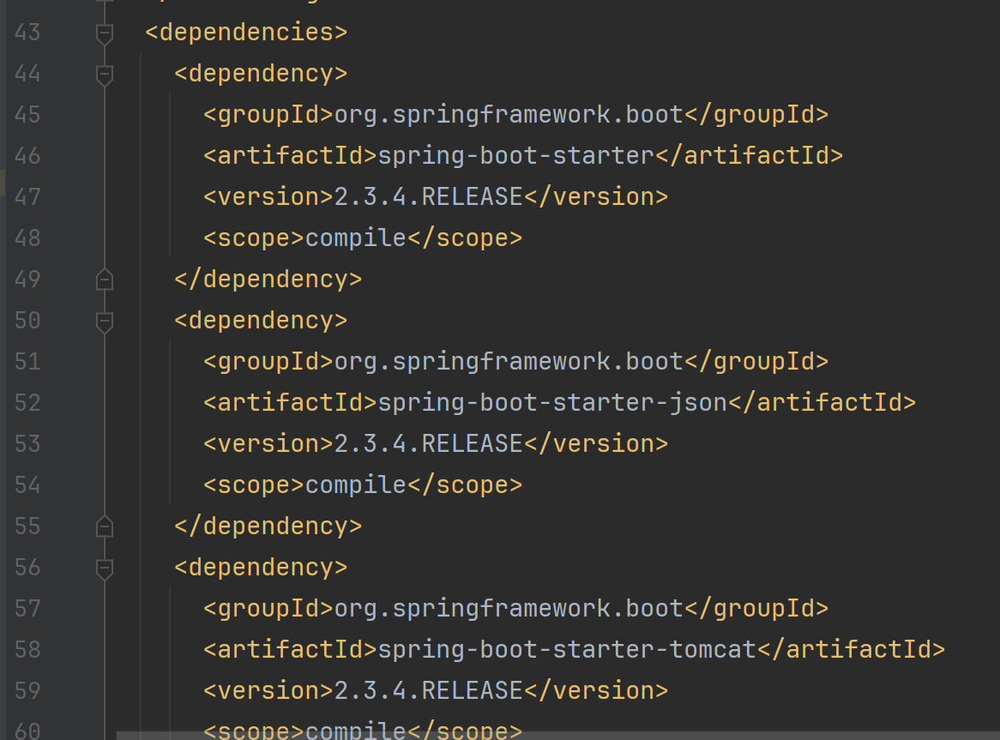
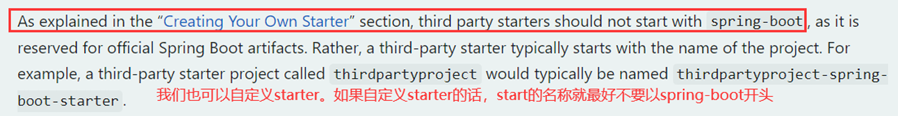
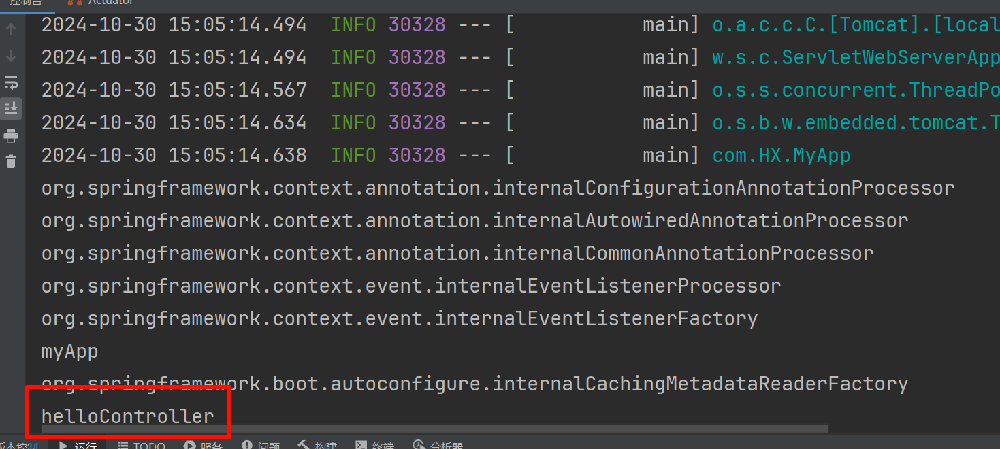
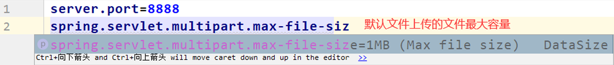

# springboot自动配置原理
## 1. springboot依赖管理
我们在`pom.xml`里面配置了一个父依赖:

```xml
<parent>
    <groupId>org.springframework.boot</groupId>
    <artifactId>spring-boot-starter-parent</artifactId>
    <version>2.3.4.RELEASE</version>
</parent>
```

这个依赖有什么作用?

学过maven都知道，父依赖就是进行依赖管理的。父工程里面会定义大量的依赖，并且对这些依赖进行了版本控制。那么在springboot里面是不是这样子的呢？

我们点击`spring-boot-starter-parent`查看具体情况:

```xml
<parent>
  <groupId>org.springframework.boot</groupId>
  <artifactId>spring-boot-dependencies</artifactId>
  <version>2.3.4.RELEASE</version>
</parent>
```
点击进去，我们发现`spring-boot-starter-parent`还有一个父项目，就是`spring-boot-dependencies`。那么这个依赖里面到底做了哪些事情?

我们继续点击`spring-boot-dependencies`进去查看:

我们发现这个工程对大量依赖做了管理，并进行了版本控制:

| ##container## |
|:--:|
||
|以下省略3k+行|

所以我们可以得出这样一个结论: `spring-boot-starter-parent`的作用就是
声明了所有开发中常用的依赖的版本号, 自动版本仲裁机制。

比如我们最常用的mysql数据库驱动版本，在这里就做了版本控制:

| ##container## |
|:--:|
||
||

此时我们可以在`pom.xml`里面引入mysql数据库驱动依赖，来验证这个版本是否正确。

(图片略)

由此可见: 这个父依赖`spring-boot-starter-parent`确实给我们做了依赖的版本管理。但是有的时候springboot官方给我们仲裁的依赖版本并不一定合理。

比如这个`mysql-connector-java`依赖，官方定义的是8的版本，要求我们本地数据库也必须是mysql8的版本。如果我们自己的数据库是mysql5.x的版本，此时springboot官方给我仲裁的mysql驱动版本明显就不合适了。

此时我们需要修改springboot给我们mysql仲裁的版本。如何修改？

我们只需要在`pom.xml`里面自定义mysql驱动的版本号即可。

```xml
<properties>
    <mysql.version>5.1.47</mysql.version>
</properties>
```

修改之后，我们查看我们依赖的版本号:

(图略)

我们发现自己定义的版本生效了。

在`pom.xml`里面，我们还定义了`spring-boot-starter-web`这个依赖。我们称之为web启动器。那么什么是启动器？我们看官方文档给我们作的描述。

| ##container## |
|:--:|
||

我们可以看看官方定义的启动器:

| ##container## |
|:--:|
||

所以我们`pom.xml`里面导入`spring-boot-starter-web`启动器的作用就是引入了一系列web场景的依赖。没有springboot之前，这些依赖都需要我们自己手动导入。但是有了springboot之后，通过这个web启动器，我们就可以把这个场景需要的一系列的依赖全部导入进来。

我们可以点击进入`spring-boot-starter-web`启动器。

| ##container## |
|:--:|
||

注意: 所有的启动器，底层必须依赖`spring-boot-starter`。

```xml
<dependency>
    <groupId>org.springframework.boot</groupId>
    <artifactId>spring-boot-starter</artifactId>
    <version>2.2.0.RELEASE</version>
    <scope>compile</scope>
</dependency>
```

如果官方定义的starter不满足我们的需求，我们也可以自定义starter。这一点，官方文档里面也做了明确的阐述。

| ##container## |
|:--:|
||

比如mybatis启动器: `mybatis-spring-boot-starter`。

## 2. 自动配置
我们以我们引入的`spring-boot-starter-web`启动器为例。当我们点击打开`spring-boot-starter-web`启动器，我们发现它包含很多其他的启动器。比如:

```xml
<!-- json相关的配置 -->
<dependency>
    <groupId>org.springframework.boot</groupId>
    <artifactId>spring-boot-starter-json</artifactId>
    <version>2.2.0.RELEASE</version>
    <scope>compile</scope>
</dependency>
```

```xml
<!-- tomcat相关的配置 -->
<dependency>
    <groupId>org.springframework.boot</groupId>
    <artifactId>spring-boot-starter-tomcat</artifactId>
    <version>2.2.0.RELEASE</version>
    <scope>compile</scope>
</dependency>
```

```xml
<!-- springmvc相关的配置 -->
<dependency>
    <groupId>org.springframework</groupId>
    <artifactId>spring-web</artifactId>
    <version>5.2.0.RELEASE</version>
    <scope>compile</scope>
</dependency>
<dependency>
    <groupId>org.springframework</groupId>
    <artifactId>spring-webmvc</artifactId>
    <version>5.2.0.RELEASE</version>
    <scope>compile</scope>
</dependency>
```
我们认为通过引入web启动器，在springboot项目加载的时候，就会对springmvc 、json 、tomcat等进行自动配置。我们可以验证一下:


```Java
package com.HX;

import org.springframework.boot.SpringApplication;
import org.springframework.boot.autoconfigure.SpringBootApplication;
import org.springframework.context.ConfigurableApplicationContext;

@SpringBootApplication
public class MyApp {
    public static void main(String[] args) {
        // 获得ioc容器
        ConfigurableApplicationContext context = SpringApplication.run(MyApp.class, args);
        // 获取所有bean的名称的集合
        String[] beanDefinitionNames = context.getBeanDefinitionNames();
        // 循环获取bean的名称
        for(String name : beanDefinitionNames){
            System.out.println(name);
        }
    }
}
```

| ##container## |
|:--:|
||
|更多的被省略了|

我们大致发现，之前我们配置的比如: 前端控制器、视图解析器、编码过滤器、文件上传解析器等都装配进了ioc容器，换句话也就是说进行了自动配置。**而这些在我们之前ssm整合的时候，都是需要我们自己去手动配置的。**

此时大家应该还有疑问，就是我们之前在进行SSM整合的时候，我们都会配置包扫描的规则。

```xml
<context:component-scan base-package="com.hx.controller">
```

或者使用`@ComponentScan`注解。

但是在springboot中，已经默认给我们规定好了包扫描规则，那就是主程序所在包及其下面的所有子包里面的组件都会被默认扫描进来。

我们可以测试一下:
- 首先我修改项目的目录结构, (把控制层的Hello类扔到我们MyApp的上一级目录)
- 启动
- 访问 /hello, 发现变成404了

实际上是因为`@SpringBootApplication`这个注解是一个复合注解, 里面组合了`@ComponentScan`注解
```Java
@Target({ElementType.TYPE})
@Retention(RetentionPolicy.RUNTIME)
@Documented
@Inherited
@SpringBootConfiguration
@EnableAutoConfiguration
@ComponentScan(
    excludeFilters = {@Filter(
    type = FilterType.CUSTOM,
    classes = {TypeExcludeFilter.class}
), @Filter(
    type = FilterType.CUSTOM,
    classes = {AutoConfigurationExcludeFilter.class}
)}
)
public @interface SpringBootApplication { // ...
```

当然我们也可以自定义扫描规则

```Java
@SpringBootApplication(scanBasePackages = "com.controller") //自定义包扫描规则
public class App{}
```

虽然可以自定义包的扫描规则。但是我们一般不这么去做，还是尽量遵循springboot官方给我们定义的默认包扫描规则。

springboot的各种自动配置都是有默认值的。我们以文件上传的配置为:

| ##container## |
|:--:|
||

默认配置最终绑定到某个类上面，比如：MultipartProperties。配置文件的值最终绑定到某个类的属性上面，这个类所属的bean要交给spring容器管理。

springboot虽然会自动配置，但是不会将所有场景的资源都进行自动配置。它采用的是按需加载的的方式来进行自动配置的。我们引入什么启动器，就会针对这个启动器的场景进行自动配置。

SpringBoot所有的自动配置功能都在`spring-boot-autoconfigure`包里面。

(有需要请自行探索)