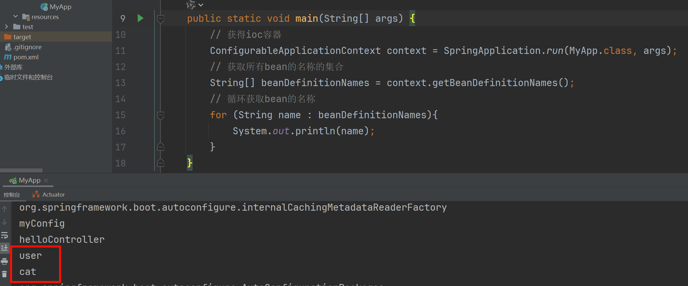
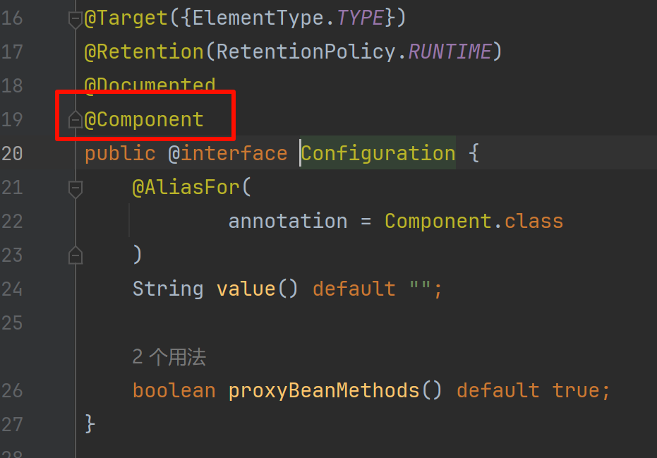

# @Configuration注解
以前，如果我们想将bean交给spring容器管理，我们会怎么办? 我们可以使用xml或者注解的方式进配置。在springboot中还有一种非常常见的方式管理bean。那就是使用配置类的方式管理bean。

现在我们就使用java配置类的方式管理bean。

- 定义两个pojo类

```Java
public class User {
    private String username;
    private String password;
    // get/set/toSting 略
}

public class Cat {
    private String name;
    private String color;
    // get/set/toSting 略
}
```

使用java配置类来管理:

```Java
package com.HX.config;

import com.HX.pojo.Cat;
import com.HX.pojo.User;
import org.springframework.context.annotation.Bean;
import org.springframework.context.annotation.Configuration;

@Configuration(proxyBeanMethods = true) // 标识当前类是一个配置类 它的作用就是类似于我们spring里面的xml配置文件
public class MyConfig {
    @Bean // 类似于xml配置文件里面的bean标签, 默认情况下面bean的id就是方法的名称
    public User user() {
        User user = new User();
        user.setUsername("eric");
        user.setPassword("114514");
        return user;
    }

    @Bean
    public Cat cat() {
        Cat cat = new Cat();
        cat.setName("大橘");
        cat.setColor("橙色");
        return cat;
    }
}
```
释义:
- `@Configuration`: 告诉SpringBoot这是一个配置类, 等同于原生spring项目的配置文件的作用。

- `@Bean`: 向spring容器中添加组件。类似于原生spring中的xml配置文件。方法名相当于bean的id。方法返回的值, 就是组件在容器中的实例。

我们的组件到底有没有注入到spring的ioc容器? 我们可以测试一下:

| ##container## |
|:--:|
||

现在我们继续测试:

我们在启动类App中添加如下代码:

```Java
User user01 = context.getBean("user", User.class);
User user02 = context.getBean("user", User.class);
System.out.println("组件："+(user01 == user02)); // True
```

我们可以得知：我们获取的组件就是从spring容器中获取的，并且是单实例的bean。

<span style="color:red">其实我们配置类也是一个组件，也是交给spring容器管理了</span>。我们点击`@Configuration`注解，进入查看源码发现:

| ##container## |
|:--:|
||

我们可以尝试获取这个bean:

```Java
MyConfig myConfig = context.getBean(MyConfig.class);
System.out.println(myConfig); // com.HX.config.MyConfig$$EnhancerBySpringCGLIB$$e7d16d64@3163987e
```

**观察可知这是一个基于Cglib字节码增强的代理对象！！！** 也就是在spring容器里面管理的是这个配置类的代理对象(增强的对象)。

其实`@Configuration`注解还有一个非常重要的属性，就是`proxyBeanMethods`。

```Java
@Configuration(proxyBeanMethods = true)
```

这个值默认为true。

作用是通过MyConfig在spring容器中的代理对象调用方法。SpringBoot总会检查这个组件是否在容器中存在。

修改为false, 那么就不会是单例了..

这个`proxyBeanMethods`属性其实就是解决一个问题，那就是<span style="color:red">组件依赖</span>。

我们现在恢复成: `@Configuration(proxyBeanMethods = true)`并把代码修改为:
```Java
@Bean
public User user(){
    User user = new User();
    user.setUsername("eric");
    user.setPassword("114514");
    user.setCat(cat()); // 添加这个
    return user;
}
```

```Java
User user = context.getBean("user", User.class);
Cat cat = context.getBean("cat", Cat.class);
System.out.println(user.getCat() == cat); // True
```

总结:
- proxyBeanMethods: 代理bean的方法
    - Full(proxyBeanMethods = true)、【保证每个@Bean方法被调用多少次返回的组件都是单实例的】
    - Lite(proxyBeanMethods = false)【每个@Bean方法被调用多少次返回的组件都是新创建的】组件依赖必须使用Full模式默认。其他默认是否Lite模式