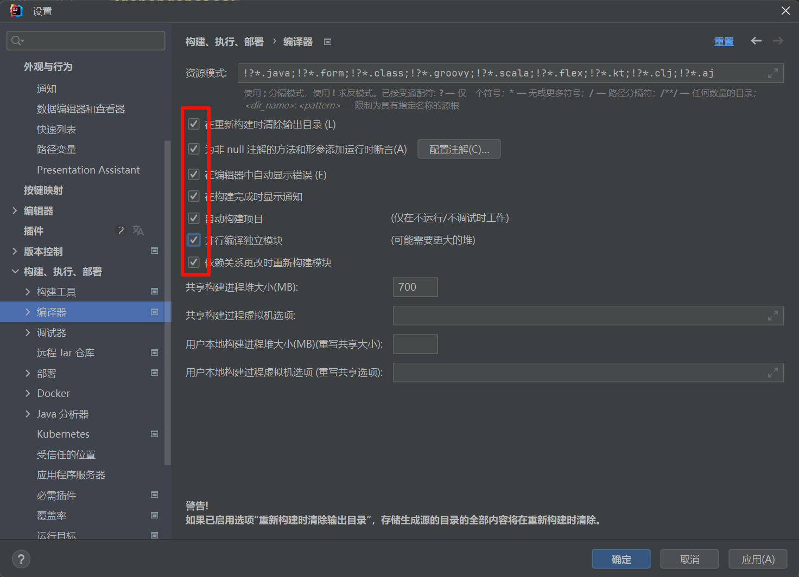
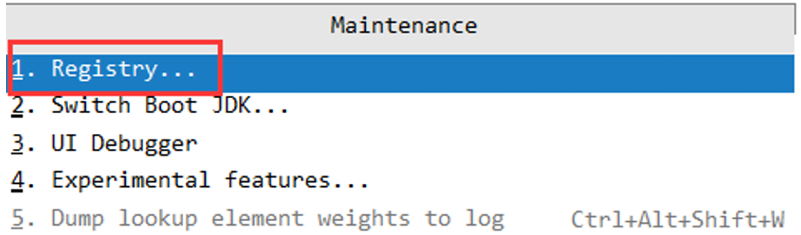
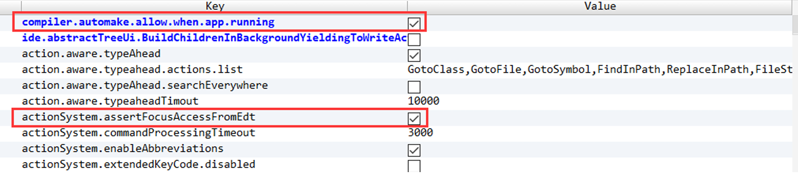

# dev-tools热部署工具
在实际项目开发中，开发的过程中一定会修改代码，如果每次修改代码都需要重新启动下，那会让人吐血的。这里我们使用`Spring-boot-devtools`进行热部署。

- 引入热部署依赖

```xml
<dependency>
    <groupId>org.springframework.boot</groupId>
    <artifactId>spring-boot-devtools</artifactId>
    <optional>true</optional>
</dependency>
```

- 引入插件

```xml
<build>
    <plugins>
        <plugin>
            <groupId>org.springframework.boot</groupId>
            <artifactId>spring-boot-maven-plugin</artifactId>
            <configuration>
                <fork>true</fork>
                <addResources>true</addResources>
            </configuration>
        </plugin>
    </plugins>
</build>
```

- 修改IDEA配置



- shift + ctrl + alt + / 四个按键一块按，选择Reg项(注册表)

| ##container## |
|:--:|
||

- 点击进入Registry

| ##container## |
|:--:|
||